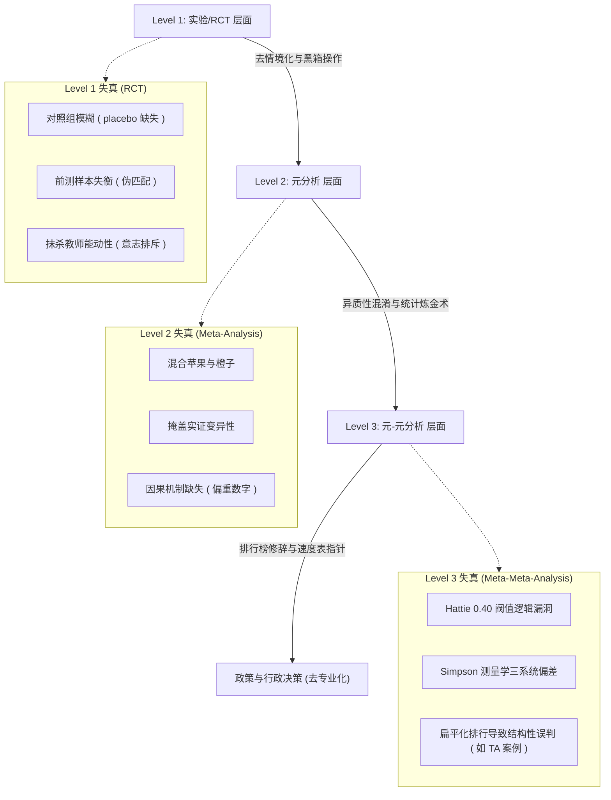

## 定义

> [!def] 核心定义
> 证据本位教育（Evidence-Based Education, EBE）是将循证医学的核心理念——专业实践应以最佳研究证据为基础——应用于教育领域的运动和学术讨论。它主张教育决策和教学决策应以系统性的实证研究（特别是随机对照试验 RCT 与系统综述）所产生的证据为基础，以科学回答“什么有效”（what works）的问题。[[Argument_Biesta_2010_SPE|Biesta, 2010, p. 491]]; [[Argument_Slavin_2002_ER|Slavin, 2002, p. 15]].

> [!concept-lens] 概念透镜
> - **含义** 教育决策应从严格的因果识别设计（如随机分配实验）中获取有效性依据，替代以往依赖传统、权威或未经检验的直觉经验的做法。[[Argument_Slavin_2002_ER|Slavin, 2002, pp. 15–16]]
> - **用途** 通过推广被证明有效的标准化干预项目和教学实践，克服教育研究与日常实践之间的鸿沟，提高教育系统的效率和可预测性。[[Argument_Slavin_2019_EP|Slavin, 2019, pp. 5–6]]
> - **边界** 它在技术上极易将“证据”窄化为脱离具体背景的统计平均值，在哲学上可能抹杀师生的主动施为（Agency）与关于“教育目的”的民主讨论。[[Argument_Wrigley_2018_BERJ|Wrigley, 2018, pp. 4, 7]]; [[Argument_Biesta_2010_SPE|Biesta, 2010, pp. 496–497]]

---

证据本位教育主张教育者的实践选择必须建立在经严格评估被证明有效的教育干预之上。这一主张最早由 Robert Slavin 在美国教育研究协会（AERA）杰出讲座上系统化阐述：

> “证据本位教育政策的核心是依赖随机化和严格匹配实验作为政策和实践的基础——将可复制的教育项目和有前景的实践置于严格评估之下，仅推广那些被证明有效的项目。”([[Argument_Slavin_2002_ER|Slavin, 2002, p. 15]])

英国教育部在官方报告中也给出了政策层面的操作定义：

> “我们使用‘证据’一词来指代寻找并使用：由外部研究人员生成的量化和质性研究发现；由 Sutton Trust、EEF 和 John Hattie 等制作的证据综述；外部评估；以及/或者由教师或学校在严格而系统的探究支撑下产出的研究。”(DfE, 2017, cited in [[Argument_Bainbridge_2022_ROE|Bainbridge et al., 2022, p. 4]])

然而，批评者对将“什么有效”作为教育核心问题提出了强烈质疑。[[Argument_Wiliam_2019_ERE|Wiliam (2019)]] 指出，“什么有效”在教育研究中是一个错误的问题，因为几乎任何事情在某些地方都有效，但没有事情在所有地方都有效。更好的问题是：“在什么条件下这个干预有效？”([[Argument_Wiliam_2019_ERE|Wiliam, 2019, p. 11]]) 

此外，[[Argument_Wrigley_2018_BERJ|Wrigley (2018)]] 指出，EBE 将“证据”窄化为去情境的统计均值，其实质是新自由主义审计文化在教育政策中的修辞延伸，剥夺了对教育价值和目的的讨论。

---

## 概念辨析

> [!contrast-table] 概念辨析
> | 维度 | 证据本位教育 (EBE) | 证据知情实践 (EIP) | 价值本位教育 (Value-Based) | 循证医学 (EBM) | 地方知识 (Local Knowledge) |
> |------|--------|----------------|----------------|----------------|----------------|
> | **分析对象** | 经严格实验评估（RCT）的干预效果 | 多源证据的整合与实践应用过程 | 教育的根本目的与“什么是值得做的” | 临床诊断、治疗技术与病患个案的结合 | 特定时间和地点环境的独特经验与上下文 |
> | **核心机制** | 强调以 RCT/系统综述的统计平均值作为实践决策的核心依据 | 视证据为重要信息来源，需通过专业判断与情境调适结合 | 民主协商、伦理反思与价值论争 | 结合基础科学理论，通过实验确认药效 | 本地试点、同伴推荐、师生反馈与非正式探索 |
> | **适用范围** | 标准化项目推广、系统清算、政策合规评估 | 教师日常教学改进、学校探究网络、课堂设计 | 教育目的论证、课程大纲与政治抉择 | 具备生理机制一致性的病患护理与药物开发 | 复杂的课堂交互、偶发性教育情境的应对 |

- **vs 价值本位教育（Value-Based Education）**：[[Argument_Biesta_2010_SPE|Biesta (2010)]] 论证，证据本位教育将“什么有效”的工具性效率置于首位，而忽略了“什么是值得做的”这一方向性价值；价值本位教育则将价值澄清与民主协商作为教育的首要前提。
- **vs 循证医学（Evidence-Based Medicine）**：循证医学是 EBE 的起源和主要类比。然而，医学 RCT 建立在极其深厚的生理学和生化学因果机制理论基础之上，医生对药物如何作用于人体的因果链非常明确；而教育学 RCT 通常缺乏深厚的因果机制理论，属于测量输入-输出的“黑箱实验”，且面临无法做到“双盲”和缺乏“安慰剂”的困境。此外，真实医学循证（Real EBM）极其强调专家判断和病患偏好，而非教条地套用实验平均数据。([[Argument_Wrigley_2018_BERJ|Wrigley, 2018, pp. 6, 11]]; [[Argument_Wiliam_2019_ERE|Wiliam, 2019, p. 4]])
- **vs 地方知识（Local Knowledge in Evidence-Based Policy）**：本地知识是实践者在特定学校 and 班级环境下积累的、关于“此时此地”环境的非正式经验。[[Argument_Wiliam_2019_ERE|Wiliam (2019, pp. 12–13)]] 引用 Hayek (1945) 的知识理论指出，只有拥有特定时间和地点环境知识的实践者，才能决定哪些干预在本地可能有效，哪些可能适得其反。地方知识是 EBE 落地时必不可少的阐释性资源。
- **vs 证据知情实践（Evidence-Informed Practice, EIP）**：EBE 的强版本主张实践决策应完全“基于”研究证据（即无证据则不能做）；而 EIP（或称证据启发教学）则将证据视为信息来源之一，主张与[[Professional Judgment|专业判断]]、学校资源和学生需求并列权衡。([[Argument_Nelson_2017_ER|Nelson & Campbell, 2017, pp. 128–129]])
- **vs 效应量（Effect Size）**：效应量是 EBE 方法论中的核心分析单位。然而，Adrian Simpson (2017) 论证，效应量测量的不是干预的绝对有效性，而是“试验灵敏度”，其数值极易受到比较组选择、范围限制和测量设计的影响；[[Argument_Wiliam_2019_ERE|Wiliam (2019, p. 11)]] 因此断言元-元分析在教育政策中没有任何角色。
- **vs 知识治理（Epistemic Governance）**：EBE 在工具层面讨论政策是否依据科学；而知识治理关注去中心化的全球治理架构中，知识如何被生产、流动并成为合法的治理手段。[[Argument_Zapp_2022_Springer|Zapp (2022, pp. 145–146)]] 将 EBE 驱动的“[[Scientization of Politics|政策的科学化]]”定位为全球知识治理的核心机制。
- **vs 副作用（Side Effects）**：[[Argument_Zhao_2017_JEC|Zhao (2017)]] 论证，EBE 盲目借鉴医学 RCT，却完全忽略了医学中更为核心的“副作用报告”机制；在教育中，提高阅读成绩（效果）的同一干预可能导致学生永远厌恶阅读（副作用），忽略副作用的 EBE 论证是不完整的。

---

## 核心要素

### EBE 的基本主张与假设

#### 核心主张
1. **科学证据作为决策基础**：教育行政政策和学校教学实践决策应基于科学证据，而非传统或习惯。[[Argument_Slavin_2019_EP|Slavin, 2019, pp. 5–6]].
2. **RCT 作为证据金标准**：通过[[Random Assignment|随机分配]]建立对照组，是确立因果关系、排除混淆变量并识别“什么有效”的黄金设计。[[Argument_Slavin_2002_ER|Slavin, 2002, p. 15]].
3. **区别对待证据级别**：严厉区分“基于科学原则研究”与“针对具体项目进行过严格实验评估”。Slavin 强调，唯有经过严格评估被证明有效、可复制的程序化项目（programs），才真正具备政策推广价值。([[Argument_Slavin_2002_ER|Slavin, 2002, pp. 18–19]])
4. **强版本与弱版本的分野**：强版本（Evidence-Based）主张无科学证据的实践应被取缔或禁止资助；弱版本（Evidence-Informed）主张证据应作为实践者的反思工具和“概率资源”。([[Argument_Nelson_2017_ER|Nelson & Campbell, 2017]]; [[Argument_Nordahl_2015_Paideia|Nordahl, 2015]])

#### 理论假设与认识论批判
证据本位教育的合法性建立在一组深层理论假设之上，这些假设在哲学上遭到了系统的解构：

| 核心假设 | 对应维度 | 批判者与批判内容 |
|---|---|---|
| **休谟因果观**：因果关系等于观察到的经验恒常规则性（若 X 则 Y） | 存在论（Ontology） | [[Argument_Wrigley_2018_BERJ|Wrigley (2018)]] 借助[[Critical Realism|批判实在论]]指出，教育是“开放系统”而非实验室封闭系统，因果取决于事物本质与环境交互，均值无法反映真实的因果机制。 |
| **机械干预假设**：干预措施如同药物注射，其效果与受试者的能动反思无关 | 实践论（Praxiology） | [[Argument_Biesta_2010_SPE|Biesta (2010)]] 与 Pawson (2006) 论证，教育项目提供的是资源，其起作用的关键在于受试者的“推理（Reasoning）”与主动能动性。 |
| **科学应用假设**：研究证据从“在某处有效”到“在这里有效”是线性的 | 认识论（Epistemology） | Cartwright & Hardie (2012) 提出三阶段知识框架，指出外推需要“支撑因素”和“本地情境规则”的配合，而非直接套用。 |

---

### 证据到政策与实践的转化模型

#### 政策转译的三种模型
[[Argument_Bainbridge_2022_ROE|Bainbridge et al. (2022, pp. 7–8)]] 总结了证据与政策决策之间的三种交互轨迹：
- **线性模型（Linear Model）**：研究直接转化为政策，假设政策制定者是完全理性的技术官僚。
- **多流模型（Multiple Streams Model）**：政策由问题流、政策流和政治流共同决定，证据只是游说窗口的一股力量。
- **混战模型（Melee Model）**：科学证据、政治选票、经济成本和社会价值四股力量交互混战，政策是权力妥协而非科学理性的产物。

#### 实践转译的四个中介链条
[[Argument_Nordahl_2015_Paideia|Nordahl (2015, pp. 63–67)]] 提出了学校改进中证据进入课堂的转译链：
1. **承认不同教学法效果非等效**：建立循证改革的先决前提。
2. **视证据为概率资源而非控制指令**：证据只提示高概率路径，不能取代专业判断。
3. **聚焦中介转译机制**：建立共同备课、课堂观察和数据回看等制度，解决“知道”到“行动”的瓶颈。
4. **将改革失败重构为能力与知识赤字**：以能力建设取代简单的问责和压力施加。

#### 决策评估四问题与五要素
- **Wiliam 的四个实用评估问题**：1. 这解决我们面临的问题吗？2. 我们能获得多少改进（净效果 vs 宣传效果）？3. 成本多少（成本有效性）？4. 它在这里有效吗（特定情境匹配）？([[Argument_Wiliam_2019_ERE|Wiliam, 2019, pp. 11–12]])
- **Blass 的五要素评估框架**：学术证据在政策采纳前，须接受对方法论、情境、假设、领导力和时效性的系统性交叉评估。([[Argument_Blass_2020_JESP|Blass, 2020, p. 96]])

---

### EBE 的三级统计失真框架

[[Argument_Wrigley_2018_BERJ|Wrigley (2018)]] 系统提出了 EBE 证据在生产、累积和宏观聚合过程中的“三层失真”逻辑：

- **Level 1 (RCT 层面：过度简化与机制黑箱)**：控制组通常是“一切照旧”的真实高强度教学而非安慰剂，导致效应量失去绝对参照。为了控制变量，RCT 将教师的教学热情和学生的推理施为视为“干扰源”进行屏蔽，产生了没有深层因果机制的“数据包装”。([[Argument_Wrigley_2018_BERJ|Wrigley, 2018, pp. 5–6]])
- **Level 2 (元分析层面：异质性混淆与统计泥浆)**：元分析按照有无对照组等单纯技术性指标强行聚合极其异质的研究，将患者病情、教学情境等关键变量剥离，“将重要的不一致性埋入统计泥浆中”。这被称为“统计炼金术”。([[Argument_Wrigley_2018_BERJ|Wrigley, 2018, p. 9]])
- **Level 3 (元-元分析层面：双重失真与排行榜修辞)**：以 Hattie 阀值和 EEF Toolkit 为代表的元-元分析，将前几级的偏误无限放大。其排行榜修辞彻底过滤掉了“为什么有效”的结构性因素，为官僚机构提供了极其空洞化但具修辞威力的决策钝器。([[Argument_Wrigley_2018_BERJ|Wrigley, 2018, pp. 11–12]]; [[Argument_Simpson_2019_ERE|Simpson, 2019]])

---

## 围绕概念形成的命题

> [!claim] 命题一：随机对照试验（RCT）等严格实验研究，是确立教育“什么有效”的黄金标准。
> 教育实践决策必须依赖于通过随机分配与控制变量确立的实验证据，以排除外部偏误，证明干预项目的可复制效果。[[Argument_Slavin_2002_ER|Slavin (2002, p. 15)]]; [[Argument_Slavin_2019_EP|Slavin (2019, pp. 5–6)]].

> [!warrant]- 命题一的支撑理由
> 随机对照试验通过随机化将未测量的混淆变量均匀分配在干预组与对照组中，是目前社会科学确立因果推断内部效度（Internal Validity）最强大的工具，能防止因“相关性不等于因果性”导致的无效改革。[[Argument_Slavin_2002_ER|Slavin (2002, pp. 15–16)]].
> - *反驳观点*：教育是分层的开放系统。RCT 缺乏双盲和安慰剂机制，前测失衡屡见不鲜；最关键的是，它将教师能动性这一产生效果的“必要机制”强行视为需要被控制的“污染源”，形成了逻辑悖论。[[Argument_Wrigley_2018_BERJ|Wrigley (2018, pp. 5–6)]]; [[Argument_Biesta_2010_SPE|Biesta (2010, pp. 496–497)]].

---

> [!claim] 命题二：元分析与元-元分析能跨越单一实验情境的局限，产生普适的教学效果排行榜。
> 通过聚合成百上千项实验的效应量，以大样本统计均值消除局部随机波动，能为政策制定者提供一目了然的高效干预选择依据。[[Argument_Terhart_2011_JCS|Terhart (2011, p. 436)]]; [[Argument_Qvortrup_2019_NordSTEP|Qvortrup (2019, p. 5)]].

> [!warrant]- 命题二的支撑理由
> 大规模聚合通过合并相似研究所产生的效应值，能极大提高因果识别的统计功效，过滤掉单一研究的偶发性误差，提供具有普遍推广价值的教学效果排序。[[Argument_Slavin_2019_EP|Slavin (2019, p. 5)]].
> - *反驳观点*：元-元分析抹杀了研究的极端异质性（混合苹果与橙子），在测量学上存在对照组效应、范围限制和测量设计三大系统偏差，其得出的平均值和排行榜属于无法指导具体情境的“测量学伪像”。[[Argument_Wrigley_2018_BERJ|Wrigley (2018, pp. 9–12)]]; [[Argument_Simpson_2019_ERE|Simpson (2019)]]; [[Argument_Wiliam_2019_ERE|Wiliam (2019, p. 11)]].

---

> [!claim] 命题三：循证清算中心（Clearinghouses）设定统一证据标准，能提供客观可靠的循证项目认证。
> 官方和独立的清算中心依据四级证据标准对全网研究进行系统检索和科学评级，能有效为教育实践者降低项目筛选的信息不对称成本。[[Argument_Ross_Morrison_2021_ROE|Ross & Morrison (2021, p. 109)]]; [[Argument_Slavin_2019_EP|Slavin (2019, p. 5)]].

> [!warrant]- 命题三的支撑理由
> 清算中心通过设立同行专家委员会、制定固定的证据审查协议，将复杂的学术研究转化为“强、中、有希望”的清晰标签，极大地便利了 ESSA 框架下的地方资助合规和科学采购。[[Argument_Slavin_2021_ROE|Slavin et al., 2021]].
> - *反驳观点*：实证研究显示，各清算中心评级存在严重的跨机构不一致性，83% 的项目仅由单一机构评级，且多评级项目的一致性仅为 30% 左右。这表明“证据本位”的构念效度在操作层极为不稳定，受制于各清算中心设定的非标准化门槛。[[Argument_Wadhwa_2024_RER|Wadhwa et al., 2024, pp. 3, 26–27]].

---

## 概念演变

> [!timeline] 概念演变时间线
> - **1992–1996 起源阶段**：Guyatt 等人提出循证医学（EBM）范式；OECD (1995) 指出教育中研究、政策与创新脱节；David Hargreaves (1996) 开启教育政策循证类比。[[Argument_Wiliam_2019_ERE|Wiliam, 2019, pp. 3–4]]; [[Argument_Møller_2017_EERJ|Møller, 2017, p. 377]]
> - **1998–2002 制度化建立**：美国国会 Obey-Porter 立法首次挂钩联邦资金与有效性证据；NCLB 法案 (2001) 提及“科学本位研究” 110 次；美国教育部创建 What Works Clearinghouse (2002)。[[Argument_Slavin_2002_ER|Slavin, 2002, pp. 15–16]]; [[Argument_Wiliam_2019_ERE|Wiliam, 2019, p. 3]]
> - **2007–2010 国际扩散与批判兴起**：OECD (2007) 发布报告倡导 RCT 金标准；欧洲理事会等开启 EU 证据知情政策倡议；Biesta (2010) 系统提出“三重缺陷”哲学批判。[[Argument_Møller_2017_EERJ|Møller, 2017, pp. 377–378]]; [[Argument_Biesta_2010_SPE|Biesta, 2010]]; [[Argument_Pellegrini_2021_ROE|Pellegrini & Vivanet, 2021, pp. 28–30]]
> - **2013–2016 体系精细化与替代方案**：EEF Toolkit (2013) 成为旗舰工具；Tom Bennett 建立 ResearchED 草根循证运动 (2013)；美国 ESSA (2015) 确立四级证据标准；Peterson (2016) 提出“机制实验 + 改进网络”的 2.0 替代方案。[[Argument_Ross_Morrison_2021_ROE|Ross & Morrison, 2021, p. 109]]; [[Argument_Peterson_2016_IJRME|Peterson, 2016]]
> - **2018–2024 系统反思与实证解构**：Wrigley (2018) 解构三级统计失真与实在论机制；Wiliam (2019) 论证教育知识的局部性与临时性；McKnight (2020) 开启文化政治剖析；Wadhwa et al. (2024) 揭示清算中心不一致性。[[Argument_Wrigley_2018_BERJ|Wrigley, 2018]]; [[Argument_Wiliam_2019_ERE|Wiliam, 2019]]; [[Argument_McKnight_2020_Discourse|McKnight & Whitburn, 2020]]; [[Argument_Wadhwa_2024_RER|Wadhwa et al., 2024]]

---

## 实证发现

> [!finding-cards] 实证发现总览
> 1. **清算中心一致性薄弱**：跨国与跨机构的教育证据清理中心对同一项目的评级一致性极低（仅约 30% 出现一致结果），导致“循证”的制度认证存在明显的构念效度不足。[[Argument_Wadhwa_2024_RER|Wadhwa et al., 2024, p. 3]]
> 2. **大规模有效项目极度匮乏**：在英美主导的、累计数亿英镑资金资助的 RCT 项目评估中，绝大部分（高达 90%）的有效性试验未显示出显著的正向影响，呈现出显著的“RCT 大规模萎靡感”。[[Argument_Pampaka_2016_IJRME|Pampaka et al., 2016, pp. 231, 233]]
> 3. **非干预研究中实践建议泛滥**：五本核心教育心理学期刊中，近四分之三的研究为非干预研究（相关、观察或质性研究），但其中高达 66% 包含因果性实践建议（RFP），将相关性证据过度拔高为因果指令。[[Argument_Brady_2023_EPR|Brady et al., 2023, pp. 6–7]]
> 4. **数据幻象与糟糕随机化**：深度解构 EEF 的 Fresh Start 等高评级 RCT 发现，所谓的 $+0.24SD$（3个月额外进步）纯粹是由于干预组与对照组前测样本失衡产生的统计伪像，在严格匹配子集中进步幅度几乎完全等同。[[Argument_Wrigley_2018_BERJ|Wrigley, 2018, p. 5]]

> [!stat-cards] 关键数据卡片
> - **83.2%**：在 12 个清算中心的 1,359 个项目中，仅由单一清算中心评级的比例，反映出证据认证的高度碎片化。[[Argument_Wadhwa_2024_RER|Wadhwa et al., 2024, p. 18]]
> - **+0.24SD vs +0.00SD**：Fresh Start 官方宣称的效应量 vs 严格匹配前测低分匹配子集后测得的真实净效应量。[[Argument_Wrigley_2018_BERJ|Wrigley, 2018, p. 5]]
> - **0.40**：John Hattie 设立的教学效应量“铰链点”（Hinge point），混淆了干预时长、学生年龄和前测设计，受到测量学强烈质疑。[[Argument_Wrigley_2018_BERJ|Wrigley, 2018, p. 11]]; [[Argument_Wiliam_2019_ERE|Wiliam, 2019, p. 12]]
> - **800 与 50,000**：Hattie 元-元分析所汇总的元分析数量与涉及的原始研究数量，付出了完全消除具体教育情境的代价。[[Argument_Wrigley_2018_BERJ|Wrigley, 2018, p. 10]]

---

## 争议与批评

### 认识论与哲学基础批评

#### 民主缺陷与技术官僚化（Gert Biesta）
EBE 主张将教育目的的技术化效率（什么有效）置于首位。Biesta (2007, 2010) 指出，面对任何教学干预，教育界应首先追问政治与伦理价值问题——“为了什么目的（To what ends）”以及“对谁有效”。EBE 剥夺了有关教育公平和价值的民主讨论，代之以技术官僚的规训权力。

#### 知识的局部性与临时性（Dylan Wiliam）
[[Argument_Wiliam_2019_ERE|Wiliam (2019)]] 从 Goldman 的分析认识论出发，论证 EBE 在原则上无法成功。
- **知识的局部性**：Goldman 的知识论说明，在 A 情境下成立的知识在 B 情境的替代状态下可能失效。教育知识是高度局部的。
- **知识的临时性**：教育研究只告诉我们“曾经是什么”，随着教师质量变异（一标准差差异对应 0.15 SD 成绩差异）等未测混淆变量的加入，原有的“能力分组效应”可能纯粹是“教师分配效应”这一替代状态。
- **效度归属**：效度是“推论的属性”，而不是实验本身的属性，导致将实验结论外推的因果声称天然具有临时性。

#### 实在论解构：封闭系统与休谟经验主义（Terry Wrigley）
[[Argument_Wrigley_2018_BERJ|Wrigley (2018)]] 运用批判实在论的层级本体论，对 EBE 的方法论基础进行了哲学批判：
- **开放系统 vs 封闭系统**：物理实验室试图创造封闭系统来识别规则性；而教育是一个分层的、不断变化的开放系统（Strata，涵盖国家政策、学校制度、课堂互动和个体信念）。
- **休谟因果观的局限**：EBE 默认因果等同于经验观察到的重复规则性（X 则 Y）。批判实在论指出，事物（如学生和教师）具有内在的性质和结构，其因果力不仅取决于项目资源，更取决于受试者自身的情感、biographies 和信念。
- **涌现（Emergence）与能动性（Agency）**：人类意志、师生情感和主动反思（亚里士多德的“最终原因”）是因果关系的关键组成，而 RCT 却必须将其视为“干扰噪声”加以屏蔽。这种“能动性排除”从根本上破坏了教育作为人的塑造（Bildung）的本质。

---

### 方法论与科学哲学批评

#### Feinstein 的“统计炼金术”与异质性抹除
医学统计学家 Feinstein (1995) 批评元分析是“统计炼金术”。它强行汇总不同人群、不同干预强度和不同测试工具的研究，将极其宝贵的实证不一致性掩埋进“统计泥浆”中。元分析概念 the founder Gene Glass 亦警告：“元分析的结果绝不应该是一个平均数，而应该是一张图表。”Robert Coe (2002) 论证，如果聚合了极其异质的测量，其平均数在数学上是完全没有意义的。([[Argument_Wrigley_2018_BERJ|Wrigley, 2018, p. 9]])

#### 语义空洞化：以反馈（Feedback）类目为例
EEF Toolkit 将大量迥异的教学实践（如口头启发、书面指错、甚至包含 38% 的负效应案例）统一归入“反馈”这一庞大类目下，得出了高额平均值。[[Argument_Wiliam_2019_ERE|Wiliam (2019, pp. 10–11)]] 反驳道，在不了解干预如何在特定情境产生效果的情况下，盲目根据平均排行榜推广“反馈”，在三分之一的具体课堂中可能产生负效果。

#### 测量学三大系统偏差（Adrian Simpson）
Simpson (2017, 2018) 论证，EEF Toolkit 和 Hattie 的排行建立在严重偏误的效应量之上：
- **比较组效应**：当对照组处于“零干预”（如不布置作业）而非“常规教学”时，干预组的相对效应量会被系统性放大。
- **范围限制**：当研究对象局限于极端窄化群体（如仅有 10 个阅读障碍学生）时，因标准差（分母）急剧缩小，效应量会计算出伪像式的暴涨。
- **测量设计**：由研究开发者自行设计的、与干预高度契合的非标测试，其得出的效应量系统性高于第三方标准化考试。

#### 扁平化排行的决策误导：教学助理（TA）案例
EEF Toolkit 将教学助理（TA）归入“低影响、高成本”（效应量仅 $+0.08$）排行榜底部。Peter Blatchford 等的实证研究表明，TA 表现不佳是因为学校未给他们预留备课时间，且系统性地将低成就生推给 TA 照料。Toolkit 的扁平排行过滤掉了这一“结构性不当情境”，导致财政紧缩时决策者将排行用作裁撤 TA 的错误依据。([[Argument_Wrigley_2018_BERJ|Wrigley, 2018, p. 12]])

#### 实践建议（RFP）过度推广与清算中心局限
- **非干预研究的越界**：[[Argument_Brady_2023_EPR|Brady et al. (2023)]] 指出大量非实验、观察性研究在没有进行因果检验前就泛滥地撰写 RFP 实践处方，扭曲了研究序列的严谨性。
- **构念效度危机**：[[Argument_Wadhwa_2024_RER|Wadhwa et al. (2024)]] 发现清算中心跨机构评级一致性微弱，表明“什么项目是循证的”在政策操作层缺乏稳定的构念效度。

---

### 实施、制度与政治经济学批评

#### 教师实施维度的不可约挑战
[[Argument_Cowen_2015_CHESS|Cowen et al. (2015)]] 访谈指出，即使接受 EBE 认识论，实践中仍面临三大障碍：
- **机制理解诉求**：教师做决策需要知道底层“因果原理”，不能只看 EEF Toolkit 的统计均值。
- **情境的不可控制性**：班级氛围、周五和周一差异、甚至教师个人的情绪，使得研究数据在微观实践中预测力极其微弱。
- **教师研究素养赤字**：教师往往被推入“研究者”定位，但实际缺乏严格的方法论训练。

#### 风险-收益：副作用批评（Yong Zhao）
[[Argument_Zhao_2017_JEC|Zhao (2017)]] 指取教育研究系统性忽视了副作用的评估。他类比了辉瑞终止 Torcetrapib 心脏病药开发（因其显著提高心衰风险）的案例，批评教育决策只顾指标提升，却不顾教学干预对学生非智力品质（如阅读兴趣丧失、创造力压抑）的副作用危害，主张引入“FDA 式的上市后持续副作用跟踪机制”。

#### 官僚透明度与制度韧性（Tullock 官僚理论）
[[Argument_Cowen_2019_ERE|Cowen (2019)]] 借助 Tullock 的官僚理论，回答了“既然 EBE 的三级统计失真和哲学缺陷如此明显，为什么它依然是美英政策的绝对主导力量”：
- **过滤工具**：对主权者而言，繁杂的教育实践需要被过滤和监控。基于实验和效应量计算的 EBE 充当了“对主权者透明的过滤机制”。
- **免责与合规**：官僚机构通过依靠“金标准 RCT”和 WWC 评级，能够证明其采购和决策的合法性，以此规避政治责任。

#### 议会回避证据与道德侧步（Bainbridge）
[[Argument_Bainbridge_2022_ROE|Bainbridge et al. (2022)]] 剖析了 EBE 的制度虚伪性：
- 尽管政府在法令上要求实践者遵循最佳科学证据，但在实际议会立法辩论中，当面对选择性教育（文法学校）有害社会流动的压倒性学术证据时，政策制定者会系统性地“道德侧步”、用轶事和党派攻击来回避证据，反而把非同行评议的 Ofsted 评级作为“好学校”的修辞依据。

#### 文化政治：男性视觉霸权与能力主义假设（McKnight & Whitburn）
[[Argument_McKnight_2020_Discourse|McKnight & Whitburn (2020)]] 从后结构主义和女性主义视角对 Hattie 的《可见学习》进行了解构：
- **视觉控制霸权**：VL 痴迷于“让学习可见”，在以女性教师为主的职业中建立起男性化的、类似“色情凝视”的结果展示霸权，消解了爱、慷慨、关怀伦理等不可测量的关系因素。
- **能力主义排除**：VL 的效应量计算设定了“健全人”的规范本体假设，系统性排斥了有视觉和感知障碍的教师与学生。
- **知识商品化**：VL 将教师的实践经验提取、加工、汇总成元分析后，作为“外部专家建议”反向卖回给教师，形成了跨国平台资本主义剥削。

---

## 应用案例

> [!case] 英国：Education Endowment Foundation (EEF) Toolkit
> 英国官方于 2013 年建立 What Works Network，EEF Toolkit 成为其核心政策工具。Toolkit 采用元-元分析对不同教学策略进行效应量排行（转化为“额外学习月份”）。然而，[[Argument_Wrigley_2018_BERJ|Wrigley (2018, p. 12)]] 解构发现，Toolkit 将异质性极高的项目混合，且严重高估了开发者设计的狭隘测试，容易引发错误的资源削减政策。

> [!case] 英国：ResearchED 与 Gibb 的政治合规
> 2013 年由教师 Tom Bennett 创立的草根循证运动，旨在打破高等教育研究的垄断。然而，[[Argument_Wrigley_2018_BERJ|Wrigley (2018, p. 4)]] 揭示，该运动迅速被保守党教育部大臣 Nick Gibb 政治收编，用以宣传符合政府意图的“传统教学法”与“合成拼读法”，实质上成为规训大学研究界、使一线教师技术工人化的伪草根工具。

> [!case] 英国：Fresh Start RCT 的统计偏误
> EEF 资助的针对中一阅读困难学生的拼读项目，官方行政摘要宣称其效应量达 $+0.24SD$（相当于3个月额外进步）。然而，[[Argument_Wrigley_2018_BERJ|Wrigley (2018, p. 5)]] 解构其技术报告发现，由于随机化失衡，干预组的前测成绩远低于对照组；当筛选出前测成绩完全一致的低分匹配学生子集进行比较时，两组的进步幅度和后测均值**完全等同（效应量为 $+0.00SD$）**。

> [!case] 美国：NCLB 法案 (2001) 与 WWC 清算中心
> 美国《不让一个孩子掉队》法案 110 次提及并定义“基于科学本位的研究”，将联邦 Title I 拨款与通过 RCT/严格匹配实验筛选的项目挂钩，并建立 What Works Clearinghouse 作为中央证据认证机构。[[Argument_Slavin_2002_ER|Slavin (2002)]] 是其核心学术论证支持者，但 [[Argument_Wadhwa_2024_RER|Wadhwa et al. (2024)]] 的实证检验揭示 WWC 与其他 11 个联邦清算中心对同一项目的评级一致性极低，证明了这一中央认证基础设施的效度困境。

> [!case] 美国：Tennessee STAR 与 California Class Size 推广失败
> 1985–1989 年田纳西州开展的小班化 RCT 实验被誉为教育学最重要的试验。然而，1996 年加州政府在没有做好充足准备的情况下全州推广该“循证证据”，导致合格教师和教室不足，新增的大量代课教师严重稀释了教学质量，最终以零成效乃至负成效收场。这一经典案例常被用作证明 RCT 外部效度与外推局限性的证据。[[Argument_Wiliam_2019_ERE|Wiliam, 2019, p. 7]]

> [!case] 新西兰：新西兰国会文法学校辩论的证据回避
> 2015–2019 年英国议会围绕 Selective Schools Expansion Fund（文法学校扩张基金）进行了 11 场辩论。[[Argument_Bainbridge_2022_ROE|Bainbridge et al. (2022)]] 追踪发现，尽管政府官方对“循证教育”有严格规定，但面对选择性教育（文法学校）扩大阶级差距的压倒性科学证据，国会议员们在 70% 的核心辩论节点上使用了道德侧步、政治攻击和 Ofsted 评级修辞来系统性回避研究证据，证明了证据在真实权力博弈中的虚无化。

> [!case] 澳大利亚：Gonski 改革与维多利亚州 HITS Toolkit
> 澳大利亚 Gonski 改革主张以证据为本的逻辑，强调评估个体的实质进步而非年龄基准，其直接课堂落地形式为维多利亚州教育部的 HITS 教学包（以 Hattie 可见学习的 10 项策略为首要参考）。[[Argument_Sarbiewska_2019_JSR|Sarbiewska (2019)]] 指出，这种基于 Benner 教学三角的技术移植在实施层面缺乏对本地学校文化和师资准备的考量，面临强烈的教师抵制。

---

## 参考文献

- [[Argument_Bainbridge_2022_ROE|Bainbridge et al. (2022)]]. "evidence-based" policy or "evidence-informed" practice? ECNU Review of Education.
- [[Argument_Berk_2011_ER|Berk (2011)]]. You can't tell the evidence without a program. Educational Researcher.
- [[Argument_Biesta_2010_SPE|Biesta (2010)]]. Why 'what works' still won't work: From evidence-based education to value-based education. Studies in Philosophy and Education.
- [[Argument_Blass_2020_JESP|Blass (2020)]]. Using academic research in educational policy-making. Journal of Educational Administration and History.
- [[Argument_Brady_2023_EPR|Brady et al. (2023)]]. Recommendations for practice in non-intervention research. Educational Psychology Review.
- [[Argument_Cowen_2019_ERE|Cowen (2019)]]. The political economy of evidence-based education. Educational Research and Evaluation.
- [[Argument_Cowen_2015_CHESS|Cowen & Cartwright (2015)]]. What works works here? CHESS Working Paper.
- [[Argument_McKnight_2020_Discourse|McKnight & Whitburn (2020)]]. The cultural politics of John Hattie's Visible Learning. Discourse: Studies in the Cultural Politics of Education.
- [[Argument_Møller_2017_EERJ|Møller (2017)]]. The cultural politics of evidence-based education. European Educational Research Journal.
- [[Argument_Nelson_2017_ER|Nelson & Campbell (2017)]]. Evidence-informed practice in education. Educational Research.
- [[Argument_Nordahl_2015_Paideia|Nordahl (2015)]]. School improvement and research evidence. Paideia.
- [[Argument_ONeill_2012_NZJES|O'Neill (2012)]]. The material fallacies of evidence-based educational policy. New Zealand Journal of Educational Studies.
- [[Argument_Peterson_2016_IJRME|Peterson (2016)]]. "What works" 2.0: Mechanism experiments and improvement networks. International Journal of Research & Method in Education.
- [[Argument_Ross_Morrison_2021_ROE|Ross & Morrison (2021)]]. Local evidence and stakeholder interpretations. ECNU Review of Education.
- [[Argument_Sarbiewska_2019_JSR|Sarbiewska (2019)]]. Evidence-based education in Australia and New Zealand. Język-Szkoła-Rodzina.
- [[Argument_Slavin_2002_ER|Slavin (2002)]]. Evidence-based education policies. Educational Researcher.
- [[Argument_Slavin_2019_EP|Slavin (2019)]]. Three decades of evidence-based education. Educational Psychologist.
- [[Argument_Slavin_2021_ROE|Slavin et al. (2021)]]. Evidence-based reform in China, the US, and the UK. ECNU Review of Education.
- [[Argument_Terhart_2011_JCS|Terhart (2011)]]. Has John Hattie really found the holy grail of pedagogy? Journal of Curriculum Studies.
- [[Argument_Wadhwa_2024_RER|Wadhwa et al. (2024)]]. Clearinghouses rating consistency in educational programs. Review of Educational Research.
- [[Argument_Wiliam_2019_ERE|Wiliam (2019)]]. Why evidence-based education will never work. Educational Research and Evaluation.
- [[Argument_Wrigley_2018_BERJ|Wrigley (2018)]]. The power of 'evidence': Reliable science or a set of blunt tools? British Educational Research Journal.
