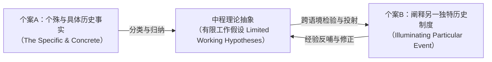

# Argument_Kazamias_2009_ForgottenThemes

---

## 研究问题

> [!question]
> 20 世纪上半叶由萨德勒、坎德尔、汉斯与乌利希等学者奠立的“历史-哲学-文化与自由人文主义母题”究竟包含哪些深层认识论基石与内部范式分殊？在 1960 年代战后实证主义、量化主义与结构功能主义的“科学化”围剿下，该传统何以被贬斥为“前科学”或“神秘主义”？比较教育学者应如何超越狭隘实证主义，重构历史比较法的现代学科合法性？

> [!claim] 核心主张
> 历史-哲学-文化与自由人文主义母题并非已被实证科学淘汰的“史前遗迹”，而是建基于广义科学观（*Wissenschaft* / *Episteme*）、以国家制度起源演进与全人教化（*Paideia*）为内核的深层人文科学传统；尽管其国民性格构念与辉格史观存在时代局限，但通过引入克莱恩·布林顿（Crane Brinton）的“有限工作假设”归纳法，历史比较法展现出严谨的因果解释与理论建构效能，是抵抗当代技术理性与实证工具主义狂热、捍卫以人为中心的教育研究的不可替代的学术防线。

> [!concept-lens] 阅读透镜
> - **对象** 19 世纪末至 20 世纪中叶英美跨大西洋比较教育思想史文本，重点考据马修·阿诺德（Matthew Arnold）、迈克尔·萨德勒（Michael Sadler）、艾萨克·坎德尔（Isaac Kandel）、尼古拉斯·汉斯（Nicholas Hans）与罗伯特·乌利希（Robert Ulich）的原著论述，以及 1960 年代诺亚、埃克斯坦、霍姆斯等人的批判文献。
> - **张力** 德语“广义人文科学”（*Vergleichende Erziehungswissenschaft*）的质性历史解释学，与战后英美经验社会科学狭隘的“量化预测论”、“可证伪科学律”之间的剧烈认识论冲突。
> - **贡献** 系统提炼历史学派七大共通认识论基石；细致拆解四位奠基者的范式分化；反思作者早年批判并借由比较史学的有限工作假设理论完成对历史比较法现代合法性的有力辩护。

---

## 理论框架

> [!framework-table] 理论工具箱
> | 理论工具 | 解释功能 |
> |----------|----------|
> | **[[Historical-Philosophical-Cultural Motif|历史-哲学-文化与自由人文主义母题]]** | 贯穿维多利亚晚期至 20 世纪中叶的核心范式，以广义科学观、因果力量解释、民族国家单元、质性优位与古典全人教化为七大认识论基石。 |
> | **牛津唯心主义与新自由主义哲学**<br>Oxford Idealism & New Liberalism | 萨德勒借由 T. H. 格林思想突破边沁与密尔的功利主义及狭隘自由放任观，确立国家介入文化塑造的正当性与积极自由观。 |
> | **阶梯式因素解释分析框架**<br>Factorial Interpretive Framework | 汉斯创立的三维因素体系（自然、宗教、世俗），为混乱海量历史数据确立清晰认知结构，探寻塑造国家教育相貌的客观力量。 |
> | **有限工作假设归纳法**<br>Limited Working Hypotheses | 援引克莱恩·布林顿（Crane Brinton）比较史学理论，论证历史比较可从个殊历史事实提炼中程假设，反哺阐释其他情境，击碎历史不可比较的实证教条。 |
> | **古典教化人本论**<br>Classical Paideia & Anthropocentric Episteme | 承接古希腊与德国新人文主义传统，将比较教育建基于对“人（*Anthropos*）”的终极关怀与人类伦理政治危机省察。 |

> [!warrant]- 理论如何支撑论证
> 作者通过思想史考古与概念类型学，将历史学派从杂乱的历史叙述中提炼为具有严密认识论自洽性的知识范式；继而通过认识论还原，揭示实证主义对历史学派的指责源于对“科学”一词的狭隘经验主义垄断；最后依托比较史学的方法论创新（有限工作假设），架起连接历史个殊性与理论概括性的认识论桥梁。

---

## 研究方法

> [!method-panel] 研究设计
> | 模块 | 材料与处理方式 |
> |------|----------------|
> | **思想史考古与概念类型学**<br>Intellectual History & Typological Reconstruction | 深度剖析 1817 年至 1960 年代跨越一个半世纪的比较教育经典文献，解构“因素”、“国民性格”、“国家”、“教化”等核心构念的谱系演变。 |
> | **认识论论辩与方法论对质**<br>Epistemological Critique & Methodological Confrontation | 选取 1960 年代科学化浪潮中的代表性文本，将实证主义的“规律预测假说”与历史学派的“因果情境解释”进行逐层对质与真伪甄别。 |
> | **反思性学术史考证**<br>Reflexive Academic Historiography | 结合卡扎米亚斯本人 1959–1963 年批判坎德尔的早期学术轨迹与门生经历，对历史学派展开兼具内部批判与同情理解的双重视角审视。 |

> [!sample-panel]- 样本与材料快照
> | 样本层面 | 构成 |
> |----------|------|
> | **先驱奠基文本** | 马修·阿诺德（1864《法国伊顿公学》、1868 欧陆高校考察）；迈克尔·萨德勒（1898 普鲁士中学教育问题报告、1900 吉尔福德演讲、1902 德国及其他地区中等教育动荡报告）。 |
> | **历史学派经典著作** | 坎德尔（1933《比较教育》、1955《教育新时代》、1959《比较教育方法论》）；汉斯（1949《比较教育：教育因素与传统研究》、1952《比较教育的英国先驱》、1959 历史路径论文）；乌利希（1961《民族的教育：历史视角的比较》）。 |
> | **实证与量化批评文本** | 诺亚与埃克斯坦（1969《走向比较教育科学》）；布赖恩·霍姆斯（1965《教育中的问题：比较路径》）；菲利普·福斯特（1960）；C. 阿诺德·安德森（1961）；埃温·埃普斯坦（1970）。 |
> | **史学理论与纪念文献** | 克莱恩·布林顿（Crane Brinton）比较史学方法论；约瑟夫·劳威斯（1959 哲学路径）；乔治·贝雷迪（1965 坎德尔悼词）；保罗·纳什（1977 乌利希悼词）；卡扎米亚斯个人文献（1961, 1963, 1966, 1977）。 |

---

## 论证结构

> [!logic-map]- 核心论证逻辑链
> ```mermaid
> flowchart TD
>     A["19世纪现代主义发端的分化<br>（朱利安实证主义 vs 行政借用实用主义）"] --> B["维多利亚晚期思想转向<br>（阿诺德批判Philistines庸俗 / 萨德勒确立校外精神力量）"]
>     B --> C["历史-哲学-文化与自由人文主义母题奠基<br>（萨德勒/坎德尔/汉斯/乌利希）"]
>     C --> D["七大共通认识论基石<br>（人文科学/因素解释/历史改良/国民性/质性优位/自由民主/观念比较）"]
>     D --> E["内部范式分殊与具体制度案例<br>（萨德勒机构实践 / 坎德尔国家变量 / 汉斯因素框架 / 乌利希人本教化）"]
>     E --> F["1960年代实证主义科学化危机<br>（诺亚/埃克斯坦/霍姆斯贬斥为前科学/神秘主义/无法预测）"]
>     F --> G["卡扎米亚斯反思与辩护<br>（检讨辉格史观与国民性虚妄 / 援引布林顿重构工作假设归纳法）"]
>     G --> H["结论：确立历史比较法现代合法性<br>（广义科学观Wissenschaft + 以人为中心的古典人文防线）"]
> ```

---

### 论证步骤一　19 世纪现代主义发端与阿诺德/萨德勒的历史情境转向

> [!claim] 步骤一核心主张
> 19 世纪欧美的比较教育探索经历了从浅层报告与功利借用向历史-文化情境分析的深刻转向；马修·阿诺德通过批判自由放任庸俗主义并倡导国家介入文化教化，迈克尔·萨德勒通过吸纳牛津唯心主义与探寻校外无形精神力量，共同开辟了历史-哲学-文化母题的思想先河。（pp.37–39, 42–45）

#### 1. 早期比较教育探索的三大局限与行政借用范式

19 世纪比较教育的现代主义发端呈现出双重思想分化：一端是马克-安托万·朱利安（Marc-Antoine Jullien de Paris）在 1817 年开创的基于经验观察、旨在提供“非任意且非多变”知识的实证科学方案；另一端则是 19 世纪中叶占据绝对统治地位的行政官员考察报告。（pp.37–38）

> [!row-contrast] 19 世纪初中期比较教育早期话语模式对照
> | 比较维度 | 朱利安的实证科学构想（1817） | 行政官员与政策顾问考察话语（1830s–1860s） |
> |---|---|---|
> | **代表人物** | 朱利安（Marc-Antoine Jullien de Paris） | 贺拉斯·曼、卡尔文·斯托、约翰·格里斯科姆、亨利·巴纳德、维克多·库森等 |
> | **核心目的** | 构建基于事实表的实证科学法则，指导理性改革 | 汲取国外办学经验（Lesson-learning）以解决本国具体行政困难 |
> | **方法特征** | 编制标准化问卷与量化统计表雏形 | **事实描述性（Reportorial-descriptive）**，缺乏社会历史纵深 |
> | **改良逻辑** | 普适理性主义改良 | **功利工具主义（Utilitarian-instrumental）与先验改良（Meliorism）** |

行政官员们远赴普鲁士、法国与瑞士考察，其核心动力在于“经验借鉴”与“机械借用”，先验地预设良好教育体系的标准，缺乏对教育制度扎根于特定民族历史土壤的深刻自觉。（pp.37–38）

#### 2. 马修·阿诺德批判自由放任庸俗主义并以法国公学确立国家文化教化

19 世纪后半叶，英国皇家学校督学马修·阿诺德开启了截然不同的文化审视路径。深受西方古典人文教化（*Paideia*）熏陶的阿诺德，以极其尖锐的笔触批判维多利亚时期统治阶级的庸俗与未开化，指斥强调狭隘个人主义、自愿主义与国家不干预的自由放任自由主义是缺乏“甜蜜与光明（Sweetness and Light）”的庸人（Philistines）信条。（p.38）

> [!policy-context] 阿诺德论国家作为民族代表行动力量与文化塑造
> - **自由主义内涵的民主重构** 阿诺德断言自由主义意味着“民主平等（Democratic Equality）”或“社会自由”，而非对个人主义的盲目崇拜或资产阶级单一利益维护。
> - **国家行动与文化实现** 教育终极目标在于培育“文化”，而文化若无国家积极干预绝无法达成。阿诺德将国家界定为“民族的代表性行动力量；国家的行动即是民族的代表性行动”。
> - **法国图卢兹公学实证案例（Lyceum of Toulouse）** 在《法国伊顿公学》（*A French Eton*）中，阿诺德极力推崇拿破仑建立并由国家维持的公立中学系统，详尽剖析图卢兹公学的课程方案：除古典希腊语与拉丁语外，全面引入自然科学、近代历史、地理、现代外语以及母语法语教学，展示了国家行动如何成功保障国民大众免于庸俗化。（p.38）

阿诺德的研究彻底超越了单纯的事实罗列，开创了将学校教育置于民族政治与文化语境中的“准历史、自由人文主义与文化比较”分析范式。（pp.38–39）

---

### 论证步骤二　战间期四大学者构建历史人文主义母题的七大认识论基石

> [!claim] 步骤二核心主张
> 迈克尔·萨德勒、艾萨克·坎德尔、尼古拉斯·汉斯与罗伯特·乌利希在 20 世纪上半叶构建了成熟的历史-哲学-文化与自由人文主义母题，其理论体系由广义人文科学定位、因果力量解释学、历史改良主义、民族国家与国民性分析单元、质性优位、自由民主人文主义以及思想观念唯心主义比较等七大互为支撑的认识论基石所统摄。（pp.39–42）

#### 1. 广义人文科学定位与历史因果解释学转向

四位奠基巨擘坚决拒斥将比较教育定性为经验性或实证主义的狭隘“社会科学”，而是回归德语的 *Wissenschaft* 与希腊语的 *Episteme* 范畴，将学科确立为贯通科学与人文学术的跨学科体系。（pp.39–40）

> [!feature] 历史人文主义范式的前三大认识论基石
> - **广义人文科学定位（Human Science / Wissenschaft）** 该传统更接近德语的“比较教育科学”（*Vergleichende Erziehungswissenschaft*），而非美语中实证色彩浓厚的 *Comparative Education*。它类似于比较解剖学、比较法学与比较宗教学，其比较不仅考察现状，更追溯制度起源与演进脉络。汉斯强调：比较教育学恰恰坐落于人文科学与自然科学的交界边缘，因而类似于哲学。（pp.39–40）
> - **因果因素与历史解释学（Explanatory and Interpretive Episteme）** 研究目的在于“理解”与“解释”国家教育体系何以演化为当下样态，探寻政治、社会、经济与文化力量与因素（Forces and Factors）如何决定了体系的异同。坎德尔在其 1933 年名著中明确提出因果探究三阶段：分析产生问题的起因 ➔ 比较制度间的差异及其内在根由 ➔ 考察各国尝试的解决方案。
> - **历史改良主义旨趣（Historical-Meliorism）** 学者们虽然是专注于理性解释的历史知识分子而非行政行动派，但坚信通过研究外国制度，能够培养广阔的哲学态度与深刻洞察力，进而更好地理解和改革本国教育。（p.40）

这一转向使比较教育从浮于表面的政策工具，转变为具有深厚历史厚度的阐释性学科。（pp.39–40）

#### 2. 民族国家与国民性单元、质性优位与唯心观念比较

在分析单元与方法论规范上，历史学派展现出鲜明的质性阐释与思想史取向，排斥以量化测验度量教育本质。（pp.40–42）

> [!tension-table] 质性精神诠释与纯统计测量取向的认识论对质
> | 对质维度 | 历史人文主义范式（Sadler, Kandel, Hans） | 实证量化与心理测量倾向（Empirical & Psychometric） |
> |---|---|---|
> | **认识论前设** | 教育品质体现在学校整体精神氛围、文化价值与制度结构中 | 教育必须具有经由统计数据客观证实和检验的肯定的值 |
> | **统计数据效能** | 仅能在单国内部使用；跨国比较因概念与社会语境差异而失效 | 追求建立跨越国界的通用指标体系与量化模型 |
> | **教育目标界定** | 坚信统计方法只能测量结果，**绝无法定义教育的宗旨与目标** | 试图通过常模与效率指标反向规范教育行为 |
> | **典型案例批判** | 汉斯严厉批判战后美国滥用智商测验推导“北欧白人优于斯拉夫或意大利移民”的伪科学种族偏见 | 依赖标准化测验与心理智商度量判定群体优劣 |

与此同时，学者们确立了后四大核心基石：以民族国家与国民性为核心分析单元（将国民性格视为主导学校形式的深层无形动因）；恪守质性诠释优位；秉持源自古希腊教化（*Paideia*）的自由民主人文主义信念；以及赋予思想、理想与精神形态高于物质经济的唯心主义解释权重。（pp.40–42）

---

### 论证步骤三　内部四大先驱学者的范式分殊与具体制度案例

> [!claim] 步骤三核心主张
> 四位奠基巨擘在共享宏观母题的同时，因所处时代变迁、地缘政治处境与从政治学经历的差异，发展出截然不同的方法论侧重：萨德勒立足特别调查署实践探求校外精神力量，坎德尔首次将国家作为核心解释变量，汉斯创立三维因素分析框架，乌利希则开创了融通西方思想史的古典教化人本范式。（pp.42–52）

#### 1. 迈克尔·萨德勒：牛津唯心主义滋养下的新自由主义改革家与校外精神力量

迈克尔·萨德勒（Michael Sadler）在拉格比公学（Rugby School）与牛津大学三一学院接受严格的古典人文学术熏陶。19 世纪末，维多利亚晚期英国昔日“世界工场”的工商业霸权受到德国与美国的剧烈撼动，边沁与密尔的功利主义哲学随之破产。（pp.42–43）

> [!policy-design] 萨德勒的学术生涯与政策实践网络
> 1. **牛津唯心主义（Oxford Idealism）的思想浸润** 萨德勒深受托马斯·希尔·格林（T. H. Green）、布拉德利与鲍桑葵等哲学家影响，将自由界定为积极向善的“积极自由”，主张国家应当承担积极的社会与文化干预功能。
> 2. **新自由主义（New Liberalism）政治立场** 在社会哲学上偏离维多利亚放任主义，坚定探索“个人主义与社会主义之间的中间地带（Debatable territory between Individualism and Socialism）”。（p.43）
> 3. **横跨学术与官僚体系的智囊实践** 1884 年投身大学推广运动（University Extension）推动劳工阶级成人教育；1894–1895 年主笔具有里程碑意义的布莱斯委员会报告（Bryce Commission）；1895–1903 年执掌特别调查与报告署（OSIR）；1911–1923 年出任利兹大学校长；1907 年规划大英帝国教育局蓝图。（pp.44–45）

在 1898 年普鲁士中学报告与 1902 年德国中等教育动荡报告中，萨德勒详尽剖析德国工业崛起的根由，指出这源于德国教育的严密组织与赋予其生机的内在“精神力量”。在 1900 年著名的吉尔福德演讲中，萨德勒提炼出名垂青史的学术准则：研究外国教育体系必须认识到校外的事情比校内的事情更为重要，并且支配着校内的一切。（pp.43–44）

#### 2. 艾萨克·坎德尔：政治国家作为核心解释变量的理论建树与三重局限

跨大西洋学者艾萨克·坎德尔（Isaac Kandel）在哥伦比亚大学执教期间，通过 1933 年《比较教育》与 1955 年《教育新时代》确立了国际权威地位。乔治·贝雷迪在其悼词中盛赞其为“大学人文学者一代的巍峨丰碑，照亮激荡浪潮的灯塔”。（pp.45–46）

> [!method-position] 坎德尔论国家作为解释变量与古典政治哲学渊源
> 坎德尔在比较教育学科史上**首次将“国家（The State）”作为首要的上下文解释变量**引入比较研究。他承接柏拉图与亚里士多德的古典命题，提出：
> - “每个国家都拥有其意志所决定的教育类型”（Every state has the type of education that it wills）；
> - “国家如何，学校便如何”（As is the state, so is the school）；
> - “你期望国家呈现何种面貌，就必须将其置于学校之中”（What you want in the state, you must put in the school）。（pp.47–48）

然而，卡扎米亚斯深刻指出，坎德尔这一开创性洞见同时受制于严重的三重理论缺陷：

> [!critique-method] 卡扎米亚斯对坎德尔政治分析范式的三重批判
> - **政体二元理想型对立的机械分类** 将当代国家截然割裂为“极权国家（法西斯意大利、纳粹德国、苏联）”与“民主国家（英、美、法）”两极，忽视复杂政治光谱。
> - **亲盎格鲁-撒克逊的意识形态偏见** 带有强烈的亲美英自由主义立场与对苏联社会主义的意识形态成见，倡导以“文化民族主义”对抗军国主义政治民族主义，但预设了西方资产阶级议会制的终极优越性。（pp.48–49）
> - **实然与应然混淆导致阶级盲区** 将规范性期望（国家“应当”如何）投射为客观现实（国家“实际”如何），从而彻底无视了战后英美发达工业资本主义社会内部普遍存在的严酷阶级压迫、种族歧视与权力不平等分配。（p.48）

#### 3. 尼古拉斯·汉斯：阶梯式因素分析框架与政治民主制度深度横评

尼古拉斯·汉斯（Nicholas Hans）从东欧流亡至英国伦敦大学国王学院任教，是历史学派中体系化程度最高的学者。正如特雷瑟韦（Tretheway）所指出，汉斯的卓越贡献在于为原本海量混乱的比较教育数据确立了清晰的秩序与认知结构。（pp.49–50）

> [!quad-grid] 汉斯的阶梯式因素解释体系（Factorial Interpretive Framework）
> - **自然因素（Natural Factors）** 考察种族（Race）、语言（Language）与地理环境（Environment）对国家教育格局施加的天然先决制约。
> - **宗教因素（Religious Factors）** 重点剖析天主教、英国圣公会与清教传统在教育价值观、学校控制权与道德规范上的历史博弈。
> - **世俗因素（Secular Factors）** 系统考察人文主义、社会主义与民族主义三大世俗思潮在现代教育制度创立中的决定性作用。
> - **民主综合归宿（Democracy & Education）** 将民主制度作为总结性维度，探讨政治意识形态与国家教育公平的深层互动。（p.50）

在展开具体分析时，汉斯展现了极具穿透力的制度案例分析：

> [!row-contrast] 汉斯因素分析法的两大标志性案例
> | 考察案例 | 具体经验案例与机制剖析 | 核心论证推论 |
> |---|---|---|
> | **案例一：民族主义与法西斯教育** | 梳理德国费希特、意大利马志尼的思想发端，进而深入剖析墨索里尼与哲学家真蒂莱（Giovanni Gentile）治下的意大利法西斯教育改革，以及希特勒统治下以极权种族主义重构的德国学校体系。（pp.50–51） | 民族主义作为世俗动因，在特定极权意识形态异化下会彻底吞噬学校，将其异化为国家崇拜机器。 |
> | **案例二：英美与苏联民主概念辨析** | 摆脱坎德尔的简单非黑即白，横向比照英美民主（强调政治自由）与苏联民主（强调社会平等）。 | **惊人深刻的批判性结论** 英美放任了严重的阶级与教育机会不均，苏联则扼杀了文化自由与精神创造，**“两种民主实践在实现公民真正平等的教育机会上皆存在严重缺陷（Defective）”**。（p.51） |

#### 4. 罗伯特·乌利希：贯通西方文明的思想史编纂与以人为本的古典教化

罗伯特·乌利希（Robert Ulich）原任魏玛德国萨克森教育部高官与德累斯顿工业大学教授，44 岁时因坚拒与希特勒法西斯政权同流合污而被迫流亡美国，执教于哈佛大学。（pp.51–52）

> [!proc] 乌利希《民族的教育》（1961）的西方思想史四阶段叙事
> 1. **中世纪主义（Medievalism）** 阐述教会大一统神学体系下的学术与经院教育根基。
> 2. **文艺复兴与宗教改革（Renaissance & Reformation）** 剖析古典人文复兴与教派分立对世俗国民学校的催生作用。
> 3. **理性主义时代（Rationalism）** 展现启蒙理性与科学精神如何重塑国家教育组织。
> 4. **工业科学技术时期（Science & Technology）** 深入考察英、法、德、俄四国在中等与高等教育应对工业化浪潮的历史变迁，并提炼其对战后亚非拉“新兴国家（New Nations）”教育转型的普遍借鉴意义。（p.51）

尽管卡扎米亚斯指出乌利希的比较维度在一定程度上被思想通史所冲淡（读者必须自行在丰富的史料中进行横向比对），但哈佛学者保罗·纳什在其悼词中高度肯定了其学术遗产的四大人文维度：

> [!feature] 乌利希人文主义比较范式的四大支柱
> - **始终保持以“人（Person）”为中心** 拒绝将研究中心置于冷冰冰的课程方案、学科规训、机构设置或量化指标上，坚信教育的最终目的在于人的全人生成。
> - **不加妥协的历史语境主义** 坚信离开深邃的历史根源便绝不可能真正理解现实中的教育过程。
> - **关照教师培养的人文本质** 极其反感比较教育演变为少数学者制造复杂图表、模型和自娱自乐晦涩理论的技术行径，坚持研究成果必须反哺一线教师教育。
> - **坚定的社会民主党政治信念** 终身恪守民主社会主义理想，以学术抵御极权与压迫。（p.52）

卡扎米亚斯深情回顾了自己在哈佛师从乌利希的经历，指出乌利希的人格风范与学术造诣承接了维尔纳·雅格尔（Werner Jaeger）《教化》（*Paideia*）的崇高传统，深刻启发了其本人与贝雷迪走上历史主义比较教育道路。（p.52）

---

### 论证步骤四　1960 年代实证主义科学化危机与对历史学派的四大批判

> [!claim] 步骤四核心主张
> 1960 年代冷战科技竞赛、去殖民化新兴国家建国以及经验社会科学大爆发引发了比较教育学科的深刻“认同危机”；新一代实证主义与结构功能主义学者将历史学派贬斥为不具备预测力、依赖私人洞察的“前科学”或神秘主义，促使作者重新反思历史学派的方法论边界。（pp.52–55）

#### 1. 战后实证主义兴起的历史语境与“新玩家”的科学化重塑

1960 年代，比较教育学界的外部生态发生剧变：亚非拉新兴国家迫切需要能够迅速转化为经济增长与国家建构的“实用操作工具”；欧美国家亦在福利社会转型中高度重视教育的经济社会效益；同时，自然科学与量化社会科学的威望达到顶峰。比较教育与国际教育学会（CIES）成立，《比较教育评论》（CER）创刊，大批接受现代实证科学训练的“新玩家（New Player-comparativists）”涌入该领域。（pp.52–53）

在技术理性、经验主义与工具主义主导的氛围下，老一代学者崇奉的历史、哲学与古典教化（*Paideia*）被指责为陈腐落伍，实证学派针对历史学派发起了猛烈围剿。（pp.53–54）

> [!tension-table] 1960 年代实证主义学者对历史比较学派的四大核心指控
> | 批判向度 | 实证批评代表学者与核心文献 | 核心攻击焦点与理论定性 |
> |---|---|---|
> | **前科学与主观臆测** | 诺亚与埃克斯坦<br>（Noah & Eckstein, 1969《走向比较教育科学》） | 将萨德勒、坎德尔和汉斯归入学科演进的**“前科学（Pre-scientific）的因素与力量阶段”**；指责其结论依赖学者个人的“私人洞察力（Private insights）”，缺乏判定各因素相对重要性的客观标准，结论充其量只是“待检验的假说”。（p.53） |
> | **缺乏因果预测力** | 布赖恩·霍姆斯<br>（Brian Holmes, 1965《教育中的问题：比较路径》） | 断言历史比较无法替代**“科学比较教育”**；学科必须是一门**“概括性科学（Generalising science）”**；教育决策者关心的是行动的未来后果而非历史渊源，真正的理解来自于“成功的预测（Successful prediction）”。（Holmes, 1965） |
> | **个殊性排斥比较** | C. 阿诺德·安德森 & 菲利普·福斯特<br>（Anderson, 1961; Foster, 1960） | 斥责历史学派为“历史主义（Historicists）”，坚信历史只处理具有唯一时空坐标的“独特且不可重复的现象”；既然独特事物不可比较，比较学者就必须告别历史，转向探寻重复模式与规律的社会科学家。 |
> | **滑向神秘主义** | 埃温·埃普斯坦<br>（Erwin Epstein, 1970） | 攻击萨德勒对“无形、不可捉摸的精神力量”的强调**“濒临神秘主义（Borders on mysticism）”**，指责其呼吁学者关注非经验力量实质上是将严谨的实证分析引向随意的空想或灵性启示。（p.54） |

#### 2. 卡扎米亚斯早年的学术反思：辉格史观与国民性格伪解释的清算

面对这场危机，卡扎米亚斯早在 1961 年与 1963 年便以战后青年学者身份率先展开内部审视。卡扎米亚斯尖锐指出，老一辈学者的实际操作确实存在重大方法论硬伤：

> [!critique-method] 卡扎米亚斯对历史学派两大方法论陷阱的早期清算
> - **混淆“实然”与“应然”引发的“辉格史观（Whiggism）”** 卡扎米亚斯援引著名史学家赫伯特·巴特菲尔德（Herbert Butterfield）的经典论断，批评坎德尔试图在历史考察中寄托民主改良愿望，将“现状是怎样的（What is）”与“未来应当怎样（What ought to be）”混为一谈。历史学家的天职是客观厘清事物为何发生，一旦历史写作被先验的道德改良狂热所绑架，必然堕落为剪裁史料的辉格主义。（pp.54–55）
> - **“国民性格（National Character）”概念的滥用与套套逻辑** 卡扎米亚斯严厉抨击坎德尔将英法制度差异轻率归因于心理特质的作法：例如坎德尔声称“英国教育缺乏体系”源于“英国人厌恶抽象思考与规划”，而“法国教育秩序井然”源于“法国人沉溺于纯粹思维的快感”。这种缺乏过硬史料支撑的刻板印象，正如约瑟夫·劳威斯（Joseph Lauwerys）所揭露——**“国民性格最终能被用来解释一切，因而实际上什么也没有解释”**。（p.55）

然而，卡扎米亚斯郑重声明：批判特定学者的个别操作偏颇，绝不等于否定历史方法在比较教育学中的根本地位。（pp.55–56）

---

### 论证步骤五　卡扎米亚斯的方法论辩护与历史人文主义传统的现代重构

> [!claim] 步骤五核心主张
> 实证主义者对历史方法的贬斥建立在对“科学”的狭隘经验主义定义之上；通过激活德语 *Wissenschaft* 的广义科学观，并引入克莱恩·布林顿（Crane Brinton）比较史学中基于有限工作假设的中程归纳法，能够完全确立历史比较法在理论提炼与因果阐释上的现代科学合法性，并捍卫以人为中心（*Anthropos*）的终极价值。（pp.56–57）

#### 1. 语言认识论还原：打破英语狭隘“Science”对科学概念的垄断

卡扎米亚斯首先从语言哲学与认识论源头破除实证学派的指责。他指出，英语中的“Science”在战后被高度窄化为自然科学与经验量化社会科学的同义词；但在其他主要学术语言中，“科学”具有全然不同的广阔内涵。（p.56）

> [!ref-table] “科学”概念的跨语言认知体系对照
> | 词汇概念 | 语言与文化渊源 | 学术覆盖范畴 | 认识论合法性定性 |
> |---|---|---|---|
> | **Science** | 近现代英语语境（尤其是战后英美） | 狭义局限于自然科学、实证主义、数理统计与经验定量社会科学 | 将质性历史研究、哲学思辨与价值探究粗暴排除在“科学”门外（p.56） |
> | **Wissenschaft** | 德语学术传统 | 涵盖所有对自然、社会、文化与人文学科的系统化、规范化学术探究 | 萨德勒、坎德尔与汉斯的学术完全契合德语“比较教育科学”的标准（pp.39, 56） |
> | **Episteme** | 古希腊哲学体系 | 指代能够提供真知与严密理性理解的知识体系，对立于主观意见（*Doxa*） | 强调系统探寻事物演化根由，兼具自然研究与人文规范维度 |

如果恢复德语 *Wissenschaft* 与古希腊语 *Episteme* 的广义科学界定，历史比较教育不仅不是“前科学”，反而是探索人类文化复杂机制的正统科学范式。（p.56）

#### 2. 援引布林顿比较史学：有限工作假设打破个殊与普遍的虚假二分

针对福斯特与安德森所谓“历史只处理个殊性、因而无法进行抽象与理论概括”的教条，卡扎米亚斯援引享誉学界的哈佛比较史学家克莱恩·布林顿（Crane Brinton，《革命的解剖》作者）的史学理论予以正面反驳。（p.56）

> [!proc] 基于有限工作假设（Limited Working Hypotheses）的历史归纳循环
> 1. **深耕具体与个殊事实（The Particular & The Concrete）** 历史比较学者首先对特定时空坐标下的具体制度、法案、政策与文化语境展开严密考证。
> 2. **分类提炼与中程归纳（Induction & Formulation）** 比较史学家完全有能力将历史现象归类，并提炼出具有概括性的理论命题。这些命题虽非普遍永恒铁律，但构成了严谨的“**有限工作假设**”。
> 3. **跨情境检验与反哺阐释（Testing & Illumination）** 将所提炼的有限工作假设投射至其他面临类似结构性矛盾的教育体系中进行批判性检验，从而深刻照亮另一个独特的历史个案。（p.56）



对“特殊性”与“一般性”的探究普遍存在于历史学与社会科学之中；两者之间的界限绝非不可逾越的鸿沟，而仅仅是**研究重心与研究目标（Emphasis and objectives）的侧重差异，绝非方法本质与科学属性的断裂**。（p.56）

#### 3. 终极价值收束：重申以人为中心（Anthropos）的人文主义防线

在全篇结论中，卡扎米亚斯对历史-哲学-文化母题作出了极具理论深度的定性升华。他呼吁比较学者在面对现代技术的狂飙与量化指标的规训时，必须重新继承萨德勒、坎德尔、汉斯与乌利希的核心遗产。（pp.56–57）

> [!chain-link] 历史比较传统的终极价值推导链
> - **前提：超越“学校教育（Schooling）”狭隘范畴** 坚决拒绝将教育等同于单纯的课堂教学、标准化测验或文凭工厂，将其提升至西方古典**“文化教化（Paideia / Culture）”**的广阔格局。
> - **机制：确立“以人为中心（Man-centred / Anthropocentric）”的人文知识体系** 无论制度结构多么宏大、统计模型多么繁复，比较教育的核心关切必须始终锁定在“人（*Anthropos*）”的生存、发展与精神解放之上。
> - **结论：铸就直面人类文明危机的思想防线** 比较教育学必须充盈着深厚的人文主义哲学情怀，主动介入当代人类所面临的宏大政治极权、社会撕裂与伦理价值危机，唯有如此，方能不负这门学科在诞生之初所承载的文明重任。（pp.56–57）

---

## 主要发现

> [!finding-cards] 核心发现
> 1. **历史学派母题的七大认识论基石** 萨德勒、坎德尔、汉斯与乌利希共同奠立了以广义人文科学、因果因素解释学、历史改良主义、民族国家单元、质性优位、自由民主信念与观念唯心比较为支柱的学术范式。（pp.39–42）
> 2. **奠基学者独特的范式分支贡献** 萨德勒立足特别调查署实践开创“校外无形精神力量”情境论；坎德尔首创“国家意志与政体”解释变量；汉斯建立自然、宗教与世俗三维阶梯式因素框架并敏锐指出英美与苏联民主在教育公平上的共同缺陷；乌利希贯通西方思想文明四阶段开辟以人为本的教化史路径。（pp.42–52）
> 3. **1960年代实证危机的本质是话语垄断** 实证主义者对历史学派“前科学”、“主观神秘”与“缺乏预测”的指责，源于战后英美经验主义对“科学（Science）”概念的狭隘语义垄断，抹杀了德语 *Wissenschaft* 与希腊语 *Episteme* 的深厚人文科学传统。（pp.52–56）
> 4. **有限工作假设确立历史比较法现代科学合法性** 援引克莱恩·布林顿的比较史学理论，论证历史研究能够经由归纳提炼中程的“有限工作假设”，在特殊与一般之间建立双向循环检验，从而打破个殊性不可比较的实证主义神话，确立了以人（*Anthropos*）为中心的现代学科防线。（pp.56–57）

> [!stat-cards]- 标志性学术史与文献节点
> - **1817 年** 朱利安发表《比较教育初步观察与计划》，提出实证科学建构构想。（p.37）
> - **1864 年** 阿诺德发表《法国伊顿公学》，以图卢兹公学为例确立国家干预文化教育模式。（p.38）
> - **1895–1903 年** 萨德勒主持英国特别调查与报告署（OSIR），奠定实地历史比较调查范式。（pp.44–45）
> - **1900 年** 萨德勒发表吉尔福德演讲，确立“校外无形精神力量支配校内一切”的名篇断论。（p.44）
> - **1933 年** 坎德尔出版经典巨著《比较教育》，开创国家政体解释变量与观念比较进路。（p.46）
> - **1949 年** 汉斯出版《比较教育：教育因素与传统研究》，确立自然、宗教、世俗三维因素框架。（p.50）
> - **1961 年** 乌利希出版《民族的教育》，系统梳理西方文明演进对教育制度的塑造。（p.51）
> - **1960 年代** 诺亚、埃克斯坦、霍姆斯发起科学化批判，卡扎米亚斯展开方法论辩护与重构。（pp.53–56）

---

## 关键引用

> [!citation-card] 萨德勒论校外无形精神力量与民族活体有机体
> 教育绝非仅关乎学校或书本知识。因此，若我们要研究外国教育系统……就必须努力探求究竟何种无形的、不可捉摸的精神力量在真正维系着学校系统并决定其实际效能……国家教育系统是一个活生生的有机体，是昔日被遗忘的艰难抗争与战火的结晶。它蕴含着民族生活的隐秘运作；它既反映又试图救治国民性格的缺陷。(pp. 40, 44)；引自 Sadler (1900/1964:309–310)
>
> *[E]ducation is not a matter of schools or book learning alone. Therefore, if we propose to study foreign systems of education... we must also... try to find out what is the intangible, impalpable, spiritual force which, in the case of any successful system of Education, is in reality upholding the school system and accounting for its practical efficiency... A national system of education is a living thing, the outcome of forgotten struggles and difficulties, and 'of battles long ago.' It has in it some of the secret workings of national life.*

> [!citation-card] 坎德尔论国家意志与学校塑造的关系
> 比较教育专家应当通晓不同的政治理论，尤其是关于国家与个人关系的学说……柏拉图与亚里士多德早已阐明了这一原则，后来被表述为：‘国家如何，学校便如何’，或者‘你期望国家呈现何种面貌，就必须将其置于学校之中’。(pp. 47–48)；引自 Kandel (1933:274–275)
>
> *The specialist in comparative education should have a knowledge of varying political theories, especially as they bear on the relations of the state and the individual... [both Plato and Aristotle] early enunciated the principle which was later expressed in the phrase 'as is the state, so is the school' or 'what you want in the state, you must put in the school'.*

> [!citation-card] 坎德尔论比较教育的实质在于比较观念、理想与形态
> 坎德尔在 1956 年深刻反思比较教育学的本质，当被问及‘我们究竟比较什么？’时，他斩钉截铁地回答道：‘答案应当是比较各种观念、理想与形态。’(p. 42)；引自 Kazamias & Schwartz (1977:154–155)
>
> *'What do we compare?' Kandel asked in 1956, to which he responded: 'The answer should be the comparison of ideas, ideals and forms'.*

> [!citation-card] 汉斯论比较教育作为跨越人文与科学边缘的哲学品格
> 汉斯精辟指出：‘比较教育学作为一门学术学科，恰恰坐落于人文科学与自然科学的交界边缘，因此类似于哲学，后者正是两者的共同表述。’(pp. 39–40)；引自 Hans (1959:299)
>
> *Comparative Education as an academic discipline is just on the border line between humanities and sciences and thus resembles philosophy, which is the formulation of both.*

> [!citation-card] 汉斯论英美政治自由与苏联社会平等在实现真正教育公平上的双重缺陷
> 从这些案例中可以清晰看出，无论是英美将民主解释为政治自由，还是苏联将民主解释为社会平等，在实践中都未能在各自国家为全体公民建立起真正平等的受教育机会。我们不得不得出结论：现行实践中的这两种民主解释都是存在严重缺陷的。(p. 51)；引自 Hans (1949:236–237)
>
> *From these examples it appears that neither the Anglo-Saxon interpretation of democracy as political freedom nor its Soviet interpretation as social equality have resulted in practice in establishing a true equality of educational opportunity for all citizens of their countries. We cannot escape the conclusion that both interpretations of democracy as practiced at present are defective.*

> [!citation-card] 卡扎米亚斯援引布林顿比较史学重构有限工作假设
> 正如杰出的比较史学家克莱恩·布林顿所表明的，对历史现象进行归类并为了提炼概括而展开比较是完全可行的。尽管此类概括可能具有有限性而非普遍永恒性，但它们反过来可以作为工作假设，在其他类似情境中接受检验以阐释这些情境。换言之，通过对具体的、经验的和特殊事物的考察，具有历史头脑的比较教育学者能够归纳出概括性结论，并进而用其照亮另一个具体的事件或形态。(p. 56)；引自 Kazamias (1963:396)
>
> *As Crane Brinton has shown, it is quite possible to categorize or classify historical phenomena and compare them for the purpose of making generalizations. Although such generalizations may be of a limited rather than a universal nature, they may in turn be used as working hypotheses to be tested in other similar situations in order to illuminate them. In other words, from an examination of the specific, the concrete and the particular, the historically-minded comparative educator may induce a generalization and then use it in order to illuminate another particular event or form.*

> [!citation-card] 历史人文主义比较传统的以人为本与全人教化底线
> 萨德勒、坎德尔、汉斯与乌利希这四位杰出学者，不仅从‘学校教育’的狭隘意义来审视教育，更从‘文化教化（paideia/culture）’的广阔意义来理解教育；他们将比较教育视为一门‘人文主义知识体系（humanistic episteme）’，其根本关切应当始终锁定在‘人（anthropos）’身上。因此，它必须是以人为中心的（anthropocentric）；它必须充盈着‘人文主义’的哲学情怀，必须深切关照人类所面临的宏大政治、社会与伦理危机。(pp. 56–57)
>
> *Sadler, Kandel, Hans, and Ulich, four of its most noted exponents, approached education not just from the narrow sense of 'schooling' but from the broader sense of paideia/culture, and comparative education as a 'humanistic episteme' whose major concern should be with the 'human being', the anthropos ('man'). As such, it should therefore be anthropocentric ('man-centred'); it should be pervaded by a 'humanistic' philosophy, and it should be concerned with the great problems—political, social but also ethical—which 'mankind' faces.*

---

## 自述局限

> [!limits] 原文自述局限与研究边界
> - **个人学术亲历者立场的双重张力** 卡扎米亚斯明确自述其学术生平卷入的双重张力：一方面，作为战后新一代青年学者，他曾率先激烈批判坎德尔的历史主义方法（指出其辉格史观与国民性格偏见）；另一方面，他又在哈佛大学亲炙乌利希教授（并合编文集向恩师致敬），这使其在反思历史学派时既带有敏锐的批判锋芒，又带有深刻的学脉同情与代际反思张力。（pp.52, 54）
> - **主要聚焦于英美与跨大西洋代表性人物** 本章对历史-哲学母题的考察主要聚焦于英美语境中的四位核心学者（萨德勒、坎德尔、汉斯、乌利希）及先驱阿诺德，对欧洲大陆同属该传统的其他重要学者（如德国的施耐德 Friedrich Schneider、法国相关比较学者）仅作了简略提及，未作同等深度的专门文献剖析。（pp.38–39）
> - **历史学派奠基者自身的阶级与意识形态盲区** 卡扎米亚斯客观指出，包括坎德尔在内的老一代历史学者带有明显的西方资产阶级自由民主制偏见与先验改良主义预设，未能深入探究发达资本主义社会内部的阶级对抗、种族主义与深层权力不平等，在社会批判的彻底性上具有时代局限性。（pp.48, 55）

---

## 来源

- [[books/Cowen(Ed.)_2009_Springer/Ch04_Kazamias_2009|Ch04_Kazamias_2009]]
