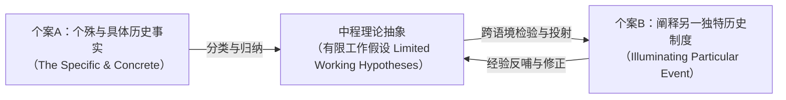

# Argument_Kazamias_2009_ForgottenThemes

---

## 研究问题

> [!question]
> 20 世纪上半叶由[[Michael Sadler|迈克尔·萨德勒]]（Michael Sadler）、[[Isaac Kandel|艾萨克·坎德尔]]（Isaac Kandel）、[[Nicholas Hans|尼古拉斯·汉斯]]（Nicholas Hans）与[[Robert Ulich|罗伯特·乌利希]]（Robert Ulich）等学者奠立的历史-哲学-文化与自由人文主义母题究竟包含哪些深层[[Epistemology|认识论]]基石与内部[[Paradigm|范式]]分殊？在 1960 年代战[[Postpositivism|后实证主义]]、量化主义与结构功能主义的科学化围剿下，该传统何以被贬斥为前科学或神秘主义？比较教育学者应如何超越狭隘[[Positivism|实证主义]]，重构[[Historical-Comparative Method|历史比较法]]的现代学科合法性？

> [!claim] 核心主张
> 历史-哲学-文化与自由人文主义母题并非已被实证科学淘汰的史前遗迹，而是建基于广义科学观（*Wissenschaft* / *Episteme*）、以国家制度起源演进与全人[[Bildung|教化]]（*Paideia*）为内核的深层人文科学传统；尽管其[[National Character in Comparative Education|国民性格]][[Construct|构念]]与辉格史观存在时代局限，但通过引入克莱恩·布林顿（Crane Brinton）的有限工作[[Hypothesis|假设]]归纳法，历史比较法展现出严谨的因果解释与理论建构效能，是抵抗当代[[Technical Rationality|技术理性]]与实证工具主义狂热、捍卫以人为中心的教育研究的不可替代的学术防线。

> [!concept-lens] 阅读透镜
> - **对象** 19 世纪末至 20 世纪中叶英美跨大西洋比较教育思想史文本，重点考据马修·阿诺德（Matthew Arnold）、[[Michael Sadler|萨德勒]]、[[Isaac Kandel|坎德尔]]、[[Nicholas Hans|汉斯]]与[[Robert Ulich|乌利希]]的原著论述，以及 1960 年代[[Harold Noah|哈罗德·诺亚]]（Harold Noah）、[[Max Eckstein|马克斯·埃克斯坦]]（Max Eckstein）、布赖恩·霍姆斯（Brian Holmes）等人的批判[[Document|文献]]。
> - **张力** 德语广义人文科学（*Vergleichende Erziehungswissenschaft*）的质性历史解释学，与战后英美经验社会科学狭隘的量化预测论与可[[Falsification|证伪]]科学律之间的剧烈认识论冲突。
> - **贡献** 系统提炼历史学派七大共通认识论基石；细致拆解四位奠基者的范式分化；反思作者早年批判并借由比较史学的有限工作假设理论完成对历史比较法现代合法性的有力辩护。

---

## 理论框架

> [!framework-table] 理论工具箱
> | 理论工具 | 解释功能 |
> |----------|----------|
> | **[[Historical-Philosophical-Cultural Motif\|历史-哲学-文化与自由人文主义母题]]** | 贯穿维多利亚晚期至 20 世纪中叶的核心[[Paradigm\|范式]]，以广义科学观、因果力量解释、民族国家单元、质性优位与古典全人[[Bildung\|教化]]为七大[[Epistemology\|认识论]]基石。 |
> | **牛津唯心主义与新自由主义哲学**<br>Oxford Idealism & New Liberalism | [[Michael Sadler\|萨德勒]]借由托马斯·希尔·格林（Thomas Hill Green / T. H. Green）思想突破杰里米·边沁（Jeremy Bentham）与约翰·斯图尔特·密尔（John Stuart Mill）的功利主义及狭隘自由放任观，确立国家介入文化塑造的正当性与积极自由观。 |
> | **阶梯式因素解释分析框架**<br>Factorial Interpretive Framework | [[Nicholas Hans\|汉斯]]创立的三维因素体系（自然、宗教、世俗），为混乱海量历史数据确立清晰认知结构，探寻塑造国家教育相貌的客观力量。 |
> | **有限工作假设归纳法**<br>Limited Working Hypotheses | 援引克莱恩·布林顿（Crane Brinton）比较史学理论，论证历史比较可从个殊历史事实提炼中程[[Hypothesis\|假设]]，反哺阐释其他情境，击碎历史不可比较的实证教条。 |
> | **古典教化人本论**<br>Classical Paideia & Anthropocentric Episteme | 承接古希腊与德国新人文主义传统，将比较教育建基于对人（*Anthropos*）的终极关怀与人类伦理政治危机省察。 |

> [!warrant]- 理论如何支撑论证
> 作者通过思想史考古与概念类型学，将历史学派从杂乱的历史叙述中提炼为具有严密认识论自洽性的知识范式；继而通过认识论还原，揭示[[Positivism|实证主义]]对历史学派的指责源于对科学概念的狭隘经验主义垄断；最后依托比较史学的方法论创新（有限工作假设），架起连接历史个殊性与理论概括性的认识论桥梁。

---

## 研究方法

> [!method-panel] 研究设计
> | 模块 | 材料与处理方式 |
> |------|----------------|
> | **思想史考古与概念类型学**<br>Intellectual History & Typological Reconstruction | 深度剖析 1817 年至 1960 年代跨越一个半世纪的比较教育经典[[Document\|文献]]，解构因素、[[National Character in Comparative Education\|国民性格]]、国家、[[Bildung\|教化]]等核心[[Construct\|构念]]的谱系演变。 |
> | **认识论论辩与方法论对质**<br>Epistemological Critique & Methodological Confrontation | 选取 1960 年代科学化浪潮中的代表性文本，将[[Positivism\|实证主义]]的规律预测假说与历史学派的因果情境解释进行逐层对质与真伪甄别。 |
> | **反思性学术史考证**<br>Reflexive Academic Historiography | 结合[[Andreas Kazamias\|安德烈亚斯·卡扎米亚斯]]（Andreas Kazamias）本人 1959–1963 年批判[[Isaac Kandel\|坎德尔]]的早期学术轨迹与门生经历，对历史学派展开兼具内部批判与同情理解的双重视角审视。 |

> [!sample-panel]- 样本与材料快照
> | 样本层面 | 构成 |
> |----------|------|
> | **先驱奠基文献** | Arnold (1864), *A French Eton*; Arnold (1868), *Schools and Universities on the Continent*; Sadler (1898, 1900/1964, 1902) |
> | **历史学派经典文献** | Kandel (1933), *Comparative Education*; Kandel (1955), *The New Era in Education*; Kandel (1959); Hans (1949), *Comparative Education: A Study of Educational Factors and Traditions*; Hans (1952, 1959); Ulich (1961), *The Education of Nations: A Comparison in Historical Perspective* |
> | **实证与量化批判文献** | Noah & Eckstein (1969), *Toward a Science of Comparative Education*; Holmes (1965), *Problems in Education: A Comparative Approach*; Foster (1960); Anderson (1961); Epstein (1970) |
> | **史学理论与纪念文献** | Brinton (1938/1952), *The Anatomy of Revolution*; Lauwerys (1959); Bereday (1965, 1966); Nash (1977); Kazamias (1961, 1963, 1966); Kazamias & Schwartz (1977) |

---

## 论证结构

> [!logic-map]- 核心论证逻辑链
> ```mermaid
> flowchart LR
>     A["19世纪现代主义发端的分化<br>（朱利安实证主义 vs 行政借用实用主义）"] --> B["维多利亚晚期思想转向<br>（阿诺德确立国家文化教化 / 萨德勒确立校外精神力量）"]
>     B --> C["历史-哲学-文化与自由人文主义母题奠基<br>（萨德勒/坎德尔/汉斯/乌利希）"]
>     C --> D["七大共通认识论基石<br>（人文科学/因素解释/历史改良/国民性/质性优位/自由民主/观念比较）"]
>     D --> E["内部范式分殊与具体制度案例<br>（萨德勒机构实践 / 坎德尔国家变量 / 汉斯因素框架 / 乌利希人本教化）"]
>     E --> F["1960年代实证主义科学化危机<br>（诺亚/埃克斯坦/霍姆斯贬斥为前科学/神秘主义/无法预测）"]
>     F --> G["卡扎米亚斯反思与辩护<br>（检讨辉格史观与国民性虚妄 / 援引布林顿重构工作假设归纳法）"]
>     G --> H["结论：确立历史比较法现代合法性<br>（广义科学观Wissenschaft + 以人为中心的古典人文防线）"]
> ```

---

### 论证步骤一　阿诺德与萨德勒确立国家文化教化与校外精神力量，推动比较教育从机械行政借用转向历史情境阐释

> [!claim] 步骤一核心主张
> 19 世纪欧美的比较教育探索经历了从浅层事实罗列与功利行政借用，向深入社会历史与国家政治环境的文化情境阐释的深刻转变；阿诺德批判自由放任庸俗信条并倡导国家介入教育[[Bildung|教化]]，[[Michael Sadler|萨德勒]]立足牛津唯心主义提出校外精神力量决定论，共同开辟了历史-哲学-文化比较[[Paradigm|范式]]的思想发端。（pp.37–39, 42–45）

#### 1. 早期行政官员考察受制于描述性、功利借用与先验改良三重局限

19 世纪初至中叶的比较教育发端存在明显的认知断裂：[[Marc-Antoine Jullien|马克-安托万·朱利安]]（Marc-Antoine Jullien de Paris）在 1817 年试图仿效解剖学建立实证分类量表与普遍科学法则，而随后几十年主导跨国教育研究的却是一批行政官员与政策顾问的视察报告。（pp.37–38）

> [!contrast-table] 19 世纪初中期比较教育早期话语模式对照
> | 比较维度 | 朱利安的实证科学构想（1817） | 行政官员与政策顾问考察话语（1830s–1860s） |
> |---|---|---|
> | **代表人物** | [[Marc-Antoine Jullien\|马克-安托万·朱利安]]（Marc-Antoine Jullien de Paris） | [[Horace Mann\|霍勒斯·曼]]（Horace Mann）、[[Calvin Stowe\|卡尔文·斯托]]（Calvin Stowe）、约翰·格里斯科姆（John Griscom）、[[Henry Barnard\|亨利·巴纳德]]（Henry Barnard）、[[Victor Cousin\|维克多·库森]]（Victor Cousin）等 |
> | **核心目的** | 构建基于事实表的实证科学法则，指导理性改革 | 汲取国外办学经验（Lesson-learning）以解决本国具体行政困难 |
> | **方法特征** | 编制标准化[[Questionnaire\|问卷]]与量化统计表雏形 | **事实描述性（Reportorial-descriptive）**，缺乏社会历史纵深 |
> | **改良逻辑** | 普适[[Rationalism in International Relations\|理性主义]]改良 | **功利工具主义（Utilitarian-instrumental）与先验改良（[[Educational Meliorism\|Meliorism]]）** |

行政官员们奔赴普鲁士、法国与瑞士考察，其关注焦点高度局限于汲取经验与[[Policy Borrowing|政策借用]]，缺乏对外国学校制度扎根于独特历史土壤的深层自觉，导致跨国办学举措的机械移植屡屡受挫。（pp.37–38）

#### 2. 马修·阿诺德以图卢兹公学为例论证国家干预与古典教化是抵御庸俗放任的核心屏障

面对维多利亚时期自由放任自由主义的泛滥，皇家学校督学马修·阿诺德开启了文化批判视野。阿诺德指责资产阶级统治阶层为缺乏甜蜜与光明（Sweetness and Light）的庸人（Philistines），坚信离开国家的强力干预，具有普遍教化意义的文化绝无法实现。（p.38）

> [!case] 阿诺德论国家代表力量与图卢兹公学实证案例
> - **自由主义内涵的民主重构** 阿诺德断言自由主义意味着民主平等（Democratic Equality）或社会自由，而非对个人主义的盲目崇拜或资产阶级单一利益维护。
> - **国家行动与文化实现** 教育终极目标在于培育文化，而文化若无国家积极干预绝无法达成。阿诺德将国家界定为民族的代表性行动力量，强调国家的行动即是民族的代表性行动。
> - **法国图卢兹公学实证案例（Lyceum of Toulouse）** Arnold (1864) 在 *A French Eton* 中推崇拿破仑建立并由国家维持的公立中学系统，详尽剖析图卢兹公学的课程方案：除古典希腊语与拉丁语外，全面引入自然科学、近代历史、地理、现代外语以及母语法语教学，展示了国家行动如何成功保障国民大众免于庸俗化。（p.38）

阿诺德的研究彻底摆脱了单纯行政条例的机械记录，开创了将教育观察系统嵌入欧洲主权国家政治与文化网络中的准历史、自由人文主义与文化比较分析范式。（pp.38–39）

---

### 论证步骤二　战间期四大学者将比较教育奠定为以民族国家、质性因果与观念形态为核心的广义人文科学

> [!claim] 步骤二核心主张
> 萨德勒、[[Isaac Kandel|坎德尔]]、[[Nicholas Hans|汉斯]]与[[Robert Ulich|乌利希]]在 20 世纪上半叶建立的知识母题，以广义人文科学（*Wissenschaft*）定位、因果力量解释学、历史改良主义、民族国家与[[National Character in Comparative Education|国民性]]分析单元、质性优位、自由民主信念以及唯心主义思想比较七大[[Epistemology|认识论]]基石为支撑，确立了独立于经验实证社会科学的质性诠释传统。（pp.39–42）

#### 1. 历史学派将学科锚定于德语广义科学与因果因素分析以探求制度生成根由

四位奠基巨擘坚决拒斥将比较教育定性为经验性或[[Positivism|实证主义]]的狭隘社会科学，而是回归德语的 *Wissenschaft* 与希腊语的 *Episteme* 范畴，将学科确立为贯通科学与人文学术的跨学科体系。（pp.39–40）

> [!theory-components] 历史人文主义范式的前三大认识论基石
> - **广义人文科学定位（Human Science / Wissenschaft）**
>   该传统更接近德语比较教育科学（*Vergleichende Erziehungswissenschaft*），而非美语中实证色彩浓厚的 *Comparative Education*。它类似于比较解剖学、比较法学与比较宗教学，其比较不仅考察现状，更追溯制度起源与演进脉络。汉斯强调：比较教育学恰恰坐落于人文科学与自然科学的交界边缘，因而类似于哲学。（pp.39–40）
> - **因果因素与历史解释学（Explanatory and Interpretive Episteme）**
>   [[Research Purpose|研究目的]]在于理解与解释国家教育体系何以演化为当下样态，探寻政治、社会、经济与文化力量与因素（Forces and Factors）如何决定了体系的异同。坎德尔在其 1933 年名著中明确提出因果探究三阶段：分析产生问题的起因 ➔ 比较制度间的差异及其内在根由 ➔ 考察各国尝试的解决方案。
> - **历史改良主义旨趣（Historical-Meliorism）**
>   学者们虽然是专注于理性解释的历史知识分子而非行政行动派，但坚信通过研究外国制度，能够培养广阔的哲学态度与深刻洞察力，进而更好地理解和改革本国教育。（p.40）

这一转向使比较教育从浮于表面的政策工具，转变为具有深厚历史厚度的阐释性学科。（pp.39–40）

#### 2. 历史学派以主权国家与国民性格为质性解释单元并拒斥纯统计测量对教育目标的僭越

在研究对象与分析工具上，历史学派将民族国家视为不可替代的基本单位，并将国民性格作为统辖制度特征的解释支柱，同时基于认识论原则严厉排斥量化至上主义。（pp.40–42）

> [!tension-table] 质性精神诠释与纯统计测量取向的认识论对质
> | 对质维度 | 历史人文主义范式（Sadler, Kandel, Hans） | 实证量化与心理测量倾向（Empirical & Psychometric） |
> |---|---|---|
> | **认识论前设** | 教育品质体现在学校整体精神氛围、文化价值与制度结构中 | 教育必须具有经由统计数据客观证实和检验的肯定的值 |
> | **统计数据效能** | 仅能在单国内部使用；跨国比较因概念与社会语境差异而失效 | 追求建立跨越国界的通用指标体系与量化模型 |
> | **教育目标界定** | 坚信统计方法只能测量结果，**绝无法定义教育的宗旨与目标** | 试图通过常模与效率指标反向规范教育行为 |
> | **典型案例批判** | 汉斯严厉批判战后美国滥用智商测验推导北欧白人优于斯拉夫或意大利移民的伪科学种族偏见 | 依赖标准化测验与心理智商度量判定群体优劣 |

与此同时，四位学者全员浸润于西方古典人文教化（*Paideia*）传统，坚信启蒙理智与公民自由，并在解释中赋予观念、理想与文化形态高于经济物质的决定性权重。（pp.40–42）

---

### 论证步骤三　历史学派内部依凭政治处境与方法重心分化出机构精神力量、国家政体变量、三维因素框架与文明思想史四大范式分支

> [!claim] 步骤三核心主张
> 历史学派四位巨擘虽共享宏观人文基石，但因各自学术背景、政治履历与问题意识的差异，分化出截然不同的方法论路径：萨德勒立足智库与行政实践探索校外精神力量，坎德尔开创政治国家解释[[Variable|变量]]，汉斯构建因素框架并剖析民主缺陷，乌利希则开创了融通西方文明史的人本教化范式。（pp.42–52）

#### 1. 萨德勒融通牛津唯心主义与新自由主义，确立校外无形精神力量对校内体系的支配地位

在 19 世纪末与 20 世纪初的维多利亚晚期，曾被誉为“世界工场”的英国面临严峻的社会历史转折：德国与美国在工业、商业与技术上的迅猛崛起对大英帝国的垄断地位构成了实质性挑战；与此同时，以杰里米·边沁（Jeremy Bentham）与约翰·斯图尔特·密尔（John Stuart Mill）为代表的“功利主义幸福哲学”及自由放任（Laissez-faire）自由主义日渐式微，无法继续为国家社会与教育改革提供合法律性依据。萨德勒早期在拉格比公学（Rugby School）与牛津大学三一学院（Trinity College, Oxford）受训，深沐古典人文学术传统，这一学脉使他始终坚信中等教育的首要天职是“通过真实鲜活的人文学科教学使人具有人性（Humanise），其次才是赋予面对实际生活的效能”（Kazamias, 1966: 140–141; 2009: 43）。

> [!dimension] 萨德勒教育哲学思想体系的四重根基
> - **古典人文教化的目的论导向**
>   拉格比与牛津学脉确立了其人文自由主义的教育意识形态：坚决拒绝将学校等同于职业技能培训所或功利效率流水线，断言以人文学科为灵魂的中等教育其本质在于心智开蒙与道德陶冶，旨在培养全面发展的健全人；功利效能只是生存手段，全人人性化方为终极归宿。（Kazamias, 1966: 140–141; 2009: 43）
> - **牛津唯心主义与积极自由伦理观**
>   深受牛津大学最具号召力的哲学家托马斯·希尔·格林（T. H. Green / Thomas Hill Green）及 F. H. 布拉德利（F. H. Bradley）、伯纳德·鲍桑葵（Bernard Bosanquet）与 J. M. E. 麦克塔格特（J. M. E. McTaggart）等新[[Immanuel Kant|康德]]主义与新[[Georg Wilhelm Friedrich Hegel|黑格尔]]主义学者影响。格林学派彻底批判功利主义将自由狭隘理解为消极被动的“免于外在限制的自由（Freedom from constraint）”，倡导追求自我实现与道德完善的“积极自由（Positive Freedom）”；据此，主权国家不再是守夜人式的消极看守，而是具有伦理向善潜能、在社会与文化领域承担积极干预职能的正当行动者（Positive actor in society）。（pp.43–44）
> - **新自由主义在个人与国家间的中间道路**
>   萨德勒在政治思想上全面偏离了维多利亚早期的放任个人主义，积极拥抱晚期兴起的新自由主义（New Liberalism）思潮。在教育与社会政策层面，追求积极自由逻辑上必然要求“国家介入（State interference）”以改善民生；但他同时高度警惕德国式的全面官僚集权控制，主张坚定探索“个人主义与社会主义之间的争鸣地带（That debatable territory between Individualism and Socialism）”，在守护个人[[Creativity|创造力]]与强化国家公共文化责任之间达成精妙平衡。（Sadler, 1898: 95; p.43）
> - **多维文化生态与无形精神力量[[Ontology|本体论]]**
>   在 1902 年《德国及其他地区中等教育动荡》中，萨德勒对“社会环境（Social Environment）”的内涵做出重大哲学开拓：环境绝非仅由住宅、饮食、服装等冰冷物质条件所构成，更包含了精神、道德、智识氛围以及“传统的力量（The power of tradition）”。国家教育系统蕴含着深邃的“内在生命（Inner life）”，决定其效能与相貌的正是这些潜沉在历史地层深处的“无形、不可捉摸的精神力量（Intangible, impalpable spiritual forces）”。（Sadler, 1900/1964: 309–310; 1902: x–xi; p.44）

不同于仅以书斋思辨见长的学院派知识分子，萨德勒兼具思想家与“教育政治家（Educational Statesman）”的双重身份。传记学者希金森（J. H. Higginson）指出，萨德勒从不将比较教育仅仅视作纯学术智识游戏，而是将其定性为“国家制度改革的能动中介（An agency of reform）”。自 1880 年代起，他便深度嵌入英国晚期维多利亚与爱德华时代的政策决策智囊网络，将跨国考察直接锻造为推动本土制度重塑的顶层设计蓝图。（pp.44–45）

> [!feature] 萨德勒的制度改革实践网络与智囊轨迹
> - **劳工阶级成人教育拓展（University Extension, 1884）** 早在 1884 年便率先发起大学推广运动，推动高等学术资源走向平民大众与劳工阶层，积极打破精英学术垄断，以实践践行新自由主义民主平权诉求。（p.44）
> - **皇家布莱斯委员会报告（Bryce Commission, 1894–1895）** 出任全英皇家中等教育委员会核心委员，并作为公认的主笔起草了里程碑式的布莱斯报告，为英国 1902 年《巴尔福教育法》（Balfour Act）及地方中等教育公共体系奠定了奠基性蓝图。
> - **特别调查与报告署国家智库（OSIR, 1895–1903）** 受命创立并执掌英国教育部的“特别调查与报告署”，亲自将其定义为国家的“教育情报署（Educational intelligence office）”。萨德勒主持撰写 11 卷跨国教育宏篇巨著，确立了情报署的三大职能：从繁杂争鸣中提炼真实经验、向国民揭示本国在国际竞争中的效能位置、凝聚国家教育发展方向的共识。（Higginson, 1961: 289）
> - **地方行政咨询与现代大学治理（LEAs & Leeds, 1903–1923）** 1902 年后作为高级独立顾问为全英各地方教育局撰写权威中等教育报告；1907 年规划《大英帝国教育局构想》；1911–1923 年出任利兹大学校长，将新自由主义文化关怀全面注入现代地方大学的组织建设。（Kazamias, 1966: 28–29; Jones, 1971: 49–50; p.45）

在 1898 年普鲁士中学报告与 1902 年德国中等教育动荡报告中，萨德勒详尽剖析德国工业崛起的根由，指出这源于德国教育的严密组织与赋予其[[Conatus|生机]]的内在精神力量。在 1900 年著名的吉尔福德演讲中，萨德勒将深厚的唯心主义哲学与宏阔的一线调查经验彻底合流，提炼出名垂青史的学术准则：研究外国教育体系必须认识到校外的事情比校内的事情更为重要，并且支配着校内的一切。（pp.43–44）

#### 2. 坎德尔首创以政治国家为核心解释变量但受困于二元政体划分与实然应然混淆

作为欧洲犹太知识分子与欧洲中心主义自由人文主义文化的产物，[[Isaac Kandel|艾萨克·坎德尔]]（Isaac Kandel）在 20 世纪初移居美国，在哥伦比亚大学[[Normal School|师范学院]]长期执教，成为享誉国际的教育史学家、教育哲学家与比较教育学者。早年在曼彻斯特大学师从[[Michael Sadler|萨德勒]]的经历，使其深刻继承了英国学派的[[Situative Perspective|情境主义]]历史脉络，并将其与美国哥伦比亚大学的学术活力相融合。Kandel (1933) 出版奠基性巨著 *Comparative Education*，系统确立了该学科的认识论、方法论与意识形态轮廓，并在 1950 年代出版续作 *The New Era in Education*（Kandel, 1955）。面对 1960 年代量化社会科学浪潮对历史学派的冲击，[[George Bereday|贝雷迪]]在其逝世悼文中深情赞誉坎德尔为“大学人文学者一代的参天灯塔”，指出其“既非死板的[[Scientism|科学主义]]者，亦非咬文嚼字的学究，而是笃信直觉与人文洞见的博雅之士”（Bereday, 1965: 249; 1966: 147–150; pp.45–46）。

坎德尔在学科史上最为卓著的理论贡献，在于打破了以往仅将政治视为外在背景的描述性惯例，首次将国家（The State）确立为统领全局的首要上下文解释[[Independent Variable|自变量]]（The state as a contextual explanatory variable）。他断言比较教育本质上是政治学与政治哲学的分支，主张比较研究必须以个人与国家的关系（Relations of the state and the individual）为轴心，直接溯源并发展了[[Plato|柏拉图]]与[[Aristotle|亚里士多德]]关于城邦政体（Politeia）决定公民教化（Paideia）的古典政治哲学命题。（pp.47–48）

> [!axioms] 坎德尔论国家作为解释变量的四大核心公理与古典政治哲学渊源
> - **国家意志决定论**
>   每个国家都拥有其意志所决定的教育类型（Every state has the type of education that it wills），甚至拥有其意愿获得或理应配得的教育体系（Each nation has the educational system that it desires or that it deserves）。国家绝非中立的行政协调机器，而是具有鲜明政治意志的主权实体，教育的目的、内容与规模从根本上取决于主权者对国家前途的意志决断。（Kandel, 1933: xix, xxiv; p.47）
> - **国家即学校镜像论**
>   国家如何，学校便如何（As is the state, so is the school）。学校是主权国家政体架构、宪制原则与权力分配的微缩映射；学校内部的课程[[Disciplina and Doctrina|规训与教学]]技术无法脱离其外部政治母体而获得自足解释，任何对学校形态的剖析必须首先穿透其所依托的政治国家样态。（Kandel, 1933: 274–275; pp.47–48）
> - **公民塑造奠基论**
>   你期望国家呈现何种面貌，就必须将其置于学校之中（What you want in the state, you must put in the school）。国家制度与宪制秩序的再生产，依赖学校有意识地塑造符合其政治哲学规范的“良好公民（The good citizen）”；公民培育的方向与边界直接由国家政体的存续需要所定义。（Kandel, 1933: 275; p.48）
> - **国家自变量的学科首创与批判回响**
>   坎德尔在学科史上首次将国家作为核心上下文解释自变量，开创了从国家政体与权力运作审视教育制度的比较范式。卡扎米亚斯高度肯定这一开创性洞见，指出抛开其自由主义偏见，坎德尔对国家视角的奠立超前预示了 1970 至 1980 年代卡诺伊与戴尔等学者在批判范式下对国家理论（The return of the state）的重新引入。（p.48）

在方法论与认识论层面，坎德尔坚决抵制 20 世纪初日渐兴起的量化统计实证主义。他在 1933 年著作中尖锐指出，统计测验与量化指标固然能够精确测量某些局部范围内的机械产出与行为常模，却“绝无可能定义教育的目的与意义，更无法确立任何质性价值标准（Qualitative standards）”（Kandel, 1933: xxiii; p.41）。承接萨德勒关于校外无形精神力量的洞见，坎德尔将比较研究的核心锚定在对历史因果机制的质性阐释上，提出了经典的因果探究三阶段流程，并提炼出以思想形态为灵魂的唯心主义认识论。（pp.40, 46–47）

> [!proc] 坎德尔历史因果探究三阶段程序与观念形态比较论
>
> 1. **教育难题的政治与历史起因剖析（Analysis of Causes）**
>
>    深入挖掘催生特定教育挑战的历史根源、政治思潮、经济结构与社会态度，揭示学校体系赖以生成的外部力量网络，拒绝将现实教育问题孤立为纯粹的教学法或管理学技术失误。（Kandel, 1933: xix; p.40）
>
> 2. **国别制度分殊与内在动因的跨国比照（Comparison of Differences）**
>
>    在厘清起因后，系统比照不同国家教育体系在组织形态、行政层级与课程设置上的制度差异，并穿透制度表象，深入探究造成此类差异背后的国家意志、政治意识形态与民族文化动因。（Kandel, 1933: xix; p.40）
>
> 3. **各国应对方案与改革成效的综合审视（Study of Solutions Attempted）**
>
>    系统考察不同主权国家面对共同时代挑战（如战后教育重建、民主化危机与中等教育拓展）所采纳的政策方案与制度试验，评估其实践成效与经验教训，借由他者镜鉴反哺本国体系改革。（Kandel, 1933: xix; p.40）

坎德尔将这一因果探究程序升华为极具唯心主义色彩的哲学纲领：1956 年在反思学科本质时，他明确断言比较教育的实质在于“比较各种观念、理想与形态（Comparison of ideas, ideals and forms）”（Kazamias & Schwartz, 1977: 154–155; 2009: 43）。比较研究的终极使命是穿透客观体制细节，捕捉潜沉其下的“真实涵义”、“隐秘意义”与“精神本质（Essence）”，使研究者形成洞悉教育本质的哲学态度（Kandel, 1933: xix; 1955: 12; pp.46–47）。在政治意识形态与改良诉求上，坎德尔秉持 19 世纪传统英国自由主义信条，推崇“国家对社会政策的有限介入”，对福利国家集权与社会工程学保持高度戒备；同时，他极力主张以包容多元的“文化民族主义（Cultural nationalism）”取代侵略扩张的军国主义“政治民族主义（Political nationalism）”，坚信依托学校培育国际理解能够指引人类前途（Herzog, 1960; Kazamias, 1963: 385; 2009: 47–49）。

然而，卡扎米亚斯结合自身青年时期的学术批判（Kazamias, 1961, 1963），深刻指出坎德尔的政治国家[[Analytic Framework|分析框架]]存在三大内在缺陷：

> [!critique-method] 卡扎米亚斯对坎德尔政治分析范式的三重批判
> - **政体二元理想型对立的机械分类** 将当代国家截然割裂为极权国家（法西斯意大利、纳粹德国、苏联）与民主国家（英、美、法）两极，忽视复杂政治光谱与中间过渡形态。
> - **亲盎格鲁-撒克逊的意识形态偏见** 带有强烈的亲英美自由主义立场与对苏联社会主义的意识形态成见，预设西方资产阶级议会制的终极优越性，将文化民族主义对军国主义的对抗理想化。（pp.48–49）
> - **实然与应然混淆导致阶级盲区** 在国家概念上混淆规范性期望（国家应当如何）与经验描述（国家实际如何），无视战后英美发达资本主义社会内部普遍存在的严酷阶级对抗、种族歧视与权力不平等。（p.48）

#### 3. 汉斯依托三维因素框架结构化海量数据并揭示英美政治自由与苏联社会平等的共同教育缺陷

作为流亡英国的东欧学者，[[Nicholas Hans|尼古拉斯·汉斯]]（Nicholas Hans）在伦敦大学国王学院长期任教。在 1952 年的学术反思中，他明确承认自己深受[[Michael Sadler|萨德勒]]与[[Isaac Kandel|坎德尔]]的思想启迪（Hans, 1952）。然而，在历史学派的所有奠基者中，汉斯是**最为体系化地运用历史因果框架**研究各国教育难题的学者。不同于萨德勒与坎德尔偏向整体历史叙事与唯心主义直觉洞察的进路，汉斯开创性地提出了一套先验明晰的概念框架（A specified conceptual framework）。比较教育学者特雷瑟韦（R. E. Tretheway）高度评价指出，汉斯的核心贡献并非简单提供坎德尔方法的英国跨大西洋翻版，而在于构建了一套由内在与恒久力量构成的“因素（Factors）”解释体系；该框架最卓越的价值，在于在海量浩瀚、极易失序的跨国历史经验材料中确立了清晰的分类学认知与[[Coding in Qualitative Research|编码]]秩序（Tretheway, 1976: 63–64; pp.49–50）。

“因素（Factor）”是汉斯理论大厦的基石，其分析范式因而被称为“因素分析法（Factorial analysis）”。汉斯断言，国民教育体系如同国家宪法与国家文学一样，是国民性格的外在表达（Outward expression of national character）；若能剥离并剖析在历史长河中塑造不同民族特质的关键因素，便能在很大程度上揭示构成国民教育体系底层的核心原则（Hans, 1949: 9–11）。据此，比较教育研究包含两重不可分割的核心任务：其一是**识别构成民族国家相貌（Physiognomy）或国民性格的一整套关键因素**；其二是**比较分析这些因素在催生与形塑国民教育体系过程中的功能性互动关系**，并从历史纵深维度比较各国针对这些衍生问题所尝试的制度解决方案（Hans, 1949: 10–11; p.50）。

> [!factors] 汉斯的阶梯式三维因素解释体系（Factorial Interpretive Framework）
> 1. **自然因素的物质与生态制约（Natural Factors: Race, Language, Environment）**
>    涵盖种族（Race）、语言（Language）与地理环境（Environment）三大天然物理先决条件。汉斯强调国民教育体系是国民性格的外在表达。在自然因素中，种族构成人类族群身体与历史分化的物质先决条件，但汉斯严厉抵制生物种族决定论，并在 1950 年代公开抨击美国利用智力测验推导“北欧日耳曼族裔优于斯拉夫或意大利族裔”的伪科学偏见（Hans, 1959: 447）；语言作为思维形式与文化认同的核心纽带，在多语言与多民族国家（如瑞士、比利时、加拿大）直接决定教育分权与国家整合同盟的稳定性；地理环境（海陆区位、气候、自然资源与地缘空间）则对各国的产业结构、人口聚集与教育行政集权或分权体制施加不可逆转的天然物质生态塑造。（Hans, 1949: 9–11）
> 2. **宗教因素的超验权威与制度博弈（Religious Factors: Catholicism, Anglicanism, Puritanism）**
>    深入考察宗教通论与三大西方基督宗教传统对学校制度的历史奠基作用（Hans, 1949: 16）。天主教（Catholicism）依托普世神权权威、严密教阶秩序与修会办学传统（如耶稣会），强调集中化教义传承，往往与近代民族国家的世俗化集权爆发激烈的学校控制权冲突；英国圣公会（Anglicanism）作为国家教会（Established Church），体现王权与建制妥协特征，塑造了英国公立学校与教会自愿学校双轨并存的折衷传统；清教与加尔文派（Puritanism & Calvinism）打破中介教阶，倡导信徒直面圣经与天职观念，从教义上强力催生了平民普及识字、基层会众自治与民选校董会机制，深刻奠定了苏格兰、荷兰以及北美早期地方分权公立教育的民主根基。（Hans, 1949: 16）
> 3. **世俗因素的启蒙理性与意识形态重构（Secular Factors: Humanism, Socialism, Nationalism）**
>    系统剖析近代瓦解或重塑宗教主导的三大世俗思想运动。人文主义（Humanism）继承文艺复兴古典理性，确立古典博雅学科在精英中等教育（如英国公学、德国文理中学、法国文理高中）的支配地位，致力于批判理性与健全人格的陶冶；社会主义（Socialism）直面工业资本主义带来的阶级压迫与教育不平等，主张教育作为社会公平与生产劳动相结合的解放工具，倡导国家统筹免费普及义务教育，在苏联转化为消弭脑体对立的统一劳动学校；民族主义（Nationalism）作为最具穿透力的现代世俗动因（Universal secular movement），被汉斯视为国民性格的自然表达，打破教会普世壁垒并将学校全面收归主权国家控制。（Hans, 1949: 215–234）
> 4. **民主与教育的综合评价归宿（Democracy and Education）**
>    在全书终章专列“民主与教育”作为统摄并衡量所有因素运作的最高政治伦理基准（Hans, 1949: 16, 236–237）。汉斯将民主视为现代国家教育发展的试金石，检验特定政治体制能否超越单纯的形式结构，在保障文化精神发展自由的同时，真正实现实质性的教育机会均等（True equality of educational opportunity）。这一终极维度使因素分析法超越了静态的机械归类，升华为关照社会正义与人类尊严的规范性批判框架。（Hans, 1949: 236–237; pp.50–51）

汉斯明确将比较教育定性为一门具有功用目的与动态改良品格的“应用学科（An applied subject）”。他指出，不同于比较解剖学或比较宗教学等纯书斋学术，比较教育的使命不仅在于比较现有制度，更在于“设想最适合新社会与经济条件的制度改革（To envisage reform best suited to new social and economic conditions）”（Hans, 1952: 57; p.51）。但他同时强调，这一应用学科绝非机械的政策工程学，它必须依托教育哲学提供价值目的，依托教育史、社会学与经济学提供经验根基；比较教育学恰恰坐落于人文科学与自然科学的交界边缘，因而类似于哲学（Hans, 1959: 299）。面对战后量化实证浪潮，汉斯极富远见地告诫：统计测验与心理测量在跨越国界时必然遭遇文化[[Incommensurability|不可通约性]]障碍，比较研究的核心仍须锁定在“教育的质性品质（Quality of education）”上，即深刻把握学校体系所依托的整个文化氛围与制度结构（Hans, 1959: 447; p.41）。

汉斯的因素分析法在经验案例中展现出极具启发性的批判力量，尤其体现在对世俗民族主义的极权异化剖析与对冷战两大意识形态阵营的民主反思之中：

> [!row-contrast] 汉斯因素分析法的两大标志性案例
> | 考察案例 | 具体经验案例与机制剖析 | 核心论证推论 |
> |---|---|---|
> | **案例一：民族主义与法西斯教育** | 梳理德国约翰·戈特利布·费希特（Johann Gottlieb Fichte）《对德意志民族的演讲》与意大利朱塞佩·马志尼（Giuseppe Mazzini）的思想发端，进而深入剖析贝尼托·墨索里尼（Benito Mussolini）与哲学家乔瓦尼·真蒂莱（Giovanni Gentile）治下的意大利法西斯教育改革（将天主教小学教育与国家极权崇拜杂糅），以及阿道夫·希特勒（Adolf Hitler）统治下以极权种族主义对德国课程体系进行的全面同质化清洗。（Hans, 1949: 215–234; pp.50–51） | 民族主义作为世俗动因，在特定极权意识形态异化下会彻底吞噬学校自主性，将其异化为国家崇拜与侵略动员的政治机器。 |
> | **案例二：英美与苏联民主概念辨析** | 摆脱坎德尔非黑即白的政体二元对立，横向比照英美自由民主（强调消极的“政治自由”，依托地方分权与教会自愿办学）与苏联社会主义民主（强调积极的“社会平等”，依托国家包办与统一普及）。（Hans, 1949: 236–237; p.51） | **惊人深刻的批判性结论** 英美放任了严重的阶级特权与教育机会不均，苏联则扼杀了文化自由与精神创造，**两种民主实践在实现公民真正平等的教育机会上皆存在严重缺陷（Defective）**。 |

#### 4. 乌利希编纂西方思想史四阶段演进并以古典全人教化坚守以人为中心的人文主义防线

乌利希原任魏玛德国萨克森教育部高官与德累斯顿工业大学教授，因抗拒纳粹而流亡哈佛。Ulich (1961) 在其名著 *The Education of Nations* 中系统构建了西方文明演进的思想史架构。（pp.51–52）

> [!phase] Ulich (1961) 在 *The Education of Nations* 中的西方文明四阶段演进脉络
>
> - **中世纪主义（Medievalism）**
>
>   阐述教会大一统神学体系下的学术与经院教育根基。
>
> - **文艺复兴与宗教改革（Renaissance & Reformation）**
>
>   剖析古典人文复兴与教派分立对世俗国民学校的催生作用。
>
> - **理性主义时代（Rationalism）**
>
>   展现启蒙理性与科学精神如何重塑国家教育组织。
>
> - **工业科学技术时期（Science & Technology）**
>
>   深入考察英、法、德、俄四国在中等与高等教育应对工业化浪潮的历史变迁，并提炼其对战后亚非拉新兴国家（New Nations）教育转型的普遍借鉴意义。（p.51）

保罗·纳什在其悼念[[Document|文献]]中，将乌利希的学术品格提炼为四大人文支柱：

> [!quad-grid] 乌利希人文主义比较范式的四大支柱
> - **始终保持以人（Person）为中心** 拒绝将研究中心置于冷冰冰的课程方案、学科[[Disciplina and Doctrina|规训]]、机构设置或量化指标上，坚信教育的最终目的在于人的全人生成。
> - **不加妥协的历史语境主义** 坚信离开深邃的历史根源便绝不可能真正理解现实中的教育过程。
> - **关照教师培养的人文本质** 极其反感比较教育演变为少数学者制造复杂图表、模型和自娱自乐晦涩理论的技术行径，坚持研究成果必须反哺一线教师教育。
> - **坚定的社会民主党政治信念** 终身恪守民主社会主义理想，以学术抵御极权与压迫。（p.52）

卡扎米亚斯回顾其在哈佛师从乌利希的岁月，强调乌利希将维尔纳·雅格尔（Werner Jaeger）的 *Paideia* 理念融入比较教育，为战后学者保留了宝贵的人文星火。（p.52）

#### 5. 四大奠基者比较方法学推进脉络与范式分化全景对照

从 20 世纪初至 1960 年代，萨德勒、坎德尔、汉斯与乌利希并非互不相干的历史个体，而是在跨大西洋思想网络中形成了一条层层递进、由宏观外在情境向深层人本教化演进的方法论轨迹：萨德勒确立校外力量的[[Ontology|本体论]]基础；坎德尔将其[[Operationalization|操作化]]为国家与政体解释变量；汉斯构建结构化三维因素过滤器以驾驭海量史料；乌利希则超越主权国家狭隘单元，将学科升华为以人为中心的文明思想史防线。（pp.42–52）

> [!logic-map] 历史比较传统四大学者方法论演进轨迹
> ```mermaid
> flowchart LR
>     A["1. 萨德勒（Sadler, 1900）<br>突破机械经验借用<br>提出校外无形精神力量<br>确立民族活体有机体情境论"] -->|"将无形精神力量具体化为政治制度"| B["2. 坎德尔（Kandel, 1933）<br>确立首要上下文解释变量<br>引入国家意志与政体理想型<br>奠定因果探究三阶段与观念形态比较"]
>     B -->|"将繁复历史数据结构化编码"| C["3. 汉斯（Hans, 1949）<br>构建阶梯式因果分析体系<br>创立自然-宗教-世俗三维因素框架<br>横向剖析英美与苏联民主的制度缺陷"]
>     C -->|"超越主权国家走向文明思想史"| D["4. 乌利希（Ulich, 1961）<br>升华以人为中心的人文科学底线<br>梳理西方文明演进思想史四阶段<br>确立抵御技术异化的全人教化传统"]
> ```

四位学者在问题意识、解释变量、分析层级与比较进路上的方法论分化与互补关系，可系统对照如下：

> [!row-contrast] 比较教育历史学派四大学者方法论推进全景横向对照
> | 学者与学脉渊源 | 核心研究对象与分析单位 | 核心分析工具与解释机制 | 对比较方法学的范式推进贡献 | 代表性文献与方法论代表命题 |
> |---|---|---|---|---|
> | **[[Michael Sadler\|迈克尔·萨德勒]]**<br>（Michael Sadler, 1861–1943）<br>牛津唯心主义与新自由主义 | 民族国家的学校体系与其深层社会文化母体 | **校外无形精神力量（Intangible Spiritual Forces）**；民族活体有机体（Living organism）；[[National Character in Comparative Education\|国民性格]] | **击碎机械借用主义与确立情境决定论** 终结了 19 世纪初中期行政视察报告收集数据与生硬移植办学经验的功利工具主义，确立了学校系统由社会历史无形力量决定的方法论公理。（pp.42–45） | Sadler (1900/1964), *How Far Can We Learn Anything of Practical Value...*<br>“校外的事情比校内的事情更为重要，并且支配着校内的一切。”（p.44） |
> | **[[Isaac Kandel\|艾萨克·坎德尔]]**<br>（Isaac Kandel, 1881–1965）<br>曼彻斯特与哥伦比亚大学学脉 | 主权国家教育制度及其背后的政治哲学观念 | **政治国家作为核心[[Independent Variable\|自变量]]（The State as Primary Variable）**；政体二元理想型（民主制 vs 极权制）；**观念、理想与形态比较（Ideas, Ideals and Forms）** | **确立国家解释变量与规范因果探究程序** 在学科史上首次将国家作为首要上下文变量引入比较研究；规范了因果探究三阶段（探寻起因 ➔ 比较制度差异 ➔ 考察解决方案），推动比较研究从事实罗列转向政治哲学因果解释。（pp.45–48） | Kandel (1933), *Comparative Education*; Kandel (1955), *The New Era in Education*<br>“国家如何，学校便如何；比较的实质在于比较观念、理想与形态。”（pp.42, 47） |
> | **[[Nicholas Hans\|尼古拉斯·汉斯]]**<br>（Nicholas Hans, 1888–1969）<br>敖德萨学脉与伦敦大学国王学院 | 欧洲主权国家与多民族大国的制度发展史 | **阶梯式三维因素分析框架**（自然因素、宗教因素、世俗因素）；民主综合分析；跨越人文与自然科学边缘的哲学反思 | **建立分类学过滤器与打破冷战意识形态神话** 首创因素分析法，为混乱海量历史数据建立清晰认知[[Coding in Qualitative Research\|编码]]秩序；横向剖析英美政治自由与苏联社会平等的制度实践，得出两者在教育公平上皆存在严重缺陷的客观论断。（pp.49–51） | Hans (1949), *Comparative Education: A Study of Educational Factors and Traditions*<br>“比较教育学坐落于人文科学与自然科学的交界边缘，因而类似于哲学。”（pp.39–40） |
> | **[[Robert Ulich\|罗伯特·乌利希]]**<br>（Robert Ulich, 1890–1977）<br>魏玛德国高等行政学统与哈佛大学 | 跨越国界的西方文明与思想史长河演进 | **西方思想史四阶段叙事**（中世纪/文艺复兴/理性主义/工业科技）；古典全人[[Bildung\|教化]]（*Paideia*）；以人（*Anthropos*）为中心的质性关怀 | **开辟宏大思想史纵深与筑牢人文科学防线** 摆脱主权国家微观机制束缚，将比较教育嵌入西方文明两千年思想长河，为新兴国家现代转型提供宏观历史参照；抵御纯技术官僚工具主义，确立以人为终极关怀的人文学术品格。（pp.51–52） | Ulich (1961), *The Education of Nations: A Comparison in Historical Perspective*<br>“比较教育是一门以人为中心的人文知识体系，其根本关切应当始终锁定在人身上。”（pp.56–57） |

---

### 论证步骤四　1960 年代实证学派以预测力与客观性为标尺，将历史解释学贬斥为缺乏实证标准的不可预测的前科学

> [!claim] 步骤四核心主张
> 1960 年代伴随去殖民化新兴国家建构与量化社会科学崛起，比较教育遭遇深刻的科学化危机；实证派学者从私人洞察力、缺乏因果预测力、独特个案无法抽象以及涉嫌神秘主义四个维度全方位围剿历史学派，促使作者清算历史学派的辉格史观与国民性格偏见。（pp.52–55）

#### 1. 战后新兴国家建设与实证社会科学崛起诱发将历史学派贬为前科学的范式围剿

1960 年代，新兴独立国家亟需快速转化为人力资本与经济增长的技术方案，欧美亦在福利社会重建中追求效率。在此背景下，经验社会科学与数理统计方法声誉日隆，大批接受结构功能主义与量化训练的新一代学者（New Player-comparativists）涌入学科。（pp.52–53）

实证主义者将历史学派贬斥为不具备操作价值的陈旧遗迹，发起了系统性的学科地位清算：

> [!index-table] 1960 年代实证主义学者对历史比较学派的四大核心指控
> | 批判向度 | 实证批评代表学者与核心文献 | 核心攻击焦点与理论定性 |
> |---|---|---|
> | **前科学与主观臆测** | Noah & Eckstein (1969), *Toward a Science of Comparative Education* | 将萨德勒、坎德尔和汉斯归入学科演进的**前科学（Pre-scientific）因素与力量阶段**；指责其结论依赖学者个人的私人洞察力（Private insights），缺乏判定各因素相对重要性的客观标准，结论充其量只是待检验的假说。（p.53） |
> | **缺乏因果预测力** | Holmes (1965), *Problems in Education: A Comparative Approach* | 断言历史比较无法替代**科学比较教育**；学科必须是一门**概括性科学（Generalising science）**；教育决策者关心的是行动的未来后果而非历史渊源，真正的理解来自于成功的预测（Successful prediction）。（Holmes, 1965:19–21, 30） |
> | **个殊性排斥比较** | Anderson (1961); Foster (1960) | 斥责历史学派为历史主义者（Historicists），坚信历史只处理具有唯一时空坐标的独特且不可重复现象；既然个殊事物不可比较，比较学者就必须告别历史，转向探寻重复模式与规律的经验社会科学。 |
> | **滑向神秘主义** | Epstein (1970) | 攻击萨德勒对无形、不可捉摸精神力量的强调**濒临神秘主义（Borders on mysticism）**，指责其呼吁学者关注非经验力量实质上是将严谨的实证分析引向随意的空想或灵性启示。（p.54） |

#### 2. 卡扎米亚斯早期清算历史学派将道德应然混同历史实然的辉格史观与国民性格套套逻辑

作为战后青年学者，卡扎米亚斯早在 1961 年与 1963 年便对老一代历史学者展开过尖锐剖析，指出其确实存在两大方法论硬伤：

> [!critique-method] 卡扎米亚斯对历史学派两大方法论陷阱的早期清算
> - **混淆实然与应然引发的辉格史观（Whiggism）** 卡扎米亚斯援引著名史学家赫伯特·巴特菲尔德（Herbert Butterfield）的经典论断，批评坎德尔试图在历史考察中寄托民主改良愿望，将现状是怎样的（What is）与未来应当怎样（What ought to be）混为一谈。历史学家的天职是客观厘清事物为何发生，一旦历史写作被先验的道德改良狂热所绑架，必然堕落为剪裁史料的辉格主义。（pp.54–55）
> - **国民性格（National Character）概念的滥用与套套逻辑** 卡扎米亚斯严厉抨击坎德尔将英法制度差异轻率归因于心理特质的作法：例如坎德尔声称英国教育缺乏体系源于英国人厌恶抽象思考与规划，而法国教育秩序井然源于法国人沉溺于纯粹思维的快感。这种缺乏过硬史料支撑的刻板印象，正如约瑟夫·劳威斯所言，国民性格最终能被用来解释一切，因而实际上什么也没有解释。（p.55）

然而，卡扎米亚斯强调：清算历史学派的具体操作偏误，绝非认同实证学派对历史方法的根本取缔。（pp.55–56）

---

### 论证步骤五　卡扎米亚斯激活广义科学观并借由有限工作假设确立历史比较法因果建构合法性与全人教化底线

> [!claim] 步骤五核心主张
> 实证主义者对历史方法的排斥建立在对科学概念的狭隘经验主义垄断之上；通过恢复德语 *Wissenschaft* 的广义人文科学传统，并引入克莱恩·布林顿（Crane Brinton）比较史学中基于有限工作[[Hypothesis|假设]]的归纳法，能够完全确立[[Historical-Comparative Method|历史比较法]]在理论建构与因果阐释上的现代科学合法性，筑牢以人为中心的终极防线。（pp.56–57）

#### 1. 认识论溯源消解英语 Science 的狭隘垄断，为历史学派恢复德语广义科学规范的合法地位

卡扎米亚斯指出，英语中的 Science 在战后被高度窄化为自然科学与经验定量社会科学；然而在大陆哲学与欧洲古典学术语境中，科学具有全然不同的崇高内涵。（p.56）

> [!row-contrast] 科学概念的跨语言认识论体系横向对照
> | 词汇概念 | 语言与文化渊源 | 学术覆盖范畴 | 认识论合法性定性 |
> |---|---|---|---|
> | **Science** | 近现代英语语境（尤其是战后英美） | 狭义局限于自然科学、实证主义、数理统计与经验定量社会科学 | 将质性历史研究、哲学思辨与价值探究粗暴排除在科学门外（p.56） |
> | **Wissenschaft** | 德语学术传统 | 涵盖所有对自然、社会、文化与人文学科的系统化、规范化学术探究 | 萨德勒、坎德尔与汉斯的学术完全契合德语比较教育科学的标准（pp.39, 56） |
> | **Episteme** | 古希腊哲学体系 | 指代能够提供真知与严密理性理解的知识体系，对立于主观意见（*[[Doxa]]*） | 强调系统探寻事物演化根由，兼具自然研究与人文规范维度 |

一旦打破英语 Science 的词义垄断，历史比较学者对制度演进根由的系统剖析，便无可争议地属于严谨正统的人文科学。（p.56）

#### 2. 援引布林顿比较史学确立有限工作假设归纳法，破除历史个殊不可比较的实证教条

针对 Foster (1960) 与 Anderson (1961) 所谓历史个案具有唯一时空性因而不具备比较价值的论断，卡扎米亚斯援引著名比较史学家 Brinton (1938/1952) 在 *The Anatomy of Revolution* 中提出的史学理论予以反驳。（p.56）

> [!proc] 基于有限工作假设（Limited Working Hypotheses）的历史归纳循环
> 1. **深耕具体与个殊事实（The Particular & The Concrete）** 历史比较学者首先对特定时空坐标下的具体制度、法案、政策与文化语境展开严密考证。
> 2. **分类提炼与中程归纳（Induction & Formulation）** 比较史学家完全有能力将历史现象归类，并提炼出具有概括性的理论命题。这些命题虽非普遍永恒铁律，但构成了严谨的中程**有限工作假设**。
> 3. **跨情境检验与反哺阐释（Testing & Illumination）** 将所提炼的有限工作假设投射至其他面临类似结构性矛盾的教育体系中进行批判性检验，从而深刻照亮另一个独特的历史个案。（p.56）



对特殊性与一般性的关注普遍存在于历史学与社会科学中；两者的区别仅仅是**研究重心与研究目标（Emphasis and objectives）的侧重差异，绝非研究本质与科学属性的断裂**。（p.56）

#### 3. 比较教育学必须超越单纯学校教育技术规训，坚守以人为中心直面文明伦理危机

在全章的价值收束中，卡扎米亚斯指出[[Historical-Philosophical-Cultural Motif|历史-哲学-文化母题]]绝非过时的前科学遗迹，而是对抗当代量化异化与技术官僚主义的最核心防线。（pp.56–57）

> [!chain-link] 历史比较传统的终极价值推导链
> - **前提：超越学校教育（Schooling）狭隘范畴** 坚决拒绝将教育等同于单纯的课堂教学、标准化测验或文凭工厂，将其提升至西方古典**文化教化（Paideia / Culture）**的广阔格局。
> - **机制：确立以人为中心（Man-centred / Anthropocentric）的人文知识体系** 无论制度结构多么宏大、统计模型多么繁复，比较教育的核心关切必须始终锁定在人（*Anthropos*）的生存、发展与精神解放之上。
> - **结论：铸就直面人类文明危机的思想防线** 比较教育学必须充盈着深厚的人文主义哲学情怀，主动介入当代人类所面临的宏大政治极权、社会撕裂与伦理价值危机，唯有如此，方能不负这门学科在诞生之初所承载的文明重任。（pp.56–57）

---

## 主要发现

> [!finding-cards] 核心发现
> 1. **历史学派母题的七大[[Epistemology|认识论]]基石** [[Michael Sadler|萨德勒]]、[[Isaac Kandel|坎德尔]]、[[Nicholas Hans|汉斯]]与[[Robert Ulich|乌利希]]共同奠立了以广义人文科学、因果因素解释学、历史[[Educational Meliorism|改良主义]]、民族国家单元、质性优位、自由民主信念与观念唯心比较为支柱的学术[[Paradigm|范式]]。（pp.39–42）
> 2. **奠基学者独特的范式分支贡献** 萨德勒立足特别调查署实践开创校外无形精神力量情境论；坎德尔首创国家意志与政体解释[[Variable|变量]]；汉斯建立自然、宗教与世俗三维阶梯式因素框架并敏锐指出英美与苏联民主在教育公平上的共同缺陷；乌利希贯通西方思想文明四阶段开辟以人为本的[[Bildung|教化]]史路径。（pp.42–52）
> 3. **1960年代实证危机的本质是话语垄断** [[Positivism|实证主义]]者对历史学派前科学、主观神秘与缺乏预测的指责，源于战后英美经验主义对科学（Science）概念的狭隘语义垄断，抹杀了德语 *Wissenschaft* 与希腊语 *Episteme* 的深厚人文科学传统。（pp.52–56）
> 4. **有限工作[[Hypothesis|假设]]确立[[Historical-Comparative Method|历史比较法]]现代科学合法性** 援引克莱恩·布林顿的比较史学理论，论证历史研究能够经由归纳提炼中程的有限工作假设，在特殊与一般之间建立双向循环检验，从而打破个殊性不可比较的实证主义神话，确立了以人（*Anthropos*）为中心的现代学科防线。（pp.56–57）

> [!timeline]- 标志性学术史与[[Document|文献]]里程碑
> - **1817 年** Jullien (1817) 发表 *[[Esquisse d'un ouvrage sur l'éducation comparée]]*，提出实证科学建构构想。（p.37）
> - **1864 年** Arnold (1864) 发表 *A French Eton*，以图卢兹公学为例确立国家干预文化教育模式。（p.38）
> - **1895–1903 年** Sadler 主持英国特别调查与报告署（OSIR），奠定实地历史比较调查范式。（pp.44–45）
> - **1900 年** Sadler (1900/1964) 发表吉尔福德演讲，确立校外无形精神力量支配校内一切的名篇断论。（p.44）
> - **1933 年** Kandel (1933) 出版 *Comparative Education*，开创国家政体解释变量与观念比较进路。（p.46）
> - **1949 年** Hans (1949) 出版 *Comparative Education: A Study of Educational Factors and Traditions*，确立自然、宗教、世俗三维因素框架。（p.50）
> - **1961 年** Ulich (1961) 出版 *The Education of Nations: A Comparison in Historical Perspective*，系统梳理西方文明演进对教育制度的塑造。（p.51）
> - **1960 年代** Noah & Eckstein (1969)、Holmes (1965) 发起实证科学化批判，Kazamias (1961, 1963) 展开方法论反思与现代合法性辩护。（pp.53–56）

---

## 关键引用

> [!citation-card] [[Michael Sadler|萨德勒]]论校外无形精神力量与民族活体有机体
> 教育绝非仅关乎学校或书本知识。因此，若我们要研究外国教育系统……就必须努力探求究竟何种无形的、不可捉摸的精神力量在真正维系着学校系统并决定其实际效能……国家教育系统是一个活生生的有机体，是昔日被遗忘的艰难抗争与战火的结晶。它蕴含着民族生活的隐秘运作；它既反映又试图救治[[National Character in Comparative Education|国民性格]]的缺陷。(pp. 40, 44)；引自 Sadler (1900/1964:309–310)
>
> *[E]ducation is not a matter of schools or book learning alone. Therefore, if we propose to study foreign systems of education... we must also... try to find out what is the intangible, impalpable, spiritual force which, in the case of any successful system of Education, is in reality upholding the school system and accounting for its practical efficiency... A national system of education is a living thing, the outcome of forgotten struggles and difficulties, and 'of battles long ago.' It has in it some of the secret workings of national life.*

> [!citation-card] [[Isaac Kandel|坎德尔]]论国家意志与学校塑造的关系
> 比较教育专家应当通晓不同的政治理论，尤其是关于国家与个人关系的学说……[[Plato|柏拉图]]与[[Aristotle|亚里士多德]]早已阐明了这一原则，后来被表述为：‘国家如何，学校便如何’，或者‘你期望国家呈现何种面貌，就必须将其置于学校之中’。(pp. 47–48)；引自 Kandel (1933:274–275)
>
> *The specialist in comparative education should have a knowledge of varying political theories, especially as they bear on the relations of the state and the individual... [both Plato and Aristotle] early enunciated the principle which was later expressed in the phrase 'as is the state, so is the school' or 'what you want in the state, you must put in the school'.*

> [!citation-card] 坎德尔论比较教育的实质在于比较观念、理想与形态
> 坎德尔在 1956 年深刻反思比较教育学的本质，当被问及‘我们究竟比较什么？’时，他斩钉截铁地回答道：‘答案应当是比较各种观念、理想与形态。’(p. 42)；引自 Kazamias & Schwartz (1977:154–155)
>
> *'What do we compare?' Kandel asked in 1956, to which he responded: 'The answer should be the comparison of ideas, ideals and forms'.*

> [!citation-card] [[Nicholas Hans|汉斯]]论比较教育作为跨越人文与科学边缘的哲学品格
> 汉斯精辟指出：‘比较教育学作为一门学术学科，恰恰坐落于人文科学与自然科学的交界边缘，因此类似于哲学，后者正是两者的共同表述。’(pp. 39–40)；引自 Hans (1959:299)
>
> *Comparative Education as an academic discipline is just on the border line between humanities and sciences and thus resembles philosophy, which is the formulation of both.*

> [!citation-card] 汉斯论英美政治自由与苏联社会平等在实现真正教育公平上的双重缺陷
> 从这些案例中可以清晰看出，无论是英美将民主解释为政治自由，还是苏联将民主解释为社会平等，在实践中都未能在各自国家为全体公民建立起真正平等的受教育机会。我们不得不得出结论：现行实践中的这两种民主解释都是存在严重缺陷的。(p. 51)；引自 Hans (1949:236–237)
>
> *From these examples it appears that neither the Anglo-Saxon interpretation of democracy as political freedom nor its Soviet interpretation as social equality have resulted in practice in establishing a true equality of educational opportunity for all citizens of their countries. We cannot escape the conclusion that both interpretations of democracy as practiced at present are defective.*

> [!citation-card] 卡扎米亚斯援引布林顿比较史学重构有限工作[[Hypothesis|假设]]
> 正如杰出的比较史学家克莱恩·布林顿所表明的，对历史现象进行归类并为了提炼概括而展开比较是完全可行的。尽管此类概括可能具有有限性而非普遍永恒性，但它们反过来可以作为工作假设，在其他类似情境中接受检验以阐释这些情境。换言之，通过对具体的、经验的和特殊事物的考察，具有历史头脑的比较教育学者能够归纳出概括性结论，并进而用其照亮另一个具体的事件或形态。(p. 56)；引自 Kazamias (1963:396)
>
> *As Crane Brinton has shown, it is quite possible to categorize or classify historical phenomena and compare them for the purpose of making generalizations. Although such generalizations may be of a limited rather than a universal nature, they may in turn be used as working hypotheses to be tested in other similar situations in order to illuminate them. In other words, from an examination of the specific, the concrete and the particular, the historically-minded comparative educator may induce a generalization and then use it in order to illuminate another particular event or form.*

> [!citation-card] 历史人文主义比较传统的以人为本与全人[[Bildung|教化]]底线
> 萨德勒、坎德尔、汉斯与[[Robert Ulich|乌利希]]这四位杰出学者，不仅从狭隘的学校教育（schooling）视域审视教育，更从广义的文化教化（paideia/culture）层面理解教育；他们将比较教育视为一门人文主义知识体系（humanistic episteme），其根本关切应当始终锁定在人（anthropos）身上。因此，它必须是以人为中心的（anthropocentric），必须充盈着人文主义的哲学情怀，深切关照人类所面临的宏大政治、社会与伦理危机。(pp. 56–57)
>
> *Sadler, Kandel, Hans, and Ulich, four of its most noted exponents, approached education not just from the narrow sense of 'schooling' but from the broader sense of paideia/culture, and comparative education as a 'humanistic episteme' whose major concern should be with the 'human being', the anthropos ('man'). As such, it should therefore be anthropocentric ('man-centred'); it should be pervaded by a 'humanistic' philosophy, and it should be concerned with the great problems—political, social but also ethical—which 'mankind' faces.*

---

## 自述局限

> [!warning] 原文自述局限与[[Research Scope|研究边界]]
> - **个人学术亲历者立场的双重张力** 卡扎米亚斯明确自述其学术生平卷入的双重张力：一方面，作为战后新一代青年学者，他曾率先激烈批判[[Isaac Kandel|坎德尔]]的历史主义方法（指出其辉格史观与[[National Character in Comparative Education|国民性格]]偏见）；另一方面，他又在哈佛大学亲炙[[Robert Ulich|乌利希]]教授（并合编文集向恩师致敬），这使其在反思历史学派时既带有敏锐的批判锋芒，又带有深刻的学脉同情与代际反思张力。（pp.52, 54）
> - **主要聚焦于英美与跨大西洋代表性人物** 本章对历史-哲学母题的考察主要聚焦于英美语境中的四位核心学者（[[Michael Sadler|萨德勒]]、坎德尔、[[Nicholas Hans|汉斯]]、乌利希）及先驱阿诺德，对欧洲大陆同属该传统的其他重要学者（如德国的弗里德里希·施耐德 Friedrich Schneider、法国相关比较学者）仅作了简略提及，未作同等深度的专门[[Document|文献]]剖析。（pp.38–39）
> - **历史学派奠基者自身的阶级与意识形态盲区** 卡扎米亚斯客观指出，包括坎德尔在内的老一代历史学者带有明显的西方资产阶级自由民主制偏见与先验[[Educational Meliorism|改良主义]]预设，未能深入探究发达资本主义社会内部的阶级对抗、种族主义与深层权力不平等，在社会批判的彻底性上具有时代局限性。（pp.48, 55）

---

## 来源

- [[books/Cowen(Ed.)_2009_Springer/Ch04_Kazamias_2009|Ch04_Kazamias_2009]]
