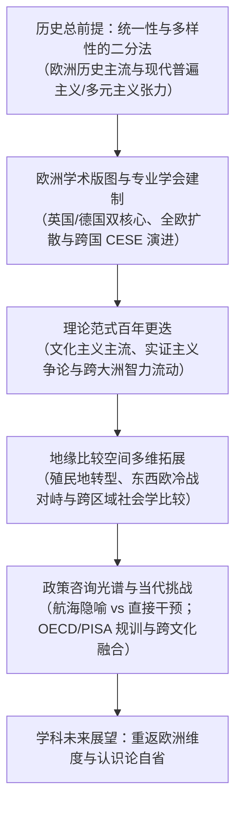

# Argument_Mitter_2009_Europe

---

## 研究问题

> [!question]
> 欧洲作为现代科学、工业技术与制度化公共教育体系的历史发源地，其比较教育学科在跨越两个世纪的生成、大学建制化与跨国扩散历程中，如何受制于中世纪早期以来便贯穿欧洲文明主流的多样性与统一性这一深层结构性张力？欧洲各主要国家的大学教席与独立研究机构如何分布？跨国与国家级专业学术学会如何在学术自主、精英定位与行政实务的拉扯中竞合演变？百年来学科经历了怎样的理论范式更迭？在地缘空间拓展（殖民转型、冷战东西对峙与多国实证项目）以及政策咨询的角色定位（超然航海图、直接改革规划与当代国际测评问责）上面临何种根本抉择与认识论危机？（pp.87–89, 98–99）

> [!claim] 核心主张
> 欧洲比较教育学的历史演进由多样性（以现代民族国家教育主权与个殊学制为载体）与统一性（以跨国共同精神文化遗产与欧洲一体化理念为载体）的永恒辩证法所决定；该学科在组织形态上形成了以英德为双核心、全欧多中心扩散的大学教席网络，并在 1961 年通过确立跨国个人会员制创设了以学术自主和精英主义为特征的欧洲比较教育学会（Comparative Education Society in Europe, CESE）；在理论范式上，欧洲学界始终坚守以历史考证与文化主义为主流的知识传统，抵御了北美式的纯行为主义实证异化；在政策咨询定位上，欧洲比较教育形成了以劳威斯审慎中立的航海隐喻与罗宾逊积极干预的全面改革规划为两极的光谱；而在当代全球化语境下，该学科正面临经济合作与发展组织（Organisation for Economic Co-operation and Development, OECD）国际学生评估项目（Programme for International Student Assessment, PISA）等大规模测评带来的技术官僚经济主义规训、跨文化教育的合流挑战以及重返欧洲维度的务实制度转向。（pp.87–88, 91–92, 93–94, 95–96, 98–99）

> [!concept-lens] 阅读透镜
> - **对象** 欧洲大陆与英国两个世纪以来（19 世纪初至 21 世纪初）比较教育学在大学教席、独立研究所、跨国学术学会中的制度化版图，以及核心理论范式与政策咨询功能的历史演进。（pp.87–91）
> - **张力** 民族国家教育主权垄断（多样性）与超越国界的欧洲文化精神（统一性）之间的辩证冲突；文化主义历史解释学传统与实证主义量化预测之间的认识论对峙；学者作为客观信息领航员与行政改革干预者之间的政策咨询角色冲突；严谨学术认识论规范与泛化浅层比较之间的学科身份危机。（pp.87–88, 93–94, 95–96, 98–99）
> - **贡献** 构建了欧洲比较教育学科史的制度地理学与范式演变全景，系统解构了专业学会从跨国精英模式向国家、区域与语言网络分化的社会学逻辑，阐明了德语区交叉领域（Querschnittsbereich）定位与英国独立系所模式的认识论差异，确立了政策咨询立场的航海隐喻，为当代抵抗大规模测评工具化提供了深厚的思想史镜鉴。（pp.91–93, 95–98）

---

## 理论框架

> [!framework-table] 理论工具箱
> | 理论工具 | 解释功能 |
> |----------|----------|
> | **统一性与多样性的二分法**<br>Dichotomy between Diversity and Unity | 解释欧洲文明与教育体系的核心结构性原则。多样性体现为民族国家学制的独特性、制度异质性与国别边界分割；统一性体现为共享的哲学、科学、艺术精神传统与趋同驱动力，二者构成了现代普遍主义与文化多元主义张力的历史原型。（pp.87–88） |
> | **比较教育作为交叉领域**<br>[[Comparative Education as a Cross-Sectional Area]] | 阐明欧陆（特别是德国）教育科学体系中比较教育的建制形态：在学科母体上深度依托普通教育学（德文：Allgemeine Pädagogik）与教化哲学，在问题意识与研究工具上面向历史学、政治学与社会学纵深切入，实现规范反思与经验解释的统一。（pp.97–98） |
> | **比较教育的航海隐喻**<br>[[Navigation Metaphor in Comparative Education]] | 厘定比较教育研究在政策咨询中的职业伦理边界，将研究者定位为提供多重航线备选方案与潜在暗礁风险预测的罗盘与地图供给者，学者恪守学术中立，坚决不越权替掌舵领航员直接操盘干预政治决策。（pp.95–96） |

> [!warrant]- 理论如何支撑论证
> 作者以统一性与多样性的二分结构作为贯穿全章的总透镜，将欧洲复杂的学术地理分布（英国、德国、法国、南欧、北欧与中东欧）与学会组织模式（跨国 CESE 与各国国家学会）解释为统一性诉求与多样性现实的动态博弈；引入交叉领域概念澄清德语区与欧陆比较教育学为何长期坚持与普通教育学保持母子血缘纽带，同时合法化其吸纳实证社会学与历史解释学工具的跨学科行动；运用航海隐喻及其与激进改革论、国际测评工具论的对比，搭建起评价比较教育参与现实政策程度的理论光谱，使两个世纪的学科史不仅是一部人物与机构编年史，更成为一部透视知识生产、政治权力和地缘变迁的批判制度社会学。（pp.87–99）

---

## 研究方法

> [!method-panel] 研究设计
> | 模块 | 材料与处理方式 |
> |------|----------------|
> | **历史制度分析**<br>[[Historical-Comparative Method]] | 追踪自 19 世纪初马克-安托万·朱利安（Marc-Antoine Jullien de Paris）、学校督学与教育考察者、威廉·狄尔泰（Wilhelm Dilthey）以来，欧洲比较教育学跨越两个世纪的学科起源、大学教席设立、独立研究所创设与专业学会演进脉络。（pp.87–92） |
> | **学术地理绘图**<br>Institutional and Cartographic Mapping | 绘制欧洲学术地理图谱，系统梳理英国、德国、法国、南欧（意、西、希、马耳他）、低地与北欧以及前苏联东欧阵营核心重镇的学者谱系、大学教席与研究所分布。（pp.89–91） |
> | **理论范式变迁考察**<br>Paradigm Shift Analysis | 划分 20 世纪欧洲比较教育三大理论发展时期（1920s–1950s 宏大历史文化全景、1960s–1980s 德国社会学实证主义争论与新马克思主义、1990s 以后多元竞争），解构文化主义与实证主义之争。（pp.92–94） |
> | **政策咨询光谱定位**<br>Policy-Advisory Typology | 以约瑟夫·劳威斯（Joseph Lauwerys）与索尔·罗宾逊（Saul Robinsohn）为两极，构建比较教育政策咨询功能类型学，审视战后西德学者选择审慎立场的制度逻辑，并剖析国际教育成就评价协会（International Association for the Evaluation of Educational Achievement, IEA）与国际学生评估项目（PISA）兴起带来的技术官僚重组。（pp.95–96） |

> [!sample-panel]- 样本与材料快照
> | 样本层面 | 构成 |
> |----------|------|
> | **文献与文本样本** | 涵盖 19 世纪经典著作（Jullien, Dilthey）、20 世纪学科奠基专著（Sadler, Hans, Schneider, Hilker, Lauwerys, Holmes, Robinsohn, King, Anweiler, Schriewer）以及当代前沿文献与学会论文集（1994 哥本哈根、2006 格拉纳达）。（pp.98–99） |
> | **机构与组织样本** | 英国伦敦大学教育研究院（Institute of Education, IOE）、国王学院、牛津大学、剑桥大学；德国汉堡大学、波鸿大学、海德堡大学、德国国际教育研究所（Deutsches Institut für Internationale Pädagogische Forschung, DIPF）、柏林马克斯·普朗克教育研究所、柏林洪堡大学；法国国际教学研究中心（Centre international d'études pédagogiques, CIEP）；欧洲比较教育学会（CESE）及各国国家、区域和语言学会；国际组织：联合国教科文组织（United Nations Educational, Scientific and Cultural Organization, UNESCO）、经济合作与发展组织（OECD）、国际教育成就评价协会（IEA）、世界银行（World Bank）。（pp.89–92） |
> | **历史时空覆盖** | 覆盖 19 世纪拿破仑战争后、一战后、二战后冷战时期、两德统一与东欧剧变、世纪之交欧洲一体化深入推进全周期。（pp.87–98） |

---

## 论证结构



---

### 论证步骤一　统一性与多样性的永恒二分构成了欧洲比较教育学科演进的深层结构原则

欧洲比较教育学绝非凭空构建的抽象学术话语，其演进脉络深刻受制于自中世纪早期起便主导欧洲历史主流的基本结构性原则：**多样性与统一性之间的二分法**。（p.87）

这一二分法直接塑造了比较教育的经验载体与问题意识：一方面，多样性构成了最直观可见的强势一极，促使学者的目光聚焦于欧洲地理、制度与学术版图上千差万别的实体单位——大学、研究机构、学术学会、地方区域以及民族国家；另一方面，对超越国界的共同精神脉络与制度趋同的追求，构成了维系学科宏观视野的隐性基石。（pp.87–88）

```text
[多样性之极 (Diversity Pole)]                    [统一性之极 (Unity Pole)]
民族国家教育主权垄断                           欧洲共同精神与哲学文化遗产
国别制度个殊性与边界分割                       深层文化形态中的趋同与驱动力理论
单国深度描述与双边对照                         跨国统一标准与超国家一体化愿景
  └── 现代演变 ➔ 文化多元主义                    └── 现代演变 ➔ 普遍主义
```

> [!claim] 民族国家对教育主权的垄断奠定了比较教育的经验容器
> 自 19 世纪初[[Marc-Antoine Jullien|马克-安托万·朱利安]]（Marc-Antoine Jullien de Paris）在后拿破仑时代神圣同盟外部边界内构想跨欧国家教育比较体系以来，朱利安以经验证据促进欧洲和平治理的启蒙计划，迅速被法国大革命的核心政治遗产——民族国家的崛起所替代。（p.87）在整个 19 与 20 世纪，国家与民族的意识形态同盟逐步垄断了教育主权，使得以领土边界为刚性划分的国家教育体系成为比较教育无可争议的最主要研究单元。（pp.87, 94）

然而，欧洲比较教育学者从未放弃对共同性的追求。在多样性聚光灯背后，欧洲统一性的超验理想持续发挥着向心凝聚力。（p.88）

> [!warrant]- 统一性理念在驱动力理论与现代性张力中的投射
> 欧洲思想史中源自前现代精神与物质事件以及现代科学、哲学、艺术潮流的欧洲理念，直接具象化为比较教育经典时期的驱动力理论（theories of the driving forces），用以揭示各国教育体系在深层文化形态中的趋同机制。这两种力量的交织，奠定了当今全球化世界中普遍主义与文化多元主义之间的根本张力。（p.88）

在学科正式进入大学建制之前，19 世纪漫长而丰富的奠基孕育期形成了三大先驱范式，为后世确立了不同的研究进路：（pp.88–89）

> [!dimension] 19 世纪欧洲比较教育的三大先驱范式
> - **朱利安的启蒙理性主义实证进路（Marc-Antoine Jullien）**
>   立足理性主义与启蒙哲学，设计了结构严密、指标详尽的标准化问卷与指标调查表格，试图系统收集欧洲各国教育体系的事实与统计数据，通过实证证据实现各学制的协调改进，构成了 20 世纪实证主义比较范式的最早先驱。
> - **教育考察者与学校督学的政策改良进路**
>   以维克多·库森（Victor Cousin）、霍勒斯·曼（Horace Mann）及马修·阿诺德（Matthew Arnold）等政府督学为代表，远赴国外查阅法案公文、收集统计并访谈各级管理者与教师，其核心目的在于通过借鉴外国经验服务于母国的现实教育立法与学校改制，同时展现出将考察事实深度置于社会政治与文化母体中的历史解释素养。
> - **狄尔泰的历史解释学哲学进路（Wilhelm Dilthey）**
>   植根于德语精神科学（Geisteswissenschaften）传统，主张在历史考证与阐释学理解的基础上展开教育体系比较，确立了欧洲比较教育深厚的人文主义底色。（pp.88–89）

---

### 论证步骤二　欧洲学术版图与专业学会建制在跨国精英协作与国别分化中双向演进

欧洲比较教育学科的生存与发展，依托于关键人物的战略性开拓、大学与独立研究所的实体建制，以及跨国专业学术学会的组织网络。（pp.89–92）

在大学教席与实体机构层面，英国与德国构成了 20 世纪欧洲比较教育的两大支柱性核心，并在战后逐步向全欧扩散：（pp.89–91）

> [!line-a] 英国学术脉络：从萨德勒遗产到伦敦大学教育研究院知识高地
> 现代大学比较教育起步于伦敦。[[Michael Sadler|迈克尔·萨德勒]]（Michael Sadler）在说服英国政府创设特别查询与报告办公室（Office of Special Inquiries and Reports）并以德国为核心参照系开创比较研究后，其学术遗产由伦敦大学教育研究院（IOE）全面发扬光大，汇聚了[[Joseph Lauwerys|约瑟夫·劳威斯]]（Joseph Lauwerys）、[[Nicholas Hans|尼古拉斯·汉斯]]（Nicholas Hans）、[[Brian Holmes|布莱恩·霍姆斯]]（Brian Holmes）、雅努什·托米亚克（Janusz Tomiak）、[[Robert Cowen|罗伯特·考恩]]（Robert Cowen）与马丁·麦克莱恩（Martin McLean）等数代学者；国王学院（[[Edmund King|埃德蒙·金]]）、牛津大学（哈尔斯、菲利普斯）、剑桥大学（图拉谢维奇）等名校相继跟进，形成密集的学科网络。（pp.88, 89–90）

> [!line-b] 德国学术脉络：从天主教人文全景到冷战阵营研究与两德融合
> 德国第一阶段由[[Friedrich Schneider|弗里德里希·施奈德]]（Friedrich Schneider）与弗朗茨·希尔克（Franz Hilker）以个人专著开路，随后汉堡大学（默克、豪斯曼、[[Torsten Husén|胡森]]同道波斯特尔斯韦特）、马堡大学（弗勒泽）、海德堡大学（勒尔斯、伦哈特）、波鸿鲁尔大学（[[Oskar Anweiler|奥斯卡·安维勒]]、阿迪克）、明斯特大学（格洛夫卡、克吕格-波特拉茨）、德国国际教育研究所（DIPF，舒尔策、[[Wolfgang Mitter|沃尔夫冈·米特]]）以及柏林马克斯·普朗克教育研究所（罗宾逊、戈尔德施密特）先后确立教席与独立建制；两德统一后，西德面临财政与建制收缩，学科重心东移，柏林洪堡大学（[[Jurgen Schriewer|于尔根·施里维尔]]、亨泽）、莱比锡大学（赫尔纳）与德累斯顿工业大学（瓦特坎普）构成了新的学术支点。（pp.89–90）

除了英德双核，全欧范围内的学术机构呈现出多元繁荣格局：（pp.90–91）

> [!dev-timeline]- 全欧多中心学术版图的发展轨迹
> - **法国的辐射与文化巨著** 塞夫尔的国际教学研究中心（CIEP）在埃德梅·阿廷盖（Edmée Hatinguais）领导下成为核心枢纽，后由德博韦（Debauvais）、奥利维尔（Orivel）与勒克莱尔（Leclercq）接续；黎成魁（Lê Thành Khôi）于 1981 年出版巨著《比较教育》（*L'éducation comparée*），以宏大的文化史与社会学视野开创了法兰西独立学派。（p.90）
> - **南欧与北欧的建制跃升** 意大利（博尔吉、维萨尔贝吉、拉恩、泰尔蒙、帕隆巴）、西班牙（加西亚-奥斯、图斯克茨、马林、加西亚·加里多、佩雷拉）、荷兰（布朗格、费莱马）、比利时（德凯泽、范达勒、威勒曼斯）以及北欧诸国（温瑟-延森、哈博、赖沃拉），在托斯滕·胡森（Torsten Husén）富有开创性的跨国研究奠基上迅速发展；希腊在卡扎米亚斯与马特乌推动下确立学术重镇，马耳他（苏尔塔纳）紧随其后。
> - **前苏联与东欧社会主义阵营的探索与转型** 冷战时期由于执政当局的政治与意识形态干预，比较教育难以确立真正的科学地位，但苏联（马利科娃、武尔夫松）、波兰（芬赫尔斯基）、捷克斯洛伐克（辛古勒）、匈牙利（伊列什）与保加利亚（察卡洛夫）仍维系了宝贵探索；德意志民主共和国（German Democratic Republic, GDR，即东德）建立马克思列宁主义比较教育学（基尼茨、霍夫曼）的尝试随政权瓦解告终；1990 年代剧变后，保加利亚（波波夫）、捷克（科塔塞克、普鲁查、瓦尔特罗娃）、匈牙利（科兹马）与波兰（帕霍钦斯基、库兹马）迎来了学科重建。（pp.90–91）

在专业学会层面，[[Comparative Education Society in Europe|欧洲比较教育学会]]（CESE）于 1961 年的成立标志着欧洲跨国学术共同体的奠基。（p.91）

> [!contrast-table] CESE跨国精英模式与多元学会竞合格局
> | 组织类型 | 代表学会 | 成员资格原则 | 组织宗旨与实践取向 |
> |---|---|---|---|
> | **跨国综合性学会** | 欧洲比较教育学会（CESE，1961） | 跨国个人会员制（否决联邦国家代表制） | 坚持学术自主与非政治化，早期带有鲜明的纯学术精英主义取向，对纯实务从业者保持审慎距离。（pp.91–92） |
> | **独立国家学会** | 英国国际与比较教育学会（British Association for International and Comparative Education, BAICE）、希腊学会、波兰学会、西班牙学会、保加利亚学会、土耳其学会 | 国家公民资格与本国学术建制 | 维护本国比较教育专业身份，深度对接国家教育政策咨询与学科教学。 |
> | **国家教育学会分会** | 德国教育学会（Deutsche Gesellschaft für Erziehungswissenschaft, DGfE）比较分会、捷克、匈牙利教育学会分会 | 依托本国母体教育学会二级建制 | 体现欧陆将比较教育视作教育学内部交叉学科的建制传统。 |
> | **跨国区域/语言学会** | 北欧学会（Nordic Society）、地中海比较教育学会（Mediterranean Society of Comparative Education, MESCE）、法语比较教育学会（Association Francophone d'Éducation Comparée, AFEC）、荷兰语学会 | 跨国地缘板块或共同语言文化圈 | 突破单一国家局限，凝聚区域认同（如庞帕尼尼创立的地中海学会覆盖南欧、北非与中东）或特定语系共同体。 |
> | **实践导向学会** | 法国比较教育与交流发展学会（Association Francophone d'Éducation Comparée et d'Échanges, AFDECE） | 开放吸纳一线教师与政策实践者 | 强调比较教育知识向教育体系实务领域的扩散与转化。（p.92） |

---

### 论证步骤三　百年理论范式更迭历经宏大历史文化全景、实证主义论战与当代多元纷争

考察欧洲比较教育百年理论演进，可以清晰洞察到三大发展时期的理论范式更迭，折射出社会政治思潮与邻近人文社会科学的深刻影响：（pp.92–94）

> [!dev-timeline]- 欧洲比较教育百年理论范式更迭阶段
> - **1920s–1950s — 宏大历史文化全景与精神科学传统** 这一时期由英格兰的[[Nicholas Hans|尼古拉斯·汉斯]]与德国的[[Friedrich Schneider|弗里德里希·施奈德]]（深受天主教思想影响）所构建的宏大历史文化全景所主导，意大利的弗洛雷斯·达尔卡伊斯与西班牙的胡安·图斯克茨亦在战后推进类似探索。学者深入考察塑造民族教育体系的历史背景与精神驱动力（driving forces），汉斯的名言“第一步是将每个国家体系置于其历史背景中研究其与国民性格和文化发展的紧密联系”成为这一时期的灵魂注脚。（pp.93–94）
> - **1960s–1980s — 德国社会学实证主义争论与跨国范式分化** 德国社会学中以卡尔·波普尔（Karl Popper）的批判理性主义与尤尔根·哈贝马斯（Jürgen Habermas）的法兰克福学派批判理论之间的实证主义争论（德文：Positivismusstreit），跨国席卷并重塑了比较教育的内容与方法论。新马克思主义论点进一步丰富了理论图景。在具体机构中，伦敦大学 IOE 经历了从汉斯、劳威斯的文化主义向布莱恩·霍姆斯（Brian Holmes）实证主义批判二元论的激烈转向；波鸿鲁尔大学经历了从安维勒的苏联东欧研究向阿迪克的全球化与世界体系理论转向。（pp.92–93）
> - **1990s 至今 — 现代主义与后现代主义对峙下的多元解体** 呈现为趋同与趋异理论之间的激烈竞争，核心体现为现代主义与后现代主义的抗衡，以及以斯坦福世界体系理论为代表的普遍主义与文化多元主义之间的根本张力。性别研究、教育规划、终身学习、职业教育以及跨文化教育等新兴领域蓬勃兴起。（p.94）

理论范式的演进并非均质平铺，而是在局部大学学派的兴衰中呈现断裂与重构：（pp.92–93）

> [!case-study]- 典型大学学派的范式转向案例
> - **伦敦大学 IOE 的文化主义与实证主义博弈** 长期秉持以汉斯、劳威斯、托米亚克以及国王学院埃德蒙·金为代表的文化主义传统；但在 1960 至 1980 年代，布莱恩·霍姆斯（Brian Holmes, 1965, 1981）力推以波普尔批判二元论为底座的实证主义问题法（Problem Approach），在学院内部引发激烈的认识论争鸣。（pp.92–93）
> - **波鸿鲁尔大学从极权体制剖析向全球化世界体系转向** 1960 至 1980 年代在安维勒带领下成为全欧苏联与东欧社会主义教育研究的重镇；其继任者克里斯蒂尔·阿迪克（Christel Adick）则转向研究全球化与斯坦福学派世界体系理论对比较教育的冲击。
> - **柏林洪堡大学的系统论与跨国话语重构** 两德统一后，于尔根·施里维尔（Jürgen Schriewer, 1987, 1999）将德国社会学家尼克拉斯·卢曼（Niklas Luhmann）的自创生系统论（Autopoietic System Theory）与世界体系理论相结合，创立了以世界层面的意义外化（Externalisation）为核心的比较教育新范式。（p.93）

> [!claim] 文化主义与历史传统始终是欧洲比较教育的顽强主干
> 尽管美国比较教育在战后全面倒向实证主义量化测量，欧洲比较教育的主流直至 20 世纪末仍牢牢受文化主义研究所支配，并与深厚的历史学研究紧密结盟。从早期的汉斯、施奈德，到当代的考恩、卡扎米亚斯、诺瓦（Nóvoa）与施里维尔，无不坚守文化与历史脉络。在欧洲，大样本量化经验研究长时期处于边缘地位；胡森与波斯特尔斯韦特领导的国际教育成就评价协会（IEA）自始至终是在与欧洲既有比较教育研究中心和学会网络保持高度疏离的独立轨道上运作的，进一步加剧了文化主义者与经验实证主义者之间的认识论鸿沟。（p.94）

同时，欧洲与北美之间的跨大洲智力流动深刻改写了全球比较教育版图。自 1930 年代欧洲知识分子逃离纳粹极权开始，以[[Isaac Kandel|艾萨克·坎德尔]]、[[Robert Ulich|罗伯特·乌利希]]、乔治·贝雷迪、哈罗德·诺亚、马克斯·埃克斯坦、安德烈亚斯·卡扎米亚斯与汉斯·魏勒为代表的流亡学者，将欧洲文化历史底蕴注入北美，并反向推动了跨大西洋的学术合作，例如布莱恩·霍姆斯倡议设立的世界比较教育学会联合会（World Council of Comparative Education Societies, WCCES）理论转型委员会。（p.93）

---

### 论证步骤四　比较空间从单一民族国家容器扩展至殖民遗存、冷战阵营对抗与跨区域社会学比较

在比较教育的空间维度上，民族国家在整个 20 世纪不仅是朱利安与萨德勒分析的基本单位，更成为几乎排他的比较主体。（pp.94–95）

尽管学界大量产出的是针对单一外国教育体系的深度国别研究，但这些个案研究内部蕴含着强烈的比较视野。在应对宏观教育政策变迁时，欧洲比较空间在三大具体方向上实现了对单一国家容器的突破：（pp.94–95）

> [!dimension] 欧洲比较空间的突破方向
> - **殖民扩张与去殖民地发展中国家教育分化**
>   英法等宗主国学者将本国教育体系向殖民地的扩张与后殖民遗存转化为研究对象。由于一线考察人员发现传统比较教育教席无法满足实践需求，伦敦大学等重镇分化出独立的发展中国家教育研究所；而海德堡大学（勒尔斯、伦哈特）则成功将发展中国家教育研究吸纳整合于比较教育学科教席之内。（pp.94–95）
> - **冷战前沿的东西欧社会主义阵营教育对峙**
>   西德学者在铁幕与国家分裂的直接地缘压力下，开创了系统的西-东阵营冲突教育研究，伦敦的托米亚克亦深度参与。以安维勒、弗勒泽、米特等具有中东欧血统的学者为代表，其扎实的第一手文献考据在冷战结束后被原社会主义阵营学者公认为当时极其珍贵且客观可靠的学术档案。（p.95）
> - **跨越阵营与国界的宏观经验社会学比较项目**
>   索尔·罗宾逊（Saul Robinsohn）在柏林马普所主持的《社会进程中的学校改革》项目，首次以明确的社会学视角比较了七个欧洲国家的社会因素对学制改革的结构性影响；埃德蒙·金则针对五个西欧国家开展后义务教育（Post-Compulsory Education）比较研究，深入考察职业教育新趋势对青年进入劳动力市场的影响。

---

### 论证步骤五　政策咨询定位在航海图式的中立审慎、直接干预与当代国际评测量化规训间深刻分化

比较教育研究究竟应当如何定位自身与国家政策制定之间的距离？欧洲学术史呈现出一幅跨度极大的立场光谱：（pp.95–96）

```text
[航海隐喻模式] --------------------- [温和改良模式] --------------------- [激进规划模式]
(约瑟夫·劳威斯)                     (西德主流学界)                     (索尔·罗宾逊)
只提供多重备选航线与风险预测,         通过非正式渠道提供方案与后果预判,   直接起草改革法案与蓝图,
学者坚决不替领航员操舵决策           在两德分裂敏感地带保持专业审慎     主张直接干预现实教育体制
```

> [!claim] 劳威斯的航海隐喻与罗宾逊的直接干预构成了咨询光谱的两极
> 劳威斯在 1958 年将比较教育明确比作航海：研究者的唯一目标是向领航员或决策者提供关于备选战略与航道的信息，绝不试图对实际政治决策施加直接影响；而索尔·罗宾逊则针锋相对，在 1970 年代西德全面教育改革中坚决主张研究者的直接咨询与法案推动功能。绝大多数西德学者（包括主持两德教育比较大课题的安维勒）在高度紧张的政治分裂环境下，选择了偏向劳威斯式的审慎距离，以防学术沦为党派政治与意识形态冲突的工具。（pp.95–96）

然而，世纪之交的当代情境打破了上述从容的专业平衡。（p.96）

> [!warrant]- 国际大规模测评崛起对比较教育政策咨询格局的颠覆
> 由国际教育成就评价协会（IEA）特别是[[OECD|经济合作与发展组织]]（OECD）主持的国际学生评估项目（PISA）在决策层与公众舆论中取得广泛影响，推动了由经合组织强力倡导的经济导向型教育政策的全球确立。政府机构不仅日益加强对研究经费与研究内容的直接干预，更直接规定比较研究的项目目标与问责指标，促使比较教育面临以人力资本与经济竞争力为指标的规训压力。（p.96）

---

### 论证步骤六　全球化扩张、跨文化教育挑战与重返欧洲维度共同塑造学科未来走向

置身 21 世纪初的新全球化语境，欧洲比较教育面临三大深层次的结构性转变与前沿挑战：（pp.96–98）

首先是**比较视界在地理维度的全面跨洲扩张**。全球化要求展开跨大洲横向比较，将研究者的本土专家内部洞察与外来学者的审慎疏离视界辩证融合；同时，英语作为全球学术通用语的支配地位既加速了流通，也带来了学术训练异质性与本土学术语言流失的长期挑战。（pp.96–97）

其次是**从民族国家比较向跨文化教育（Intercultural Education）的范式转移**。（pp.97–98）

> [!line-a] 经典民族体系比较进路
> 聚焦民族国家边界、法定学制、国家课程标准与宏观教育立法，视国家为相对稳固的教育制度容器。（pp.87, 97）

> [!line-b] 新兴跨文化教育实践进路
> 聚焦多民族与移民社会的微观文化互动，致力于通过课程、教科书与教学改革改善多元文化社群的社会整合，兼具高度的政策导向与一线教学改良主义诉求；德语区在经历 1980 年代两大学派的分道扬镳后，最终在世纪之交实现了比较教育学者与跨文化教育学者的重新合流。（pp.97–98）

最后是**学科本体论身份在德英双轨传统上的融合与超越**。（pp.97–98）

以安维勒为代表的欧陆模式将比较教育定义为依托普通教育学母体的[[Comparative Education as a Cross-Sectional Area|交叉领域]]（Querschnittsbereich），成功兼顾了哲学价值关怀与跨学科社会学分析；而英国模式则从不构建抽象的普通教育学，直接将比较教育确立为平行的独立大学系所模块。当代日益强化的全球跨学科合作，促使传统的德英二元建制模式走向历史性消解。（pp.97–98）

伴随 1994 年哥本哈根至 2006 年格拉纳达的 CESE 历届双年会，欧洲比较教育迎来了务实的欧洲维度回归：学者告别了早期汉斯、施奈德式的历史形而上学玄想，转向对欧盟教育政策文本、欧洲资格框架与跨国实证数据的严肃再分析。（p.98）

> [!implication] 学科泛化风险与认识论自我捍卫
> 米特在结语中警示：当泛化浅层比较与自称比较学者的实务热潮蔓延时，比较教育正面临失去其特定学科轮廓的危险。大量欠缺理论与方法学严密训练的浅层对照，稀释了比较研究的学术品质。欧洲比较教育唯有坚守两个世纪以来在历史哲学考证、制度发生学阐释与文化脉络深描中铸就的认识论身份，方能真正在全球比较知识版图中发挥不可替代的批判启蒙价值。（pp.98–99）

---

## 主要发现

> [!finding-cards] 欧洲比较教育学科演进的核心学术发现
> - **统一性与多样性的结构性主轴** 欧洲比较教育学的百年脉络本质上由民族国家教育主权的多样性与欧洲共享精神文化遗产的统一性二分法所驱动，并在当代重构为普遍主义与文化多元主义的张力。（pp.87–88）
> - **文化主义与历史传统的顽强主流地位** 欧洲比较教育始终未如北美一般全盘沦陷于行为主义与实证统计，以汉斯、施奈德、考恩、卡扎米亚斯与施里维尔为代表的文化-历史传统始终占据学科理论高地，而大规模测评（IEA/PISA）长期游离于学科建制之外。（pp.93–94）
> - **政策咨询从审慎航海转向技术官僚规训** 欧洲学界传统上以劳威斯的航海隐喻抵御政治工具化，但在经合组织与大规模测评支配下，经济导向的证据治理迫使比较研究直接受制于行政目标与绩效指标。（pp.95–96）
> - **跨文化融合与欧洲维度的务实转向** 比较教育正成功吸纳微观多民族整合的跨文化教育议程，并在欧盟超国家治理背景下，从抽象欧洲统一哲学走向对欧洲教育政策与跨国实证数据的务实制度分析。（pp.97–98）

---

## 关键引用

> [!citation-card] 历史深处的统一性与多样性二分法
> 将比较教育置于欧洲这一区域框架内进行情境化考察，必然会导向自中世纪早期以来决定欧洲历史主流的基本结构性原则：多样性与统一性之间的二分法。这一基本论点解释了为何本导论性章节将该主题作为贯穿整篇分析的持续母题。（p.87）
>
> *Contextualising comparative education in the regional framework of Europe cogently leads to the basic structural principle that has determined the mainstream of European history since the early Middle Ages: the dichotomy between diversity and unity. This basic argument explains that this introductory chapter takes up this theme and uses it as the continuous motif of the present analysis on the whole.*

> [!citation-card] 比较教育的航海隐喻
> 约瑟夫·劳威斯明确指出比较教育与航海之间存在相似性，二者都仅仅旨在为领航员或政策制定者提供有关备选战略的信息，而不试图对后者的决策施加直接影响。（pp.95–96）
>
> *Joseph Lauwerys expressly perceived similarity of comparative education with navigation, insofar as both are only aimed at providing the navigator or the policy-maker, respectively with information on alternative strategies without trying to exercise influence on their decision-making.*

> [!citation-card] 泛化比较趋势下的认识论身份危机
> 观察者不应忽视由于人们意识到‘人人都在比较并自称比较学者’而引发的担忧，这种担忧害怕比较教育学可能会失去其特定的轮廓。此类声称往往缺乏关于该学科比较基础特殊性的理论与方法学训练，包括缺乏对其认识论身份进行持续界定的努力。（p.98）
>
> *The observer should not overlook the shadows either which are caused by fears that comparative education might lose its specific contours when realising that 'everybody compares and claims to be a comparativist'. Such claims often lack the requirements of theoretical and methodical training concerning the particularities of the comparative foundations of the discipline including the continuity of the efforts to define its epistemological identity.*

---

## 自述局限

> [!limit-card] 原文明确阐述的研究边界与方法局限
> - **学术版图调查的非穷尽性** 原文所列出的欧洲各国大学教席、独立研究所与学者名单旨在提供代表性范例，不声称具备统计学意义上的完整覆盖。（p.89）
> - **跨洲与跨语言研究的沟通屏障** 跨大洲合作尽管克服了地理隔离，但跨越不同文化与学术传统的研究者在语言转换、概念对称性与专业胜任力上仍面临不可低估的深层隔阂。（p.97）
> - **非正式政策影响难以客观测度** 相较于正式咨询报告，比较学者通过人际网络与非正式渠道对决策者产生的隐性渗透极其复杂，难以在实证经验层面进行精确量化评估。（p.96）

---

## 来源

- [[books/Cowen(Ed.)_2009_Springer/Ch07_Mitter_2009|Ch07_Mitter_2009]]
