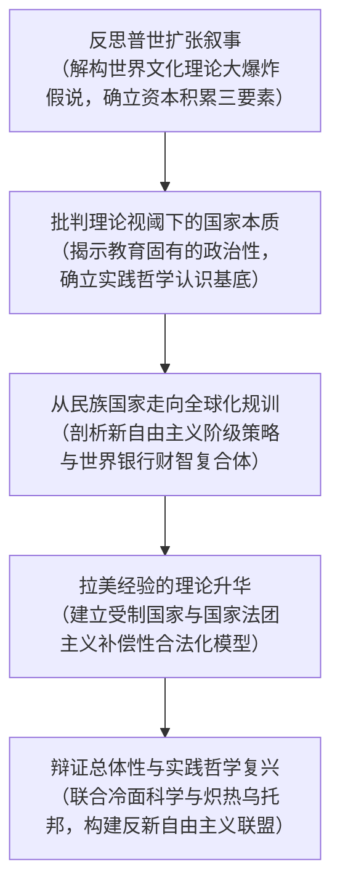

# Argument_Olmos_Torres_2009_StateTheories

---

## 研究问题

> [!question]
> 20 世纪下半叶波及全球的教育扩张为何无法通过功能主义或世界体系/[[World Society Theory|世界文化理论]]的同质化“大爆炸”假说得到合理解释？在跨国资本积累、全球化[[Disciplina and Doctrina|规训]]与本土阶级矛盾交织的背景下，民族国家的制度性质如何塑造公共教育政策？为何拉丁美洲等第三世界国家在经历了 1960 年代创纪录的教育扩张后，非但未能实现实质政治民主化与社会公平，反而在新自由主义结构调整中陷入公共教育退化、阶级双轨固化与公民身份商品化的多重危机？（pp. 73–76）

> [!claim] 核心主张
> 教育绝非政治中立的技术技能分配体系，而是深刻嵌入资本主义国家资本积累与社会合法化双重矛盾职能的争鸣[[Champ|场域]]；外围资本主义国家受制于全球资本积累的边缘地位与本土后封建政治结构，演化出排他性的“[[Conditioned State Theory|受制国家]]”与“[[State Corporatism|国家法团主义]]”体制，并借助双轨教育系统和“[[Compensatory Legitimation|补偿性合法化]]”维系阶级霸权；在新自由主义全球化下，以[[World Bank|世界银行]]为核心的“[[Financial-Intellectual Complex|金融-智识复合体]]”通过结构性调整强推[[Endogenous and Exogenous Privatisation|教育私有化]]、分权化与使用者付费，实质上是以市场逻辑剥夺大众政治主体地位的阶级策略，唯有重构马克思主义实践哲学与广泛的批判联盟方能开辟民主解放路径。（pp. 73–85）

> [!concept-lens] 阅读透镜
> - **对象** 现代国家理论与教育扩张的互动关系，以 20 世纪战后拉丁美洲（重点考证墨西哥、阿根廷、哥斯达黎加与智利）的教育发展史、工业化转型与新自由主义结构调整为核心经验案例。（pp. 73–74, 81–84）
> - **张力** 宏大功能主义与普世世界文化理论的非历史均质化[[Hypothesis|假设]]，对决新马克思主义政治经济学强调的资本积累阶段性、合法化危机、殖民剥削遗产与历史具体性。（pp. 74–76）
> - **贡献** 系统提炼比较教育政治社会学[[Analytic Framework|分析框架]]，确立[[Conditioned State Theory|受制国家理论]]、[[State Corporatism|国家法团主义]]、[[Compensatory Legitimation|补偿性合法化]]与[[Financial-Intellectual Complex|金融-智识复合体]]等核心[[Construct|构念]]，推动比较教育学彻底摆脱西方中心主义的现代化叙事与技术官僚迷思。（pp. 77–85）

---

## 理论框架

> [!framework-table] 理论工具箱
> | 理论工具 | 解释功能 |
> |----------|----------|
> | **[[Conditioned State Theory\|受制国家理论]]** Conditioned State Theory | 阐明外围资本主义国家受到世界体系边缘从属地位与本土阶级结构双重约束，本土精英结成排他性支配同盟，导致国家丧失自主整合市场与主权的能力。（pp. 83–84） |
> | **[[State Corporatism\|国家法团主义]]** State Corporatism | 解释威权后革命国家自上而下通过垄断性代表网络收编工会与教师群体，将教育体系转化为维系国家霸权体制的政治杠杆。（p. 83） |
> | **[[Compensatory Legitimation\|补偿性合法化]]** Compensatory Legitimation | 揭示国家在面临严重资本积累危机与合法性匮乏时，以教育普及与成人扫盲作为平抑阶级矛盾的代偿性整合机制。（p. 84） |
> | **[[Politicity of Education\|教育的政治性]]** Politicity of Education | 继承[[Paulo Freire\|保罗·弗莱雷]]（Paulo Freire）思想，揭示教育在认识论、分析与伦理维度上不可剥离的权力属性，瓦解技术官僚中立神话。（pp. 77–78） |
> | **[[Financial-Intellectual Complex\|金融-智识复合体]]** Financial-Intellectual Complex | 剖析[[World Bank\|世界银行]]（World Bank, WB）将巨额贷款与定向委托研究深度绑定，推行新古典教育经济学霸权与结构调整政策的机制。（pp. 80–81） |

> [!warrant]- 理论如何支撑论证
> 两位作者以历史唯物主义辩证总体性视角为基座，将资本积累机制与政治合法化矛盾确立为贯穿国家教育政策的核心分析支柱。通过引入受制国家与国家[[Neocorporatism|法团主义]]框架，作者打通了“世界体系边缘从属地位 ➔ 本土代用国家异化 ➔ 教育制度阶级双轨化 ➔ 新自由主义跨国金融[[Disciplina and Doctrina|规训]] ➔ 大众批判反抗与实践哲学复兴”的完整逻辑链条，有力证成了教育扩张绝非[[Technical Rationality|技术理性]]的自然演化，而是国家在深刻历史阶级矛盾中维系统治秩序与资本积累的制度妥协。（pp. 75–76, 83–85）

---

## 研究方法

> [!method-panel] 研究设计
> | 模块 | 材料与处理方式 |
> |------|----------------|
> | **批判性理论评述与概念重构** Critical Theoretical Review & Conceptual Reconstruction | 系统梳理韦伯主义、功能主义、[[World-Systems Theory\|世界体系理论]]、新自由主义国家观与新马克思主义国家批判学说，辨析各流派在教育扩张动力机制上的根本分歧。（pp. 73–80） |
> | **[[Historical-Comparative Method\|历史比较与政治经济学分析]]** Historical-Comparative & Political Economy Analysis | 运用政治经济学框架，系统考察拉丁美洲社会 20 世纪前殖民与后殖民历史遗产、1960 年代工业化时期的教育扩张跃升、1980 年代债务危机以及结构调整政策的演进历程。（pp. 81–84） |
> | **跨国机构文本与政策话语剖析** Institutional Policy & Discourse Analysis | 深度解构世界银行、[[OECD\|经济合作与发展组织]]（Organisation for Economic Co-operation and Development, OECD）与国际货币基金组织（International Monetary Fund, IMF）贷款政策文本与核心经济学分析范式。（pp. 79–81） |

> [!sample-panel]- 样本与材料快照
> | 样本层面 | 构成 |
> |----------|------|
> | **理论[[Document\|文献]]样本** | 涵盖卡诺伊、[[Paulo Freire\|弗莱雷]]、葛兰西、萨特、阿普尔、鲍尔、萨莫夫、多斯桑托斯及本赛德等学者的经典文本。（pp. 85–86） |
> | **经验与历史案例** | 重点覆盖拉丁美洲地区（墨西哥后革命国家法团体制与扫盲政策、阿根廷布宜诺斯艾利斯大学高教重构、智利新自由主义中产阶级危机）的制度演变档案。（pp. 79, 81–84） |
> | **跨国统计与政策材料** | [[World Bank\|世界银行]]教育部门政策文件、结构调整贷款协议文本、[[UNESCO\|联合国教科文组织]]/拉加经委会（UNESCO/CEPAL/PNUD）历史统计报告。（pp. 81, 85–86） |

---

## 论证结构

---

### 论证步骤一　反思普世扩张叙事：世界文化大爆炸假说批判与资本积累历史辩证法

普世主义[[World Society Theory|世界文化理论]]将战后教育扩张简化为全球单一社会体系的共时趋同，完全抹杀了第三世界国家被动卷入全球资本积累的历史创伤与制度特殊性。

> [!claim] 普世教育扩张叙事存在严重的“大爆炸”历史虚无倾向
> 战后世界体系与世界文化学者假定存在单一同质的全球组织与文化[[Champ|场域]]，并将教育扩张的动力归纳为四项普世文化信念：共同的国民经济发展目标、受过教育的公民被视为宝贵资产、个体与国家均具有可改进性，以及在资本主义世界经济中发展即意味着经济竞争的胜利。然而，这种观点仿佛[[Hypothesis|假设]]某种“大爆炸”（Big Bang）在 1945 年凭空创造了独特的全球体系，将 1945 年之前的殖民剥削遗产与历史因果弃置不顾，无法解释第三世界普遍存在的阶级[[Dual School System|双轨学制]]。（pp. 74–75）

普世主义叙事用抽象的全球同质性掩盖了外围国家真实的阶级分选现实。为此，必须建立扎根于资本积累具体历史条件的批判政治经济学[[Analytic Framework|分析框架]]。

> [!contrast-table] 教育扩张解释[[Paradigm|范式]]对质
> | 比较维度 | 普世世界文化理论（World Culture Theory） | 批判政治经济学路径（Political Economy Approach） |
> |---|---|---|
> | **扩张驱动力** | 共享的世界[[Cultural Models\|文化模型]]与普世价值扩散 | 全球资本积累需求与国家合法化危机的妥协 |
> | **历史因果观** | 假定 1945 年后制度断裂与共时性趋同 | 强调前殖民与殖民剥削遗产的长周期制约 |
> | **教育系统性质** | 均质化的国民学校与现代公民身份培育 | 阶级固化的[[Dual School System\|双轨教育体系]]（富人与底层分流） |
> | **国家角色定位** | 理性化世界文化的被动接收与制度模仿者 | 在外生资本依附与内生阶级冲突中博弈的矛盾主体 |

> [!warrant] 资本积累的插入时点与历史遗产决定了外围教育形态
> [[Liliana Esther Olmos|莉莉安娜·埃丝特·奥尔莫斯]]（Liliana Esther Olmos）与[[Carlos Alberto Torres|卡洛斯·阿尔贝托·托雷斯]]（Carlos Alberto Torres）提出，第三世界教育发展的分析基点必须建立在资本积累的全球进程之上。殖民与后殖民时期构成了截然不同的积累条件；殖民国家因其固有的非代表性与强制性，极少关注教育的社会和谐与合法化职能，而是以最低限度的行政强制能力保障资源掠夺；后殖民扩张则受制于三大历史要素。（pp. 75–76）

> [!theory-components] 外围国家教育扩张的三大历史决定构件
> - **全球积累体系的接入时点与模式**
>   不同民族国家在世界资本主义扩张长周期中被吸纳的具体历史阶段（如初级产品掠夺、工业原材料供应或金融资本渗透），直接决定了宗主国对其本土劳动力技能的初级要求。（p. 76）
> - **接入前业已存在的本土教育遗产**
>   前殖民与殖民时期沉淀的教会学校、官僚培养网络以及特权等级教育格局，构成了后殖民国家教育扩张难以摆脱的制度路径依赖。（p. 76）
> - **本土社会结构的阶级与文化特殊性**
>   国内前资本主义（甚至后封建主义）生产关系残余、种族部落构成与本土阶级分层，对国家推行普惠性公共教育构成了深刻的内生制约。（p. 76）

---

### 论证步骤二　批判理论视阈下的国家本质：实践哲学、教育政治性与非中立性

任何教育政策与学术研究背后均暗含特定的国家理论，标榜[[Value Neutrality|价值中立]]的[[Technical Rationality|技术官僚理性]]实质上是掩盖权力支配的意识形态障眼法。

> [!claim] 教育政策制定与研究议程受制于隐含的国家理论
> 任何关于教育“真实”问题以及最适宜解决方案（如成本效益、伦理可行性与合法性）的界定，均高度取决于支撑、证成并指导教育诊断的国家理论。正如[[Christopher Martin|马丁]]·卡诺伊（Martin Carnoy, 1992）所指出，多数教育研究均暗含着某种国家理论，但其基本假定极少在研究与实践中被明确识别或阐明；对自身理论前提保持反思，是开展扎实学术研究的前提条件。（pp. 73–74）

> [!citation-card] 奥尔莫斯与托雷斯论国家理论对教育规划的前提性支配
> 界定教育的“真实”问题以及最适宜（如最具成本效益、伦理上可接受且具有合法性）的解决方案，在很大程度上取决于支撑、证成并指引教育诊断与提议方案的国家理论。然而，正如马丁·卡诺伊（Martin Carnoy, 1992）所指出的，大多数教育问题分析都暗含着一种国家理论，但在教育研究与实践中，这种理论的根本前提却极少被识别或阐明。对我们自身的理论假定保持自我审思，是开展扎实学术研究的前提条件。（pp. 73–74）
>
> *Defining the "real" problems of education and the most appropriate (e.g., cost-effective, ethically acceptable, and legitimate) solutions depends greatly on the theories of the state that underpin, justify, and guide the educational diagnosis and proponed solutions. There is, however, a permanent challenge here. As Martin Carnoy (1992) has argued, most analyses of educational problems have implicit in them a theory of the state but seldom are the fundamentals of that theory recognized or spelled out in educational research and practice.*

教育政策绝不能脱离政治学与国家权力的维度进行抽象孤立考察，[[Critical Pedagogy|批判教育学]]为解构这一迷思提供了核心武器。

> [!claim] 教育具有不可剥离的固有政治性
> 依据[[Paulo Freire|保罗·弗莱雷]]（Paulo Freire）的思想，教育既非政治中立，亦非技术客观。教育具有固有的[[Politicity of Education|教育的政治性]]（Politicity of Education），这种政治性贯穿于[[Epistemology|认识论]]、分析与伦理三个维度。学校教育本质上是商品与服务交换、权力分配以及多元政治经济路线竞逐的争鸣场域（Contested Arenas）。（pp. 77–78）

> [!dimension] 教育政治性的三重内涵
> - **认识论维度（Epistemological）**
>   知识的选择与官方课程认证直接映射统治集团的阶级利益与[[Hegemony|文化霸权]]，何种知识被界定为“正统”从来不是价值中立的。（pp. 77–78）
> - **分析维度（Analytical）**
>   教育诊断将何种现象界定为“危机”或“低效”，直接折射了执政集团所采纳的国家理论偏好。（pp. 77–78）
> - **伦理维度（Ethical）**
>   教育关乎公民身份的塑造与道德正义；在面对剥削与排斥时，宣称“技术中立”实质上是在伦理上默许不平等现状。（pp. 77–78）

> [!warrant] 马克思主义作为[[Reflexivity|反思性]]历史理论的当代不可超越性
> 援引佩里·安德森（Perry Anderson）与让-保罗·萨特（Jean-Paul Sartre）的经典论断，马克思主义之所以能够历经风雨依然保持强大[[Conatus|生机]]，源于资本主义自身永远无法化解由其本性催生的贫困、边缘化与生态掠夺危机。在《方法论问题》（*Questions de Méthode*）中，萨特指出一种哲学只要孕育并支撑它的实践活动仍然鲜活，就将持续保持效力；只有当每个人都从生存资料的生产中获得真正的自由，马克思主义才会被真正的“自由哲学”取代。在此之前，马克思主义依然是当代不可超越的批判地平线。（pp. 74, 76–77）

---

### 论证步骤三　从民族国家到全球化规训：跨国财智复合体与新自由主义阶级策略

全球化并非单纯的时空压缩，而是资本主义跨国统治联盟重构政治霸权、削弱民族国家主权与瓦解公共教育福利的过程。

> [!claim] 民族国家在当代全球化中承受上下两维度的撕裂与重构
> 依据戴维·赫尔德（David Held, 1991）与尼尔·斯梅尔瑟（Neil Smelser, 1993）的分析，民族国家曾经作为公民忠诚与政治团结的天然载体，但在全球化进程中正面临来自“上方”与“下方”的双重挑战：在上方，生产、贸易、金融与跨国公司（TNCs）使国界高度通透，国家丧失了自主调控命运的能力；在下方，次国家尺度的区域、语言、宗教、族群与性别团体大量[[Emergence|涌现]]，争夺民众效忠与领土管辖权。跨国公司倾向于维持最小化的国际协调，同时利用主权国家之间的[[Disciplina and Doctrina|规训]]空隙与法律漏洞谋取暴利。（pp. 79–80）

国家形态的演变直接引发了霸权生产方式与日常意识形态解释的剧烈重组，催生了向新自由主义国家范式的全盘转向。

> [!feature] 新自由主义在外围国家推行的三项标准教育处方
> - **使用者付费（User Fees）** 将教育服务的成本直接转嫁给受教育者与家庭，削减公共财政教育拨款。（p. 79）
> - **[[Endogenous and Exogenous Privatisation|教育私有化]]（Privatisation）** 大力引入私人资本与营利机构参与办学，将教育从公共物品降格为消费商品。（p. 79）
> - **行政分权化（Decentralisation）** 借分权之名将中央教育财政负担甩包袱给脆弱的省州与地方自治市，加剧区域校际鸿沟。（p. 79）

> [!claim] 市场逻辑替代国家投资实质上是资产阶级的剥削策略
> 援引[[Stephen Ball|斯蒂芬·鲍尔]]（Stephen Ball, 1993）的研究，新自由主义用市场逻辑取代国家在教育政策中的主导角色，本质上是优势阶级巩固特权的“阶级策略”（Class Strategy）。在拉丁美洲，国家从公共教育中大规模撤资，严重阻碍了底层大众作为具有批判反思能力的“教育主体”（Pedagogical Subjects）与民主公民身份的建构。（p. 79）

资本主义劳动过程从标准化福特制向后福特制灵活积累模式的转型，为上述阶级策略提供了深层经济动力。

> [!continuum] 资本主义生产模式转型与教育治理目标转向
> **福特制标准化工业经济** **后福特制灵活全球经济**
>
> - 高产能、高度标准化的流水线集中生产
> - 全球离散化、高度灵活的碎片化生产网络
> - 少数管理层自上而下严格科层控制
> - 多中心决策与跨国弹性权力链条
> - 培养服从命令、纪律严明且可靠的产业大军
> - 劳动力技能分化与[[Cognitive Deskilling|去技能化]]并存的技术控制
> - 课程追求统一国民知识体系与集体政治整合
> - 课程推行模块化、能力本位与绩效竞争管控

> [!claim] [[World Bank|世界银行]]构成了规训发展中国家的跨国[[Financial-Intellectual Complex|金融-智识复合体]]
> 依据乔尔·萨莫夫（Joel Samoff, 1992, 1993）与丹尼尔·舒古伦斯基（Daniel Schugurensky, 1994）的实证批判，世界银行作为资本主义体系的关键规训机构，操纵着一个庞大的跨国[[Financial-Intellectual Complex|金融-智识复合体]]（Financial-Intellectual Complex），使教育研究与结构性贷款融资形成强力合流。（pp. 80–81）

> [!evidence-grid] 金融-智识复合体的霸权运作机制
> - **受雇专家共同体** 动用雄厚预算组织长期[[Categorical Funding|委托研究]]，利用雇佣专家垄断[[International Education|国际教育]]咨询与政策话语权。（p. 80）
> - **方法论裁量霸权** 独尊成本效益分析、生均收益率（Rate of Return）与投入产出量化模型，将技术工具理性包装为唯一合法的政策依据。（p. 81）
> - **单向度信贷闭环** 尽管世行内部学者观点多元，但贷款部门在放贷实践中推行高度铁板一块的新自由主义规训逻辑，迫使受援国全面推行私有化。
> - **跨国企业政策亲和** 政策主张与美国商业圆桌会议（Business Roundtable）高度共谋，服务于跨国资本全球扩张。

---

### 论证步骤四　拉美经验的理论升华：工业化跃升、受制国家与法团主义补偿性合法化

拉丁美洲教育演变的历史轨迹揭示了外围资本主义国家特有的治理结构，[[Conditioned State Theory|受制国家]]与[[Neocorporatism|法团主义]]在此展现了极其复杂的运作张力。

> [!claim] 1960年代拉美工业化初期的教育扩张呈现出世界最高的爆发式增长
> 依据[[UNESCO|联合国教科文组织]]（UNESCO, 1974）与拉加经委会（UNESCO/CEPAL/PNUD, 1981）的权威历史统计，拉丁美洲在 1960 年代进口替代工业化（ISI）初期迎来了创纪录的教育扩张狂飙，但这种扩张伴随着严重的内部阶级断裂。（pp. 81–82）

> [!stat-cards] 1960–1970 年代拉美工业化初期教育扩张关键指标（UNESCO, 1974）
> - **247.9%** 1960 至 1970 年间拉丁美洲高等教育的增长指数，创下当时全球最高扩张增速。（pp. 81–82）
> - **258.3%** 1960 至 1970 年间拉丁美洲中等教育的增长指数。（pp. 81–82）
> - **167.6%** 1970 年代之后中等与高等教育增速明显放缓的增长指数。（pp. 81–82）
> - **≈ 0%** 文盲率在大部分拉美国家同期维持恒定未降的变动幅度，暴露了大众初等识字与中高等精英分化并存的阶级断层。（pp. 81–82）

面对这一矛盾，埃内斯托·希费尔拜因（Ernesto Schiefelbein, 1998）总结了拉美在过去四十年来取得的五重进展，但作者指出，这些进展完全是在不平等结构未改的前提下发生的。

> [!feature] 希费尔拜因总结的拉美教育五重渐进改善与结构限度
> - **学龄儿童入学覆盖扩大** 绝大多数学龄儿童获得了进入学校的机会，基础教育名义规模显著跃升。（p. 82）
> - **在校[[Educational Level|受教育年限]]延长** 青少年平均在校受教育时间逐步增加，中等教育规模扩大。（p. 82）
> - **入学及时性逐步提升** 适龄儿童按时入学率改善，超龄就读与早年辍学现象有所遏制。（p. 82）
> - **弱势儿童早期看护拓展** 向日益增多的贫困与弱势儿童提供初步的幼儿早期教育关怀。（p. 82）
> - **消除社会阶层分轨与投入保底** 提高最低教育资源配置，试图在形式上废除针对不同社会阶层的分轨学制。（p. 82）

要透视拉美教育扩张背后的深层机制，必须梳理发展社会学与政治经济学的多元理论谱系。

> [!quad-grid] 第三世界与拉美发展理论的四大流派谱系
> - **[[Dependency Theory|依附论]]学派（Dependency Perspective）**
>   代表学者特奥托尼奥·多斯桑托斯（Theotonio Dos Santos, 1998）。核心聚焦国际资本主义剥削结构与外围经济体缺乏自主积累资本的困境。（pp. 82–83）
> - **现代化理论学派（Modernization Perspective）**
>   将欠发展的根本原因归咎于发展中国家内部社会结构的“传统性”、“落后性”与制度文化缺陷。（p. 83）
> - **后帝国主义学派（Postimperialism Theory）**
>   试图将欠发展解释为跨国资产阶级（Transnational Class）在发展中国家本土形成与结盟的过程。（p. 83）
> - **国内现代政治经济学派（Domestic Political Economy）**
>   强调国内社会经济与政治力量的复杂博弈，坚信国内社会经济行动者的利益诉求是决定政策走向的关键。（p. 83）

在依附论与现代政治经济学交叉点上，奥尔莫斯与托雷斯提炼出解释外围国家的轴心[[Construct|构念]]。

> [!claim] 依附性经济催生了功能异化的“受制国家”
> 在新马克思主义依附论视阈下，拉美国家形成了独特的[[Conditioned State Theory|受制国家]]（Conditioned State）。受制国家同时受到其在全球体系中外围从属地位以及内部后封建政治结构的制约。本土经济的脆弱性使统治集团拒绝大众民主参与，国家蜕变为服务于精英利益的“支配同盟”（Pact of Domination）或代用国家（Surrogate State）。由于国内市场边界由跨国公司与外部强权划定，国家丧失了自主调控政治经济的能力，公共教育体系难以摆脱精英与底层的两极分化。（pp. 83–84）

> [!logic-map] 受制国家教育政策生成的结构因果链
> 资本主义世界体系边缘从属地位 + 本土后封建依附结构 ➔ 本土统治阶层形成“支配同盟”（代用国家） ➔ 无法自主整合民族内部市场与主权疆界 ➔ 面对大众民主诉求时推行“教育主权者”式大众扩张，但受制于财政依附形成阶级双轨学制 ➔ 遭遇新自由主义债务危机时向跨国金融机构妥协，转入[[Compensatory Legitimation|补偿性合法化]]与教育商品化。

> [!claim] [[State Corporatism|国家法团主义]]将教育作为“补偿性合法化”的核心工程
> 汲取教育政治社会学与拉美法团主义研究，作者指出墨西哥等后革命威权政体演化出独特的[[State Corporatism|国家法团主义]]（State Corporatism）。教育在此类政权中承担着维系国家霸权的核心功能。当深刻的阶级不平等与经济紧缩动摇政权根基时，国家自上而下通过全国教师工会等垄断机构，将教育普及（尤其是成人教育与扫盲）作为一项庞大的[[Compensatory Legitimation|补偿性合法化]]（Compensatory Legitimation）综合工程，以边际福利换取底层顺从与政治喘息。（pp. 83–84）

为使宏观理论落地，作者在全章中深度穿插了三个代表性国别经验案例：

> [!example] 典型经验案例一：墨西哥后革命国家法团主义与全国成人教育学会（INEA）
> 墨西哥在 20 世纪革命制度党（PRI）统治时期构建了严密的国家法团主义控制体系。国家依法授予全国教育工作者工会（Sindicato Nacional de Trabajadores de la Educación, SNTE）独家垄断代表权，将全国数十万公立学校教师牢牢收编于政权恩庇体系之下。面对底层工农未减的文盲率与阶级冲突，国家在 1980 年代设立全国成人教育学会（Instituto Nacional para la Educación de los Adultos, INEA），发起大规模扫盲与基础教育补习工程。托雷斯（Torres, 1991）与莫拉莱斯-戈麦斯（Morales-Gómez & Torres, 1990）的实证考察表明，这项成人教育工程的实质并非实现阶级权力的彻底再分配，而是一项精密的“补偿性合法化”国家工程：通过向底层劳工施予名义上的受教育机会，缓和严苛经济现实引发的政权合法性危机，换取工农大众对政党国家统治霸权的政治拥护。（pp. 83–84）

> [!example] 典型经验案例二：智利中产阶级在新自由主义结构调整下的生存挣扎（Lomnitz & Melnick, 1991）
> 智利作为皮诺切特军政府时期率先全面推行新自由主义试验的典型外围国家，其公共教育政策严格遵循了世界银行与国际货币基金组织的结构调整药方。国家大幅削减公立教育开支，推行激进的学校分权化与教育券（Vouchers）私有化改革，并全面征收使用者付费（User Fees）。洛姆尼茨与梅尔尼克（Larissa Lomnitz & Ana Melnick, 1991）的人类学与社会学[[Fieldwork|田野调查]]生动揭示出，这项改革对智利中产阶级与底层劳工构成了毁灭性打击：家庭为了支付昂贵的私立学校学费而陷入深重的债务危机，教育服务彻底沦为商品，阶级优势通过教育市场被再度固化，充分印证了新自由主义教育改革作为“阶级策略”掠夺大众公民权的残酷本质。（pp. 79, 85）

> [!example] 典型经验案例三：世界银行规训阿根廷布宜诺斯艾利斯大学高等教育重构（Schugurensky, 1994）
> 丹尼尔·舒古伦斯基（Daniel Schugurensky）对阿根廷最高学府布宜诺斯艾利斯大学（Universidad de Buenos Aires, UBA）在全球经济重组下面临制度变革的实证研究表明，世界银行在推动跨国高等教育调整中发挥了核心杠杆作用。世界银行以结构调整贷款为筹码，迫使阿根廷政府压缩对传统国立综合性大学的经常性预算拨款，强行推行研究生教育收费化、产学研商业化自筹资金以及技术官僚绩效考核指标。该案例充分揭示出世界银行与美国商业圆桌会议（Business Roundtable）在意识形态上的高度亲和性，即通过削弱外围国家高深学府的批判性人文社会科学，将大学全面改造为依附于跨国资本积累的技术培训工具。（pp. 81, 85）

---

### 论证步骤五　辩证总体性与实践哲学复兴：抵御新自由主义的另类解放路线

新自由主义全球化的全面扩张并非历史的终结，而是资本主义为压制全球劳工抵抗而发起的总动员；破解其危机必须重构多阶层批判联盟。

> [!claim] 全球化是跨国资本压制劳工反抗的霸权工程
> 全球化绝非中性的经济一体化，而是当代资本主义存续与规训世界的充要条件（Sine Qua Non），其核心动因在于保障跨国资本无障碍流动并彻底瓦解全球劳工阶级的集体反抗。全球化的制度大厦由三项核心支柱支撑。（pp. 84–85）

> [!dimension] 新自由主义全球化的三大制度支柱
> - **资本流动的全面自由化（Liberalisation of Capital Flows）**
>   废除一切对外资流动、利润汇出与金融投机的国家监管，确立金融资本对实体经济的绝对统制。（p. 85）
> - **劳资关系去管制化与社会保障清算（Deregulation & Liquidation of Social Security）**
>   推行劳动力用工的高度灵活性，削减工会集体谈判权，瓦解国家养老、医疗与公共教育等传统福利底线。（p. 85）
> - **无限制的恶性市场竞争（Unrestricted [[Competitiveness]]）**
>   将前两项条件作为强制标准向全球全盘推广，迫使所有民族国家在降低劳工与环境标准上展开“竞相逐底”（Race to the Bottom）。（p. 85）

> [!claim] 新自由主义危机的非对称性为外围反抗提供了历史契机
> 新自由主义模式的危机发展呈现出非对称节奏（Asymmetric Rhythm）。在拉丁美洲的历史周期中，极具讽刺意味的是，当新自由主义模型已经在中心国家丧失了国际理论支撑与政治合法性时，受制国家的买办精英却仍试图在外围社会强行推行该模式。这种时空错配必将激化更深层的社会抗争，为构筑反资本主义与自由解放的广泛联盟提供了历史突破口。（p. 85）

> [!warrant] 重构实践哲学：联合马克思主义的“冷面科学”与“炽热乌托邦”
> 面对当代犬儒理性的泛滥，恢复批判理性的关键在于重建马克思主义辩证法作为认识世界的方法。借由丹尼尔·本赛德（Daniel Bensaïd, 1999）对马克思当代幽灵的阐发，作者坚信马克思主义正在迎来极具[[Creativity|创造力]]的新纪元。必须将严谨求实的制度科学分析（冷面）与追求人类解放的道德乌托邦（热忱）深度交融，将批判知识转化为联合行动的实践（[[Praxis]]）。唯有依托广大教师组织、学生运动、边缘社群与劳工阶级建立广泛的反资本主义与自由联盟，方能构筑抵抗排他性全球化、捍卫公共教育尊严的替代性未来。（pp. 84–85）

---

## 主要发现

> [!claim] 一、教育扩张机制的政治经济学定性
> 20 世纪全球教育扩张绝非[[World Society Theory|世界文化理论]]所描绘的技术中立、均质趋同的普世大爆炸，而是受制于各民族国家接入资本主义世界体系的积累阶段、殖民历史遗产与本土阶级力量对比的矛盾产物，外围国家普遍演化出深层的双轨分选教育格局。（pp. 74–76）

> [!claim] 二、国家理论是破解教育政策密码的根本钥匙
> 任何教育诊断、课程标准与改革方案均暗含着特定的国家理论；在[[Epistemology|认识论]]、分析与伦理维度上，教育天然具备固有的政治性，学校教育是国家维系资本积累与社会合法化妥协的争鸣[[Champ|场域]]，技术官僚的中立修辞在本质上是遮蔽权力支配的意识形态幻觉。（pp. 73–74, 77–78）

> [!claim] 三、[[Conditioned State Theory|受制国家]]与[[State Corporatism|国家法团主义]]的双重制度依附
> 拉美等外围国家在世界体系中处于依附性的“受制国家”地位，国内市场被跨国公司割裂，统治集团结成排他性支配同盟；国家[[Neocorporatism|法团主义]]政权通过官僚网络掌控教师组织，将成人教育与机会扩张作为“[[Compensatory Legitimation|补偿性合法化]]”工具，以象征性政治吸纳掩盖经济不平等的制度现实。（pp. 83–84）

> [!claim] 四、跨国[[Financial-Intellectual Complex|金融-智识复合体]]对教育公共性的侵蚀与抵抗路径
> 以[[World Bank|世界银行]]为核心的金融-智识复合体借助贷款附加条件强推新自由主义结构调整，其私有化与分权化改革实质上是剥夺公民教育权利的阶级策略；抵御这一排他性全球化，必须在实践哲学指引下重建批判阶级联盟，捍卫公共教育的民主解放本质。（pp. 80–81, 84–85）

---

## 关键引用

> [!citation-card] 萨莫夫论[[World Bank|世界银行]]的智识霸权
> 世界银行是追求知识与专门技能跨国化的金融与智识复合体中的核心参与者，它利用受雇专家共同体，使研究与教育融资形成强力合流。世界银行在全球教育权力与决策网络中扮演着枢纽角色，通过长周期[[Categorical Funding|委托研究]]、巨额预算资助以及捍卫技术官僚工具理性，深刻形塑着发展中国家的教育政策与国际学术话语。（pp. 80–81）
>
> *Samoff argues persuasively that the World Bank is a major player in an intellectual and financial complex pursuing the transnationalization of knowledge and expertise, using a community of experts for hire in a process where there is a strong confluence of research and educational financing. The world is seen as having a pivotal role in the network of power and decision making in education worldwide, influencing in peculiar ways research and policy-making in developing countries as well as influencing the international discourse in education by different means.*

> [!citation-card] [[Liliana Esther Olmos|奥尔莫斯]]与[[Carlos Alberto Torres|托雷斯]]论[[Conditioned State Theory|受制国家]]与依附性危机
> 受制国家的理论进一步拓展并澄清了依附国家的概念，指出国家受制于其经济在世界体系中扮演的外围角色以及自身政治体系中显著的后封建元素。因此，拉美受制国家无法正常履行其公共职能：一方面，本土经济的脆弱性使本土统治集团不愿允许大众以多元方式参与国家官僚机构的遴选；另一方面，底层阶级历史上更倾向于将国家视为统治阶级的支配同盟或代用国家，而非代表公民利益的独立公权力。（p. 83）
>
> *The theory of the "conditioned states" in the Third World, expanding upon and clarifying the notion of the dependent state, argues that the state is conditioned "by the nature of the peripheral role that its economy plays in the world system and the significant (postfeudal) elements in its own political system". Therefore, Latin American "conditioned states" have not been able to carry out their public functions properly for a number of reasons. On the one hand, the fragility of local economies made local dominant groups unwilling to allow the pluralist participation of the masses in the selection of the state bureaucracy. On the other hand, since the state historically has been identified by the popular sectors more as a pact of domination by the dominant classes, or a surrogate state, it has not been seen as an independent state working on behalf of the citizenry.*

> [!citation-card] 葛兰西与萨特视阈下实践哲学的重构
> 重构作为方法与认识之道的辩证法，将马克思主义“冰冷”的一面（科学）与其“炽热”的一面（乌托邦）、知识与实践紧密结合，唯有如此，对现实的[[Creativity|创造性]]与革命性阐释才能得以展开，使马克思主义一如葛兰西所言，真正成为一门“实践哲学”。（p. 85）
>
> *Constructing partial synthesis and successive approximations, reconstructing the dialectic as a method and way of knowing, and associating the "cold" side of Marxism (science) with its "hot" phase (utopia), knowledge and [[Praxis]], will be how the creation and revolutionary interpretation of reality develops, so that Marxism continues to be as Gramsci said, a "Philosophy of Praxis."*

---

## 自述局限

> [!warning] 原文自述理论局限与经验边界
> - **微观教学过程经验研究匮乏** 作者明确承认，关于国家国际化与全球化对微观层面的具体教育政策、教科书内容以及实际课堂课程编制的深层渗透，学界迄今仍极度缺乏系统的经验与理论实证研究。（p. 80）
> - **跨国战略对话缺位削弱政治效能** 马克思主义作为批判传统与实践哲学，当前正受到政治联合项目缺乏战略性对话的负面制约，难以有效整合各方抵抗力量，必须在行动策略上进一步克服碎片化。（p. 77）
> - **案例区域特殊性限制** 尽管关于国家理论、资本积累与教育扩张的核心论断适用于广泛的发展中国家，但本章主要基于拉丁美洲社会（特别是墨西哥等具备典型[[Neocorporatism|法团主义]]传统的国别经验）进行历史推演，对其他非西方外围区域（如非洲部落社会或东亚发展型国家）的适用性仍需因地制宜展开具体历史情境检验。（pp. 74, 83–84）

---

## 来源

- [[books/Cowen(Ed.)_2009_Springer/Ch06_Olmos_Torres_2009|Ch06_Olmos_Torres_2009]]
