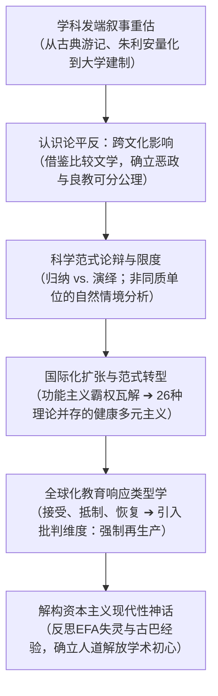

# Argument_Rust_2009_Reflections

---

## 研究问题

> [!question]
> 比较教育学自近代以来的学科发生轨迹呈现何种形态？战后学科在追求实证“科学化”过程中如何不公正地贬抑了前建制期的跨文化史学遗产？从 1950 年代结构功能主义正统向当代理论百家争鸣的演变，究竟标志着学科陷入失控的碎片化解体，还是走向心智成熟的理论多元主义？在全球化纵深推进与跨国非对称权力格局下，比较教育学如何超越西方资本主义现代性话语，重新建构关照弱势社群并推动全球正义的解放范式？（pp.121–123, 131–135）

> [!claim] 核心主张
> 比较教育学拥有贯通古今的连续性学术传统，十九世纪以来的跨文化影响考证构成了对标比较文学的坚实学术基石；战后结构功能主义教条的衰落不仅未导致学科解体，反而催生了涵盖 26 种理论视角的“健康多元主义”；面对全球化冲击，学科必须彻底打破将教育等同于资本主义现代性的狭隘偏见，将分析视野从单向度的自愿政策借用扩展至涵盖接受、抵制、恢复与强制再生产的四重批判维度，回归以人道福祉与自主解放为核心的学术初心。（pp.123–126, 131–135）

> [!concept-lens] 阅读透镜
> - **对象** 比较教育学两百余年的思想史演进、学术期刊论文的方法论与理论图谱、跨大西洋与泛北欧政策借用档案，以及全球化时代的国际教育援助政治。
> - **张力** 实证科学主义对十九世纪人文史学传统的傲慢断裂 vs. 跨文化影响作为学科本体传统的连续性；功能主义正统瓦解引发的“碎片化焦虑” vs. 26 种理论并存的“健康多元主义”；主流话语对西方现代性扩张的顺从预设 vs. 第三世界面临的强制再生产与草根文化反抗。
> - **贡献** 借鉴比较文学的理论范式为前科学期的跨文化考察平反；通过扎实的文献计量调查为学科的理论多元性提供实证背书；将批判教育学的再生产理论引入全球化教育借用研究，奠定四重响应分析架构。

---

## 理论框架

> [!framework-table] 理论工具箱
> | 理论工具 | 解释功能 |
> |---|---|
> | **[[Influences Across Cultures\|跨文化影响]]** Influences Across Cultures | 借鉴比较文学追踪母题与体裁在时空跨度中迁徙的分析方法，系统解构教育观念与体制规程在民族国家间的双向流动与再造，确立历史实证主义的认识论合法性。（pp.123–124） |
> | **[[Scientific Paradigm\|比较教育学科学范式]]** Scientific Paradigm | 审视十九世纪末以来教育学追求实证科学地位的动力机制，辨析归纳法与假说演绎法在处理社会与文化“非同质单位”（dissimilar units）时的认识论边界。（pp.126–129） |
> | **[[Typology of Educational Responses to Globalization\|全球化教育响应类型学]]** Typology of Educational Responses to Globalization | 整合主动借用的“接受”、草根反叛的“抵制”、本土知识赋权的“恢复”以及核心霸权强加的“强制再生产”，构建解构全球新自由主义教育扩张的批判分析工具。（pp.133–135） |
> | **批判教育学与解放实践** Critical Pedagogy and Praxis of Liberation | 引入吉鲁（Henry Giroux）的再生产理论与保罗·弗莱雷（[[Paulo Freire]]）的“教育即政治”命题，揭示资本主义现代性对教育伦理的侵蚀，为学科确立促进和平与社会正义的人道主义伦理锚点。（pp.134–135） |

> [!warrant]- 理论如何支撑论证
> 作者首先运用跨文化影响理论，将十九世纪欧美学者对外国教育的考察从战后实证主义者的“业余游记”与“粗浅赞歌”等偏见中解救出来，证明其蕴含着精细的政治语境权衡与政策转译逻辑；随后，借助实证科学范式审视学科在大学建制化时期的认识论大论战，推导出比较研究处理非同质单位的独特性；最后，通过引入批判教育学的结构再生产视角，将传统基于共识与自愿假定的全球化借用模型拓展为兼顾跨国不对等强加与草根反抗的批判四元模型，逻辑严密地推导出比较教育学走向解放实践的历史必然性。（pp.123–126, 128–130, 133–135）

---

## 研究方法

> [!method-panel] 研究设计
> | 模块 | 材料与处理方式 |
> |---|---|
> | **思想史考证与跨时空母题追踪** Historiographical and Lineage Analysis | 深入考证 1816 年朱利安方案、1830–1850 年代欧美跨大西洋考察一手白皮书（Cousin, Stowe, Bache, Mann, Barnard）以及 1840 年代以来挪威改革委员会文献，还原借用背后的政体博弈与理论假设。（pp.121–126） |
> | **学术期刊文献计量与理论取向实证调查** Journal Bibliometrics and Author Survey | 依托 UCLA 团队对《比较教育评论》（*CER*）等主流期刊数十年来发表论文的文献计量分析，并向论文作者发放问卷，实证统计 26 种理论传统在学科中的实际分布与演化趋势。（pp.130–132, 135） |
> | **跨国比较案例研究与多阶段政策建模** Comparative Case Study and Policy Modeling | 运用挪威国家教育改革长程实证数据与美德历史互鉴案例，提炼国家政策借用与本土落地的多阶段运行机制；结合联合国教科文组织《全民教育》（EFA）全球监测数据开展宏观比较。（pp.124–126, 134） |

> [!sample-panel]- 样本与材料快照
> | 样本层面 | 构成 |
> |---|---|
> | **历史文献样本** | 涵盖托马斯·杰斐逊（1785）、威廉·罗素（1826）、威廉·哈里斯（1888）、朱利安（1816–1817）、维克多·库森（1831）、卡尔文·斯托（1837）、达拉斯·贝奇（1839）、[[Horace Mann\|霍勒斯·曼]]（1844）、亨利·巴纳德（1854）、威廉·佩恩（1887）、路易斯·乔丹（1905）等数十部古典文献。（pp.121–127） |
> | **建制化学术样本** | 哥伦比亚大学师范学院 1899 年首门课程大纲与 1918 年桑迪福德（Peter Sandiford）教材；德国施奈德（Friedrich Schneider）1931 年创刊的《国际教育学评论》；CIES 学会档案与世界比较教育学会联合会（WCCES）1970–2007 年 33 个成员学会建制记录。（pp.122–123, 129–130） |
> | **全球发展数据** | 联合国教科文组织 2006 年《全民教育全球监测报告》（EFA 2006）关于非洲、中东、拉美发展中国家与古巴的达标统计指标。（pp.134, 137） |

---

## 论证结构

---

### 论证步骤一　学科发端的多重叙事与“跨文化影响”实证传统的认识论平反

关于比较教育学起源的叙述往往折射了叙述者本人的思想预设，而非客观历史本身。战后实证主义者倾向于将学科起点框定在实证调查或大学建制的特定节点，并对前建制时期的探究嗤之以鼻。（pp.121–123）

针对起源叙事的历史考据，作者系统辨析了学术界关于学科发端的四种并存话语：

> [!timeline] 比较教育学学科发端的多重历史锚点
> - **古代游记传说（Antiquity）** 希罗多德、色诺芬、西塞罗与凯撒等古典作家在边疆游历中记录异域风土人情与教化实践，被视作最早带有经验观察萌芽的旅行者见闻（travellers' tales）。（p.121）
> - **朱利安实证调查倡议（1816–1817）** 马克-安托万·朱利安（Marc-Antoine Jullien）在《关于比较教育的一项工作纲要》中首次提出由跨国专家委员会使用标准化问卷收集各邦教育数据，建立教育改良参照系，被公认为近代科学比较教育之父。（pp.121–122）
> - **现代大学制度建制化（1899–1918）** 哥伦比亚大学师范学院于 1899 年由罗素（James Russell）开设首门比较教育大学课程；1918 年彼得·桑迪福德（Peter Sandiford）编著出版首部大学通用教材《比较教育》，确立了以“特定国家或地区的教育”为单元的系统知识谱系。（pp.122–123）
> - **专业学会与学术刊物诞生（1931–1956）** 德国弗里德里希·施奈德（[[Friedrich Schneider]]）于 1931 年创立《国际教育学评论》；1956 年美国比较教育学会（后更名为 [[Comparative and International Education Society|CIES]]）成立并创办会刊《比较教育评论》（*CER*），标志着专业学者共同体的正式制度化。（pp.122–123）

然而，二十世纪下半叶的学术界（如 Kandel, 1930; Templeton, 1954）却形成了贬低十九世纪考察文献的严苛教条，指责其充斥着“功利主义”、“纯粹行政描述”、“缺乏理性论证”与“过度颂扬赞美”。作者尖锐反驳了这种傲慢偏见，明确提出必须确立教育[[Influences Across Cultures|跨文化影响]]（Influences Across Cultures）的学术合法性。（pp.123–124）

> [!line-a] 比较文学范式的认识论借鉴
> 跨文化影响研究在比较文学学科中拥有至高地位。学者们通过在时间轴上追踪思想源流（如古典主义对浪漫主义的渗透、莎士比亚对英国文学的重构），以及在空间轴上追踪母题迁徙（如宗教主题从瑞士经荷兰传入美洲、托尔斯泰与梭罗对南亚文学的浸润、唐璜原型跨文化演化），确立了严谨的实证探究传统。比较教育学早期的跨国考察在本质上完全对标这种探究模式，其对制度思想迁徙路径的挖掘具有不可替代的学术价值。（pp.123–124）

为了击碎早期考察缺乏分析深度的误判，作者以美国公学改革者赴普鲁士考察的经典历史展开论证。事实证明，这些先驱不仅具备极其敏锐的情境意识，更在认识论上确立了现代借用理论的基石：

> [!evidence-grid] 美国公学运动对普鲁士模式的历史借用逻辑
> - **官方考察高潮与普遍赞誉** 1830 年代维克多·库森（Victor Cousin）报告的英译本直接引发了美国教育精英的赴德高潮。俄亥俄州代表斯托（Calvin E. Stowe, 1837）盛赞其为“有史以来最完善学区”；贝奇（Alexander Dallas Bache, 1839）称其为“最完美的集权体系”；马萨诸塞州教委秘书[[Horace Mann|霍勒斯·曼]]（Horace Mann, 1844）在第七次报告中将普鲁士公学誉为欧洲之冠；康涅狄格州教委主任巴纳德（Henry Barnard, 1854）亦齐声共鸣。（pp.124–125）
> - **本土保守反对派的政治围剿** 当地反对者激烈抗议引进普鲁士体系，指责普鲁士学校是君主专制国家用于维系寡头统治、强化军事动员和扼杀革命萌芽的政治奴化工具。（p.125）
> - **确立“恶政良教自然可分”的公理** 霍勒斯·曼等人明确承认普鲁士制度与专制政治的勾连，但针锋相对地提出：恶政与良教在自然属性上是完全可分的。人类的心智官能（human faculties）在全世界都是相同的，因此发展心智的最佳途径亦具普适性。既然普鲁士教师能用一半的时间教好读写算，美国就完全能够学习其先进教学法，而绝不采纳其被动顺从的政治信条；优良的学校完全可以服务于强化北美的民主与共和精神。（p.125）
> - **制度成果的本土再造与固化** 正是在这种严密的论证支撑下，美国的公立公学（Common School）直接复刻了普鲁士国民学校（Volksschule），师范学校（Normal School）则直接复刻了德国教师讲习所，奠定了现代美洲公共教育的制度根基。（p.125）

---

### 论证步骤二　科学范式的兴起动因、认识论论辩与“非同质单位”的方法论限定

十九世纪末以降，比较教育学卷入大学建制化后追求“成为一门科学”的普遍冲动。1887 年密歇根大学首任教育学教授佩恩（William H. Payne）直言“教育主要是一门经验艺术，但大学的核心目的在于发展教育科学”。德语区围绕“比较教育科学”（Vergleichende Erziehungswissenschaft）与“比较教育学/教艺”（Vergleichende Pädagogik）的命名论战，亦折射了在科学与实践艺术之间寻找立足点的努力。（pp.126–127）

在科学化浪潮中，比较教育并非孤立存在，而是广泛归属于横跨自然与人文社会科学的庞大“比较学科群”。1905 年路易斯·乔丹（Louis Henry Jordan）在其巨著《比较宗教》中梳理了 26 个并存的比较学科（涵盖比较解剖学、比较胚胎学、比较语法学、比较法学直至比较教育学），断言所有比较学科之所以成其为科学，皆在于其拥有统一的科学方法，旨在揭示事物之间根本的“关联法则”；乔丹更盛赞比较教育学是其中最典范的代表。（p.127）

然而，在具体的实证推进过程中，学术共同体迅速陷入了认识论与方法论的深层分歧：

> [!contrast-table] 科学范式内部的方法论对立与认识论交锋
> | 论辩焦点 | 经验归纳主义（Inductive Approach） | 假说演绎主义（Hypothetico-Deductive Approach） |
> |---|---|---|
> | **代表学者** | 艾萨克·坎德尔（[[Isaac Kandel]]）、尼古拉斯·汉斯（[[Nicholas Hans]]）、乔治·贝雷迪（[[George Bereday]]） | 布赖恩·霍姆斯（[[Brian Holmes]]，渊源于杜威探究理论与波普尔证伪主义） |
> | **研究起点** | 从系统详尽的国别教育现象历史与现状描述起步 | 从明确的问题（Problem）与预设假说出发 |
> | **理论生成路径** | 描述 ➔ 社会政治背景解释 ➔ 并置（juxtaposition） ➔ 归纳比较 | 批判理性检验 ➔ 假说建构 ➔ 经验演绎检验 ➔ 政策预测 |
> | **批判要点** | 霍姆斯批评其深陷纯粹经验描述泥潭，理论出现过迟，无法有效应对战后规划 | 归纳派指责假说演绎法过于脱离鲜活的民族历史情境与制度特殊性 |

> [!warrant]- 比较教育学实证探索的内在方法论限度
> 作者指出，方法论（Methodology，涉及研究设计与理论推导）必须与具体方法（Methods，涉及数据收集与分析）严格区分。尽管先驱们普遍标榜科学方法，但比较教育学在认识论上天然受制于两大不可逾越的边界：其一，由于不能在实验室对国家和文化进行人为控制干预，学者只能依赖在自然情境（natural setting）中观察系统性变异；其二，比较研究的核心困难在于其分析对象是人类社会中高度复杂的“非同质单位”（dissimilar units，Smelser, 1976），即不同社会与文化下的教育系统。因此，单一机械的自然科学实证法则绝不可能垄断比较教育研究。（pp.127–129）

---

### 论证步骤三　知识共同体的全球拓殖与从功能主义正统向健康理论多元主义的转型

二十世纪后半叶，比较教育学经历了深远的国际化扩张。早期的英美欧中心主义格局被彻底打破，世界各区域的学术建制如雨后春笋般兴起。（pp.129–130）

> [!phase] 知识共同体的国际化空间拓殖
> - **阶段一：跨大西洋与欧洲核心期（19 世纪末–20 世纪中期）** 早期教席与核心学会完全集中于美、英、加、德等西方工业发达国家，学者身份高度同质化（如 Kandel, Hans, Bereday, Schneider, Holmes 等大多在英美或西欧任教）。（pp.129–131）
> - **阶段二：世界学会联合体建立与空间扩散（1970s）** 1970 年世界比较教育学会联合会（[[World Council of Comparative Education Societies|WCCES]]）在加拿大渥太华成立，推动学术网络向全球延伸；至 2007 年，已有 33 个国家与区域比较教育学会纳入联合会，并在哈瓦那等全球多地召开世界大会。（pp.129–130）
> - **阶段三：非西方地区的自主知识生产（1980s 至今）** 日本因战后向西方学习催生学会体系；印度立足后殖民与南亚邻国比较开创自主传统；中国比较教育学会于 1979 年重建，至 1990 年代已创办多达 7 种专业期刊，台湾暨南国际大学设立多达 6 个比较教育专任教席，规模甚至超越诸多北美传统中心。（pp.129–131）

伴随着地理空间的拓展，学科的研究方法与理论范式发生了天翻地覆的重构。1950–1960 年代，学科曾被结构功能主义与现代化理论（以人力资本理论与系统论为支柱）所高度垄断，形成压抑性的意识形态正统。然而自 1970 年代起，这一单一霸权遭到批判主义与解释主义知识群落的全面瓦解。（pp.131–132）

> [!stat-cards] 学科成熟期的实证计量快照（UCLA 调查成果）
> - **26 种**
>   - **理论范式共存**
>   - 涵括结构功能、人力资本、依赖论、世界体系、现象学、常人方法学、符号互动、批判理论、女权主义、后现代主义与后殖民主义等，正统垄断彻底终结。（pp.132, 135）
> - **33 个**
>   - **WCCES 成员学会**
>   - 遍布各大洲的专业组织打破西方学术封闭，反映全球学术多中心网络的形成。（pp.129–130）
> - **3 大主流**
>   - **社会科学学科认同**
>   - 当代比较教育学者在实证调查中最普遍认同的母学科为社会学、政治学与经济学。（pp.130–131）

学术界内部曾出现强烈的忧虑，认为原有在方法、地域、人员与理论上的高度统一性丧失之后，学科正在失控旋转并瓦解为毫无连贯认同的碎片。作者在此亮出核心学术判断：这种多维扩张绝非病态的碎片化（fragmentation），而是标志着学科走向成熟与包容的“健康多元主义”（healthy pluralism）。多元主义是对冷战时期窒息性实证正统的成功破除，赋予了学者针对差异化问题选用最契合工具的学术自由。（p.132）

---

### 论证步骤四　解构资本主义现代性神话与建构全球化四重教育响应批判框架

文章进入终篇，两位青年学者（Johnstone 与 Allaf）与资深导师拉斯特展开了一场极具批判锋芒的代际思想交锋。作者指出，主流比较教育学长期默认全球化是一个不可抗拒的自然进程，并将教育的职能狭隘锚定为推动“现代性”；这种论调实质上是将教育出卖给了资本主义经济扩张逻辑。（pp.133–134）

拉斯特在 2004 年曾提出教育对全球化的三重响应（接受、抵制、恢复）。然而，合著者尖锐指出，这三重模式预设了国家间对称互惠的互动关系，严重遮蔽了国际关系中强势核心国家对弱势边缘国家非自愿的暴力强加。由此，作者正式提出了[[Typology of Educational Responses to Globalization|全球化教育响应类型学]]的四维批判模型：

> [!quad-grid] 全球化背景下教育响应的四维批判范式
> - **接受（Receptivity）**
>   - 主动吸引与借用外部模型
>   - 内部共同体出于改良本国教育意愿，自发吸收外部先进经验与制度设计（即传统比较教育两百年来的核心焦点）。（pp.133–134）
> - **抵制（Resistance）**
>   - 激进批判与草根反抗
>   - 针对新自由主义全球化的资本霸权展开反击，抵御文化同质化，捍卫语言、文化与政治意识形态的多样性。（pp.133–134）
> - **恢复（Restoration）**
>   - 本土文化赋权与知识振兴
>   - 挽救与保护在殖民主义和资本主义全球扩张中遭受重创甚至濒临灭绝的原住民语言与传统生态知识体系。（pp.133–134）
> - **强制再生产（Reproduction）**
>   - 外部霸权强加与依附固化
>   - 核心发达国家与跨国机构在非对称权力关系下，强行向发展中国家植入资本主义教育体制，推行暗含不平等与依附关系的“隐蔽课程”。（pp.133–134）

为了揭露强制再生产的危害，作者以联合国教科文组织推行的《全民教育》（Education for All, EFA）为经验透镜展开对质：

> [!claim] EFA 实证对质：资本主义受迫国家的失灵与古巴经验的启示
> EFA 倡议本质上确立了以教育公平、入学机会与识字普及为内核的崇高人道主义愿景。然而最新的量化评估显示，几乎所有被迫全盘接受西方资本主义市场化改革的非洲、中东与拉美国家均未能实现 EFA 核心目标；与此形成极其鲜明对照的是，在资本主义全球权力架构之外独立探索的古巴，凭借以人为本的全民动员，成为拉美地区唯一全面达标的国家。令人遗憾的是，由于古巴拒绝遵从主导性的资本主义意识形态，其卓越实绩不仅未获得应有的国际赞誉，反而遭到边缘化。这一惨痛反差充分证明：强行绑定资本主义市场逻辑不仅无法实现普遍的人道受教育权，反而是维系跨国剥削的枷锁。（pp.134–135）

基于上述反思，作者向全球比较教育界发出严正呼吁：必须彻底清算新自由主义将教育等同于技术现代性的意识形态神话。学者们应当重返坎德尔（Isaac Kandel）开创的人文主义源头，牢记教育的本质是国家塑造公民德性与实现文化自决的殿堂；比较教育学的未来使命必须从帝国主义式的“外部干涉与再生产”，全面转向尊重主权与文化多元的“自主研究与自愿接受”，投身于增进人类普遍福祉与社会正义的解放实践（praxis of liberation）。（pp.134–135）

---

## 主要发现

> [!finding-cards] 核心发现
> 1. **平反跨文化影响考证确立了比较教育学的学术连续性** 澄清了十九世纪先驱在赴欧考察中展现的高度情境自觉与政治批判眼光，揭示美德跨大西洋互动中“恶政与良教自然可分”的公理，证明跨文化影响考证构成了现代政策借用理论不可割裂的实证基石。（pp.123–126）
> 2. **实证调查证实学科正处于理论多元主义的健康成熟期** 基于 UCLA 团队对主流期刊的大规模计量与作者调查，揭示当代比较教育涵盖 26 种并存的理论范式；作者论证这种百家争鸣是摆脱冷战功能主义窒息正统的标志，构成了学科繁荣的健康多元主义而非无序碎片化。（pp.130–132）
> 3. **建构全球化四重响应模型揭露了教育强加的再生产本质** 突破了传统借用理论将跨国流动预设为自愿互惠的局限，创造性地确立了包含“强制再生产”在内的四维分析范式，深刻揭露了核心霸权国家向发展中国家强行输出新自由主义体制的隐蔽课程与依附机制。（pp.133–134）
> 4. **确立反思现代性神话与重返人道主义解放实践的学术使命** 尖锐指出主流比较教育合谋资本主义扩张的伦理缺陷，援引古巴在全民教育（EFA）中的独立突破，倡导学科摆脱跨国干涉主义，重返以主权自决与人类解放为本位的人文主义根基。（pp.134–135）

---

## 关键引用

> [!citation-card] [[Horace Mann|霍勒斯·曼]]论恶政与优良教学法的自然可分性
> 如果普鲁士的学校教师能用我们通常所需一半的时间教会儿童认字、写字、地理和算术，那么我们完全可以借鉴他传授这些基础要素的教学方式，而绝无必要采纳他对政府被动顺从的政治观念。（p.125）
>
> *if the Prussian schoolmaster could teach reading, writing, geography, and arithmetic in half the time that was required in America, then surely they could “copy his modes of teaching these elements, without adopting his notions of passive obedience to government.”*

> [!citation-card] [[Val D. Rust|瓦尔·拉斯特]]论学科理论多元主义并非失控碎片化
> 从我们的视角来看，我们认为比较教育领域正在走向多元主义，而非陷入碎片化；这种多元主义应被视作学科的一种生命力与优势，它标志着学科成功打破了 1950 年代至 1960 年代初在理论与方法上窒息学术探索的教条正统。任何快速演进的事物都有失控旋转的潜在风险……但这显然不是当下的现实；我们坚信比较教育是一个健康且边界清晰的探索领域。（p.132）
>
> *From our vantage point we see the field becoming pluralistic rather than fragmented, and that pluralism can be seen as a strength in that it indicates a break from the stifling orthodoxy, that characterized the field in the 1950s and early 1960s, both theoretically and methodologically. However, any phenomenon that gyrates has the potential of spinning out of control... This is certainly not yet the case; we see comparative education as a healthy, defined field of endeavor.*

> [!citation-card] 约翰斯通与阿拉夫论解构资本主义现代性与回归人道主义
> 带着对比较教育这一致力于科学研究与自主接受而非干预主义与强制再生产的学科理解；带着对教育应当依据人道主义而非资本主义来界定的坚定认同；并带着一种解放而非支配的实践行动，各个独立的主权国家与社会完全能够自主掌握定义本国教育体系的主导权，以切实造福于自身的人民、文化、经济与政治。（pp.134–135）
>
> *With this understanding of comparative education as a field dedicated to research and receptivity, not interventionism and reproduction; with the acceptance that education be defined in terms of humanism, not capitalism; and with a praxis of liberation, not domination, individual countries and societies can take ownership for defining their own educational systems for the benefit of their people, culture, economics, and politics.*

---

## 自述局限

> [!warning]
> - **文献计量调查的历史截面局限** 作者自述关于学科研究策略与理论取向的统计主要基于 UCLA 团队在特定时段（1990 年代末至 2000 年代初）对若干核心期刊发表文献的抽样问卷，难以完全涵盖非英语主流刊物及边缘地区未被主流引文索引收录的本土出版物。（pp.130–132, 135）
> - **低人类发展指数国家学者能见度不足的结构制约** 作者坦陈，受制于跨国学术政治经济学的结构性不平等，处于低人类发展水平国家的学者由于普遍缺乏参与昂贵国际合作研究所需的经费资源，其在国际比较教育学会网络与主流刊物中的学术能见度依然显著偏低。（p.131）
> - **全球化跨国非对称流动微观模型的待完善性** 作者指出，历史上的政策借用大多以主权民族国家为基本单元，而全球化催生的超国家流动与跨国复杂条件呈现出前所未有的异质性，系统阐明全球化下多标度借用与强制推行的新型分析微观机制仍有待未来学者进一步深化。（pp.126, 134）

---

## 来源

- [[books/Cowen(Ed.)_2009_Springer/Ch09_Rust_Johnstone_Allaf_2009|Ch09_Rust_Johnstone_Allaf_2009]]
