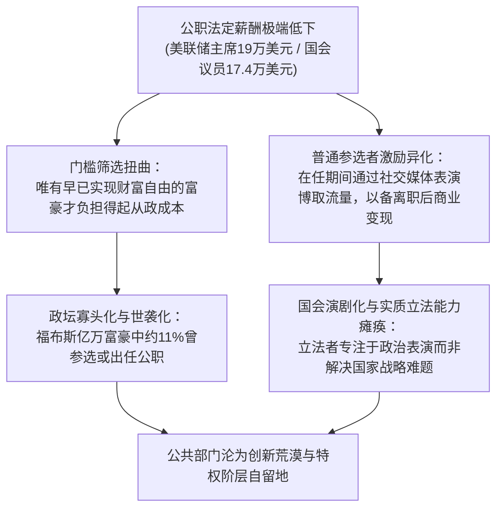
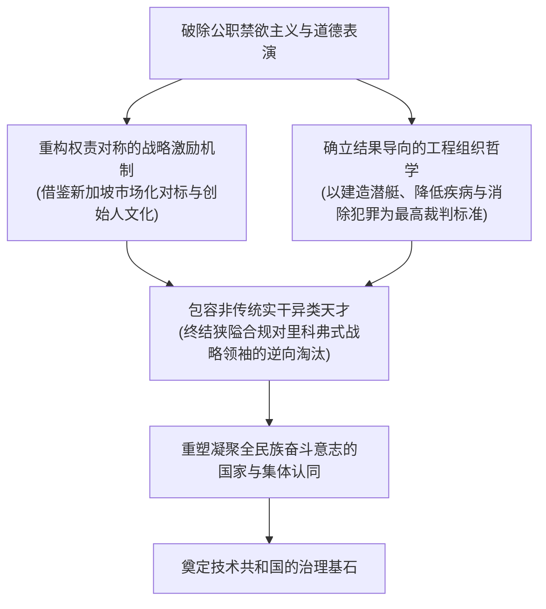

---
authors:
  - "[[Alexander Karp|Karp, A. C.]]"
  - "[[Nicholas Zamiska|Zamiska, N. W.]]"
source_language: en
summary: "剖析西方公职伦理中清教徒式道德纯洁性与禁欲主义对国家治理效能造成的严重破坏；借由美联储主席鲍威尔象征性低薪揭示公职低报酬诱发的富豪政治与离职变现悖论，对比新加坡李光耀将公务员薪酬与私营市场顶尖行业挂钩的务实激励制度；详述“核海军之父”里科弗上将研制世界首艘核潜艇鹦鹉螺号奠定国家战略均势却因微小礼品遭遇程序道德审判的公案；引入肯尼斯·伯克的替罪羊机制与圣本笃典故，批判形式主义规章与道德表演对实干天才的逆向淘汰，呼吁以权责对称激励与国家集体认同重铸技术共和国。"
type: argument
subtype: monograph
publication_type: book-chapter
title: "Argument_Karp_Zamiska_2025_Technological_Republic_Ch16"
argument_key: "Argument_Karp_Zamiska_2025_Technological_Republic_Ch16"
argument_display_title: "“Piety and Its Price”"
argument_kind: "book-chapter"
book_title: "The Technological Republic: Hard Power, Soft Belief, and the Future of the West"
publication_place: "New York"
publisher: "Crown Currency"
year: 2025
isbn: "9780593798706"
citation: "Karp, A. C., & Zamiska, N. W. (2025). “Piety and Its Price”. In The technological republic: Hard power, soft belief, and the future of the West (pp. 179–189). New York: Crown Currency."
citation_aliases: []
tags:
  - source/book-chapter
  - theme/public-governance
  - theme/civil-service-reform
  - theme/incentive-design
  - theme/engineering-mindset
  - theme/technological-republic
  - theme/procedural-purism
  - region/us
  - region/singapore
sources:
  - "[[books/Karp_Zamiska_2025_Technological_Republic/Karp_Zamiska_2025_Technological_Republic|Karp_Zamiska_2025_Technological_Republic]]"
part_of: "[[Argument_Karp_Zamiska_2025_Technological_Republic]]"
confidence: high
status: draft
created: 2026-10-08
updated: 2026-10-08
---
# Argument_Karp_Zamiska_2025_Technological_Republic_Ch16

---

## 本章主旨

> [!chapter-question]
> 在现代国家治理体系中，为何对公职人员道德纯洁性与清教徒式禁欲主义的执着追求，反而导致了公共部门顶尖人才匮乏、富豪阶层垄断政坛以及实干领袖遭受体制逆向淘汰的深重危机？从美联储主席每年仅 19 万美元的象征性年薪到国会议员的微薄报酬，西方公职补偿机制如何催生出富豪自费从政与离职后流量变现的恶性扭曲？对比[[Lee Kuan Yew|李光耀]]（[[Lee Kuan Yew|Lee Kuan Yew]]）在新加坡推行的[[Singapore Civil Service Salary Benchmarking Policy|公职薪酬市场化挂钩制度]]，务实激励逻辑为何优于空洞的道德说教？以核海军之父[[Hyman Rickover|海曼·里科弗]]（[[Hyman Rickover|Hyman G. Rickover]]）上将研制[[USS Nautilus Submarine Development|鹦鹉螺号核潜艇]]奠定国家深海霸权却在晚年因琐碎礼品遭遇合规审查的公案为例，官僚程序主义如何通过[[Kenneth Burke|肯尼斯·伯克]]（[[Kenneth Burke|Kenneth Burke]]）揭示的[[Scapegoat Mechanism|替罪羊机制]]将开拓型实干领袖牺牲以换取表层的合规幻觉？重构[[Technological Republic|技术共和国]]为何必须彻底打破道德表演，转向结果导向与权责对齐的制度设计？

> [!claim] 核心主张
> 西方国家治理能力衰退与公共部门技术贫困的深层体制根源，在于公共文化中深植的清教徒式道德纯洁性崇拜（Piety）与形式主义程序正义对实质治理成果的严重压制。[[Alexander Karp|亚历山大·卡普]]（[[Alexander Karp|Alexander C. Karp]]）与[[Nicholas Zamiska|尼古拉斯·扎米斯卡]]（[[Nicholas Zamiska|Nicholas W. Zamiska]]）指出，美欧社会一方面心安理得地容忍硅谷与华尔街金融资本的巨额暴利，另一方面却对关乎数亿国民福祉的公共治理职位施加不切实际的禁欲要求，迫使公职沦为少数无需为生计担忧的世袭特权阶层或亿万富豪的志愿活动，并诱使普通政客通过煽动政治极化与媒体表演在离职后变现；李光耀在新加坡确立的务实市场化薪酬挂钩证明，承认人性的现实激励才能为国家吸引一流治理英才。更严重的是，现代官僚体制沉溺于繁琐的行政合规审查，将追求无瑕纯洁的道德洁癖置于建造潜艇、攻克绝症与保障国家安全等重大战略成果之上；里科弗上将凭借无畏开拓精神打造[[USS Nautilus Submarine Development|鹦鹉螺号]]（USS Nautilus）确立西方数十年的深海优势，晚年却因收受防务承包商总额微小的日常纪念品而沦为官僚政治与[[Kenneth Burke|肯尼斯·伯克]]（[[Kenneth Burke]]）所论[[Scapegoat Mechanism|替罪羊机制]]的牺牲品。作者强调，必须终结用审美偏好与道德表演替代实战问责的虚伪作风，在公共部门重塑风险与回报对称的[[Engineering Mindset|工程思维]]与制度激励，以强大的国家共同体认同重铸技术共和国（pp. 179–189）。

> [!phase] 章节论证推进脉络
>
> - **华盛顿公职薪酬脱节与富豪阶层垄断政坛**
>
>   以 2023 年凯雷集团联合创始人戴维·鲁宾斯坦对美联储主席鲍威尔 19 万美元年薪的访谈切入，揭示全球最具影响力央行行长薪资不及华尔街初级分析师的荒谬现状；结合西北大学关于亿万富豪参政比例高达 11% 的实证研究，指出微薄公职薪酬迫使政坛沦为富豪志愿俱乐部，或诱发普通议员将国会作为个人流量与离职变现跳板（pp. 179–181）。
>
> - **清教禁欲传统加剧人才贫困与新加坡务实薪酬挂钩范式**
>
>   回顾 1787 年麦迪逊关于议员自定薪酬系将手伸进公款中饱私囊的历史警惕，指出西方拒绝将私营激励引入公共部门的禁欲主义传统直接导致了教育、医疗与公共治理的严重人才匮乏；对比李光耀 1994 年在新加坡推行的公职薪酬与私营顶尖专业人士挂钩政策，援引其极少有人会成为神职人员的务实名言，论证唯有合理激励才能打破世袭精英对高声望公共职位的垄断（pp. 181–183）。
>
> - **里科弗上将打破规章与鹦鹉螺号奠定深海战略均势**
>
>   详述 1953 年爱达荷沙漠小型舰载核反应堆陆上动力试验与 1955 年鹦鹉螺号成功实现 1,300 英里全程潜航的历史壮举；展现里科弗上将无视官僚繁文缛节、打破既有规章的强悍工程管理，阐明正是这种不讨好体制的异类天才确立了美国在冷战深海博弈中的决定性优势（pp. 183–185）。
>
> - **通用动力小礼品调查公案与程序合规对实战功勋的审判**
>
>   详述 1985 年海军审查委员会披露里科弗在十六年间收受通用动力公司总值 67,628 美元的小额礼品与日用纪念品的公案；剖析海军部长约翰·莱曼与《纽约时报》社论借程序瑕疵发起的道德声讨，对比威廉·普罗克斯迈尔参议员与《时代》周刊对实质历史战功的坚定辩护，揭示体制对瑕疵实干家的残酷排斥（pp. 185–186）。
>
> - **道德纯洁性狂热与伯克替罪羊机制的集体心理排毒**
>
>   深刻反思现代社会对华尔街与硅谷资本暴利视若无睹、却对战略功勋领袖进行严苛道德审判的认知失调；引入肯尼斯·伯克 1935 年在《持久与变迁》中提出的替罪羊机制，揭示体制如何通过仪式化牺牲争议人物以暂时卸载集体内部危机与内疚感；结合公元六世纪圣本笃面对政敌弗洛伦蒂乌斯身亡时的肃穆与对门徒幸灾乐祸的训诫，阐释成熟政治文明应有的审慎与宽容（pp. 187–188）。
>
> - **终结道德表演并以权责对称激励重铸技术共和国**
>
>   指出过度偏狭的规则执念与对不讨好个体的迫害是领导层与实质治理成果脱节的制度病理；论证重构技术共和国必须打破回避复杂结果的道德表演，在公共核心部门建立风险与回报对称的所有权激励，并重塑凝聚全民族奋斗意志的国家与集体认同基石（pp. 188–189）。

---

## 详细论证链条

### 一、 西方公职法定薪酬过低迫使政界沦为富豪志愿俱乐部与离职变现跳板

现代西方政治体系陷入了一种表面崇高、实则极度虚伪的薪酬激励悖论（pp. 179–181）。

在 2023 年 2 月华盛顿特区经济俱乐部举行的访谈中，凯雷投资集团联合创始人、净资产近 40 亿美元的戴维·鲁宾斯坦（David Rubenstein）向美联储主席杰罗姆·鲍威尔（Jerome Powell）询问其法定年薪数额（p. 179）。鲍威尔面带微笑、神色平静地回答其年薪仅约为 19 万美元；当鲁宾斯坦进一步追问这是否是一份与其职责相匹配的公允薪酬时，鲍威尔诚恳而得体地表示认可，引得现场观众发出略带尴尬与同情的笑声（pp. 179–180）。

> [!case-study] 美联储主席与国会议员薪酬脱节引发的治理扭曲
> - **职责与影响力规模** 美联储主席掌管着全球最核心的中央银行体系，其关于基准利率升降节奏与通胀轨迹的每一次判断，直接决定着美国乃至全球数亿工薪劳动者的生计命运，牵动着全球证券市场数万亿美元资本的易手与重新配置（pp. 179–180）。
> - **薪酬与价值脱节** 国会为该职位设定的年薪仅约 19 万美元，甚至不及华尔街顶尖投资银行初级分析师的总薪酬水平（p. 180）。
> - **制度实质** 鲍威尔个人净资产据报道已超过 2,000 万美元，其政府薪酬相对于其财富体量微不足道，他本人公开表示日常开支主要依赖个人储蓄；这实质上意味着作为世界最富裕国家的美国，是在依靠富豪的自费奉献来运营国家货币与金融中枢（p. 180）。

> [!claim] 公职薪酬扭曲与阶层垄断命题
> 将公职薪酬人为压低到远离市场真实价值的水平，不仅无法实现选贤任能的初衷，反而造成了严重的逆向淘汰：它在制度上逼迫候选人必须在进入公共部门前先积累巨额财富，从而将国家治理演变为富豪阶层的志愿活动，或者促使缺乏资产的从政者将公职视为建立个人知名度的跳板，在任内热衷于激进的表演性政治，以便在卸任后通过游说、演讲和咨询实现商业变现（pp. 180–181）。

根据美国西北大学研究团队 2023 年针对《福布斯》全球两千名亿万富豪的实证调查（Krcmaric et al., 2023），约有 11% 的亿万富豪曾竞选或出任过公职（p. 180）。政治学者安德鲁·霍尔（Andrew B. Hall, 2019）在其著作《谁想参选？》（*Who Wants to Run?*）中同样实证指出，立法者薪酬的贬值必然导致唯有富豪阶层才负担得起参选成本（p. 180）。与此相对，根据美国国会研究处（Congressional Research Service, CRS）的报告（Brudnick, 2024），美国参议院与众议院议员的平均年薪仅为 17.4 万美元，但他们做出的立法与财政决策却深刻影响着数百万军人、教师、工人与学生的生存处境（pp. 180–181）。任何一家以这种脱离价值贡献方式支付薪酬的私营企业都无法在竞争中存活；西方社会一边抱怨金钱对政治的侵蚀，一边却在体制上默许富豪对公共权力的全面渗透（pp. 180–181）。

---

### 二、 清教禁欲传统加剧公共部门人才匮乏，新加坡市场化薪酬挂钩证明务实激励的必要性

西方社会对公共激励的排斥，植根于建国初期确立的道德禁欲主义与清教徒式道德纯洁性幻想（pp. 181–183）。

在 1787 年制宪会议关于国会议员薪酬的辩论中，后出任第四任美国总统的詹姆斯·麦迪逊（James Madison）对允许议员掌控自身薪酬持高度怀疑态度，认为将手伸进公共钱袋中饱私囊是失德的（p. 181）。这种将个人利益与公共使命截然对立的思维模式延续至今，致使主流舆论始终抱有一种虚幻的期待，即德才兼备的精英理应出于纯粹的奉献精神而不计报酬地报效国家（pp. 181–182）。新闻评论家马修·伊格莱西亚斯（Matthew Yglesias, 2019）等学者呼吁给国会大幅加薪以扩大优质候选人蓄水池，但此类改革提议在华盛顿屡屡搁浅（p. 181）。

> [!contrast-table] 美国清教禁欲模式与新加坡务实挂钩模式对比
> | 比较维度 | 美国清教禁欲模式 | 新加坡李光耀务实对标模式 |
> |---|---|---|
> | **核心人性假设** | 预设公职人员应为道德圣人或清贫修道者 | 承认公职人员是有家庭、有现实经济诉求的真实个体 |
> | **薪酬制定基准** | 象征性低薪，由立法者在民粹舆论压力下人为压低 | 法定挂钩于私营部门顶级专业人士中位数折算标准 |
> | **人才吸引机制** | 依赖富豪自费奉献或吸引热衷政客表演的投机者 | 以一流报酬竞争全社会最聪明、最务实的技术官僚与专业领袖 |
> | **廉洁防腐路径** | 诉诸微观繁复的行政合规审查与舆论道德审判 | 形成高薪养廉与违法必惩的权责对称闭环 |
> | **阶层流动后果** | 将政府、医学与学术高阶职位演化为世袭精英的禁脔 | 畅通平民专业技术精英凭真才实学投身国家治理的上升通道 |

> [!case-study] 新加坡 1994 年公职薪酬市场化改革
> - **改革背景** 1994 年 11 月，新加坡建国总理[[Lee Kuan Yew|李光耀]]（[[Lee Kuan Yew|Lee Kuan Yew]]）在议会提出《竞争性薪酬确保廉洁高效政府》白皮书，确立部长与文官薪酬对标私营部门顶尖法律、银行、工程与管理人才的法定公式（p. 182）。
> - **现实主义论辩** 面对批评者指责高薪会吸引图谋私利而非献身国家者的质疑，李光耀尖锐回应：从政者是有家庭与现实抱负的普通男女，当我们高谈阔论所有这些崇高宏大的事业时，请记住归根结底极少有人会成为神职人员（p. 182）。
> - **运行成效** 到 2007 年，新加坡内阁部长的平均年薪随私营基准调整至 126 万美元（Mydans, 2007）；新加坡长期位居全球清廉指数与政府效率榜首，有效规避了西方政界议员离职搞旋转门寻租的弊端（p. 182）。

卡普与扎米斯卡尖锐地指出，美国文化中对物质消费的警惕与清贫节制的崇尚虽然具有抵御消费主义沉沦的精神价值，但若将这种本能不加区分地泛化为要求公职人员充当道德圣人，其结果将是灾难性的（pp. 182–183）。它剥夺了政府、教育与公共医疗等关乎国计民生的核心公共部门利用有效激励吸引顶尖人才的能力，并极具倒退性地将整个公共服务领域演变为少数不需要为生计发愁的世袭受教育精英的特权领地，变相排斥了来自底层社会的真正竞争力（pp. 182–183）。

---

### 三、 颠覆性国家战略突破依赖于注重实效、敢于打破官僚规章的异类工程领袖

当国家面临关乎生死存亡的颠覆性技术竞争时，唯有能够打破官僚科层繁文缛节、直面客观物理规律的异类工程天才，才能创造战略奇迹（pp. 183–185）。

1953 年 5 月 31 日晚，在爱达荷州东部沙漠的偏远试验场，美国海军反应堆监督官埃德温·金特纳（Edwin E. Kintner）与美国原子能委员会（Atomic Energy Commission, AEC）委员托马斯·默里（Thomas E. Murray）共同启动了世界上第一台小型潜艇核反应堆陆上原型堆（Submarine Thermal Reactor Mark I, S1W）（pp. 183–184）。在核链式反应控制技术尚处婴儿期、面临严重辐射泄漏与不可控爆炸风险的极端不确定情境下，该核动力引擎成功连续运转近两小时，并在次月完成了长达五天的全功率连续运行，正式拉开了美苏潜艇动力技术代差竞争的序幕（pp. 183–184）。

> [!timeline] 鹦鹉螺号核潜艇与深海战略均势的确立
> - **1900–1906** [[Hyman Rickover|海曼·里科弗]]出生于波兰马科夫裁缝家庭，6 岁时随家人移民美国纽约（p. 184）。
> - **1940 年代后期** 里科弗在海军内部敏锐捕捉核能前景，以强力意志推动核反应堆小型化与舰载化设计（pp. 183–184）。
> - **1953 年 5 月** 爱达荷沙漠核动力原型试验大获成功，验证了核动力驱动汽轮机的可行性（pp. 183–184）。
> - **1955 年 5 月** 世界首艘核动力潜艇[[USS Nautilus Submarine Development|鹦鹉螺号]]（USS Nautilus, SSN-571）完成从康涅狄格州新伦敦至波多黎各圣胡安的 1,300 英里处女航，全程潜航近四天（p. 184）。
> - **战术性能飞跃** 鹦鹉螺号对常规空中侦测与反潜打击近乎完全免疫，航速超越常规鱼雷，将潜艇由短时下潜的水面舰转化为可长期隐匿大洋深处的战略核威慑中枢，为美国奠定了延续至今的海上战略优势（p. 184）。

> [!case-study] 里科弗上将打破海军规章与建造鹦鹉螺号
> - **性格与管理风格** 里科弗性格桀骜、言辞尖锐，在 1984 年哥伦比亚广播公司（Columbia Broadcasting System, CBS）《60分钟》（*60 Minutes*）节目接受黛安·索耶（Diane Sawyer）采访时自嘲只有花栗鼠般的亲和力；他曾让意见相左的下属在壁橱中站立面壁数小时，对平庸与借口展现出绝对的零容忍（pp. 184–185）。
> - **对官僚规章的决裂** 当副官手捧美国海军规章手册向其汇报流程时，里科弗直接命令其滚出去并把规章手册烧掉，留下了掷地有声的工程信条：我的职责不是在体制内合规工作，我的职责是把事情真正做成（p. 185）。
> - **下属总统的敬畏** 曾在其手下服役的吉米·卡特（Jimmy Carter）总统回忆，尽管在里科弗严苛甚至折磨人的管理下曾有几次恨透了他，但他毫不犹豫地承认，除自己的亲生父亲外，没有任何其他人对自己的生命产生过如此深沉塑造的影响（p. 185）。

这项彻底颠覆现代海战形态的历史性工程，完全由时任海军准将[[Hyman Rickover|海曼·里科弗]]（[[Hyman Rickover|Hyman G. Rickover]]）以近乎狂热的进攻性进取心一手缔造（pp. 184–185）。正是这种敢于对抗体制惰性、直面物理运行客观规律的异类工程师，为西方构筑了半个世纪以上的安全屏障（pp. 184–185）。

---

### 四、 官僚体制借由微小合规瑕疵对实干领袖发起道德审判，压制了实质战略成果

当技术突破与国家危机退潮后，追求平庸安稳的官僚体制迅速掉转矛头，对非传统的开拓型实干家发起严苛的程序道德审判（pp. 185–186）。

在里科弗上将退役后的 1980 年代初，美国海军审查委员会发布调查报告，披露他在 1961 至 1977 年的十六年间，曾收受主要造船防务承包商通用动力公司（General Dynamics Corporation）总计 67,628 美元的礼品，平均每年约 4,200 美元（p. 185）。这批物品包括价值 1,125 美元的耳环与翡翠吊坠、水牛角手柄水果刀、西装干洗服务、一套二手大英百科全书、热盘、12 张浴帘、鹦鹉螺号甲板木料托盘、240 个咖啡杯以及 88 个蒂芙尼纸镇（p. 185）。里科弗坦承收受礼品并说明许多物品已转赠给支持核潜艇项目的国会议员，且强调自己在 1952 年即可在私营部门赚取数倍财富却选择留在海军领微薄薪水服役三十年（pp. 185–186）。

> [!case-study] 通用动力公司小礼品调查与程序合规争议
> - **官僚派指控** 海军部长约翰·莱曼（John Lehman）公开将此事件定性为里科弗的跌落神坛；《纽约时报》（1985）发表社论指责其自以为凌驾于规则之上，认为这种信念虽促成其崇高成就，却孕育了深刻的判断缺陷，借由微小合规程序否定其一生的卓越品格（p. 186）。
> - **战略派辩护** 威廉·普罗克斯迈尔（William Proxmire）参议员坚决捍卫老友，直言当如今掌管海军的平庸官僚被历史彻底遗忘之后，里科弗作为核海军之父与国防承包舞弊不屈斗士的英名仍将永载史册；《时代》周刊（1986）悼词亦客观指出，里科弗的傲慢无法掩盖其粗粝天才乃是美国在原子能时代黎明期最伟大的战略资产（p. 186）。

尽管海军审查委员会最终仅建议给予行政警告信，但政敌与媒体借程序瑕疵发起的道德围剿，彻底暴露出官僚体制对异类功勋实干家的残酷排斥（pp. 185–186）。

---

### 五、 体制在面临深层治理困境时通过替罪羊机制转嫁集体焦虑，造成对创新英才的逆向淘汰

对里科弗等功勋领袖的道德清算，揭示了现代官僚体制在面对自身结构性失能时，如何通过驱逐异类来获取短暂的心理平衡（pp. 187–188）。

社会在面对华尔街对冲基金经理、硅谷科技巨头凭借资本套利攫取天文数字财富时表现得麻木甚至推崇，却在一名为国家立下不世之功的功勋军官收受几把水果刀和咖啡杯等琐碎纪念品时掀起道德狂潮（p. 187）。这种对微观合规的偏狭狂热，本质上是体制在用形式主义程序正义逃避更为艰难的实质治理问责：建造核潜艇、攻克疑难重症、挫败恐怖袭击与捍卫国家利益需要承受巨大的风险与复杂的现实权衡，而躲在合规条例与道德大棒背后挑剔实干家的瑕疵，则是平庸官僚最廉价的避险工具（p. 187）。

> [!claim] 替罪羊机制在公共治理中的异化命题
> 现代组织在遭遇治理瓶颈与集体道德焦虑时，极易退行到古老的[[Scapegoat Mechanism|替罪羊机制]]：系统倾向于将整个体制的惰性、过失与深层矛盾投射到某个个性桀骜、不讨好大众但战功卓著的突出领袖身上，通过对其微小瑕疵发起道德公审与名誉献祭，使广大平庸官僚与公众获得转瞬即逝的道德纯洁感与危机化解幻觉，从而彻底掩盖了系统缺乏战略产出能力的根本危机（pp. 187–188）。

> [!case-study] 伯克替罪羊理论与圣本笃的历史哀悼
> - **肯尼斯·伯克论替罪羊机制** 文论家[[Kenneth Burke|肯尼斯·伯克]]（[[Kenneth Burke|Kenneth Burke]]）在 1935 年《持久与变迁》（*Permanence and Change*）中指出，替罪羊机制最纯粹的形态是将牺牲客体作为仪式性卸载群体罪恶的容器，通过对受难客体的残酷打击来缓解更广泛群体的内疚与认知失调（p. 188）。
> - **圣本笃面对仇敌身亡的肃穆** 公元六世纪教宗格里高利记载：当长期迫害修道院长本笃、甚至投送毒面包与派遣裸女诱惑修士的神父弗洛伦蒂乌斯（Florentius）意外横死时，前来报喜的门徒欣喜若狂；本笃却当场陷入极度沉痛，既为仇敌的丧生而悲哀，更因门徒在对手死亡时表现出的幸灾乐祸而感到痛心（pp. 188–189）。成熟政治文明必须拥有超越狭隘快感与道德审判的自省力量（p. 189）。

柏拉图在《理想国》中早已洞察，品行无可挑剔的道德纯洁者往往缺乏掌握权柄与攻坚克难的雄心；彻底抹杀对人性复杂性与矛盾性的制度包容，最终只会让平庸怯懦、毫无担当的合规操盘手掌控国家航向，给文明带来无可挽回的悔恨（pp. 187–188）。

---

### 六、 重建技术共和国必须打破道德表演，在公共治理中确立权责对称的实效考核与共同体认同

破除清教徒式道德纯洁性的偏狭束缚，是重构国家治理能力与消灭创新荒漠的前提条件（pp. 188–189）。

对规章条例的僵化迷信、对治理实质成果的视而不见以及对非传统异类精英的体制性排斥，是当代西方社会深层制度功能障碍的集中表征（p. 189）。其根源在于：掌控国家最高权力的官僚领导层与他们理应推动的实质治理目标之间发生了严重的脱节脱钩，决策者既不承担失败的真实风险，也不分享成功的实质回报（p. 189）。

> [!claim] 重塑技术共和国的终极路径
> 重建[[Technological Republic|技术共和国]]不仅需要在薪酬与治理机制上打破禁欲主义与道德表演，引入风险与收益对称的所有权社会理念与[[Founder Culture|创始人文化]]，更需要在精神层面上重塑全社会对国家使命与集体认同的崇高信念；唯有将敏捷务实的工程治理与坚如磐石的共同体承诺深度融合，人类文明才能走出形式主义平庸化的深渊，迎来持久的繁荣与进步（pp. 188–189）。

---

## 核心概念与关键机制

> [!feature] 核心机制与分析维度
> 
> - **公职禁欲悖论** 西方社会对公职人员施加清教徒式道德纯洁性要求与微薄法定薪酬，导致公职被富豪阶层垄断或异化为离职变现跳板，严重剥夺公共部门吸引顶尖专业人才的激励能力（pp. 179–183）。
> - **李光耀务实薪酬挂钩范式** 将公共治理职位薪酬与私营市场顶级行业中位数挂钩，承认人性现实诉求，以一流待遇招募一流人才并辅以严苛法治问责（pp. 182–183）。
> - **里科弗工程领袖范式** 以交付颠覆性战略成果为第一要务，敢于突破僵化科层合规，代表了颠覆性科技攻坚所必须的实战工程思维（pp. 183–185）。
> - **伯克替罪羊机制** 体制在遭遇结构性无能与内部道德失调时，通过将过错转嫁并牺牲具有争议的实干天才，以换取短暂虚幻的集体心理释怀与道德纯洁感（pp. 187–188）。
> - **结果导向治理与国家认同** 终结形式主义程序审判，以权责对齐的制度设计与共同体信念重铸技术共和国（pp. 188–189）。

---

## 关键引用

> [!citation-card] 李光耀论公职激励与人性现实
> 当我们谈论所有这些冠冕堂皇、高尚崇高的宏大事业时，请记住归根结底极少有人会成为神职人员。（p. 182）
>
> *So when we talk of all these high-falutin, noble, lofty causes, remember at the end of the day, very few people become priests.*

> [!citation-card] 里科弗论打破官僚体制与交付实效
> 我的职责不是在体制内四平八稳地合规工作，我的职责是把事情真正做成。（p. 185）
>
> *My job was not to work within the system. My job was to get things done.*

> [!citation-card] 伯克论替罪羊机制的纯粹形态
> 替罪羊机制最纯粹的形式，是将牺牲性客体作为一种容器，用于仪式性地卸除自身的罪过。（p. 188）
>
> *In Permanence and Change, published in 1935, Kenneth Burke described “the scapegoat mechanism in its purest form,” as “the use of a sacrificial receptacle for the ritual unburdening of one’s sins.”*

> [!citation-card] 形式程序对实质成果的倒置侵害
> 风险在于我们开始将看似无可指摘的透明度与程序目标置于真正重要的事情之上——建造潜艇、研制最难攻克的药物、防范恐怖袭击以及捍卫国家利益。这种功利主义权衡或许并不具审美吸引力，但在任何严峻斗争中，我们有时必须抛开审美上的厌恶；我们太经常躲在自身的道德纯洁性背后，以逃避关于结果与成效的更艰难且令人不安的追问。（p. 187）
>
> *The risk is that we begin to privilege the seemingly unobjectionable goals of transparency and process over what actually matters—building submarines, developing our most elusive cures, preventing terrorist attacks, and advancing our interests. Such a utilitarian calculus is unattractive. But in any struggle, we must sometimes set aside aesthetic distaste. We too often hide behind our piety as a way of avoiding more challenging and indeed uncomfortable questions about outcomes and results.*

---

## 本章创建与更新的知识条目

> [!ref-index] 本章关联的核心知识对象
> 
> - **人物条目**
>   - [[Hyman Rickover]] 美国海军四星上将，核海军之父，领导研制世界首艘核潜艇鹦鹉螺号，注重实效与打破官僚规章的工程领袖代表（pp. 183–186）。
>   - [[Lee Kuan Yew]] 新加坡建国总理，确立公职薪酬市场化挂钩制度，提出极少有人会成为神职人员的务实治理名言（p. 182）。
>   - [[Kenneth Burke]] 美国著名修辞学家与哲学家，在《持久与变迁》中系统剖析替罪羊机制与集体罪咎卸载过程（p. 188）。
> - **概念条目**
>   - [[Scapegoat Mechanism]] 社会与组织在面临内部危机时将矛盾转嫁于特定牺牲者以维系表层整合的修辞与心理机制（pp. 187–188）。
> - **事实条目**
>   - [[USS Nautilus Submarine Development]] 美国海军与原子能委员会在里科弗领导下于 1953–1955 年研制成功世界首艘核潜艇的历史性工程（pp. 183–184）。
>   - [[Singapore Civil Service Salary Benchmarking Policy]] 新加坡政府于 1994 年确立的部长与高级公务员薪酬法定市场对标制度（p. 182）。

---

## 来源

- [[books/Karp_Zamiska_2025_Technological_Republic/Karp_Zamiska_2025_Technological_Republic|Karp_Zamiska_2025_Technological_Republic]]
