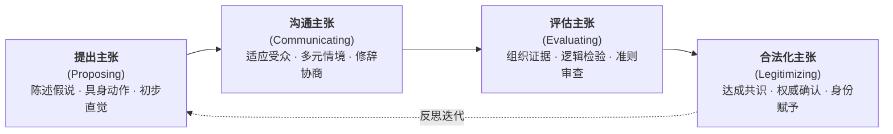

# Argument_Kelly_Licona_2018_EpistemicPractices

---

## 研究问题

> [!question]
> 科学教育如何摆脱“仅传授既定知识结论”与“将认识论视为孤立个人信念”的局限，引导学生在共同体的话语互动与学科规程中参与“[[Epistemic Practices|认识论实践（epistemic practices）]]”？（pp. 139–141）

> [!claim] 核心主张
> 科学教育的核心不仅在于传授概念结论，更在于引导学生作为微观协商共同体的成员，亲身参与提出（propose）、沟通（communicate）、评估（evaluate）与合法化（legitimize）知识主张的“[[Epistemic Practices|认识论实践]]”。这一实践具有交互生成、情境嵌入、历史互文与制度后果四大特征，在探究科学、工程设计与社会科学议题等不同领域中呈现出鲜明的学科差异，为破除僵化的“科学方法”教条、培育公共科学素养确立了实践基础。（pp. 140, 148, 156–158, 161）

> [!concept-lens] 阅读透镜
> - **对象** 中小学与大学科学课堂、高中物理振动实验小组、小学工程设计团队、大学地质学论文写作，以及社会科学议题辩论场景。
> - **张力** 哲学上追求的普遍理性标准与实际科学活动中的情境复杂性之间的张力；教科书普适线性的“科学方法”与各学科高度异质的实际研究规程之间的断裂。
> - **贡献** 提出并实证阐明了认识论实践的四维行动框架（提出、沟通、评估、合法化）与四大本体特征（交互性、情境性、互文性、后果性），系统构建了三大教育取向在学习目标与实践规程上的对比矩阵，为培育面向现实生活的公共科学素养提供了实践哲学基础。

---

## 理论框架

> [!framework-table] 理论工具箱
> | 理论来源 | 代表学者 | 核心命题与分析工具 | 理论功能与作用 |
> |---|---|---|---|
> | **三维科学教育目标论** | Richard Duschl (2008) | 科学教育必须同步整合概念（conceptual）、认识论（epistemic）与社会（social）三大学习目标，三者相互支撑，不可割裂。（pp. 140–141） | 作为组织科学教学的顶层架构，反对单纯以概念记忆为中心的灌输式教学。 |
> | **社会知识认识论与批判规范** | Helen Longino (1990, 2002) | 认识论主体是社会群体而非孤立个体；科学知识通过公共论坛（venues）、吸收批评（uptake）、公认标准（standards）与平等智识权威（equality of intellectual authority）确立。（p. 148） | 为课堂认识论实践提供规范准则，防止社会学实证视角滑向主观相对主义。 |
> | **修辞学与科学流派分析** | Charles Bazerman (1988); Alan Gross (1989) | 科学证据是通过特定体裁（genres）与文本互文（intertextuality）呈现的，知识主张通过修辞协商在社会论坛中获得说服力。（pp. 146, 158–159） | 提供分析学生实验报告、设计方案辩护与地质学论文证据层级的话语分析工具。 |
> | **语言游戏与实践认识论** | Ludwig Wittgenstein (1958); Per-Olof Wickman (2004) | 意义在实际行动的语言游戏中生成；通过群体默认的“立足点”（stand fast）与遭遇挑战的“意义裂隙”（gaps）刻画行动中的认识论。（pp. 149–150） | 支撑对课堂日常互动的微观分析，揭示参与者如何在即时对话中协商何者算作有效证据与知识。 |

> [!warrant]- 理论如何支撑论证
> 理论工具箱将宏观规范与微观语料有机连接：理查德·杜施尔（Richard Duschl）的三维目标论确立了认识论在课程中的核心地位；海伦·朗基诺（Helen Longino）的社会认识论准则为课堂公共协商提供了防范相对主义的规范航标；查尔斯·巴泽曼（Charles Bazerman）的修辞学工具帮助剖析学生文本中的证据组织层级；而维特根斯坦（Ludwig Wittgenstein）与佩尔-奥洛夫·威克曼（Per-Olof Wickman）的语言哲学则将分析焦点牢牢锚定在课堂实际的话语互动之中。

---

## 研究方法

> [!method-panel] 研究设计
> | 模块 | 材料与分析方式 |
> |---|---|
> | **方法路径**<br>Interactional Ethnography & Discourse Analysis | 结合科学元勘综述、微观交互人种志与质性[[Discourse Analysis\|话语分析]]，重点考察口头与书面语言、符号系统、语调特征与具身动作（手势与操作）。（pp. 139, 144–147） |
> | **案例综合**<br>Multi-Case Comparative Synthesis | 横跨中小学与大学学段，综合对比四项具有代表性的原生态课堂实证案例，涵盖物理探究、工程设计、地质写作与教师引导话语。（pp. 144–147） |
> | **学科矩阵分析**<br>Disciplinary Matrix Comparison | 针对“探究式科学”、“工程教育”与“社会科学议题”三大教学取向，在学习目标与认识论实践两个层面系统编制跨领域比较矩阵。（pp. 142–143, 156–157） |

> [!sample-panel]- 样本与材料快照
> | 案例来源与学段 | 核心学科与任务情境 | 材料形态与分析焦点 |
> |---|---|---|
> | **物理实验小组**<br>(Kelly et al., 2001) | 高中物理：弹簧振子简谐振动实验 | 微观录像转录、微机传感器实时位移与速度波形图、学生具身模仿手势、小组对话序列（pp. 144–145） |
> | **技术工程团队**<br>(Kelly & Brown, 2003) | 小学三年级：设计可实际运作的太阳能集热与烹饪装置 | 小组讨论记录、工程草图、原型测试数据、全班展示与面向“科学小记者”的辩护话语（pp. 145–146） |
> | **专业地质写作**<br>(Takao & Kelly, 2003) | 大学本科地质学：撰写板块构造证据论证学术论文 | 学生学期论文文本、全球地质测量数据图表、认识论层级（EL）编码（p. 146） |
> | **科学身份塑造**<br>(Reveles et al., 2004) | 小学三年级多元文化课堂：物质状态与自然现象探究 | 教师 Cordova 课堂录像转录、师生互动话语、对对话进行反思的“元话语（meta-discourse）”（pp. 146–147） |
> | **重力与地球观念**<br>(Lidar et al., 2010) | 小学阶段：地球形状与重力作用机制探究 | 小组对话录音、操作天球仪与地图的互动过程、实践认识论分析（PEA）编码（p. 150） |

---

## 论证结构

> [!logic-map]- 核心论证逻辑链
> ```mermaid
> flowchart LR
>     Step1["步骤一<br/>认识论主体转向<br/>协商共同体"] --> Step2["步骤二<br/>认识论实践涵盖<br/>四维行动环节"]
>     Step2 --> Step3["步骤三<br/>认识论实践确立<br/>四大本体特征"]
>     Step3 --> Step4["步骤四<br/>不同教学取向呈现<br/>学科规程差异"]
>     Step4 --> Step5["步骤五<br/>通过显性反思<br/>培育公共科学素养"]
> ```

---

### 论证步骤一　科学知识的认识论主体是社会协商共同体而非孤立个体

> [!claim] 步骤一核心主张
> 认识论主体不是孤立的个体，而是具有特定文化规范与传统的微观实践共同体；科学教育必须走出个体心智测验的狭隘视野，转向考察群体如何在社会互动中决定何者算作有效知识。（pp. 140, 147–148）

#### 1. 走出笛卡尔孤立知者假说，转向情境化社会实践

> [!row-contrast] 认识论主体范式的根本转向
> | 比较维度 | 传统个体认识论范式（Cartesian Subject） | 社会实践认识论范式（[[Epistemic Practices]]） |
> |---|---|---|
> | **核心主体** | 孤立的个体认知者、心理学测验对象 | 处于具体情境中的微观协商共同体 |
> | **知识形态** | 头脑中的心智表征、去语境的命题信念 | 在话语互动中被提出、沟通与辩护的动态行动 |
> | **有效性依据** | 个体心智与客观实在的符合程度 | 共同体成员公认标准、审议规程与对合理批评的接纳 |
> | **教育考量** | 概念记忆测试、标准化问卷测量（如 VNOS） | 引导学生参与真实科学文化与学科论辩实践 |

#### 2. 区分描述性实践记录与规范性教育目标

> [!proc] 解构对科学社会学戒心的三重学术辩护
> 1. **区分描述性记录与规范性目标** 记录科学活动中的实际社会互动并不等同于将所有实际行为直接当作教学标准。教育目标需要结合伦理与育人考量，实证研究旨在深化对知识生成过程的理解，而非盲目复制职业科学家的所有行为。
> 2. **立足教育学视角吸纳研究成果** 吸纳科学社会学是为了揭示知识生产的内部运作逻辑（如文本修改、实验检验、同行审议），这些洞见能够为课程设计提供生动滋养，无须陷入相对主义的极端争议。
> 3. **借鉴人种志的微观研究方法** 科学元勘考察“行动中的科学”（science-in-the-making）的田野观察方法，为教育研究考察课堂中“师生如何共同确立知识”提供了成熟有效的方法工具。（pp. 143–144）

> [!warrant]- 推理桥梁：从个体信念向社会规程的转变
> 当认识论主体定位于共同体时，科学教育的重心便发生转变：学习科学不仅是记住现成的概念定义，更是学会参与特定学科的交流实践，掌握共同体用来提出、检验与确立知识的社会规程。

---

### 论证步骤二　认识论实践由提出、沟通、评估与合法化知识主张四个行动环节构成

> [!claim] 步骤二核心主张
> [[Epistemic Practices|认识论实践]]是群体成员提出、沟通、评估与合法化知识主张的社会组织化方式；这四个环节相互支撑，在课堂中具体展现为言语、手势与文本的互动过程。（pp. 140, 144–147）



#### 1. 认识论实践四维行动模型及其课堂实证展现

> [!quad-grid] 认识论实践四维行动的微观课堂实证复原
> - **提出主张（Proposing）：高中物理简谐振动实验**
>   - **语料情境** 高中生利用弹簧振子与超声波传感器探究振动，计算机实时生成的波形图具有显著的解释灵活性（Kelly et al., 2001）。学生用手部动作在空中模仿振动，将身体感觉与屏幕波峰波谷对照，提出充满试错的初步猜想。
>   - **认识论机制** 科学发现需要具身动作与仪器读数相互印证（Garfinkel et al., 1981）。这些粗粒度的初始尝试，构成了启动小组公共审议的关键认知支点。（pp. 144–145）
> - **沟通主张（Communicating）：小学三年级太阳能装置设计**
>   - **语料情境** 小学三年级学生分组设计太阳能集热装置（Kelly & Brown, 2003）。学生面对多重交流场景：在小组内商讨材料折中方案，在全班汇报集热原理，并用实测升温数据回应“科学小记者”的质疑。
>   - **认识论机制** 沟通是知识建构的核心中介而非事后包装。学生根据受众与任务调整论证，与专业科学家撰写报告和答辩时的修辞工作完全同构（Bazerman, 1988）。（pp. 145–146）
> - **评估主张（Evaluating）：大学海洋地质学论文写作**
>   - **语料情境** 大学生利用全球地质数据集撰写板块构造论文（Takao & Kelly, 2003）。高水平论证必须从具体观测事实（震源深度、洋底地磁条带）平稳过渡到中阶概括（贝尼奥夫带、扩张速率），最终上升到理论机制（板块俯冲）。
>   - **认识论机制** 评估关乎证据组织的体裁规范。即使高年级助教也往往难以直接说清某篇论文为何“更有说服力”，话语分析使这种默会的证据评估层级变得显性可教。（p. 146）
> - **合法化主张（Legitimizing）：小学科学课堂教师元话语**
>   - **语料情境** 教师 Cordova 在小学探究课上引导学生确立科学解释的权威（Reveles et al., 2004）。教师不直接裁决对错，而是使用元话语点评：“大家注意到了吗，刚才在反驳时调用了昨天的实测温度数据，这正是科学家解决分歧的做法。”
>   - **认识论机制** 基础教育中合法化知识的核心在于培养学生的“科学身份（science identity）”，赋予边缘背景学生基于证据平等发声的自信（Latour, 1987; Myers, 1997）。（pp. 146–147）

#### 2. 知识主张在发现、辩护与全流程沟通三重情境中推进

> [!quad-grid] 知识主张生成与审议的三重情境架构（p. 147）
> - **发现的情境（Context of Discovery）** 充满尝试、困惑与假说调整。该情境让学生体验仪器如何操作、观察如何受已有经验影响（Norman, 1998），以及假说如何在探索中逐步成型。
> - **辩护的情境（Context of Justification）** 强调严密的推理与证据支撑。该情境让学生学习如何调动实测数据支持主张，理解理论如何在公共标准下接受检验（Duschl & Grandy, 2008）。
> - **沟通与呈现的情境（Context of Communication & Presentation）** 贯穿于探究的全过程。从提出设想、小组争辩到整理报告，知识主张始终根据潜在受众的理解与期待不断调整。
> - **情境共生与转化机制** 发现、辩护与沟通不是先后分离的单向流程，而是在日常探究中交织循环的有机整体。

---

### 论证步骤三　认识论实践内生具有交互生成、多尺度情境、历史互文与制度后果四大特征

> [!claim] 步骤三核心主张
> [[Epistemic Practices|认识论实践]]是在人际协作中当场生成的（交互性）、同时嵌入即时情境与长远传统的（情境性）、借由过往话语和符号传承的（互文性），以及直接影响知识合法性与身份认同的（后果性）。（pp. 140, 156–159）

#### 1. 认识论实践的四大本体特征

> [!feature] 认识论实践的四大本体特征（pp. 156–159）
> - **交互生成性（Interactional）** 知识生成是集体协同行动。在物理实验中，组员之间的争论、动作配合以及对异常数据的讨论，共同决定了哪种解释被小组采纳。（p. 156）
> - **多尺度情境性（Contextual）** 认识论实践同时存在于微观即时情境（处理反常数据）与宏观历史传统（实验报告体裁与测量规范）之中。（pp. 156–158）
> - **历史互文性（Intertextual）** 师生口头表述持续指涉课本概念、公式与官方数据，将当下对话与已有公共知识网络紧密对接。（pp. 158–159）
> - **制度后果性（Consequential）** 哪些观点被认定为有效知识直接决定了谁的想法被采纳，深刻影响着学生的学习认同与科学身份。（p. 159）

#### 2. 认识论实践从微观互动到社会认同的推导机制

> [!chain-link] 认识论实践从微观互动到社会认同的发展链条
> - **前提：微观互动情境** 学生在课堂微观场景中围绕实验材料与数据开展讨论。（p. 156）
> - **机制：多尺度互文锚定** 讨论过程调用科学概念与体裁规范，与更广泛的学术传统对接。（pp. 158–159）
> - **结果：知识确立与身份发展** 群体就何者算作合理知识达成共识，最终形成具有归属感的科学学术身份。（p. 159）

---

### 论证步骤四　探究科学、工程教育与社会科学议题遵循不同的学科认识论规程

> [!claim] 步骤四核心主张
> 探究式科学、工程教育与社会科学议题（SSI）在目标定位与四维行动规程上高度分化，科学教学必须尊重各领域的独特学科规范。（pp. 142–143, 155–157）

#### 1. 三种教学取向在概念、认识论与社会目标上的分工

> [!row-contrast] 表 5.1 三种科学教学取向在三大学习目标上的侧重差异（p. 143）
> | 学科取向（Disciplinary Approach） | 概念目标（Conceptual） | 认识论目标（Epistemic） | 社会实践目标（Social） |
> |---|---|---|---|
> | **科学探究<br>（Science）** | 构建并理解用于表征和阐释自然世界的合理模型（Kelly, 2014b） | 理解概念知识与理论模型的理由依据及证据基础（Longino, 2002） | 识别认知文化用以生成、交流和评估知识主张的专门规程（Kelly, 2014a） |
> | **工程教育<br>（Engineering）** | 针对特定应用目的设计、分析和构建工程模型与技术方案（Cunningham & Carlsen, 2014） | 理解并优化技术系统的功能运作，确立衡量成功与约束的证据基准 | 识别工程设计与分析团队所遵循的协作程序，明确客户在生成与评估设计中的核心角色 |
> | **社会科学议题<br>（Socioscientific Issues）** | 构建并理解科学概念，同时综合考量道德、伦理、个人与宗教等多重视角（Sadler, 2004） | 统合多元视角（科学、伦理、经济等），构建支持争议性立场的连贯推理链 | 掌握在争议性议题中支持特定立场时，生成、交流和评估多元论据的公共审议程序（Zeidler, 2014） |

#### 2. 四维认识论实践在不同教学取向中的操作矩阵

> [!row-contrast] 表 5.2 三种科学与工程教育取向中的认识论实践矩阵（pp. 156–157）
> | 认识论实践维度 | 探究式科学（Inquiry Science） | 工程教育（Engineering Education） | 社会科学议题（Socioscientific Issues） |
> |---|---|---|---|
> | **提出主张<br>（Propose）** | - 提出科学探究问题<br>- 设计探究方案以回应问题<br>- 开展具身与仪器观察<br>- 设想探究所需的相关证据基础<br>- 构建并迭代修正理论模型 | - 识别实际工程与技术问题<br>- 在具体生活情境中审视工程问题<br>- 综合应用科学概念与工程逻辑<br>- 应用数学建模与定量推理<br>- 设想多种竞争性备选方案<br>- 保持坚韧并在设计失败中学习迭代<br>- 运用全局系统思维（systems thinking） | - 提出跨领域综合问题（兼涉科学、经济、道德、宗教与生态）<br>- 设计多元调查方案以探寻答案<br>- 权衡并协调多元推理线索<br>- 预先构建反驳与抗辩论据（rebuttal） |
> | **沟通主张<br>（Communicate）** | - 发展严密的科学推理链条<br>- 为知识主张提供学科特异的论证辩护<br>- 撰写规范的科学解释（实验报告）<br>- 进行口头科学阐释与现场辩驳<br>- 基于证据与推理建构因果说明 | - 在工程项目团队内部开展高效协同沟通<br>- 针对既定物理与成本约束为设计方案辩护<br>- 面向委托客户（client）进行专业汇报与展示 | - 基于实地与文献调查构建证据网络<br>- 明确阐述个人或群体的价值与政策立场<br>- 基于证据与价值考量构建多重复合论据<br>- 开展公众演讲与正式论辩陈述<br>- 深入参与角色扮演（role-play）与公共辩论 |
> | **评估主张<br>（Evaluate）** | - 评估科学主张、证据或模型的效度与优缺点<br>- 审视科学推理链条的逻辑严密性<br>- 评估科学解释对异常数据的包容度<br>- 严谨考量竞争性的备择解释（alternatives） | - 在设计指标与物理/成本约束之间进行权衡取舍（tradeoffs）<br>- 运用测试数据驱动工程方案的优化决策<br>- 评估技术约束与委托客户实际需求的契合度 | - 评估科学事实主张的有效性与内在局限<br>- 评估多元证据效力（界定何者在道德、伦理或科学上算作有效证据）<br>- 审视跨学科推理链条的融贯性与偏见<br>- 对论辩体系进行全局整体性评估 |
> | **合法化主张<br>（Legitimize）** | - 就科学合理的因果解释建立群体共识<br>- 赋予最符合既有公认科学理论的解释以权威价值<br>- 寻求相关学科认识论共同体的正式承认 | - 综合权衡工程技术方案的多维社会后果<br>- 做出基于坚实数据证据的工程决策<br>- 获得委托客户对技术方案落地成功的最终确认 | - 在公共论争中建立对最具说服力论据的广泛共识或审议接纳<br>- 承认辩论各方所持价值立场的正当性与合法合理性 |

#### 3. 转基因玉米案例展示不同取向的问题与证据边界

> [!tension-table] 转基因玉米在探究、工程与 SSI 取向下的认识论实践对质（pp. 154–155）
> | 维度 | 探究式科学（Inquiry Science） | 工程教育（Engineering Education） | 社会科学议题（SSI Approach） |
> |---|---|---|---|
> | **核心探究问题** | “转基因玉米在控制光照下是否比常规玉米生长得更好？” | “如何改良玉米基因以满足特定抗旱与低成本加工的工业要求？” | “是否应该允许将实验室培育的转基因玉米大规模引入自然生态系统？” |
> | **证据考量范围** | 仅限于生物学受控实验测得的株高、生物量与抗虫数据。 | 关注基因转化效率、种子生产成本与农机收割兼容性。 | 综合考量生态多样性风险、跨国种业专利垄断、食品安全与伦理观念。 |
> | **结论裁决准则** | 遵循单变量控制原则与统计显著性检验。 | 寻求多约束条件下的最优设计平衡与可行性。 | 综合权衡不同价值诉求，在公共审议中寻求合理的民主共识。 |

---

### 论证步骤五　破除单一科学方法神话，依托实践认识论分析与显性元话语培育公共科学素养

> [!claim] 步骤五核心主张
> 必须破除将科学方法简化为五个固定步骤的机械观念，依据家族相似性展现真实的多元学科文化；单纯让学生动手操作无法自发形成科学本质理解，必须借助教师的显性元话语反思，将课堂经验转化为批判性公共科学素养。（pp. 144–145, 150–154, 161）

#### 1. 科学门类的家族相似性消解刻板的线性科学方法

> [!critique-method] 科学方法的线性教条与跨学科认识论异质性
> - **地学与空间科学的“回溯推测”（Retrodiction）** 地质学与古生物学并不侧重于预测未来，而是回溯推测远古发生的事件。地质学研究的核心在于整合多条相互印证的证据链，并在宏大的时空尺度上进行合理外推（Ault, 1998）。
> - **化学科学的模型与定性规律** 化学中的规律（如元素周期律）不像物理学引力定律那样具备严格的公理化公式，化学教学更多依赖定性模型与结构化解释（Erduran, 2007; Erduran & Duschl, 2004）。（p. 152）
> - **生命科学的概率特征** 遗传学教学要求学生理解多基因相互作用与概率因果，这种能力有助于公民理性看待基因筛查等社会现实问题（Jiménez-Aleixandre, 2014）。（p. 151）

#### 2. 实践认识论分析与教师显性元话语将探究转化为科学素养

> [!proc] 实践认识论分析（PEA）的微观运作机理（pp. 149–150, 154）
> 1. **识别立足点（Stand Fast）** 找出师生在当前对话中共同认可、无需争论的基础概念与常识。
> 2. **遭遇意义裂隙（Encounter Gaps）** 当观察到新现象或反常数据时，原有共识出现分歧或空白。
> 3. **搭建关系桥梁（Build Relations Across Gaps）** 学生利用实验教具与生活经验跨越理解障碍（例如 Lidar et al., 2010 在关于重力的讨论中，儿童通过转动地球仪与地图修补理解裂隙）。
> 4. **开展显性反思（Engage Meta-Discourse）** 教师适时发起对谈话本身的讨论，引导学生思考：“我们为什么接受这个证据？”“怎样排除其他可能？”从而将具体操作提炼为稳固的科学认知能力。

> [!feature] 朗基诺社会知识建构规范在课堂中的转化（p. 148）
> - **公共论坛（Venues）** 提供公开展示与辩论证据的小组讨论和海报交流平台。
> - **吸收批评（Uptake）** 鼓励学生在面对合理反驳时主动修正自己的想法。
> - **公认标准（Standards）** 师生共同确立评估证据有效性与解释说服力的标准。
> - **平等智识权威（Tempered Equality of Intellectual Authority）** 鼓励学生基于事实和逻辑平等参与讨论，而非单纯服从权威。

#### 3. 认识论实践视阈下科学教育研究的四大前沿进路

> [!ref-table] 科学教育认识论实践未来研究的四大开拓方向（pp. 159–161）
> | 研究方向 | 核心探究问题 | 实践与教学意涵 |
> |---|---|---|
> | **认识论实践的学习进阶**<br>(Learning Progressions) | 探究认识论实践（如提出假说、检验证据）如何与具体概念知识协同发展；研究学生在不同年龄段的实践能力进阶轨迹。 | 指导中小学各学段科学与工程课程标准的有机衔接，避免实践技能与知识内容脱节。 |
> | **学科异质性与跨领域迁移**<br>(Disciplinarity & Transfer) | 探究学生在一个学科（如流行病学异常数据识别）中获得的认识论能力，能否有效迁移到其他领域（如气象学）。 | 评估综合科学与跨学科 STEM 教学的实际效果，明确通用技能与特定学科规范的边界。 |
> | **多语言与多元文化认知资源**<br>(Cultural & Linguistic Diversity) | 考察不同文化背景的学生如何将日常生活中的经验与知晓方式（funds of knowledge）转化为课堂学习资源。 | 推进包容性科学教学，帮助多元背景的学生更好地融入科学文化。 |
> | **民主公民审议与公共决策**<br>(Civic Participation & Epistemic Agency) | 探究通过实践培养的证据评估能力，如何帮助公众在面对公共卫生、环境保护等社会议题时做出理性判断。 | 弘扬[[Enlightenment\|启蒙运动]]倡导的理性精神，依靠理性说服与证据协商支撑公共社会生活。 |

---

## 主要发现

> [!finding-cards] 核心发现
> 1. **认识论主体是协商共同体而非孤立个体** 科学元勘实证研究表明，何者算作知识取决于群体的社会协商规程；科学教育应引导学生参与认知文化的实践活动。（pp. 140, 147–148）
> 2. **认识论实践涵盖四个核心行动环节** 知识主张的提出（Proposing）、沟通（Communicating）、评估（Evaluating）与合法化（Legitimizing）构成课堂互动的基本环节，贯穿于发现、辩护与全流程沟通之中。（pp. 144–147）
> 3. **认识论实践具有四大本体特征** 实践是在集体互动中生成的（交互性）、嵌入特定情境与传统的（情境性）、借由过往符号传承的（互文性）以及涉及身份认同与认可的（后果性）。（pp. 156–159）
> 4. **不同教学取向呈现出鲜明的学科差异** 探究科学（解释自然现象）、工程教育（多约束优化设计）与社会科学议题（平衡多元价值）在问题类型、证据范围与评价准则上各有侧重，不存在单一通用的科学方法。（pp. 142–143, 154–157）
> 5. **动手操作需配合显性反思才能发展科学素养** 单纯动手探究难以自发形成科学本质理解，教师必须通过显性元话语引导学生反思证据与论据，并建立公共审查与吸收批评的课堂规范。（pp. 146–148, 153–154, 161）

---

## 关键引用

> [!citation-card] 论认识论主体的社会共同体转向
> 这项关于知识建构实践的实证研究所做出的核心贡献，是将对认识论主体的考量从个体的知者转向了相关的社会群体。这项研究补充了哲学界对基于或预设笛卡尔主体的认识论所存在的局限性的揭示。这一转变提示我们，有必要审视决定何者算作知识的社会过程，考虑意义的共同体理解，在历史与公共情境中评估思想，并认识到相关群体对知识主张进行评判的重要性。此类社会过程随着时间的推移逐渐模式化并形成惯例，演变为认识论实践。（p. 140）
>
> *A key contribution of this empirical work on the practice of knowledge construction is the shift in the consideration of the epistemic subject from the individual knower to that of a relevant social group. This research adds to the work in philosophy identifying limitations of epistemologies based in, or assuming, a Cartesian subject. This shift suggests the need to examine the social processes determining what counts as knowledge, to consider a communal understanding of meaning, to evaluate ideas set in historical and public contexts, and to recognize the importance of the assessment of knowledge claims by relevant groups. Such social processes can become routinized and patterned over time becoming epistemic practices.*

> [!citation-card] 论认识论实践的四维行动与本体特征界定
> 认识论实践是群体成员提出、沟通、评估和合法化知识主张的社会组织性与互动实现性方式。借鉴科学研究与教育研究的成果，本章主张认识论实践具有交互生成性（由人与人之间通过协同活动建构而成）、情境性（深深嵌入在社会实践与文化规范之中）、互文性（通过连贯的话语、符号与象征符号的历史网络进行沟通）以及后果性（被合法化的知识直接具象化了权力与文化）。正是通过应用这些认识论实践，共同体才为其知识主张提供了正当性辩护。（p. 140）
>
> *Epistemic practices are the socially organized and interactionally accomplished ways that members of a group propose, communicate, evaluate, and legitimize knowledge claims. Drawing from studies of science and education, this chapter argues that epistemic practices are interactional (constructed among people through concerted activity), contextual (situated in social practices and cultural norms), intertextual (communicated through a history of coherent discourses, signs and symbols), and consequential (legitimized knowledge instantiates power and culture). Through application of these epistemic practices, communities justify knowledge claims.*

> [!citation-card] 论解构刻板的“科学方法”与面向证据审议的科学素养
> 由于认识论实践依赖于特定领域与时代变迁（因知识生产所面临的挑战而不断改变），因此根本不存在一套封闭固定的“科学实践”。这与教育实践中常常将“科学方法”机械阐释为一套线性步骤的做法形成了鲜明对比。恰恰相反，在人类理解其经验的多元方式中，存在着各具特色的学科性（以及非学科性！）知晓方式。这里的核心宗旨绝不是去教条地规定一套固定的八项实践（如 NGSS 所列），也不是去机械推行科学方法的五个步骤；而是去识别人们如何形成认识，并体会以系统化方式理解世界以使证据向公共审查与评价开放的崇高价值。（pp. 144–145）
>
> *Since epistemic practices are field- and time-dependent (changing due to the challenges of knowledge production), there is not a limited set of “science practices.” This contrasts with how “the scientific method” is often interpreted in education as a set of linear steps. Rather, there are disciplinary (and other!) ways of knowing that vary across the multiple ways that humans make sense of their experience. The point is not to define a given set of eight practices (NGSS Lead States 2013), or the five steps of the scientific method. Rather, the idea is to identify the ways people come to know and recognize the value of making sense in systematic ways that render evidence open for public scrutiny and evaluation.*

> [!citation-card] 论科学教育的民主价值与公共审议理性
> 我们在本章中的核心论断是：参与认识论实践乃是稳健科学教育不可或缺的基石。参与认识论实践的必要性，在很大程度上源于汲取知识生产共同体的崇高价值：说服优于强制的价值、思想开放优于教条盲从的价值，以及审慎考量备选解决方案的价值等等。科学解释与论证并非纯粹的技术程序，因为它们不存在能够轻易被直接平移到科学教学法中的机械公式。通过将此类实践参与和精心设计的教学法深度交织，学生方能积聚充沛的认识论能力，在公共领域中作为有见识、有教养的现代公民积极发声。（p. 161）
>
> *Our argument in this chapter is that engagement in epistemic practices is an important part of a robust science education. Part of the need to engage in epistemic practices is to learn values of knowledge-producing communities – the value of persuasion over force, open-mindedness over dogma, and consideration of alternative solutions, and so forth (Rorty 1991). Scientific explanation and argument are not technical procedures, as they do not have specific formulas that can be translated easily to the pedagogy of science education. Through such engagement, connected to carefully organized pedagogy, students may build capacity to participate as informed citizens in the public sphere.*

---

## 自述局限

> [!warning]
> 原文指出的理论与实施边界包括：
> 1. **职业科学实践不能直接生搬硬套到学校** 职业科研中存在激烈的利益竞争与人际博弈，这些行为如果直接复制到中小学课堂，可能对学生的心理健康与合作态度产生负面影响。教学设计必须以育人目标为前提，不能盲目追求表面上的“原真性”（authenticity）（pp. 148–149）；
> 2. **概念知识与实践进阶的关系仍需深入研究** 认识论实践高度依赖具体学科的概念基础，缺乏知识支撑的实践容易变成无意义的机械操作；但两者在不同年级和主题下究竟如何相互促进，仍需更多实证证据（pp. 159–160）；
> 3. **跨学科实践能力的迁移范围有待检验** 学生在某一领域（如流行病学数据异常分析）形成的认识论经验，能在多大程度上迁移到其他学科（如气象学或工程设计），目前尚缺乏充分的实证结论（p. 160）；
> 4. **教师实践观念与教材权威惯性的冲突** 教学中教师往往习惯依赖教材给出的标准步骤，容易在言语中使用过于绝对的论断，如何在师资培训中帮助教师建立反思性话语意识仍是一大挑战（pp. 153–154）。

---

## 来源

- [[books/Matthews(Ed.)_2018_Springer/Ch05_Kelly_Licona_2018|Ch05_Kelly_Licona_2018]]
