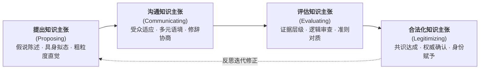

# Argument_Kelly_Licona_2018_EpistemicPractices

---

## 研究问题

在以往的科学史、科学哲学与科学教学（History, Philosophy, and Sociology of Science and Science Teaching, HPS&ST）传统中，研究视野大多局限于规范性的历史与哲学考察，而来自认知科学、科学社会学、科学人类学与科学修辞学的实证研究长期被边缘化甚至遭到防范。科学教育界往往将认识论简化为抽象孤立的哲学信条，或是学生头脑中去情境的个人信念测验。格雷戈里·凯利（Gregory J. Kelly）与彼得·利科纳（Peter Licona）在本章中聚焦的核心问题是：如何汲取跨学科科学元勘关于“行动中的科学”（science-in-the-making）的实证洞见，克服传统教学将科学窄化为既定命题结论或机械“科学方法五步法”的教条弊端，从而在课堂教学中确立以微观共同体为基础的“[[Epistemic Practices|认识论实践]]”分析框架？（pp. 139–141, pp. 143–144）

> [!question]
> 当代科学教育应当如何突破“仅传授科学最终产物（products）”与“将认识论等同于个体孤立心智信念”的双重局限，把科学知识建构还原为其兼具社会组织性、话语交互性、情境制约性与学科规范性的“[[Epistemic Practices|认识论实践（epistemic practices）]]”？（pp. 139–141）

科学教育必须实现认识论知者主体的范式转移：从沉思式的笛卡尔孤立个体，彻底转向在微观话语协商中确立何者算作证据与知识的社会共同体。

> [!claim] 核心主张
> 科学教育的核心目标不仅在于掌握命题性结论，更在于引导学生作为微观协商共同体成员，深入参与提出（propose）、沟通（communicate）、评估（evaluate）与合法化（legitimize）知识主张的“[[Epistemic Practices|认识论实践]]”；这一实践过程内生具有交互生成性、多尺度情境性、历史互文性与制度后果性，能够在探究科学、工程设计与社会科学性议题（Socioscientific Issues, SSI）等多元学科情境中赋予学生反思性证据裁决能力，从而真正落实面向公共领域的批判性科学素养。（pp. 140, 148, 156–158, 161）

本章为解析课堂科学微观话语、学科异质性与学生科学身份建构提供了系统的分析透镜。

> [!concept-lens] 阅读透镜
> - **对象** K-12 与高等教育科学课堂、中学物理简谐振动实验小组、小学三年级太阳能工程设计团队、大学地质学板块构造论文论证文本，以及社会科学性议题公共辩论场景。
> - **张力** 规范性哲学主张（追求普遍理智标准）与描述性社会实践（实际科学活动的情境偶然性与修辞协商）之间的张力；普适线性“科学方法五步法”与高度异质分化的具体学科认识论实践之间的断裂。
> - **贡献** 提出并实证阐明了认识论实践的四维行动框架（提出、沟通、评估、合法化）与四大本体特征（交互性、情境性、互文性、后果性），系统复刻了三大教育取向在三大学习目标与认识论规程上的结构矩阵，为解构教条主义科学观、奠基批判性公共科学素养确立了实践哲学根基。

---

## 理论框架

作者整合学习科学、科学元勘与课堂话语分析，建立了三位一体的跨学科理论分析框架：

> [!framework-table] 理论工具箱
> | 理论来源 | 代表学者 | 核心命题与分析工具 | 本章角色与理论功能 |
> |---|---|---|---|
> | **三维科学教育目标论** | Richard Duschl (2008) | 科学教育必须系统平衡并有机整合概念（conceptual）、认识论（epistemic）与社会（social）学习目标，三者相辅相成，不可割裂。（pp. 140–141） | 作为全文组织科学教育实践的顶层架构，坚决反对单纯以概念记忆为中心的片面灌输教学。 |
> | **社会知识认识论与批判规范** | Helen Longino (1990, 2002) | 认识论主体是社会群体而非孤立个体；科学知识通过公共论坛（venues）、吸收批评（uptake）、公认标准（standards）与平等智识权威（equality of intellectual authority）确立。（p. 148） | 为课堂认识论实践提供规范性准则，防止科学社会学实证视角滑向无原则的相对主义与主观虚无。 |
> | **修辞学与科学流派分析** | Charles Bazerman (1988); Alan Gross (1989) | 科学证据是通过特定体裁（genres）与文本互文（intertextuality）结构化呈现的，知识主张通过修辞协商在社会论坛中获得说服力。（pp. 146, 158–159） | 提供分析学生实验报告、工程方案辩护与地质学专业论文证据层级规范的文本分析工具。 |
> | **语言游戏与实践认识论** | Ludwig Wittgenstein (1958); Per-Olof Wickman (2004) | 意义在生活形式与实际行动的语言游戏中生成；通过群体默认的“立足点”（stand fast）与遭遇挑战的“意义裂隙”（gaps）刻画行动中的认识论。（pp. 149–150） | 支撑对课堂微观话语互动的微观民族志分析，揭示参与者如何在即时互动中定义“何者算作有效观察与合法知识”。 |

> [!warrant]- 理论如何支撑论证
> 理论工具箱将宏观哲学规范与微观经验语料紧密锁合：理查德·杜施尔（Richard Duschl）的三维目标论确立了认识论在课程论中的本体合法性；海伦·朗基诺（Helen Longino）的社会认识论准则为课堂话语协商提供了防范相对主义的规范航标；查尔斯·巴泽曼（Charles Bazerman）的修辞学工具使质性研究者能够穿透文本表层解剖证据层级；而维特根斯坦（Ludwig Wittgenstein）与佩尔-奥洛夫·威克曼（Per-Olof Wickman）的语言哲学则将分析焦点牢牢锚定在课堂原生态的互动话语链条之中。

---

## 研究方法

本章属于兼具元理论建构与多案例比较特征的分析性综述研究，通过对作者团队长期微观实证语料的横向综合展开概念提炼：

> [!method-panel] 研究设计
> | 模块 | 材料与处理方式 |
> |---|---|
> | **方法路径**<br>Interactional Ethnography & Discourse Analysis | 结合科学元勘综述与微观交互人种志（Interactional Ethnography）及质性[[Discourse Analysis\|话语分析]]（Discourse Analysis）。重点考量口头与书面语言、符号系统、副语言特征（prosody）与具身手势（embodied actions）。（pp. 139, 144–147） |
> | **案例综合**<br>Multi-Case Comparative Synthesis | 横跨 K-12 与高等教育学段，综合对比四项具有代表性的原生态课堂微观人种志实证案例，涵盖物理探究、工程设计、地质写作与教师元话语。（pp. 144–147） |
> | **学科矩阵分析**<br>Disciplinary Matrix Comparison | 针对“探究式科学（Inquiry Science）”、“工程教育（Engineering Education）”与“社会科学性议题（Socioscientific Issues, SSI）”三大实践取向，在三大学习目标与四维认识论实践两个层次上系统编制跨学科比较矩阵。（pp. 142–143, 156–157） |

> [!sample-panel]- 样本与材料快照
> | 案例来源与学段 | 核心学科与任务场景 | 材料形态与分析聚焦 |
> |---|---|---|
> | **物理实验小组**<br>(Kelly et al., 2001) | 高中物理学段：弹簧振子简谐振动实验 | 微观摄像转录、实时微机位移与速度波形图、学生具身模仿手势、语言互动序列（pp. 144–145） |
> | **技术工程团队**<br>(Kelly & Brown, 2003) | 小学三年级：设计可实际运作的太阳能烹饪/集热装置 | 小组头脑风暴记录、工程草图、原型迭代测试、全班汇报展示与面向“科学小记者”的辩护话语（pp. 145–146） |
> | **专业地质写作**<br>(Takao & Kelly, 2003) | 大学本科海洋地质学：撰写板块构造证据论证学术论文 | 真实学生学期论文文本、地质测量数据图表（震源深度、地磁条带）、认识论层级（EL）编码（p. 146） |
> | **科学身份塑造**<br>(Reveles et al., 2004) | 小学三年级双语/城市课堂：物质状态与自然现象探究 | 教师 Cordova 全程课堂录像、师生师幼话语转录、对谈话进行反思的“元话语（meta-discourse）”（pp. 146–147） |
> | **重力与地球观念**<br>(Lidar et al., 2010) | 小学阶段：地球形状与重力作用机制探究 | 学生小组对话转录、操作天球仪与平面地图的具身互动、实践认识论分析（PEA）编码（p. 150） |

---

## 论证结构

作者沿着“认知主体范式转移 ➔ 认识论实践四维模型 ➔ 四大本体特征确立 ➔ 学科异质矩阵对比 ➔ 解构方法神话与未来进路”五大逻辑步骤展开严密推导。

> [!logic-map]- 核心论证逻辑链
> ```mermaid
> flowchart TD
>     Step1["步骤一：认识论主体的范式转移<br/>(笛卡尔孤立知者 ➔ 微观社会协商共同体)"] --> Step2["步骤二：认识论实践的四维行动模型<br/>(提出 ➔ 沟通 ➔ 评估 ➔ 合法化)"]
>     Step2 --> Step3["步骤三：四大本体特征的理论确立<br/>(交互生成、多尺度情境、历史互文、制度后果)"]
>     Step3 --> Step4["步骤四：学科认识论实践的异质分化<br/>(探究科学 vs. 工程设计 vs. 社会科学议题)"]
>     Step4 --> Step5["步骤五：解构科学方法神话与重构素养<br/>(走向反思性元话语与实践认识论分析)"]
> ```

---

### 论证步骤一　认识论主体从笛卡尔孤立知者向微观社会协商共同体实现范式转移

传统认识论长期预设了一个沉思式、去社会化的笛卡尔认知主体；然而跨学科科学元勘的大量实证成果表明，真实世界中的科学知识从未脱离微观共同体的协同实践。（pp. 139–140）

> [!claim] 步骤一核心主张
> 知识建构的认识论主体并非孤立沉思的个体知者，而是具有特定社会文化规范与历史传统的微观实践共同体；科学教育必须走出个体信念测验的狭隘视野，转向考察群体如何在互动中决定何者算作有效知识。（pp. 140, 147–148）

#### 1. 笛卡尔知者假说的局限与科学元勘的实践转向

在以往研究中，关于学生“认识论”的考察普遍被等同为个人心理构念，即通过去情境化的问卷或访谈测量个体心智中的“认识论信念”（如知识是绝对的还是相对的）。这种研究取向承袭了笛卡尔主义的哲学预设，将认知过程封闭在孤立个体的大脑之内，彻底割裂了知者与具体实践情境的血肉联系。（pp. 140, 147）

科学元勘（包括认知科学、科学社会学、科学人类学与科学修辞学）的研究有力打破了这一神话：真实科学共同体中的知识并非个人顿悟的产物，而必须在实验室组会、同行评审、学术会议及实验仪器操作等公共论坛中经历苛刻的社会审议与论辩。

> [!row-contrast] 认识论主体范式的根本转向
> | 比较维度 | 传统个体认识论范式（Cartesian Subject） | 社会实践认识论范式（[[Epistemic Practices]]） |
> |---|---|---|
> | **核心知者** | 孤立的个体认知者、心理学被试 | 处于具体历史情境中的微观协商共同体 |
> | **知识属性** | 头脑中心智表征、去语境的命题信念 | 在话语互动中被提出、沟通与辩护的动态行动 |
> | **有效性基准** | 个体心智与客观外在实在的符合度 | 共同体成员公认标准、审议规程与合理批评的吸收 |
> | **教育考量** | 概念记忆测试、标准化问卷测量（如 VNOS） | 引导学生参与真实科学文化与学科论辩实践 |

#### 2. 对科学社会学戒心的三重辨析：区分描述实践与规范目标

在科学教育界，引入科学社会学往往会引发激烈的防范与争议，学者们担忧揭示科学的社会建构与偶然性会滑向相对主义，从而动摇科学教学的理性根基（Koertge, 1998; Slezak, 1994a, b）。凯利与利科纳针对这一批评提出了三点坚决的澄清与辩护：（pp. 143–144）

> [!proc] 解构对科学社会学戒心的三重学术辩护
> 1. **区分描述性实践记录与规范性教育目标** 记录科学活动中的实际社会互动并不等同于将所有实际行为直接奉为教育法则。教育目标依赖于规范性伦理考量，实证研究旨在拓展我们对知识生成机制的理解，而非盲目复制职业科学家的所有竞争行为。
> 2. **立足教育学视角审视科学元勘** 教育理论吸纳科学社会学是为了揭示认知文化的内部运作逻辑（如文本修改、实验操作、同行审议），这些洞见能够为课程设计提供生动滋养，而无须背负认识论相对主义的极端包袱。
> 3. **人种志方法论对学校研究的模型借鉴** 科学元勘考察“行动中的科学”（science-in-the-making）的人种志进路，为教育研究考察课堂中“何者在当下被算作知识”提供了极为强大的方法论参照。（pp. 143–144）

> [!warrant]- 推理桥梁：从个体心智信念向社会实践规程的飞跃
> 一旦将认识论主体定位于微观共同体，科学教育的重心便发生根本位移：学习科学不再是单纯记忆已固化的教科书公理，而是学会参与特定认知文化的话语实践，掌握该共同体用以产生、检验与确立知识的社会规程。

---

### 论证步骤二　认识论实践由知识主张提出、沟通、评估与合法化的四维行动链条动态构成

在确立了微观共同体这一主体基石后，作者将群体围绕知识展开的核心活动系统形式化为四维行动模型。（pp. 144–147）

> [!claim] 步骤二核心主张
> [[Epistemic Practices|认识论实践]]是群体成员提出、沟通、评估与合法化知识主张的社会组织性与互动实现性方式；这四大行动维度相互嵌套交织，在课堂真实语料中展现为具体的言语、具身与文本互动过程。（pp. 140, 144–147）



#### 1. 认识论实践四维行动模型及其课堂实证微观复原

作者深入结合团队长期积累的四项原生态微观人种志与课堂话语实证案例，逐一细致复原这四个维度的微观运作机制：

##### 提出知识主张（Proposing）：简谐振动物理实验案例（Kelly, Crawford, & Green, 2001）
在高中物理课堂中，四个协作小组利用弹簧振子与超声波微机运动传感器（MBL）研究周期振荡运动。计算机实时生成的位移-时间与速度-时间图像具有显著的“解释灵活性”（interpretative flexibility，借用 Knorr-Cetina, 1995 的概念）。（pp. 144–145）
- **语料微观细节** 面对复杂的波形图，学生最初的理解充满了不成熟的“错误起步”（false starts）与犹豫猜想。他们通过激烈的身体手势（用手掌在空中模仿弹簧振子的上下起伏运动，将身体动觉与屏幕波峰波谷进行对齐），并结合手头的实验指导手册提出初步解释。
- **认识论机制** 科学发现从来不是直接读出真理的过程，正如同行天文学家发现脉冲星时所经历的具身实践一样（Garfinkel et al., 1981）。这些粗粒度的、充满试错的知识主张，正是启动群体共同体审议、聚焦探索方向不可或缺的认知支点。

##### 沟通知识主张（Communicating）：小学三年级太阳能装置工程设计案例（Kelly & Brown, 2003）
小学三年级学生被要求运用热学与光学科学原理，团队合作设计并制作可实际运转的太阳能集热/烹饪装置。（pp. 145–146）
- **语料微观细节** 学生被置于高度分化的多重言语情境（speech situations）中：在小组内，他们需要就铝箔纸与黑纸的摆放角度展开头脑风暴并协商设计妥协；在全班汇报中，他们需要向同伴阐述装置的工作逻辑；面对扮演“科学记者”的访谈学生，他们必须系统总结装置在阳光下的升温测试数据并回答质疑。
- **认识论机制** 沟通并非在思维完成之后单纯添加的“外在包装”，而直接构成了知识生成的核心中介。学生必须学会根据受众特征、情境期待与材料约束不断修正措辞，这与职业科学家在撰写论文和同行辩护时所付诸的修辞努力完全同构（Bazerman, 1988）。

##### 评估知识主张（Evaluating）：大学海洋地质学板块构造论文论证案例（Takao & Kelly, 2003）
大学本科生在海洋地质学课程中，被要求利用真实的全球地质观测数据集撰写学术论文，系统论证特定区域的板块构造演化。（p. 146）
- **语料微观细节** 高水平的科学论证表现为一种高度专门化的学术体裁（genre）。作者开发了认识论层级（Epistemic Level, EL）分析工具，发现优秀的论证必须从低推论的经验事实（如深源地震震源带倾斜分布、洋脊两侧对称地磁条带数据），平稳有序地过渡到中阶经验概括（如贝尼奥夫带倾角、海底扩张速率），最终收束于高阶理论命题（如岩石圈板块俯冲驱动机制）。
- **认识论机制** 评估不仅关乎逻辑有效性，更关乎证据对主张的体裁支撑结构。研究揭示了一个极其深刻的现象：即便是经验丰富的高年级研究生助教，也往往很难显性道出为何某篇学生论文“论证更有说服力”，这一体裁评价标准往往是默会存在的。话语分析使得原本隐秘的证据评估规范变得清晰可见。

##### 合法化知识主张（Legitimizing）：小学三年级科学课堂教师元话语案例（Reveles, Cordova, & Kelly, 2004）
在城市多元文化小学的科学探究课堂上，科尔多瓦（Cordova）老师引导学生就物理与地球科学现象确立科学解释的合法权威。（pp. 146–147）
- **语料微观细节** 教师并不直接宣布谁对谁错，而是创造性地运用“元话语（meta-discourse）”（即“关于谈话的谈话”）。当学生通过观察提出假设时，教师立即介入点评：“大家注意到了吗，刚才马里亚在反驳时调用了我们昨天测量的温度数据，这正是专业科学家在面对分歧时所采取的做法。”
- **认识论机制** 在基础教育情境中，合法化知识的核心功能在于塑造学生的“科学学术身份（science identity）”。与职业科学界通过学术期刊出版、激烈论辩甚至利益博弈的合法化路径不同（Latour, 1987; Myers, 1997），课堂中的合法化赋予了来自边缘背景的学生以智识发声权，使其坚信自己能够像科学家一样有理有据地参与知识建构。

#### 2. 知识主张生成演进的三重动态情境：发现、辩护与全流程沟通

传统科学哲学（如波普尔）严格割裂了“发现的情境（context of discovery）”与“辩护的情境（context of justification）”，并将前者贬为不可捉摸的心理学直觉，仅将后者视为哲学的唯一正统对象。作者指出这一两分法严重脱离了科学实践，并系统重构了三重情境模型：（p. 147）

> [!quad-grid] 知识主张生成与审议的三重情境架构（p. 147）
> - **发现的情境（Context of Discovery）** 充满试错、困惑、意外与假说修正。该情境让学生深切体会实验仪器如何运作、经验观察如何受到文化经验的渗透（Norman, 1998），以及假说如何在动态探索中不断调整。
> - **辩护的情境（Context of Justification）** 强调严密的推理桥梁与证据支持。该情境让学生学习如何调动经验数据为理论主张提供系统辩护，理解理论如何在历史长河中经历公认标准的严苛审视（Duschl & Grandy, 2008）。
> - **沟通与呈现的情境（Context of Communication & Presentation）** 贯穿于探究的全过程，而非探究结束后的被动报告。从构思假说、小组争辩到修改手稿，知识主张无时无刻不在根据潜在受众的修辞期待进行权衡与调整。
> - **情境共生与转化机制** 发现、辩护与沟通绝非前后相继的单向流水线，而是在课堂日常实践中高频振荡、持续转化的有机整体。

---

### 论证步骤三　认识论实践内生具有交互生成、多尺度情境、历史互文与制度后果四大本体特征

为彻底杜绝将认识论实践异化为一套行为主义的、教条式的外在操作程序，作者在理论高度系统提炼出其四大本体特征：（pp. 156–159）

> [!claim] 步骤三核心主张
> [[Epistemic Practices|认识论实践]]是交互生成的（在集体行动中当场实现）、多尺度情境性的（同时嵌入即时情境与长时段文化传统）、历史互文性的（借由话语和符号连续传承）以及制度后果性的（直接决定何者为合法知识并分配身份权力）。（pp. 140, 156–159）

#### 1. 交互生成性与多尺度情境性：微观互动决策与宏观历史传统的交织

认识论实践决不能被还原为装在个体脑海里的认知算法，它必须在人与人、人与文本、人与仪器的原生态协作中当场生成（interactionally accomplished）。（p. 156）

> [!feature] 交互性与情境性：课堂即时决策与学科长期传统的尺度跨越
> - **交互生成性（Interactional）** 知识的产生是分布式、具身化的社会协同行动。在物理实验室中，同伴之间的争辩、手势动作的协调、以及面对传感器异常读数时的互质，共同决定了哪一项解释能够存活下来。（p. 156）
> - **多尺度情境性（Contextual）** 认识论实践同时跨越不同的时空尺度（Lemke, 2000; Wortham, 2003）。微观尺度上，学生面对实验中的异常数据（anomalous data）即时商讨是否舍弃或重测；宏观尺度上，这一即时决策受到科学历史上所积淀的实验报告体裁（Bazerman, 1988）、同行评审规程与测量文化模型的深刻制约。（pp. 156–158）

#### 2. 历史互文性与制度后果性：符号资源承接与学科共同体身份赋予

话语并非孤立自足的言语片段，每一次发声都深深嵌入在与过往文本的对话网络之中。（pp. 158–159）

> [!feature] 互文性与后果性：话语资源传承与学科共同体身份准入
> - **历史互文性（Intertextual）** 任何口头或书面表述都在持续指涉先前的文本、公式、符号与权威定义（Bazerman, 2004）。例如在社会科学性议题辩论中，学生援引生态学家发布的濒危物种数据或法律条文作为证据（Licona & Kelly, 2015），这种互文指涉将当下的碎片化谈话整合进具有历史深度的共同体经验之中。（pp. 158–159）
> - **制度后果性（Consequential）** 认识论实践具有深刻的社会与政治后果。哪些证据类型被判定为“合法的”、哪些推理方式被排斥为“无关的”，直接关涉到文化资本与权力的微观分配（Kelly, 2016）。它决定了边缘群体的原初知识资源能否获得学科共同体的承认，深刻形塑着学生的科学认同与学业命运。（p. 159）

> [!chain-link] 认识论实践从微观话语生成到宏观社会认同的因果推导链
> - **前提：微观互动情境** 学生在课堂微观场景中面对物理材料与仪器符号展开话语协商。（p. 156）
> - **机制：多尺度互文锚定** 协商过程调用科学史上积淀的公认概念体系与体裁规范，实现跨时空经验对接。（pp. 158–159）
> - **结果：知识合法化与身份生成** 群体就何者算作知识达成裁决，最终产生具有制度后果的科学学科归属感与主体赋权。（p. 159）

---

### 论证步骤四　学科认识论实践具有领域异质性，探究科学、工程教育与社会科学议题在目标与规程上深度分化

科学决非均质划一的铁板一块。作者严厉批评了科学教育界普遍存在的“普适科学方法论”幻想，明确指出不同的学科传统与教学取向在概念、认识论与社会性目标上存在着深刻的结构异质性。（pp. 141–143, 155–158）

> [!claim] 步骤四核心主张
> 探究式科学、工程教育与社会科学性议题（SSI）在概念、认识论与社会性目标及四维行动规程上高度分化，根本不存在脱离具体学科领域的抽象“普适科学过程技能”。（pp. 142–143, 155–157）

#### 1. 三种教学取向在概念、认识论与社会学习目标上的结构分化

作者系统编制了表 5.1，横向解剖三种主流取向在杜施尔三维学习目标上的分化面貌：

> [!row-contrast] 表 5.1 三种科学教学取向在三大学习目标上的侧重差异（p. 143 原书完整复刻）
> | 学科取向（Disciplinary Approach） | 概念目标（Conceptual） | 认识论目标（Epistemic） | 社会实践目标（Social） |
> |---|---|---|---|
> | **科学探究<br>（Science）** | 构建并理解用于表征和阐释自然世界的合理模型（Kelly, 2014b） | 理解概念知识与理论模型的理由依据及证据基础（Longino, 2002） | 识别认知文化用以生成、交流和评估知识主张的专门规程（Kelly, 2014a） |
> | **工程教育<br>（Engineering）** | 针对特定应用目的设计、分析和构建工程模型与技术方案（Cunningham & Carlsen, 2014） | 理解并优化技术系统的功能运作，确立衡量成功与约束的证据基准 | 识别工程设计与分析团队所遵循的协作程序，明确客户在生成与评估设计中的核心角色 |
> | **社会科学议题<br>（Socioscientific Issues）** | 构建并理解科学概念，同时综合考量道德、伦理、个人与宗教等多重视角（Sadler, 2004） | 统合多元视角（科学、伦理、经济等），构建支持争议性立场的连贯推理链 | 掌握在争议性议题中支持特定立场时，生成、交流和评估多元论据的公共审议程序（Zeidler, 2014） |

#### 2. 四维认识论实践在三大取向中的矩阵清单与跨情境对照

在微观操作层面上，四类认识论实践在三种取向中被赋予了截然不同的行动内容。作者系统构建了全章最核心的操作性框架表 5.2：

> [!row-contrast] 表 5.2 三种科学与工程教育取向中的认识论实践矩阵（pp. 156–157 原书完整复刻）
> | 认识论实践维度 | 探究式科学（Inquiry Science） | 工程教育（Engineering Education） | 社会科学议题（Socioscientific Issues） |
> |---|---|---|---|
> | **提出主张<br>（Propose）** | - 提出科学探究问题<br>- 设计探究方案以回应问题<br>- 开展具身与仪器观察<br>- 设想探究所需的相关证据基础<br>- 构建并迭代修正理论模型 | - 识别实际工程与技术问题<br>- 在具体生活情境中审视工程问题<br>- 综合应用科学概念与工程逻辑<br>- 应用数学建模与定量推理<br>- 设想多种竞争性备选方案<br>- 保持坚韧并在设计失败中学习迭代<br>- 运用全局系统思维（systems thinking） | - 提出跨领域综合问题（兼涉科学、经济、道德、宗教与生态）<br>- 设计多元调查方案以探寻答案<br>- 权衡并协调多元推理线索<br>- 预先构建反驳与抗辩论据（rebuttal） |
> | **沟通主张<br>（Communicate）** | - 发展严密的科学推理链条<br>- 为知识主张提供学科特异的论证辩护<br>- 撰写规范的科学解释（实验报告）<br>- 进行口头科学阐释与现场辩驳<br>- 基于证据与推理建构因果说明 | - 在工程项目团队内部开展高效协同沟通<br>- 针对既定物理与成本约束为设计方案辩护<br>- 面向委托客户（client）进行专业汇报与展示 | - 基于实地与文献调查构建证据网络<br>- 明确阐述个人或群体的价值与政策立场<br>- 基于证据与价值考量构建多重复合论据<br>- 开展公众演讲与正式论辩陈述<br>- 深入参与角色扮演（role-play）与公共辩论 |
> | **评估主张<br>（Evaluate）** | - 评估科学主张、证据或模型的效度与优缺点<br>- 审视科学推理链条的逻辑严密性<br>- 评估科学解释对异常数据的包容度<br>- 严谨考量竞争性的备择解释（alternatives） | - 在设计指标与物理/成本约束之间进行权衡取舍（tradeoffs）<br>- 运用测试数据驱动工程方案的优化决策<br>- 评估技术约束与委托客户实际需求的契合度 | - 评估科学事实主张的有效性与内在局限<br>- 评估多元证据效力（界定何者在道德、伦理或科学上算作有效证据）<br>- 审视跨学科推理链条的融贯性与偏见<br>- 对论辩体系进行全局整体性评估 |
> | **合法化主张<br>（Legitimize）** | - 就科学合理的因果解释建立群体共识<br>- 赋予最符合既有公认科学理论的解释以权威价值<br>- 寻求相关学科认识论共同体的正式承认 | - 综合权衡工程技术方案的多维社会后果<br>- 做出基于坚实数据证据的工程决策<br>- 获得委托客户对技术方案落地成功的最终确认 | - 在公共论争中建立对最具说服力论据的广泛共识或审议接纳<br>- 承认辩论各方所持价值立场的正当性与合法合理性 |

#### 3. 典型议题对质剖析：转基因作物（GMO）在三大取向下的问题逻辑与证据裁决分化

为了鲜活展现上述抽象矩阵的实际张力，作者以“转基因玉米（GMO Corn）”为例，深刻演示了相同科学对象在不同取向中所激发的认识论实践断裂：（pp. 154–155）

> [!tension-table] 转基因玉米在探究、工程与 SSI 取向下的认识论实践对质（pp. 154–155）
> | 维度 | 探究式科学（Inquiry Science） | 工程教育（Engineering Education） | 社会科学议题（SSI Approach） |
> |---|---|---|---|
> | **核心驱动问题** | “转基因玉米在控制光照下是否比野生原种生长得更好？” | “如何改良玉米性状以满足特定抗旱与低成本加工的工业约束？” | “是否应该允许将实验室制造的转基因玉米大规模引入自然生态系统？” |
> | **证据范围边界** | 仅限于生物学受控实验测得的株高、生物量与病虫害抗性数据。 | 限于材料物理属性、基因编辑成功率、生产成本与农机适配度。 | 突破纯自然科学范畴，纳入生态风险、跨国种业垄断经济学、食品安全伦理及宗教自然观。 |
> | **有效推理准则** | 遵循单因子变量控制与统计显著性检验。 | 追求多约束条件下的帕累托最优解与系统健壮性。 | 综合权衡不可通约的价值立场，在公共协商中寻求程序正义与民主共识。 |

---

### 论证步骤五　解构线性“科学方法”神话，以实践认识论分析与反思性元话语奠基公共科学素养

在全章收束部分，作者将认识论实践模型上升至科学素养与实践哲学的重构高度，对传统科学教育的顽固弊端展开根本清算。（pp. 149–154, 159–161）

> [!claim] 步骤五核心主张
> 必须彻底破除将科学方法化约为五个线性步骤的教条神话，依据家族相似性展现多元科学文化；同时，仅靠“动手探究”无法自发形成健全的科学本质理解，教师必须介入反思性元话语，方能将实践参与转化为面向民主社会的批判性公共科学素养。（pp. 144–145, 150–154, 161）

#### 1. 学科认识论的“家族相似性”对刻板“科学方法五步法”的解构

传统中小学教材普遍充斥着所谓“提出假设 ➔ 设计实验 ➔ 搜集数据 ➔ 分析论证 ➔ 得出结论”的“科学方法五步法”或是僵化的八项孤立技能清单。作者借用维特根斯坦（1958）的“家族相似性（family resemblance）”概念（Irzik & Nola, 2011），指出各大自然科学门类在活动、价值、方法与产物上存在家族相似，但在本体与认识论规程上存在巨大鸿沟：（pp. 150–152）

> [!critique-method] 科学方法的线性教条与跨学科认识论异质性
> - **地球与空间科学的“回溯推测”（Retrodiction）** 地质学与古生物学并不致力于通过受控实验预测未来，而是回溯推测远古历史事件。地质学认识论的核心在于管理证据的内在歧义性，寻找多条相互独立且相互收敛的证据链条，并在超宏观的时空尺度上进行系统外推（Ault, 1998）。
> - **化学科学的粗粒度模型与半经验定律** 化学领域的“定律”（如元素周期律）并不像物理学万有引力定律那样具备公理化、完全可演绎的严谨数学形式，化学教育高度依赖定性构念与模型化解释（Erduran, 2007; Erduran & Duschl, 2004）。（p. 152）
> - **生命科学的概率性与决定论张力** 在遗传学教学中，学生必须超越机械的决定论因果观，学会应对概率论逻辑与复杂的多因子互作，这种证据评估能力直接决定了公民能否理性面对商业基因筛查等社会伦理争议（Jiménez-Aleixandre, 2014）。（p. 151）

#### 2. 实践认识论分析（PEA）的操作机理与教师显性元话语的不可替代性

科学教育界长期流行一种浪漫主义信念，即只要让学生亲身投入动手探究（hands-on inquiry），就能自发领悟[[Nature of Science|科学本质]]（NOS）。桑多瓦尔（Sandoval, 2005）的实证研究早已粉碎了这一幻觉：学生在动手操作中往往只发展出支离破碎的、高度局限于局部情境的“实用认识论”，根本无法自发上升为连贯的科学方法论自觉。（pp. 153–154）

作者为此引介了威克曼等人的**实践认识论分析（Practical Epistemological Analysis, PEA）**，并强调教师反思性元话语的决定性干预价值：（pp. 149–150, 153–154）

> [!proc] 实践认识论分析（PEA）的微观运作机理（pp. 149–150, 154）
> 1. **识别立足点（Stand Fast）** 群体在当前对话中不言自明、达成默会共识的概念与常识。
> 2. **遭遇意义裂隙（Encounter Gaps）** 当遭遇新现象、反常数据或仪器测量障碍时，原有默会共识出现中断。
> 3. **搭建关系桥梁（Build Relations Across Gaps）** 学生调动物体教具、已有生活经验与语言资源，跨越理解鸿沟，建立新的意义关系（如 Lidar et al., 2010 在关于地球引力与南半球人为什么不掉落的讨论中，儿童通过转动天球仪与地图修补理解裂隙）。
> 4. **介入反思性元话语（Engage Meta-Discourse）** 教师必须发起“关于谈话的谈话”，引导学生显性审视：“我们刚才为什么信任这个数据？”“我们是如何排除备择假设的？”通过显性反思将隐性实践编码为长久的科学认知素养。

在引导课堂公共协商时，作者倡导将朗基诺（Helen Longino, 1990, 2002）的四大社会知识建构规范创造性地移植入科学课堂：（p. 148）
- **公共论坛（Venues）** 在教室中制度化设立公开审查与辩驳证据的研讨会及海报展示平台；
- **吸收批评（Uptake）** 鼓励学生根据同伴合理的反驳与质疑主动修正自身主张；
- **公认标准（Standards）** 师生共同商定评价证据说服力与模型效度的明确准则；
- **平等智识权威（Tempered Equality of Intellectual Authority）** 消除教师专制灌输，保障每个学生拥有基于证据与逻辑发声的平等学术权利。

#### 3. 认识论实践视阈下科学教育研究的四大前沿进路

最后，作者为科学教育领域的后续探索勾勒了四条具有开创性的研究进路：（pp. 159–161）

> [!ref-table] 科学教育认识论实践未来研究的四大开拓方向（pp. 159–161）
> | 研究方向 | 核心理论命题与探究问题 | 实践与政策意涵 |
> |---|---|---|
> | **认识论实践的学习进阶**<br>(Learning Progressions) | 考察认识论实践（如提出假说、质询证据）如何与具体领域的概念知识形成共生演进；研究学生在不同认知发展阶段的实践轨迹。 | 指导中小学跨年段科学与工程课程标准的进阶编排，防止技能与内容脱节。 |
> | **学科异质性与跨领域迁移**<br>(Disciplinarity & Transfer) | 探究学生在一个科学领域（如流行病学异常数据识别）获得的认识论实践，能在多大程度上迁移至异质学科（如大气科学）。 | 评估跨学科 STEM 整合教学的真实认识论效能，界定领域通用与领域特异的边界。 |
> | **多语言与多元文化认知资源**<br>(Cultural & Linguistic Diversity) | 考察来自少数族裔或多语言背景的学生如何将家庭与社区的“原生态知晓方式（funds of knowledge）”转化为合法课堂资源。 | 推进全包容性科学教育，为非主流文化背景学习者提供通往科学认知文化的有效桥梁。 |
> | **民主公民审议与公共决策**<br>(Civic Participation & Epistemic Agency) | 探究通过实践参与培育的证据反思能力，如何助力公众在面对气候变化、公共卫生等现实危机时进行批判性理性决断。 | 弘扬[[Enlightenment\|启蒙运动]]的核心理性遗产，通过理性说服而非盲目偏见巩固民主社会机质。 |

---

## 主要发现

> [!finding-cards] 核心发现
> 1. **认识论主体是微观实践共同体而非孤立个体** 科学元勘实证研究表明，决定何者算作知识取决于相关群体模式化的社会审议过程；将科学教育视作将新手社会化吸纳进特定认知文化（epistemic cultures）的实践过程。（pp. 140, 147–148）
> 2. **认识论实践由四维动态行动架构系统界定** 知识主张的提出（Proposing）、沟通（Communicating）、评估（Evaluating）与合法化（Legitimizing）构成课堂互动的核心行动链条，贯穿于发现、辩护与全流程沟通三重情境。（pp. 144–147）
> 3. **认识论实践内生具有四大本体特征** 实践是当场协同实现的（交互生成性）、嵌入多尺度时空传统的（情境性）、借由符号系统持续传承的（历史互文性）以及涉及权力分配与身份赋予的（制度后果性）。（pp. 156–159）
> 4. **三大教学取向展现出深刻的学科认识论异质性** 探究科学（探求自然解释）、工程设计（多约束优化）与社会科学议题（多元价值平衡）在核心问题、证据边界与裁决准则上不可通约，彻底粉碎了“通用科学过程技能”的神话。（pp. 142–143, 154–157）
> 5. **单纯动手探究无法自发形成健全认识论，必须依赖显性反思元话语** 学生在原生态操作中常形成零散的实用认识论，教师必须运用“关于谈话的谈话（meta-discourse）”，并植入公共论坛、吸收批评与平等权威等社会规范，方能孕育公共科学素养。（pp. 146–148, 153–154, 161）

---

## 关键引用

> [!citation-card] 论认识论主体的社会共同体转向
> 这项关于知识建构实践的实证研究所做出的核心贡献，是将对认识论主体的考量从个体的知者转向了相关的社会群体。这项研究补充了哲学界对基于或预设笛卡尔主体的认识论所存在的局限性的揭示。这一转变提示我们，有必要审视决定何者算作知识的社会过程，考虑意义的共同体理解，在历史与公共情境中评估思想，并认识到相关群体对知识主张进行评判的重要性。此类社会过程随着时间的推移逐渐模式化并形成惯例，演变为认识论实践。（p. 140）
>
> *A key contribution of this empirical work on the practice of knowledge construction is the shift in the consideration of the epistemic subject from the individual knower to that of a relevant social group. This research adds to the work in philosophy identifying limitations of epistemologies based in, or assuming, a Cartesian subject. This shift suggests the need to examine the social processes determining what counts as knowledge, to consider a communal understanding of meaning, to evaluate ideas set in historical and public contexts, and to recognize the importance of the assessment of knowledge claims by relevant groups. Such social processes can become routinized and patterned over time becoming epistemic practices.*

> [!citation-card] 论认识论实践的四维行动与本体特征界定
> 认识论实践是群体成员提出、沟通、评估和合法化知识主张的社会组织性与互动实现性方式。借鉴科学研究与教育研究的成果，本章主张认识论实践具有交互生成性（由人与人之间通过协同活动建构而成）、情境性（深深嵌入在社会实践与文化规范之中）、互文性（通过连贯的话语、符号与象征符号的历史网络进行沟通）以及后果性（被合法化的知识直接具象化了权力与文化）。正是通过应用这些认识论实践，共同体才为其知识主张提供了正当性辩护。（p. 140）
>
> *Epistemic practices are the socially organized and interactionally accomplished ways that members of a group propose, communicate, evaluate, and legitimize knowledge claims. Drawing from studies of science and education, this chapter argues that epistemic practices are interactional (constructed among people through concerted activity), contextual (situated in social practices and cultural norms), intertextual (communicated through a history of coherent discourses, signs and symbols), and consequential (legitimized knowledge instantiates power and culture). Through application of these epistemic practices, communities justify knowledge claims.*

> [!citation-card] 论解构刻板的“科学方法”与面向证据审议的科学素养
> 由于认识论实践依赖于特定领域与时代变迁（因知识生产所面临的挑战而不断改变），因此根本不存在一套封闭固定的“科学实践”。这与教育实践中常常将“科学方法”机械阐释为一套线性步骤的做法形成了鲜明对比。恰恰相反，在人类理解其经验的多元方式中，存在着各具特色的学科性（以及非学科性！）知晓方式。这里的核心宗旨绝不是去教条地规定一套固定的八项实践（如 NGSS 所列），也不是去机械推行科学方法的五个步骤；而是去识别人们如何形成认识，并体会以系统化方式理解世界以使证据向公共审查与评价开放的崇高价值。（pp. 144–145）
>
> *Since epistemic practices are field- and time-dependent (changing due to the challenges of knowledge production), there is not a limited set of “science practices.” This contrasts with how “the scientific method” is often interpreted in education as a set of linear steps. Rather, there are disciplinary (and other!) ways of knowing that vary across the multiple ways that humans make sense of their experience. The point is not to define a given set of eight practices (NGSS Lead States 2013), or the five steps of the scientific method. Rather, the idea is to identify the ways people come to know and recognize the value of making sense in systematic ways that render evidence open for public scrutiny and evaluation.*

> [!citation-card] 论科学教育的民主价值与公共审议理性
> 我们在本章中的核心论断是：参与认识论实践乃是稳健科学教育不可或缺的基石。参与认识论实践的必要性，在很大程度上源于汲取知识生产共同体的崇高价值：说服优于强制的价值、思想开放优于教条盲从的价值，以及审慎考量备选解决方案的价值等等。科学解释与论证并非纯粹的技术程序，因为它们不存在能够轻易被直接平移到科学教学法中的机械公式。通过将此类实践参与和精心设计的教学法深度交织，学生方能积聚充沛的认识论能力，在公共领域中作为有见识、有教养的现代公民积极发声。（p. 161）
>
> *Our argument in this chapter is that engagement in epistemic practices is an important part of a robust science education. Part of the need to engage in epistemic practices is to learn values of knowledge-producing communities – the value of persuasion over force, open-mindedness over dogma, and consideration of alternative solutions, and so forth (Rorty 1991). Scientific explanation and argument are not technical procedures, as they do not have specific formulas that can be translated easily to the pedagogy of science education. Through such engagement, connected to carefully organized pedagogy, students may build capacity to participate as informed citizens in the public sphere.*

---

## 自述局限

> [!warning]
> 原文作者明确指出的理论局限、实施边界与未来挑战包括：
> 1. **职业科学实践无法无缝直接平移至学校教育** 科学元勘所描绘的职业科学家实践充斥着极其残酷的利益竞争、同行倾轧与赢家通吃的敌对斗争（agonistic struggles），这些行为若直接复制到学校教育中将对学生的心理与道德发展造成严重损害。教育研究必须以伦理学、教学法与人类发展为上位准绳审慎过滤科学元勘成果，不可盲目照搬“本真性”（authenticity）（pp. 148–149）；
> 2. **概念知识与认识论实践的共生依赖** 认识论实践高度依赖特定领域的主体概念知识，缺乏扎实概念支撑的实践往往蜕变为无目的的机械盲动；然而二者在不同学段与主题下究竟如何协同演进，仍缺乏充分的经验数据支撑（pp. 159–160）；
> 3. **跨学科认识论实践的迁移边界未明** 学生在某一科学门类中习得的认识论能力（例如在流行病学数据分布中敏锐识别离群值与反常数据），究竟在多大程度上能够有效迁移到具有不同概念实体与公理结构的异质学科（如大气科学或工程设计），仍是一个悬而未决的实证谜题（p. 160）；
> 4. **教师实践认识论敏感度与教材权威惰性的冲突** 真实课堂中教师普遍高度依赖教材的线性步骤，在言谈中极易不自觉地运用确定性极高的绝对化措辞（hedges and boosters），不经意间向学生传递专制主义的科学形象，如何有效开展教师专业发展以扭转这一惯性仍属重大教学难题（pp. 153–154）。

---

## 来源

- [[books/Matthews(Ed.)_2018_Springer/Ch05_Kelly_Licona_2018|Ch05_Kelly_Licona_2018]]
