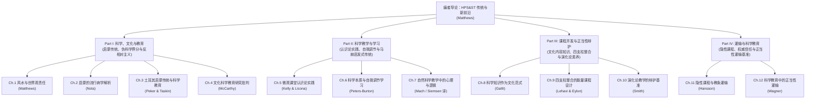

# Argument_Matthews(Ed.)_2018_Springer

---

## 编著定位

科学史、科学哲学与科学教学（History, Philosophy and Science Teaching, HPS&ST）领域自 19 世纪末恩斯特·马赫（Ernst Mach）创办第一本科学教育期刊以来，已积累逾一个世纪的研究传统。本编著作为 2014 年三卷本《科学史、哲学与科学教学国际手册》（*International Handbook of Research in History, Philosophy and Science Teaching*）的理论拓展与前沿深化，系统收录了 12 篇聚焦基础理论突破与应用深化的独立研究。

> [!volume-profile] 编著档案
> - **核心议题** 系统审视科学史、科学哲学与科学教学（HPS&ST）跨学科传统的最新发展，着重澄清科学教育对启蒙运动（Enlightenment）传统的历史承继、反思建构主义与后现代主义在文化科学教育研究中的相对主义困境，并将认识论探讨向微观课堂教学、课程结构设计以及防止教条灌输（indoctrination）深化。
> - **材料边界** 本总览页依据迈克尔·马修斯（Michael R. Matthews）撰写的导论（*New Perspectives in History, Philosophy and Science Teaching: An Introduction*，pp. ix–xxv）、全书目录体系以及各章核心论证提炼而成。
> - **章节关系** 全书采用“四板块、递进深化”的逻辑架构：由宏观维度的“科学、文化与启蒙传统”（Part I），转向中观维度的“科学教学与认知学习中的认识论实践”（Part II），继而落实为微观具体学科领域的“课程开发与正当性辩护”（Part III），最后上升至教育哲学维度的“教条灌输、隐性课程与反思能力”（Part IV）。
> - **使用方式** 本页作为全书知识结构的导航枢纽，确立全书核心议题与各章 Argument 的映射网络，指导后续分章的具体处理与跨章线索追踪。

---

## 编者问题与组织主张

编者指出，当代科学教育在国际化与大众化推进过程中，普遍面临过度技术化与工具化的危机：科学课程往往退化为孤立事实与公式的机械识记，而遗忘了科学知识生成的历史脉络与认识论根基。

> [!question] 编者问题
> 在后现代主义、相对主义世界观与去规范化的激进建构主义广泛侵蚀科学教育基础的背景下，科学教育研究者与一线教师应如何重新认识科学史与科学哲学（HPS）不可替代的奠基价值？科学教学应当如何超越单纯的知识灌输与技术培训，将学生引向具有理性反思、证据辩护与自我启蒙能力的现代公民世界观？（pp. ix–xii, p. xvi, pp. xxii–xxiii）

科学教育的根本目标绝不仅限于生产符合产业需求的技术工匠，而关乎整个社会的文化健康。

> [!volume-argument] 编者组织主张
> - **共同问题** 编者认为，任何明智且深刻的学科教学，都必然要求教师和课程开发者对所教学科的历史、认识论（epistemology）与本体论（ontology）具备清晰认识（p. x）。全书各章共同回应的核心命题是：科学是一种具有特定认识论规范与历史演进轨迹的人类文化成就，科学教学必须使学习者理解证据与主张之间的理性联结。
> - **组织逻辑** 编者将全书 12 篇论文划分为四个有机衔接的部分。首先在文化与历史哲学高度确立科学教育与启蒙传统的内在统一性，有力驳斥文化相对主义对科学客观性的消解（Part I）；接着打通认识论规范与教育心理学机制，探讨学生如何在微观共同体中掌握科学认识论实践与自我调节学习（Part II）；随后通过物理学（能量）与生物学（演化论）的具体教学设计，示范科学史哲如何为课程正当性提供四支柱支撑（Part III）；最终以教育哲学透视长期被回避的“灌输”难题，划定合法权威传递与教条灌输的边界（Part IV）（pp. xi–xxii）。
> - **整体贡献** 本书系统弥补了此前国际手册未能充分覆盖的研究盲区，特别是将启蒙运动（Enlightenment）传统、文化科学教育研究（CSSE）批判以及教育哲学中的教条灌输（indoctrination）问题确立为 HPS&ST 领域的标准分析范式，为科学教育捍卫客观理性与可错主义（fallibilism）立场提供了坚实的方法论支持（pp. x–xi, p. xvii, pp. xxi–xxiii）。

编者对现代科学教育与启蒙运动传统的紧密共生关系作出了明确界定。

> [!citation-card] 编者论科学教育的启蒙基石
> 绝大多数现代科学教育都在诉求并赞美植根于启蒙运动的承诺：证据的重要性；拒绝将简单权威作为认识论事务的仲裁者；随时准备修正观点与理论；承认学科之间的相互依存；为了促进个人与社会福祉而追求知识；抵抗政治、宗教和意识形态对课程开发与课堂教学的强加干预等等。这些承诺大都是在没有意识到其启蒙根源的情况下作出的。对于教育工作者而言，将这些当代承诺与其历史上的科学哲学基础联系起来，并意识到这些承诺历经时光所遭受的思想、政治与宗教冲击，是至关重要的。（p. xiii）
>
> *Overwhelmingly modern science education appeals to and extols Enlightenment-grounded commitments: the importance of evidence; rejection of simple authority as the arbiter of epistemic matters; a preparedness to change opinions and theories; recognising the interdependence of disciplines; pursuing knowledge for advancement of personal and social welfare; resisting the imposition of political, religious and ideological pressures on curriculum development and classroom teaching; and so on. These commitments are mostly made without awareness of their Enlightenment roots.*

---

## 全书结构与章节路线

全书由导论与四大结构板块组成，展现出从宏观文化世界观批判到课堂微观实践推进的严密学术逻辑。

> [!volume-structure] 全书结构
> - **Part I / Ch. 1–4 — 科学、文化与教育（Science, Culture and Education）** 回应科学教育在多元文化语境中的世界观定位问题。第 1 章以风水为例探讨科学与伪科学的界分及科学教育的文化责任；第 2 章从概念哲学角度澄清“启蒙”作为个体属性而非抽象名词的认识论内涵；第 3 章提供晚期奥斯曼帝国与土耳其共和国科学教育与启蒙传统的国别实证考察；第 4 章深入剖析文化科学教育研究（CSSE）的后现代建构主义起源及其认识论危机。（pp. xi–xvii）
> - **Part II / Ch. 5–7 — 科学教学与学习（Teaching and Learning Science）** 探讨科学认识论与学习心理学机制的深度融合。第 5 章基于科学研究（science studies）实证考察科学课堂中的认识论实践与共同体意义协商；第 6 章运用自我调节学习（SRL）理论系统桥接科学本质（NOS）教学的显性与反思性路径；第 7 章呈现恩斯特·马赫 1890 年论自然科学教学中心理与逻辑要素的开创性德文论文首个英文全译本。（pp. xvii–xix）
> - **Part III / Ch. 8–10 — 课程开发与正当性辩护（Curriculum Development and Justification）** 聚焦科学课程的内在逻辑建构与课程论证。第 8 章提出将科学知识视为一种文化系统并以文化内容知识（CCK）重塑物理学教学范式；第 9 章整合科学史、科学哲学、科学本身与科学教育研究（SER）四大支柱，展示以色列初中能量课程的实证设计方案；第 10 章批判演化论教学中流于功利的技术说辞，提出更具说服力且以学生为中心的演化素养论证集合。（pp. xix–xxi）
> - **Part IV / Ch. 11–12 — 灌输与科学教育（Indoctrination and Science Education）** 引入教育哲学经典概念重审科学教学规范性。第 11 章分析科学课堂隐性课程中所传递的歪曲科学形象与潜在的教条灌输机制；第 12 章在分析哲学层面上探讨科学入门学习中作为基准阈值的“正当性灌输”及其向独立反思怀疑的转化机制。（pp. xxi–xxii）

全书的四大板块与核心论证逻辑可通过如下结构流程直观呈现：

---

## 理论、方法与关键词

编者在各章导引中调动了跨学科的理论与方法分析工具，为科学教育的哲学研究确立了严密的分析框架。

> [!volume-tools] 理论与方法工具箱
> - **科学史、科学哲学与科学教学（History, Philosophy and Science Teaching, HPS&ST）** 贯穿全书的核心跨学科框架。它主张自然科学教学不能切断知识与历史发现情境、认识论辩护基础以及本体论假定的联系，强调通过历史启发与哲学反思提升教学品质。（p. ix, pp. xxii–xxiii）
> - **[[Nature of Science|科学本质（Nature of Science, NOS）]]** 全书的理论焦点之一。编者与各章作者既承认 NOS 研究在国际科学教育改革中的巨大推进作用，又着力克服传统清单式（consensus view）NOS 教学在认识论上的肤浅化与机械化倾向，呼吁转向更具反思性的深层机制。（p. x, pp. xvii–xviii）
> - **[[Enlightenment|启蒙运动（Enlightenment）]]与可错主义（Fallibilism）** 全书的规范性理论旗帜。编者坚持启蒙运动确立的证据优先、理性批判与普遍人权价值，并指出在绝对无误论（infallibilism）与虚无相对主义（relativism）之间，科学展现出一种严密的可错主义认知机制。（pp. xii–xiii, p. xvii）
> - **文化科学教育研究（Cultural Studies of Science Education, CSSE）与建构主义批判** 全书直面审视的当代流派。编者指明建构主义（constructivism）在认识论上的主观唯心主义陷阱，警告 CSSE 中滋生的后现代文化相对主义正在动摇科学真理的公共合法性。（pp. xv–xvii）
> - **认识论实践（Epistemic Practices）与自我调节学习（Self-Regulated Learning, SRL）** Part II 的核心机制工具。将认识论主体从笛卡尔式的孤立个体拓展为社会协商共同体，并在认知心理学层面利用 SRL 目标设定、监控与反思子过程落实科学思维培育。（pp. xvii–xix）
> - **文化内容知识（Cultural Content Knowledge, CCK）** Part III 提出的物理学课程重塑范式。将科学知识超越狭隘的公式解题体系，呈现为人类思想史上关于重量、光学等根本构念演化的文化全景。（pp. xix–xx）
> - **教条灌输（Indoctrination）与隐性课程（Hidden Curriculum）** Part IV 的规范分析工具。探讨当科学知识因远离直接感官经验而不得不依赖权威证言与第二手信息时，如何界定合法概念入门与歪曲灌输的规范性界限。（pp. xxi–xxii）

---

## 跨章主题线索

全书各章节跨越不同分支学科，但在若干根本哲学命题上展现出高度呼应的横向关联。

> [!cross-chapter] 跨章主题线索
> - **主题线索一：科学划界、启蒙理性与反相对主义的文化战役** 探讨科学教育如何划定伪科学界限并抵御文化相对主义侵蚀。
>   - **相关章节** Ch. 1 Argument_Matthews_2018_FengShui；Ch. 2 Argument_Nola_2018_EnlightenmentTruths；Ch. 3 Argument_Peker_Taskin_2018_TurkeyEnlightenment；Ch. 4 Argument_McCarthy_2018_CSSEAppraisal。
>   - **阅读价值** 本线索展现了理性辩护从抽象分析哲学（Nola 对“启蒙”属性的流行病学考察）、具体民俗迷信剖析（Matthews 对风水伪科学性的界定）、国别现代化政教冲突史（Peker & Taskin 对土耳其世俗教育的考察），到当代学术阵地清理（McCarthy 对 CSSE 内部后现代相对主义的严厉批判）的完整推进链条。
> - **主题线索二：认识论探究与微观学习心理机制的贯通** 探讨科学哲学中的认识论规范如何有效转化为学生课堂认知与思维习惯。
>   - **相关章节** Ch. 5 Argument_Kelly_Licona_2018_EpistemicPractices；Ch. 6 Argument_Peters-Burton_2018_NOSLearningSRL；Ch. 7 Argument_Mach_2018_PsychologicalLogicalMoment。
>   - **阅读价值** 从科学社会学与人种志观察中的微观话语实践（Kelly & Licona），过渡到教育心理学中自我调节学习理论与显性反思性 NOS 的深度平行对应（Peters-Burton），最终追溯至历史源头——马赫论科学教学中“心理发生优先于纯粹逻辑推演”的经典洞见，形成了科学教育认识论转向的立体透视。
> - **主题线索三：科学概念建构的四支柱模型与课程合理性辩护** 探讨学科核心概念（如力学构念、能量守恒定律、生物演化论）如何依托科学史哲完成课程重构与意义建构。
>   - **相关章节** Ch. 8 Argument_Galili_2018_ScientificKnowledgeCulture；Ch. 9 Argument_Lehavi_Eylon_2018_EnergyCurriculumHPS；Ch. 10 Argument_Smith_2018_EvolutionJustifications。
>   - **阅读价值** 克服科学课程单纯面向考试与升学的功利主义取向。Galili 阐明文化内容知识如何展现科学范式跃迁；Lehavi 和 Eylon 提出了整合“科学、科学史、科学哲学、科学教育研究”的四支柱课程研发模型；Smith 则揭示了现行演化论教学中功利辩护的破产，主张以美学、存在性与基础素养重新确立演化论在现代思想中的根基。
> - **主题线索四：权威传递、证据信念与教条灌输的边界审视** 直面科学教育中由于学科专业壁垒而产生的“不经反思即可接受结论”的认识论困境。
>   - **相关章节** Ch. 11 Argument_Hansson_2018_IndoctrinationHiddenCurriculum；Ch. 12 Argument_Wagner_2018_WarrantedIndoctrination。
>   - **阅读价值** Hansson 揭示了课堂中未经检验的实证主义、唯科学主义形象如何构成隐性课程中的教条灌输，损害了学生对科学的认同；Wagner 则从分析哲学视角论证了在进入专门学科门槛时，暂时的权威认同与基本程序接纳可作为“正当性灌输（warranted indoctrination）”的必要基准，关键在于这一基准能否成功引导学生走向对证据提出独立质疑的成熟阶段。

---

## 章节处理路线

全书 12 篇论文涵盖了科学教育哲学的核心论题，后续将依据理论辐射力与方法论示范效应分阶段逐步推进。

> [!chapter-roadmap] 章节处理路线
> - **已处理章节** 全书概览（Overview）及编者导论（*New Perspectives in History, Philosophy and Science Teaching: An Introduction*）。
> - **优先处理章节**
>   - **Ch. 01** Argument_Matthews_2018_FengShui — 迈克尔·马修斯（Michael R. Matthews）对风水迷信、科学与伪科学界分以及科学教育世界观重塑责任的核心论证，直接奠定全书反思文化相对主义的基调。
>   - **Ch. 02** Argument_Nola_2018_EnlightenmentTruths — 罗伯特·诺拉（Robert Nola）运用当代分析哲学对“启蒙”抽象名词化陷阱进行的概念清算与流行病学属性模型，是全书的理论枢纽。
>   - **Ch. 04** Argument_McCarthy_2018_CSSEAppraisal — 克里斯汀·麦卡锡（Christine L. McCarthy）对文化科学教育研究（CSSE）与后现代建构主义的哲学解构，属于科学教育哲学争论的标志性文献。
>   - **Ch. 05** Argument_Kelly_Licona_2018_EpistemicPractices — 格雷戈里·凯利（Gregory J. Kelly）与彼得·利科纳（Peter Licona）对微观科学课堂认识论实践与社会主体协商的实证阐述。
>   - **Ch. 11** Argument_Hansson_2018_IndoctrinationHiddenCurriculum — 莉娜·汉森（Lena Hansson）关于隐性课程、唯科学主义扭曲形象与教条灌输的分析。
> - **后续推进章节**
>   - **Ch. 03** Argument_Peker_Taskin_2018_TurkeyEnlightenment — 奥斯曼帝国与现代土耳其启蒙运动与科学教育历史演进案例。
>   - **Ch. 06** Argument_Peters-Burton_2018_NOSLearningSRL — 自我调节学习（SRL）理论与 NOS 教学策略的认知心理学整合。
>   - **Ch. 07** Argument_Mach_2018_PsychologicalLogicalMoment — 恩斯特·马赫 1890 年经典历史文献全译本及其启发式传统。
>   - **Ch. 08** Argument_Galili_2018_ScientificKnowledgeCulture — 文化内容知识（CCK）重塑物理学概念教学范式。
>   - **Ch. 09** Argument_Lehavi_Eylon_2018_EnergyCurriculumHPS — 整合科学史哲与实证研究的四支柱能量课程开发。
>   - **Ch. 10** Argument_Smith_2018_EvolutionJustifications — 现代演化论素养教学的多维正当性辩护。
>   - **Ch. 12** Argument_Wagner_2018_WarrantedIndoctrination — 分析哲学视阈下作为学科准入基准的正当性灌输概念辨析。
> - **缺口提醒** 全书各章由不同学者独立撰写，章节之间在认识论立场（如温和实在论对社会建构论）上存在微妙张力，处理分章时需注意区分各作者的独立论证脉络。

---

## 各章概览

编著各章节在全书框架中的位置、探讨主题与技术文件名如下所示：

> [!chapter-index] 章节索引
> - **Ch. 01 — Feng Shui: Educational Responsibilities and Opportunities** Argument_Matthews_2018_FengShui（待处理） — 迈克尔·马修斯（Michael R. Matthews）从历史学、哲学与科学教育三重视角审视风水在当代社会的流行，系统论证科学教育必须承担起界分伪科学与提升学生世界观理性的文化责任。（pp. 3–41）
> - **Ch. 02 — The Enlightenment: Truths Behind a Misleading Abstraction** Argument_Nola_2018_EnlightenmentTruths（待处理） — 罗伯特·诺拉（Robert Nola）剖析“启蒙”这一名词化抽象概念所带来的思维误区，提出应将启蒙还原为个体所具备的批判理性认知属性，并建立启蒙状态分布的流行病学模型。（pp. 43–65）
> - **Ch. 03 — The Enlightenment Tradition and Science Education in Turkey** Argument_Peker_Taskin_2018_TurkeyEnlightenment（待处理） — 德尼兹·佩克尔（Deniz Peker）与厄兹居尔·塔什金（Özgür Taskin）系统考证奥斯曼帝国晚期至现代土耳其科学教育改革的演进历程，揭示世俗化启蒙诉求与宗教保守主义之间的长期张力。（pp. 67–97）
> - **Ch. 04 — Cultural Studies of Science Education: An Appraisal** Argument_McCarthy_2018_CSSEAppraisal（待处理） — 克里斯汀·麦卡锡（Christine L. McCarthy）对文化科学教育研究（CSSE）学术阵营进行深入哲学清算，捍卫方法论自然主义、符合真理观与实在论立场，严厉批评后现代相对主义对科学客观性的瓦解。（pp. 99–135）
> - **Ch. 05 — Epistemic Practices and Science Education** Argument_Kelly_Licona_2018_EpistemicPractices（待处理） — 格雷戈里·凯利（Gregory J. Kelly）与彼得·利科纳（Peter Licona）总结科学元勘（science studies）的实证成果，论证认识论主体由笛卡尔孤立个体向微观社会协商群体的转向，并提炼出科学课堂认识论实践的分析框架。（pp. 139–165）
> - **Ch. 06 — Strategies for Learning Nature of Science Knowledge: A Perspective from Educational Psychology** Argument_Peters-Burton_2018_NOSLearningSRL（待处理） — 埃琳·彼得斯-伯顿（Erin E. Peters-Burton）将自我调节学习（SRL）理论引入科学本质教学，构建显性与反思性 NOS 教学与学生预想、执行及自我评价心理子过程的精确映射。（pp. 167–193）
> - **Ch. 07 — About the Psychological and Logical Moment in Natural Science Teaching (1890)** Argument_Mach_2018_PsychologicalLogicalMoment（待处理） — 恩斯特·马赫（Ernst Mach）经典历史论文的首次英文全译本，主张科学教学必须先遵循心理发展逻辑、激发起对新概念的内在需要，后施加严格逻辑规范，奠定了现代历史启发式教学传统。（pp. 195–200）
> - **Ch. 08 — Scientific Knowledge as a Culture: A Paradigm for Meaningful Teaching and Learning of Science** Argument_Galili_2018_ScientificKnowledgeCulture（待处理） — 伊加尔·加利利（Igal Galili）提出文化内容知识（CCK）范式，通过重量与光学像等物理学概念的历史演化，论证将科学知识作为文化体系教学能够有效促进跨学科深度理解与普遍科学素养。（pp. 203–234）
> - **Ch. 09 — Integrating Science Education Research and History and Philosophy of Science in Developing an Energy Curriculum** Argument_Lehavi_Eylon_2018_EnergyCurriculumHPS（待处理） — 亚龙·莱哈维（Yaron Lehavi）与巴特-谢娃·埃隆（Bat-Sheva Eylon）结合以色列中学能量教学实践，系统阐释如何整合科学本身、科学史、科学哲学以及科学教育研究四支柱研发新型能量课程。（pp. 235–260）
> - **Ch. 10 — Teaching Evolution: Criticism of Common Justifications and the Proposal of a More Warranted Set** Argument_Smith_2018_EvolutionJustifications（待处理） — 迈克·史密斯（Mike U. Smith）深入剖析演化论教学中传统功利性辩护的局限性与说服力匮乏，提出一套植根于现代生物学基础地位、现代科学素养与审美意蕴的新辩护体系。（pp. 261–280）
> - **Ch. 11 — Science Education, Indoctrination, and the Hidden Curriculum** Argument_Hansson_2018_IndoctrinationHiddenCurriculum（待处理） — 莉娜·汉森（Lena Hansson）聚焦科学教学中的隐性课程，揭示将科学无形中等同于实证主义、唯科学主义与无神论观念所造成的教条灌输效应，并探讨其对学生科学身份认同的破坏。（pp. 283–306）
> - **Ch. 12 — Warranted Indoctrination in Science Education** Argument_Wagner_2018_WarrantedIndoctrination（待处理） — 保罗·瓦格纳（Paul A. Wagner）从概念哲学角度剖析科学教育中依赖权威与证言的客观必然性，提出将“正当性灌输”界定为帮助学生跨越学科入门阈值并走向严谨怀疑态度的基准工具。（pp. 307–316）

---

## 整体贡献与使用边界

作为 HPS&ST 研究在 21 世纪第二个十年的重要集结，本书在理论建构与实践指向两方面均具有标志性意义。

> [!volume-contribution] 整体贡献
> - **研究议题贡献** 将启蒙运动遗产、世界观理性教育以及防范教条灌输三大长期被边缘化的主题，正式拉回国际科学教育研究的核心议程，拓宽了科学本质（NOS）探讨的理论视野。
> - **理论与方法贡献** 坚决抵制了后现代相对主义对科学客观性的消解，确立了方法论自然主义与可错主义实在论的哲学防线；同时搭建起科学哲学（认识论）与教育心理学（自我调节学习）、课程论（四支柱模型）之间的微观机制通道。
> - **资料价值** 既包含马赫 1890 年珍贵文献的首个英译本与土耳其科学教育现代化的一手历史材料，又为中学生能量、光学与演化论教学提供了经同行评审的课程研发范例。

使用本总览页时须明确其结构性质与引用边界。

> [!volume-limits] 使用边界
> - **不能直接代表单章观点** 本总览页主要反映编者迈克尔·马修斯对全书的理论整合逻辑与整体问题意识，无法替代各章作者在独立章节中展开的具体概念辨析、实证数据与细致论证。
> - **不能当作穷尽性系统综述** 本书属于专题研究论文选集（anthology），各章议题依据前沿理论价值与争议焦点选定，不构成对整个科学教育学科的全覆盖文献普查。
> - **章节内部的认识论张力** 各章作者在具体认识论取向上保持学术自主性（如实在论立场与社会建构分析），引用各章的具体理论观点时必须回归对应章节 Argument。

---

## 来源

- [[books/Matthews(Ed.)_2018_Springer/Matthews(Ed.)_2018_Springer|Matthews(Ed.)_2018_Springer]]
