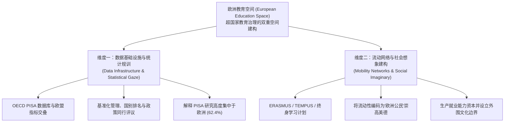

# European Education Space

---

## 定义

> [!def] 核心定义
> **欧洲教育空间（European Education Space, EES）** 是指在超国家治理与欧洲一体化进程中，由欧洲联盟（European Union，EU）与[[OECD|经济合作与发展组织]]（Organisation for Economic Co-operation and Development，[[OECD]]）通过跨国[[Data Infrastructure|数据基础设施]]、政策开放协调机制（Open Method of Coordination，OMC）、学分资格互认框架以及大规模跨国流动网络所共同构想、生产与维系的功能性治理空间与象征性社会空间。该空间不仅使欧洲各异质教育体系的跨国量化比较与政策趋同成为可能，更是塑造“欧洲性”（Europeanness）超国家公民认同与灵活[[Employability|就业能力]]的核心治理舞台。[[Argument_Li_2025_HSSC|(Li et al., 2025)]]; [[Argument_Sobe_Fischer_2009_MobilityMigration|(Sobe & Fischer, 2009, pp. 360, 362–363)]]

> [!concept-lens] 概念透镜与理论内涵
> - **双重空间面向**
>   1. **实证量化治理空间（Empirical-Statistical Space）** 由 OECD 的[[PISA|国际学生评估项目]]（Programme for International Student Assessment，[[PISA]]）数据库与欧盟统计指标交叉编织而成，为欧洲基础教育政策的协调、基准比对与同行施压提供了可操作的共同技术语言（Grek, 2009; [[Argument_Li_2025_HSSC|Li et al., 2025]]）。
>   2. **社会建构与文化认同空间（Social-Discursive Space）** 由[[António Nóvoa|安东尼奥·诺沃亚]]与马丁·劳恩（Nóvoa & Lawn, 2002; [[Argument_Sobe_Fischer_2009_MobilityMigration|Sobe & Fischer, 2009]]）深入解构——欧洲教育空间绝非天然存在的地理版图，而是通过调动古典旅行游学隐喻、推行跨国学术流动（如 [[Erasmus Programme|ERASMUS]] 与 [[TEMPUS]]）所生产的“欧洲社会想象”（European Social Imaginary）。
> - **制度边界与非正式性** 欧洲教育空间不等于欧洲政治或法律上的中央集权一体化（欧盟条约明确规定教育权保留于成员国主权内部），它主要依托“软法治理”（Soft Law Governance）、非强制性的数据对齐以及网络化参与来实施[[Governing at a Distance|远距治理]]。

> [!citation-card]
> **Nóvoa (2002) & [[Argument_Sobe_Fischer_2009_MobilityMigration|Sobe & Fischer (2009)]] 论欧洲空间认同与流动性建构**
> 安东尼奥·诺沃亚指出，流动性已成为面向欧盟的欧洲认同形成的核心试金石。该概念成为想象欧洲公民身份的手段，因为它“内含了对过往旅程与文化漫游的社会想象，并唤起了一种对未来的自由与开放感”。ERASMUS 等流动项目在每个公民心中烙印下一种集体化且统一的“欧洲体验”，这种体验与多样性、多元认同的欧洲空间想象完美契合。欧洲教育空间的制造将传统国家建构策略（旗帜、国歌、教科书）与基于知识和胜任力的新归属疆域结合起来，通过将人群汇聚在临时性合作项目与流动网络中，把个体流动性铸造为特权公民的正当品质。[[Argument_Sobe_Fischer_2009_MobilityMigration|(Sobe & Fischer, 2009, pp. 362–363)]]

> [!boundary]- 概念边界
> - **不等于欧洲高等教育区（EHEA）** 欧洲高等教育区聚焦于 48 国参与的高等教育学制三层对齐（学士/硕士/博士）；而欧洲教育空间涵盖基础教育（受 PISA 与欧盟[[21st Century Skills and Competencies Discourse|关键能力]]框架调控）、职业教育以及[[Lifelong Learning|终身学习]]全学段。
> - **不等于单一主权国家的教育政策同质化** 欧洲教育空间并不消除成员国自身的历史制度特色，而是通过建立可比较的[[Performance Indicators|绩效指标]]与资格框架，在“多元一体”的表象下实现协调与控制。

---

## 核心机制与理论架构

欧洲教育空间在比较教育学中被解构为“数据基建[[Disciplina and Doctrina|规训]]”与“流动性[[Governmentality|治理术]]”协同运作的复合体：

> [!feature] 核心支柱要素
> - **[[Data Infrastructure|数据基础设施]]与基准化考核** [[OECD]] 与欧盟委员会长期共享趋同的政策议程，两套数据体系的交叠为成员国教育绩效提供了连续可比的基准图表（Grek, 2009）。[[PISA]] 成为定义欧洲国家教育健康度的核心量度，使得 62.4% 的 PISA 政策影响实证研究高度集聚在欧洲地区（[[Argument_Li_2025_HSSC|Li et al., 2025]]）。
> - **跨国流动与象征性公民权** 自 1987 年设立的[[Erasmus Programme|伊拉斯谟计划]]（ERASMUS）及其后续框架，不仅资助了数以百万计的大学师生跨国交换，更重构了欧洲公民的心理边界，将跨界求学与多元文化适应力塑造成现代社会最宝贵的个人资产（Papatsiba, 2005; [[Argument_Sobe_Fischer_2009_MobilityMigration|Sobe & Fischer, 2009, p. 362]]）。
> - **地缘辐射与规范输出网络** 通过[[TEMPUS|天普计划]]，欧洲教育空间向东欧、西巴尔干、北非与中东等伙伴国延伸，输出[[Bologna Process|博洛尼亚进程]]模式与欧洲学分互认系统，在推进外围国家现代化的同时重塑欧洲文明的外部边界（[[Argument_Sobe_Fischer_2009_MobilityMigration|Sobe & Fischer, 2009, p. 363]]）。

---

## 围绕概念形成的命题

---

### 命题一　欧洲教育空间是全球教育大规模评估与政策影响研究区域集聚的结构性根源

> [!concept-lens] 数据治理基础设施的集聚效应
> 探讨为何[[International Large-Scale Assessments|国际大规模评估]]（ILSA）的政策溢出效应呈现出极端不均衡的地理分布，以及数据互认网络如何反向塑造学术研究重心。

> [!claim] [[Argument_Li_2025_HSSC|Li et al. (2025)]]
> **[[Data Infrastructure|数据基础设施]]对政策研究的结构性锁定** 在对全球 [[PISA]] 政策影响的[[Systematic Review|系统综述]]中发现，高达 62.4% 的实证研究以欧盟及欧洲经济区（EEA）国家为分析对象。这一不成比例的区域集中性并非单纯出于学者的主观偏好，而是因为欧洲教育空间内部深度嵌构的数据基础设施、常态化的跨国比较机制以及政策协调平台，使得 PISA 评估在欧洲内部被高度制度化为核心治理杠杆，从而源源不断地激发出海量的政策转化与学术评估需求。[[Argument_Li_2025_HSSC|(Li et al., 2025)]]

---

### 命题二　欧洲教育空间的建构是通过将精英流动性道德化为超国家公民资本的治理过程

> [!concept-lens] [[Spatial Governmentality|空间治理术]]与阶层[[Avatar|化身]]份认同
> 探讨超国家空间[[Discourse|话语]]如何通过赞美跨国人员流动来生产统一的欧洲公民身份，以及这种修辞背后的[[Governmentality|治理性]]转嫁。

> [!claim] Nóvoa & Lawn (2002); [[Argument_Sobe_Fischer_2009_MobilityMigration|Sobe & Fischer (2009)]]
> **流动性美德化与超国家治理术的阶层偏向** 欧洲教育空间不是静态的领土容器，而是通过流动网络所生产的话语[[Assemblage|装配]]（Assemblage）。政策制定者调动欧洲古典旅行的人文主义浪漫意象，将跨国流动（[[Student Mobility|学生流动]]与[[Teacher Mobility|教师流动]]）建构为面向未来、包容开放的时代美德，使跨文化资源成为 enfranchised 公民的核心象征。然而，这种话语本质上是将适应劳动力市场不确定性的风险个体化，把“[[Employability|就业能力]]”包装成个体的道德责任；同时，它将合法流动特权赋予高校文化精英，与基础教育和底层移民流动所遭遇的空间排斥形成了尖锐的阶层化区隔。[[Argument_Sobe_Fischer_2009_MobilityMigration|(Sobe & Fischer, 2009, pp. 360, 362–363)]]

---

### 命题总览

> [!contrast-table] 所有命题归纳
> | 命题类型 | 核心指向 | 适用情境 | 代表学者 |
> |---|---|---|---|
> | **数据基础设施[[Disciplina and Doctrina\|规训]]命题** | 欧洲教育空间通过量化数据网格与比较指标建立跨国软性政策协调与研究吸附机制 | 国际大规模教育评估（PISA）、循证政策决策、指标治理 | Grek (2009); [[Argument_Li_2025_HSSC\|Li et al. (2025)]] |
> | **空间治理与认同建构命题** | 欧洲教育空间通过美德化人员流动与项目网络建构超国家身份，同时转移就业责任与构筑外围边界 | [[Internationalization of Higher Education\|高等教育国际化]]、伊拉斯谟计划（ERASMUS）、[[TEMPUS\|天普计划]]（TEMPUS）、欧盟公民认同 | Nóvoa & Lawn (2002); [[Argument_Sobe_Fischer_2009_MobilityMigration\|Sobe & Fischer (2009)]] |

---

## 概念演变

> [!dev-timeline] 概念演变
> - **1990 年代初 — 政策萌芽与条约确立** 1992 年《马斯特里赫特条约》（第 126 条）明确欧盟在尊重成员国文化和语言多样性的前提下促进教育合作，[[Erasmus Programme|ERASMUS]] 与 [[TEMPUS]] 相继铺开。
> - **2000 年 — [[Lisbon Strategy|里斯本战略]]与开放协调机制** 欧盟提出建立“全球最具[[Competitiveness|竞争力]]的[[Knowledge-Based Economy|知识经济]]体”，正式确立以基准比对、量化指标和同伴学习为核心的开放协调机制（OMC），欧洲教育空间开始获得实操抓手。
> - **2002 年 — 比较教育学批判解构** [[António Nóvoa]] 与 Martin Lawn 出版《制造欧洲教育空间》（*Fabricating Europe: The Formation of an Education Space*），将该空间定性为通过数据与流动性进行主体塑造的[[Post-structuralism|后结构主义]]治理技术。[[Argument_Sobe_Fischer_2009_MobilityMigration|(Sobe & Fischer, 2009, p. 360)]]
> - **2009 年 — 空间转向与流动性分层分析** Sobe & Fischer 将其置于[[Spatial Governmentality|空间治理术]]视域下，对比欧美对[[Student Mobility|学生流动]]的阶层化道德评判，揭示欧洲教育空间的双重包容与排斥机制。[[Argument_Sobe_Fischer_2009_MobilityMigration|(Sobe & Fischer, 2009, pp. 360–363)]]
> - **2025 年 — 大规模评估实证反思** Li et al. 从全球实证综述视角证实欧洲教育空间对国际学术研究与政策评估的结构性吸附效应。[[Argument_Li_2025_HSSC|(Li et al., 2025)]]

---

## 争议与批评

> [!debates] 学术争议
>
> > [!axis] 自愿一体化 vs 隐性新自由主义[[Disciplina and Doctrina|规训]]
> > - **官方政策叙事** 欧洲教育空间是通过自愿合作、学分互认与文化交流实现多元一体的和平民主项目，尊重各自主权。
> > - **[[Critical Pedagogy|批判教育学]]者（Nóvoa, Lawn, Ball）** 欧洲教育空间实则是新自由主义[[Governmentality|治理术]]的高级形态，通过“非强制”的指标排位与资助竞争，迫使各成员国将教育目标悄然对齐劳动力市场与[[Human Capital Theory|人力资本]]积累。[[Argument_Sobe_Fischer_2009_MobilityMigration|(Sobe & Fischer, 2009, pp. 362–363)]]
>
> > [!axis] 开放包容网络 vs 外围地缘文化排斥
> > - **欧盟一体化推动者** 强调 [[TEMPUS]] 与睦邻政策将欧洲先进教育模式辐射至东欧与地中海周边，促进制度现代化与民主转型。
> > - **后殖民与空间批判学者** 批评该空间构建了以西欧为知识中心的等级秩序，将“欧洲社会想象”确立为现代性唯一准则，将非欧洲传统置于“发展落后”的时空位置上。[[Argument_Sobe_Fischer_2009_MobilityMigration|(Sobe & Fischer, 2009, pp. 360, 363)]]

---

## 实证数据

> [!ref-table]- [[International Large-Scale Assessments|国际大规模评估]]研究的欧洲区域集聚数据
> 
>
> | 研究 | 样本与情境 | 研究设计 | [[Variable\|变量]]或指标 | 原始统计结果（无[[Effect Size\|效应量]]） | 不确定性或显著性 | 解释边界 |
> |---|---|---|---|---|---|---|
> | [[Argument_Li_2025_HSSC\|Li et al. (2025)]] | 全球 101 篇关于 [[PISA]] 政策影响的经同行评审实证研究 | [[Systematic Review\|系统综述]]（Systematic Review） | 研究对象所属地理区域分布 | 欧盟/欧洲经济区研究占 **62.4%**；其中西欧国家研究占 **45.9%** | — | 表明 PISA 政策研究呈现高度欧洲中心倾斜，验证了欧洲教育空间[[Data Infrastructure\|数据基础设施]]的结构性[[Path Dependence\|锁定效应]]。 |

---

## 相关研究

> [!evidence-grid-a] [[Correlational Research|相关研究]]索引
> - [[Argument_Li_2025_HSSC|Li et al. (2025)]] — [[Systematic Review|系统综述]]揭示全球 [[PISA]] 政策影响实证研究中有 62.4% 集中在欧洲，运用欧洲教育空间概念解释数据治理基建的吸附效应。
> - [[Argument_Sobe_Fischer_2009_MobilityMigration|Sobe & Fischer (2009)]] — 援引 Nóvoa & Lawn（2002）剖析欧洲教育空间的制造过程，批判性揭示 [[Erasmus Programme|ERASMUS]] 与 [[TEMPUS]] 如何将[[Student Mobility|学生流动]]道德化为欧洲公民资本。

---

