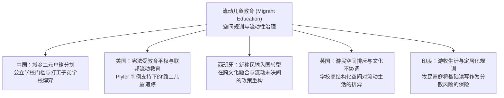

# Migrant Education

---

## 定义

> [!def] 核心定义
> **流动儿童教育（Migrant Education）** 是指面向因家庭跨区域经济流动、季节性生计转移、内部务工或跨境身份未决而处于“流转/过渡状态”（in transit）的学龄群体所推行的制度安排、教学供给与公共政策。在比较教育学与批判社会学视角下，流动儿童教育不仅关涉弱势群体的受教育权保障，更是现代国家通过划分地理区域、登记人口身份与划定学校空间边界，对人口流动性（Mobility）实施识别、规制与筛选的核心机制。[[Argument_Sobe_Fischer_2009_MobilityMigration|(Sobe & Fischer, 2009, pp. 364–366)]]

> [!concept-lens] 概念透镜与理论辨析
> 在概念谱系与制度预设上，“流动儿童教育”与传统意义上的“移民教育”（Immigrant Education）存在实质区隔：
> 1. **流动态势与居留预设** 传统移民教育通常以永久迁徙（Permanent Relocation）和居留融入为前提，政策重点在于使新移民掌握主流语言、同化或融入东道国既定社会结构；而流动儿童教育的对象在官方视域中被定性为“临时借居者”或“过渡人口”（In Transit），其家庭生计伴随季节性农业、工业建筑周期或非正规用工而高度波动。
> 2. **空间治理与资格核验** 学校在此并非中立的知识传授场所，而是国家行使[[Spatial Governmentality|空间治理术]]的“封闭性容器”（Enclosure）。国家通过编制学籍网络、要求本地户籍证明或核验证明文件，将流动儿童阻挡于主流教育空间之外，或将其圈禁于非正规、边缘化的教育机构中，从而在地理与制度双重维度建构起准入资格（Qualification）与排斥壁垒（Disqualification）。

---

## 跨国比较图景与政策形态

在全球比较视野中，流动儿童教育并非整齐划一的制度模式，而是在不同国家的历史传统、法律框架与空间政治下呈现出高度异质的发展样态：

### 1. 中国：城乡二元体制下的随迁子女博弈
在中国快速城市化与工业化进程中，流动儿童教育主要体现为超过 2000 万农村随迁务工子女的就学问题。这一实践被国家刚性的[[Hukou System|户籍制度]]（Hukou）深刻规制：
- **制度壁垒与准入排斥** 由于义务教育财政拨款与户籍属地紧密挂钩，迁入地城市公立学校长期向流动家庭设立极高的户籍准入门槛或收取巨额赞助费。
- **自发办学与空间合法性清理** 农民工群体在城乡结合部自发创立打工子弟学校，虽有效弥补了学位缺口，但往往因办学条件简陋被地方行政部门定性为“非正规/非法办学”。2006 年北京等特大城市对数百所打工子弟学校的集中关停与拆迁，集中暴露出空间治理权力对未登记流动群体的空间驱逐与资格剥夺。[[Argument_Sobe_Fischer_2009_MobilityMigration|(Sobe & Fischer, 2009, p. 365)]]

### 2. 美国：司法平权与联邦流动教育项目
在美国，流动儿童教育集中交织在无证跨境移民与季节性农业流动农工学童（Children of the Road）的双重视野中：
- **宪法权利底线** 联邦最高法院在 1982 年《[[Plyler v. Doe 1982|普莱勒诉多伊案]]》中明确裁决，公立学区不得因学生的无证移民身份而剥夺其接受免费公立基础教育的权利，确立了人权高于属地行政控制的司法原则。
- **专门化国家资助网络** 美国联邦教育部根据《[[Elementary and Secondary Education Act of 1965|初等与中等教育法]]案》（Elementary and Secondary Education Act，ESEA）第一章设立“联邦流动儿童教育办公室”（Office of Migrant Education，OME），通过专属拨款建立跨州流动学籍追踪系统与学分互认机制。然而，农工家庭高频度的地理搬迁、语言隔绝以及在《[[No Child Left Behind Act 2001|不让一个孩子掉队法案]]》（NCLB）问责下被贴上拖累学校绩效的标签，使得流动儿童始终面临学术边缘化。[[Argument_Sobe_Fischer_2009_MobilityMigration|(Sobe & Fischer, 2009, pp. 365–366)]]

### 3. 西班牙：从劳力输出到输入国的跨文化探索
西班牙在 20 世纪末迅速从劳动力输出国转型为移民主要输入国，移民人口在短时间内突破总人口的 9%：
- **定居与流动属性的模糊性** 来自北非摩洛哥、拉丁美洲以及东欧的迁徙群体在身份上介于“季节性流动务工者”与“永久定居移民”之间。
- **[[Intercultural Education|跨文化教育]]实验** 西班牙教育部门逐步确立了[[Intercultural Education|跨文化教育]]取向，强调在接纳异质文化群体的同时避免族群隔离；但面对[[Language Skills|语言能力]]有限的流动新生与变动不居的[[Student Mobility|学生流动]]轨迹，学校体系面临着如何在承认文化差异与推进国家共同体认同之间维持平衡的严峻挑战。[[Argument_Sobe_Fischer_2009_MobilityMigration|(Sobe & Fischer, 2009, p. 366)]]

### 4. 英国：传统游民社群与空间文化冲突
在英国，流动儿童教育的典型对象是罗姆人与爱尔兰大篷车游民儿童：
- 参见专题条目：[[Traveller Education|旅行者教育]]。
- **空间文化不协调** [[Ethnography|民族志研究]]显示，流动儿童难以适应正规学校“高度结构化的空间使用”（Highly Structured Use of Space）与固定课桌椅[[Disciplina and Doctrina|规训]]，这种生活[[Habitus|习性]]与校园封闭空间的错位，导致其在多元文化政策表象下依然承受深层的制度性孤立。[[Argument_Sobe_Fischer_2009_MobilityMigration|(Sobe & Fischer, 2009, p. 366)]]

### 5. 印度：游牧生计与学校教育的能动性博弈
在印度西部古吉拉特邦等干旱牧区，流动儿童教育涉及拉巴里等游牧部族：
- 参见专题条目：[[Nomadic Education|游牧教育]]。
- **国家定居化与家庭保险机制** 国家将正规学校教育视作终结游牧流动、推行定居化的关键杠杆；而牧民家庭则展现出高度的战术能动性，策略性地送子嗣入学获取基础读写能力，借此瓦解外部中介垄断，为家庭在生态退化风险下购买一份生计“保险”。[[Argument_Sobe_Fischer_2009_MobilityMigration|(Sobe & Fischer, 2009, pp. 366–367)]]

---

## 理论解释与批判反思

> [!citation-card]
> **Popkewitz & Lindblad (2000) 论[[Two Problematics of Educational Inclusion and Exclusion|双重问题式]]在流动教育中的交织**
> [[Thomas S. Popkewitz|托马斯·S·波普科维茨]]与斯韦克·林德布拉德指出，对弱势人口教育处境的考察必须统合“公平-参与问题式”与“[[Knowledge Questions|知识问题]]式”：
> - **公平-参与维度** 流动儿童在国家治理中往往面临实体性的资源匮乏与准入剥夺（如公立学校门槛、拨款短缺、办学资质受限）；
> - **知识与文化分类维度** 更为隐蔽的是，教育体制内部运作着将“流动性”视为病态、将“定居”视为常态的知识理性体系。流动儿童即使坐在同一间教室里，也往往被测试标准与分类[[Discourse|话语]][[Coding in Qualitative Research|编码]]为“落后”、“文化缺失”或“有待矫正的偏常群体”，在象征秩序上完成二次排斥。[[Argument_Sobe_Fischer_2009_MobilityMigration|(Sobe & Fischer, 2009, pp. 367–368)]]

> [!warrant] 比较教育学研究的新启示
> 流动儿童教育的跨国经验彻底动摇了传统比较教育学以“主权国家/稳定社会”为基本[[Unit of Analysis|分析单位]]的[[Positivism|实证主义]]前提：
> 1. **超越[[Methodological Nationalism|方法论民族主义]]** 人口跨界与内部阶层流动打破了国家内部均质的教育叙事，流动儿童处于空间边界与行政边缘的地带，直接折射出国家权力的包容与排斥边界；
> 2. **空间实践的生产性力量** 正如索比与菲舍尔所强调，研究流动儿童教育不能仅停留在国家政策的条文汇编上，必须进入学校空间微观实践、学籍网络管理与社会制图的交织点，考察地理停顿与流动流动性如何共同编织起现代教育治理的权力图谱。

---

