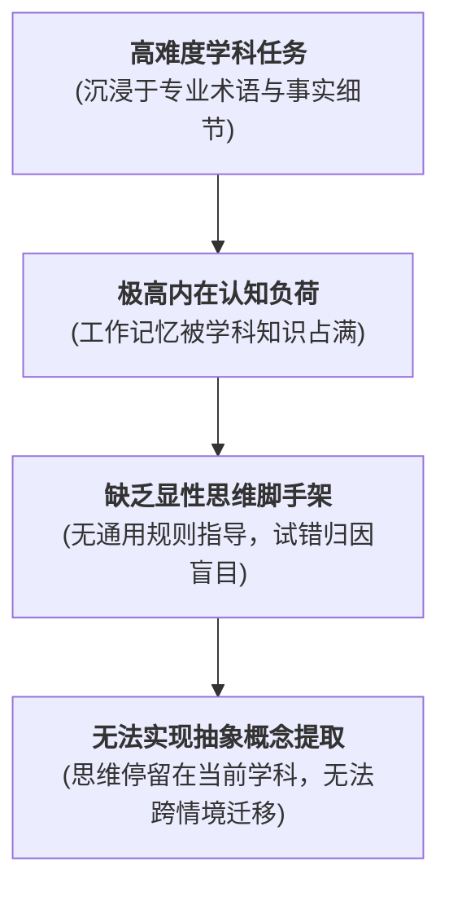

# Immersion Approach

---

## 定义

> [!def] 核心定义
> 学科沉浸模式（[[Presence|immersion]] Approach，亦称隐性渗透模式或沉浸法）是由 Robert Ennis (1989) 提出的[[Critical Thinking|批判性思维]]课程分类中的一种传统教学模式。它指在常规学科教学中，教师引导学生深度浸入具有挑战性的学科内容与[[Problem Solving|问题解决]]任务中，**但并不向学生显性讲授、命名或示范通用的批判性思维原则与评价标准**。该模式建立在一个核心[[Hypothesis|假设]]之上：只要学生深入参与高难度的学科探究，批判性思维能力就会作为学科精熟的“自然副产品”自发[[Emergence|涌现]]。[[Argument_Abrami_2015_RER|(Abrami et al., 2015, p. 281)]]

> [!concept-lens] 概念透镜
> - **含义** 将思维训练完全隐性化地融入学科内容的传统教学常态。
> - **用途** 解释为何许多看似探究充分、[[Homework|作业]]繁重的传统精英课程，在提升学生通用批判性思维与跨情境迁移上成效往往低于预期。
> - **边界** 核心在于**缺乏显性化规则（Non-explicitness）** 它与“[[Infusion Approach|学科融入模式]]”拥有相同的学科载体，但排除了显性思维脚手架与[[Metacognition|元认知]]总结。

> [!boundary]- 概念边界
> - 不等于 **完全不思考的[[Rote Learning|死记硬背]]** — 沉浸模式确实要求学生开展高强度的学科思维（如推导复杂公式、撰写历史论述），但教师**不总结“如何进行批判性思考”的通用原则**。
> - 不等于 **学科融入模式（Infusion）** — 融入模式明确要求教师把通用的逻辑与思维准则显性化教授。

---

## 理论困境：“沉浸迷思”与认知负荷

> [!warning] 沉浸模式的三大方法论缺陷
> 1. **“自发领悟”[[Hypothesis|假设]]落空** 认知心理学表明，深层思维策略（如识别隐含假设、多源证据交叉验证）极其抽象，若无显性指导，绝大多数初学者无法自发从具体学科细节中提炼出通用的思维策略。
> 2. **认知负荷过载** 在高难度的学科探究中，学生的有限[[Working Memory|工作记忆]]被学科特定事实与计算占满，难以同时兼顾对思维过程本身的[[Metacognition|元认知]]监控。
> 3. **迁移壁垒** 由于学生未能在脑海中将“思维方法”与“特定学科事实”解耦，在历史课上学会的史料批判极难自发迁移到科学实验或日常社会新闻甄别中。

---

## 实证表现（[[Argument_Abrami_2015_RER|Abrami et al., 2015]]）

> [!effect-table]- [[Meta-analysis|元分析]]实证数据对比
> | 课程模式分类 | 纳入效应量 $k$ | 加权效应 $g+$ | 95% CI 下限 | 95% CI 上限 | 相对表现 |
> |---|---|---|---|---|---|
> | **显性混合模式（Mixed）** | 84 | **0.38** | 0.26 | 0.51 | 极显著优于沉浸模式 |
> | **[[Infusion Approach\|学科融入模式]]（Infusion）** | 152 | **0.29** | 0.23 | 0.36 | 显著优于沉浸模式 |
> | **直接通用模式（General）** | 44 | **0.26** | 0.14 | 0.37 | 优于沉浸模式 |
> | **学科沉浸模式（[[Presence\|immersion]]）** | 61 | **0.23** | 0.12 | 0.34 | **四类模式中表现最弱** |

大规模元分析确证：在控制了研究质量与学段后，学科沉浸模式在通用[[Critical Thinking|批判性思维]]培养上的成效显著垫底（$g+ = 0.23$），从统计学上终结了“仅凭学科浸润即可培养批判性思维”的传统信念。[[Argument_Abrami_2015_RER|(Abrami et al., 2015, pp. 293–294)]]

---

## 相关研究

> [!evidence-grid-a] 相关研究索引
> - [[Argument_Abrami_2015_RER|Abrami et al. (2015)]] — 综合 341 项实验实证，证明隐性沉浸模式在[[Critical Thinking|批判性思维]]培养中的局限性。
> - [[Ennis's Curricular Typology]] — 系统阐释 Ennis 课程模式四分法的理论脉络。
> - [[Infusion Approach]] — 阐明通过显性化改造将沉浸模式升级为融入模式的操作路径。
