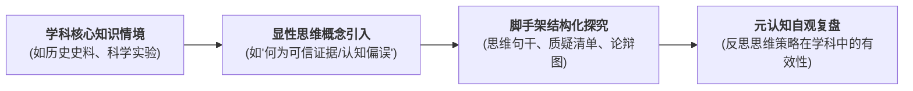

# Infusion Approach

---

## 定义

> [!def] 核心定义
> 学科融入模式（Infusion Approach，亦称[[Critical Thinking|批判性思维]]融入法）是由 Robert Ennis (1989) 提出的批判性思维课程四分法中的核心支柱。它指在深入学习常规学科知识（如历史、生物、化学、文学）的过程中，**教师有意识地将通用的批判性思维原则、逻辑规则与评价标准（如[[Hypothesis|假设]]识别、证据可[[Reliability|信度]]评估、因果推论原则）直接向学生显性化讲授并示范**，引导学生在学科探究情境中深度应用这些思维规则。[[Argument_Abrami_2015_RER|(Abrami et al., 2015, p. 281)]]

> [!concept-lens] 概念透镜
> - **含义** 兼具“学科知识学习”与“显性思维规则训练”的双重教学目标。
> - **用途** 作为大规模基础教育与高等教育课堂最易落地、最能兼顾应试知识与[[Higher-Order Thinking Skills|高阶思维]]的课程改革模式。
> - **边界** 核心区别在于**显性化（Explicitness）** 它不同于不讲思维规则的“[[Immersion Approach|学科沉浸模式]]”，也不同于脱离学科内容的“独立通用模式”。

> [!boundary]- 概念边界
> - 不等于 **学科沉浸模式（[[Presence|immersion]]）** — 沉浸模式同样基于学科内容，但教师**不向学生揭示通用的思维准则**，假定学生能自发领悟；而融入模式必须将思维原则作为显性教学内容。
> - 不等于 **直接通用模式（General）** — 通用模式使用独立的非学科情境课程；融入模式则完全依托现有的常规学科课程框架。

---

## 概念辨析

> [!contrast-table] 融入模式与相关课程模式对比
> | 比较维度 | 学科融入模式（Infusion） | [[Immersion Approach\|学科沉浸模式（Immersion）]] | 显性混合模式（Mixed） | 独立通用模式（General） |
> |---|---|---|---|---|
> | **思维原则显性度** | **高（显性讲授与示范）** | 低（隐性渗透，不讲规则） | **高（独立模块 + 学科双重显性）** | **高（独立显性教学）** |
> | **与学科内容关系** | 深度依托具体学科知识 | 深度依托具体学科知识 | 兼具独立模块与学科应用 | 脱离具体学科，使用日常情境 |
> | **教学设计难度** | 中等（学科教师需掌握思维术语） | 低（教师维持传统探究教学） | 较高（需跨学科课时协同） | 中等（需单独开设专门课程） |
> | **[[Meta-analysis\|元分析]][[Effect Size\|效应量]]** | **$g+ = 0.29$** ($k = 152$) | **$g+ = 0.23$** ($k = 61$) | **$g+ = 0.38$** ($k = 84$) | **$g+ = 0.26$** ($k = 44$) |

---

## 教学机制与操作闭环

> [!proc] 学科融入模式的四步实施流程
> 1. **确立双重教学目标** 每一堂课明确设定“学科内容目标”（掌握特定知识点）与“思维技能目标”（如掌握区分相关与因果的准则）。
> 2. **显性引入思维工具** 教师在引入学科问题前，直接命名并解释通用的思维原则（如“今天我们将使用三项准则来评估这篇史料作者的立场可[[Reliability|信度]]”）。
> 3. **情境化应用与刻意练习** 引导学生在学科劣构问题、实验设计或文本分析中运用上述准则开展互动探究与小组讨论。
> 4. **[[Metacognition|元认知]]提炼与反思** 在课末引导学生跳出学科细节，总结该思维工具如何在其他学科或现实生活中进行迁移。

---

## 实证表现

> [!effect-table]- [[Meta-analysis|元分析]]实证数据（[[Argument_Abrami_2015_RER|Abrami et al., 2015]]）
> | 测量指标 | 纳入效应量 $k$ | 加权效应 $g+$ | 95% CI 下限 | 95% CI 上限 | 实践启示 |
> |---|---|---|---|---|---|
> | **通用[[Critical Thinking\|批判性思维]]技能** | 152 | **0.29** | 0.23 | 0.36 | 显著优于隐性沉浸模式（$g+ = 0.23$），在常规课时不增加的前提下稳步提升通用思维。 |
> | **[[Domain Specificity\|学科特异性]]思维技能** | 55 | **0.56** | — | — | 针对学科内复杂问题的分析能力获得强劲提升。 |

---

## 相关研究

> [!evidence-grid-a] 相关研究索引
> - [[Argument_Abrami_2015_RER|Abrami et al. (2015)]] — 汇集 152 项实证研究，证明学科融入模式对通用与特异思维的稳健促进效果。
> - [[Ennis's Curricular Typology]] — 阐明 Ennis 课程模式四分法的理论脉络与分类逻辑。
> - [[Explicit Critical Thinking Instruction]] — 探讨显性思维教学原则在各学科中的具体教学法转化。
