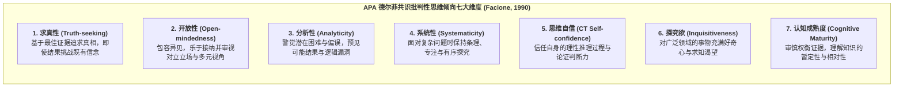

# Critical Thinking Disposition

---

## 定义

> [!def] 核心定义
> [[Critical Thinking|批判性思维]]倾向（Critical Thinking Disposition，亦称批判性思维意向或批判精神）是指个体在面对日常情境、学术探究与决策判断时，主动、自觉且持续运用批判性思维技能的内在动机、态度倾向与心智[[Habitus|习性]]（Habits of Mind）。它解答了个体“不仅能够思考（Can do），而且愿意并主动去思考（Will do）”的情意动力学机制。[[Argument_Abrami_2015_RER|(Abrami et al., 2015, pp. 277–278)]]
>
> 根据美国哲学学会（APA）[[APA Delphi Consensus on Critical Thinking|德尔菲专家共识]]，批判性思维包含“认知技能（Cognitive Skills）”与“情意倾向（Affective Dispositions）”两大不可分割的维度。一个具有良好批判性思维倾向的人被界定为：习惯性地追求真理、心智开放、勇于质疑、尊重理性、具备探究好奇心并对自身认知偏误保持警觉。[[Argument_Abrami_2015_RER|(Abrami et al., 2015, p. 278)]]

> [!concept-lens] 概念透镜
> - **含义** 指向认知背后的情意动力系统，强调思维技能的现实转化与自发激活意愿。
> - **用途** 用于解释为何某些掌握了高阶逻辑与论证规则的人在真实生活中依然表现出教条主义、偏见认同或拒绝理性反思（有能力而无意愿）。
> - **边界** 区别于纯粹的“批判性思维认知技能”；同时也不同于一般的人格特质，思维倾向在很大程度上是可通过教学环境、导师示范与文化熏陶进行后天培养的情意[[Construct|构念]]。

> [!boundary]- 概念边界
> - 不等于 **批判性思维认知技能（CT Cognitive Skills）** — 技能处理的是分析、评估、推理与自我调节的技术能力（How to think）；倾向处理的是在何时、出于何种内在动力去运用这些技术的习惯与承诺（Why & When to think）。
> - 不等于 **人格特质（Personality Traits）** — 大五人格等特质具有高度生物遗传性与跨情境稳定性；而批判性思维倾向更接近于“认知习性（Epistemic Virtues）”，受教育干预的显著调节（[[Argument_Abrami_2015_RER|Abrami et al., 2015]]）。

---

## 概念辨析

> [!contrast-table] [[Critical Thinking|批判性思维]]技能 vs 批判性思维倾向
> | 比较维度 | 批判性思维认知技能（Skills） | 批判性思维倾向（Dispositions） | 整合视角（Perkins 三元模型） |
> |---|---|---|---|
> | **核心指向** | 认知操作技术（“能做”，Can do） | 动机与心智[[Habitus\|习性]]（“愿做”，Will do） | 敏感性（Sensitivity）+ 倾向（Inclination）+ 能力（Ability） |
> | **典型表现** | 识别隐含[[Hypothesis\|假设]]、评估证据效力、避免逻辑谬误 | 求真、思想开放、审慎判断、求知欲强 | 能察觉思维契机，并有动力且正确地执行批判性反思 |
> | **测量方式** | 标准化客观测试（CCTST, [[Watson-Glaser Critical Thinking Appraisal\|WGCTA]], 论证测试） | 自陈量表（[[California Critical Thinking Disposition Inventory\|CCTDI]]）或真实情境行为观察 | 复杂[[Task Structure\|劣构任务]]与开放式长周期行为追踪 |
> | **干预提升效应** | 元分析加权效应 $g+ = 0.30$（$k = 341$） | 元分析加权效应 $g+ = 0.23$（$k = 25$） | 导师制催化下倾向效应可达 $g+ = 0.38$ |
> | **经典代表学者** | Ennis (1989); Paul (1993) | Siegel (1988); Facione (1990) | Perkins et al. (1993); Dewey (1933) |

---

## 核心要素与倾向结构体系

> [!feature] [[Critical Thinking|批判性思维]]倾向的三大理论模型
> - **APA 德尔菲七因素模型（Facione, 1990）** 将理想批判性思考者的情意特征[[Operationalization|操作化]]为 7 个可测维度：求真、开放、分析、系统、自信、求知与认知成熟。
> - **批判精神模型（Critical Spirit, Siegel, 1988）** 强调批判性思考者必须拥有对“良好理由（Good Reasons）”的情感承诺，愿意根据证据改变自身行为与信念。
> - **心智美德模型（Epistemic Virtues, Paul, 1993）** 包含智识[[Humility in Learning|谦逊]]（Intellectual Humility）、智识勇气、智识同理心与智识正直。

---

## 围绕概念形成的命题

---

### 命题一　批判性思维倾向可通过明确教学干预显著培育

> [!concept-lens] 可教性与干预效能
> 探讨思维倾向是否仅为不可更改的性格特质，抑或能在学校教育中被系统性培养。

> [!claim] [[Argument_Abrami_2015_RER|Abrami et al. (2015)]]
> **思维倾向的实证可塑性与干预增益**
> 针对 25 项真实验与准[[Experimental Research|实验研究]]的[[Meta-analysis|元分析]]证实，教学干预能够显著提升学习者的[[Critical Thinking|批判性思维]]倾向（$g+ = 0.23, 95\%\text{ CI } [0.06, 0.40], p < .001$）。出版偏倚检验（已发表 $g+ = 0.29$ vs 未发表 $g+ = 0.17, p = .320$）显示结果稳健，从统计学上确证了批判精神与理性习性并非纯粹先天禀赋，而是可通过教学实践获得实质塑造。[[Argument_Abrami_2015_RER|(Abrami et al., 2015, pp. 296–297)]]

---

### 命题二　导师指导在培育批判性思维倾向中发挥最核心的催化塑造功能

> [!concept-lens] 教学策略与情意[[Habitus|习性]]养成机制
> 探讨不同微观教学策略在塑造思维态度与心智习性时的差异化效能。

> [!claim] [[Argument_Abrami_2015_RER|Abrami et al. (2015)]]
> **[[Mentorship|导师制]]对思维倾向的峰值促进作用**
> 在对比不同教学策略对思维倾向的培养效果时：
> 1. 单纯的[[Dialogue in Education|对话]]策略获得 $g+ = 0.27$（$k = 12$），[[Authentic Instruction|真实性教学]]获得 $g+ = 0.29$（$k = 8$）；
> 2. **融入导师制（Mentoring）的教学干预获得了最高的效果量（$g+ = 0.38, k = 5$）**；
> 3. **机制解释** 批判性思维倾向本质上是一种态度认同与实践习性，很难仅凭纸笔讲授灌输。导师通过身体力行地展示专家面对错误时的智识[[Humility in Learning|谦逊]]、对复杂问题的求知执着以及对异见的开放包容，发挥了强有力的“榜样示范（Role Modeling）”与价值感染功能，成为培育学生批判精神的最强催化剂。[[Argument_Abrami_2015_RER|(Abrami et al., 2015, pp. 296–298)]]

---

## 实证数据

> [!ma-table]- 一阶[[Meta-analysis|元分析]]实证数据（Abrami et al., 2015 · Table 9 批判性思维倾向总体与亚组检验）
> 
>
> | 调节维度 | 亚组分类 | 效应量数 $k$ | 汇总加权 $g+$ | 95% CI 下限 | 95% CI 上限 | 异质性检验 $Q$ 或 $Q_b$ (df, $p$) | 理论与实践意义 |
> |---|---|---|---|---|---|---|---|
> | **总体合并** | **全样本[[Critical Thinking\|批判性思维]]倾向测量** | **25** | **0.23** | **0.06** | **0.40** | $Q(24) = 82.32, p < .001$ | 确证教学干预能够显著塑造思维倾向。 |
> | **研究设计** | [[True Experimental Design\|真实验设计]]（True Experiments） | 10 | 0.21 | 0.05 | 0.37 | $Q_b(1) = 0.15, p = .700$ | 真实验与准实验结论高度一致。 |
> | | [[Quasi-Experimental Designs\|准实验设计]]（Quasi-Experiments） | 15 | 0.26 | 0.01 | 0.51 | | |
> | **出版类型** | 已发表[[Document\|文献]]（Published） | 13 | 0.29 | 0.08 | 0.50 | $Q_b(1) = 0.99, p = .320$ | 组间差异不显著，排除了显著[[Publication Bias\|发表偏倚]]。 |
> | | 未发表文献（Unpublished） | 12 | 0.17 | -0.05 | 0.39 | | |
> | **教学策略** | **[[Mentorship\|导师制]]（Mentoring）** | **5** | **0.38** | **0.03** | **0.73** | — | **导师指导产生最强促进效应**。 |
> | | [[Authentic Instruction\|真实性教学]]（Authentic） | 8 | 0.29 | 0.05 | 0.53 | — | 真实情境激发理性探究承诺。 |
> | | [[Dialogue in Education\|对话]]研讨（Dialogue） | 12 | 0.27 | -0.01 | 0.55 | — | 观点交锋促成思维开放。 |

---

## 相关研究

> [!evidence-grid-a] 相关研究索引
> - [[Argument_Abrami_2015_RER|Abrami et al. (2015)]] — 针对 25 项实证研究展开[[Meta-analysis|元分析]]检验，确立了教学干预对思维倾向的有效性（$g+ = 0.23$）及[[Mentorship|导师制]]的最优增益（$g+ = 0.38$）。
> - [[APA Delphi Consensus on Critical Thinking]] — 系统界定思维倾向与认知技能的双元[[Construct|构念]]结构。
> - [[California Critical Thinking Disposition Inventory]] — 测量[[Critical Thinking|批判性思维]]倾向七维度的标准化量表工具。
> - [[Mentorship]] — 探讨导师作为思维榜样在认知与情意培育中的催化机制。
