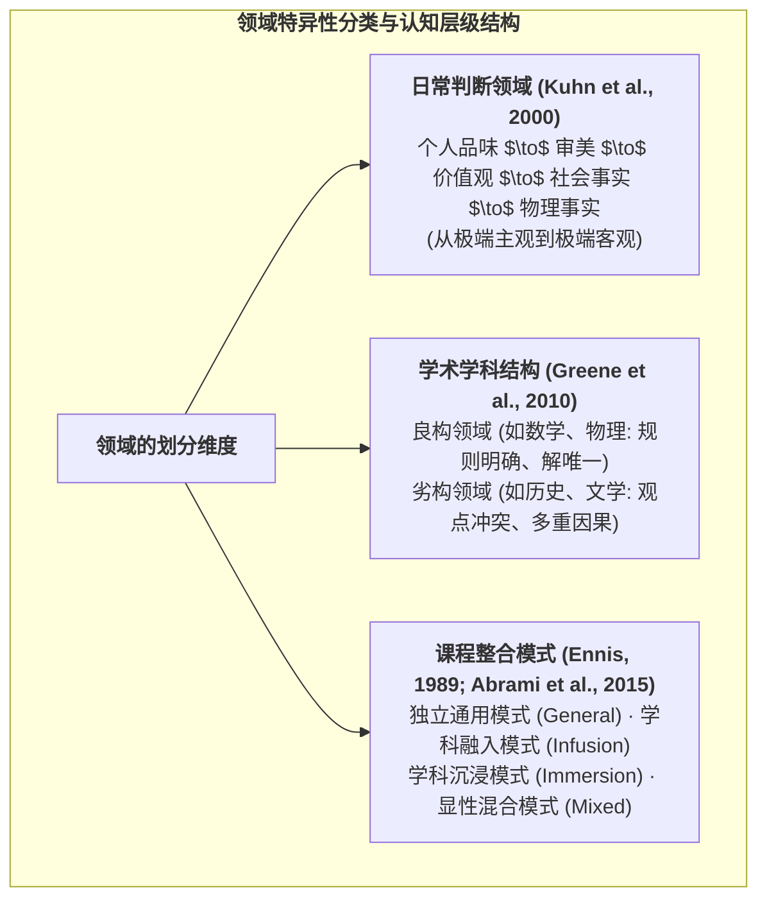

# Domain Specificity

---

## 定义

> [!def] 核心定义
> 领域特异性（Domain Specificity，亦称领域特殊性或学科特异性）是指个体的认知结构、思维方式与[[Epistemological Beliefs|认识论信念]]不具有跨情境的完全通用性（Domain Generality），而是高度依赖并内嵌于具体的[[Areas of Knowledge|知识领域]]（如物理、数学与历史）或日常判断范畴（如审美、价值观与物理事实）中。个体在一个领域的认知发展水平与推理能力无法自动、平滑地直接推导或平移至另一领域。[[Argument_Greene_2010_JEP|(Greene et al., 2010)]]; [[Argument_Abrami_2015_RER|(Abrami et al., 2015, pp. 280–281)]]
>
> 现代认知心理学与教育研究表明，领域特异性与领域通用性并非绝对对立的二元极端，而是构成一种**双层互动结构** 通用性的逻辑论证与[[Metacognition|元认知]]原则（上层）必须与特定学科的核心概念、探究规范及证据标准（下层）深度融合，才能有效催生[[Higher-Order Thinking Skills|高阶思维]]能力。[[Argument_Hofer_1997_RER|(Hofer & Pintrich, 1997)]]; [[Argument_Abrami_2015_RER|(Abrami et al., 2015, p. 281)]]

> [!concept-lens] 概念透镜
> - **含义** 认知能力升级并非计算机单一“操作系统”的全局重装，而是不同学科应用模块在特定情境规则下的差异化建构。
> - **用途** 用于解释为何自然科学领域的顶尖学者在面对社会伦理争端时可能表现出初级幼稚的认知，并指导课程设计中如何将通用思维技巧嵌入具体学科知识中。
> - **边界** 区别于假定心智能力跨学科完全通用的**领域一般性（Domain Generality）**；同时面临更微观的“细粒度情境资源（[[Epistemic Resources]]）”对宏大学科边界的理论解构。

> [!boundary]- 概念边界
> - 不等于 **情境特异性（Context Specificity）** — 领域特异性通常指向文理学科或生活范畴等宏观建制，而情境特异性则深入到课堂微观任务目标、话语互动与即时评价标准（[[Argument_Sandoval_2016_RRE|Sandoval et al., 2016]]）。
> - 不等于 **专业知识匮乏（Lack of Prior Knowledge）** — 领域特异性强调[[Epistemology|认识论]]标准（如物理学用实验证实 vs 历史学用史料互证）的[[Heterogeneity|异质性]]，而非单纯的学科事实记忆差异。

---

## 概念辨析

> [!contrast-table] 领域特异性 vs 领域一般性核心维度对比
> | 比较维度 | 领域特异性（Domain Specificity） | 领域一般性（Domain Generality） | 双层整合模型（Dual-Level Integration） |
> |---|---|---|---|
> | **核心主张** | 思维技能与[[Epistemology|认识论]]标准被深度锁定在特定学科或判断域内。 | 认知发展是整体心智能力的升级，通用逻辑原则可自发跨域迁移。 | 上层为跨情境通用的逻辑与[[Metacognition|元认知]]规则，下层为学科特异的证据与探究规范。 |
> | **发展节奏** | 高度**非同步**。在不同学科与判断领域呈现差异化甚至反转的发展曲线。 | **全局同步**。随年龄成熟或通用训练实现全领域同步跃迁。 | 通用认知框架作为脚手架加速各学科特异性标准的内化。 |
> | **[[Critical Thinking|批判性思维]]定位** | McPeck (1981)：思维永远是“关于某种具体事物的思维”，不存在独立的通用思维技能。 | Ennis (1989), Paul (1993)：批判性思维包含跨领域通用的论证分析与证据评价原则。 | [[Argument_Abrami_2015_RER|Abrami et al. (2015)]]：通用显性原则与学科内容深度融入的**混合模式（Mixed Approach）**效果最佳。 |
> | **理论代表** | McPeck (1981, 1990); [[Argument_Greene_2010_JEP|Greene et al. (2010)]] | [[Jean Piaget|Piaget]] 发生认识论; 传统智力因子理论 | Ennis (1989); [[Argument_Hofer_1997_RER|Hofer & Pintrich (1997)]]; [[Argument_Abrami_2015_RER|Abrami et al. (2015)]] |

---

## 核心要素与领域分类体系

> [!feature] 领域特异性的三大分类框架
> - **日常判断领域分类（Judgment Domains）** [[Argument_Kuhn_2000_CD|Kuhn et al. (2000)]] 将日常论辩划分为五个递进领域：个人品味、审美、价值观、社会事实、物理事实。这五个领域在接纳主观性与找回客观评价标准上呈现出截然相反的发展轨迹。
> - **学术知识结构分类（Academic Domains）** [[Argument_Greene_2010_JEP|Greene et al. (2010)]] 将学科划分为**良构领域（Well-structured domains，如数学）**与**劣构领域（Ill-structured domains，如历史）**。前者拥有公理化体系与确定答案，后者则充满相互冲突的多元史料与价值权衡。
> - **思维教学课程整合分类（Curricular Typology）** [[Argument_Abrami_2015_RER|Ennis (1989) 与 Abrami et al. (2015)]] 依据思维原则与学科内容的结合方式，将教学划分为四类模式：独立通用（General）、学科融入（Infusion）、学科沉浸（[[Presence|immersion]]）与显性混合（Mixed）。

---

## 围绕概念形成的命题

---

### 命题一　个体的认识论发展在不同领域呈现高度的非同步性与发展序列的反转

> [!concept-lens] 发展序列的领域制约
> 探讨领域固有属性（主观 vs 客观；良构 vs 劣构）如何牵制甚至反转认知升级的难度。

> [!claim] [[Deanna Kuhn|Kuhn, D.]]
> **日常判断领域的非同步与反转规律** 在由绝对主义向接纳多元解释的过渡阶段，个人品味和审美领域最先突破，而物理事实领域最难打破绝对确定性；然而在重新确立客观理性标准的评价论（[[Evaluativist]]）阶段，顺序完全反转：物理与社会事实领域最容易建立证据标准，而价值观和审美领域则成为成人认知发展最顽固的相对主义停滞点。实证测试显示 83% 的个体跨领域呈现非同步混合模式，证明心智发展不是领域一般性的线性通关。[[Argument_Kuhn_2000_CD|(Kuhn et al., 2000, p. 314)]]

> [!claim] Greene, J. A.
> **劣构领域先于良构领域的[[Epistemology|认识论]]觉醒** 学生在历史课（劣构领域）中遭遇多源史料冲突时，能更早认识到“知识具有暂定性与主观建构性”，促使其率先摆脱[[Simplicity of Knowledge|简单知识]]观；而在数学等良构领域，由于标准答案明确，学生更容易长期停留在绝对主义阶段。[[Argument_Greene_2010_JEP|(Greene et al., 2010, p. 245)]]

---

### 命题二　认识论信念在心理测量学结构上表现为分学科独立的潜在因子

> [!concept-lens] 测量模型的结构证明
> 探讨在心理测量学意义上，如何通过因子分析实证检验领域特异性。

> [!claim] Greene, J. A.
> **[[Construct Validity|结构效度]]对领域一般性模型的统计否决** 在[[Confirmatory Factor Analysis|验证性因子分析]]（CFA）中，将学生对历史与数学的[[Epistemological Beliefs|认识论信念]]强行拟合为单一通用因子的模型拟合度极差；而将历史与数学区分为两套独立潜在维度的领域特异性模型，拟合度获得断崖式提升（$\Delta\chi^2(10) = 245.56, p < .001$）。这从量化结构上确证了学生在面对文理学科时调用的是两套相互独立的认知评价网络。[[Argument_Greene_2010_JEP|(Greene et al., 2010, p. 242)]]

> [!claim] Hofer, B. K.
> **整合双层模型的概念建构需求** 早期的认识论模型默认了通用性，但大量实证确证了学科特异性。理论必须走向双层架构（Dual-level framework）：核心认识论信念是跨情境的，但在具体学科情境中会被激活为特异性的证据标准与知识验证策略。[[Argument_Hofer_1997_RER|(Hofer & Pintrich, 1997, p. 133)]]

---

### 命题三　批判性思维兼具跨学科通用性与学科融入最佳增益（元分析实证化解对立）

> [!concept-lens] 通用主义与特异主义的实证裁决
> 探讨长达数十年的“[[Critical Thinking|批判性思维]]是通用技能还是学科特异知识”之争如何在大型[[Meta-analysis|元分析]]中得到实证解决。

> [!claim] McPeck, J. E. (1981, 1990)
> **极端特异主义论点：脱离学科内容的通用思维是海市蜃楼** McPeck 认为不存在孤立于具体学科知识的“批判性思维技能”。思考必然是对“某事”的思考，历史学的批判思维依赖史料考据规范，物理学的批判思维依赖实验与数学建模；脱离实质学科知识的通用思维课无法产生有意义的认知迁移。

> [!claim] [[Argument_Abrami_2015_RER|Abrami et al. (2015)]]
> **跨学科通用有效性与显性混合模式的实证突破**
> [[Argument_Abrami_2015_RER|Abrami et al. (2015)]] 对 341 项实证研究的元分析提供了里程碑式的裁决证据：
> 1. **批判性思维具有跨学科可训练性** 教学干预在 STEM 理工科（$g+ = 0.31$）、非 STEM 文社科（$g+ = 0.29$）与医学健康领域（$g+ = 0.20$）均取得显著正向效果，且组间无统计差异（$Q_b(2) = 1.05, p = .59$），彻底推翻了“批判性思维完全被学科壁垒封锁”的极端特异论[[Hypothesis|假设]]。
> 2. **混合模式（Mixed Approach）取得最佳综合成效** 在 Ennis 的四类课程模式中，**将显性通用思维教学与具体学科内容深度融入的“混合模式”获得了最高的干预效应（$g+ = 0.38$）**，显著优于单纯的学科内隐性沉浸（$g+ = 0.23$）或纯粹的独立通用[[Direct Instruction|直接教学]]（$g+ = 0.26$）。
> 3. **理论启示** 批判性思维既不是纯粹的通用空洞技巧，也不是封闭于学科内部的孤立知识；最有效的教学是将通用的论证反思原则作为认知脚手架，在具体学科的真实[[Task Structure|劣构任务]]中进行实践淬炼。[[Argument_Abrami_2015_RER|(Abrami et al., 2015, pp. 280–281, 291–294)]]

---

### 命题四　领域的颗粒度危机：从宏观学科特异性走向微观情境资源

> [!concept-lens] 颗粒度解构
> 探讨即便将“领域”细分到学科层面，是否依然过于粗放，不足以捕捉动态的课堂认知交互。

> [!claim] Sandoval, W. A.
> **颗粒度（Grain Size）危机与动态[[Epistemic Resources|认识论资源]]** 将“科学”或“历史”视为铁板一块的领域依然过于粗放。质性[[Discourse Analysis|话语分析]]显示，在面对同一篇历史[[Document|文献]]或科学文本时，学习者的认知标准会随任务目标发生即时漂移（如专业历史学家在严谨学术考据与宗教情感认同间的无缝切换）。因此，宏观领域特异性应向微观“情境特异性（Context Specificity）”深化：心智并非携带固化的学科特异信念，而是在具体社会情境中按需激活的细粒度“[[Epistemic Resources|认识论资源]]”。[[Argument_Sandoval_2016_RRE|(Sandoval et al., 2016, pp. 473–474)]]

---

### 命题五　创造力与批判性思维的领域特殊性使测量依赖领域特定产出，任务技能重叠会抬高构念间观察相关

> [!concept-lens] 领域负荷与测量后果
> 探讨两个[[Construct|构念]]的领域分殊如何使测量依赖领域特定产出，以及领域特异的任务技能重叠如何影响构念间观察相关。

> [!claim] [[Argument_Park_2026_TSC|Park et al. (2026)]]
> **两个构念均具领域特殊性** [[Critical Thinking|批判性思维]]在不同领域被赋予特定界定，心理批判性思维强调按心理科学原则评价信息（Lawson, 1999, 2015），护理批判性思维则强调为改善病人照护的批判分析与条件识别（Alfaro-LeFevre, 1999; Bandman & Bandman, 1988; Papathanasiou et al., 2014）；[[Creativity|创造力]]被共识性地视为多面、多领域的构念，其定义随研究者对多维度、多领域性质的探索而持续演变。（pp. 2, 11）

> [!claim] [[Argument_Park_2026_TSC|Park et al. (2026)]]
> **测量的领域负荷抬高构念间相关** 创造力几乎不可能在无干扰因素下纯粹测量（Baer, 2012），[[Divergent Thinking|发散思维]]流畅性得分（Torrance, 2008）、自陈创造力（Kaufman, 2012）与专家评定的领域特定产品（Lubart et al., 2011）在测量性质上差异很大，并受亚领域效应、评分者效应与共享方法效应等干扰因素影响（Myszkowski, 2024）。当用于测量批判性思维的分析思维任务（Hassan & Madhum, 2007）与用于测量创造力的科学创造力测验（Hu & Adey, 2002）在任务技能上高度重叠时，两个构念间的观察相关会被这一特定技能重叠虚高。（pp. 10–11）

---

## 命题总览

> [!contrast-table] 领域特异性核心命题体系
> | 命题维度 | 核心论点 | 实践与研究适用情境 | 代表学者与关键[[Document|文献]] |
> |---|---|---|---|
> | **发展序列非同步性** | 劣构与主观领域的认知发展独立于良构/客观领域，发展难度甚至呈现逆向反转。 | 跨学科素养对比、思维发展阶段评估 | [[Deanna Kuhn|Kuhn et al. (2000)]]; [[Argument_Greene_2010_JEP|Greene et al. (2010)]] |
> | **测量结构特异性** | 心理测量数据显示不同学科的[[Epistemological Beliefs|认识论信念]]在统计上构成相互独立的潜在因子。 | [[Epistemology|认识论]]量表开发、[[Questionnaire|问卷]][[Construct Validity|结构效度]]验证 | [[Argument_Greene_2010_JEP|Greene et al. (2010)]]; [[Argument_Hofer_1997_RER|Hofer & Pintrich (1997)]] |
> | **跨学科有效与混合最优** | [[Critical Thinking|批判性思维]]在所有学科均可训练，且通用显性原则与学科融入相结合的混合模式效果最强。 | 课程体系设计、批判性思维教学改革 | McPeck (1981); [[Argument_Abrami_2015_RER|Abrami et al. (2015)]] |
> | **微观情境资源化** | 宏观学科边界颗粒度过大，主张用微观任务情境中按需激活的认知资源替代固定领域信念。 | 课堂互动[[Discourse Analysis|话语分析]]、真实探究任务设计 | [[Argument_Sandoval_2016_RRE|Sandoval et al. (2016)]]; Hammer & Elby (2002) |
> | **领域负荷与测量后果** | [[Creativity|创造力]]与批判性思维均具领域特殊性，创造力测量依赖领域特定产出，任务特异技能重叠抬高[[Construct|构念]]间观察相关。 | 创造力测量设计、构念间相关解读、[[Meta-analysis|元分析]]测量[[Coding in Qualitative Research|编码]] | [[Argument_Park_2026_TSC|Park et al. (2026)]]; Baer (2012); Myszkowski (2024) |

---

## 实证数据

> [!ma-table]- [[Meta-analysis|元分析]]实证数据（Abrami et al., 2015 · 学科领域与课程模式）
> 
>
> | 调节维度 | 分类亚组 | 效应量数 $k$ | 加权效应 $g+$ | 95% CI 下限 | 95% CI 上限 | 组间异质性 $Q_b$ (df, $p$) | 理论与实践意义 |
> |---|---|---|---|---|---|---|---|
> | **学科领域** (Discipline) | STEM 理工学科 | 48 | 0.31 | 0.20 | 0.42 | $Q_b(2) = 1.05, p = .59$ | [[Critical Thinking|批判性思维]]在各学科均产生显著获益，跨学科组间无显著差异，证明通用思维的可训练性。 |
> | | 非 STEM 文社科与人文学科 | 62 | 0.29 | 0.17 | 0.40 | | |
> | | 医学与健康教育领域 | 16 | 0.20 | 0.05 | 0.35 | | |
> | **Ennis 课程模式** (Course Typology) | **混合模式（Mixed: 显性教学 + 学科融入）** | 84 | **0.38** | 0.29 | 0.48 | $Q_b(3) = 4.10, p = .25$ | **混合模式产生最强促进效果**，证明通用原则与学科情境结合是认知迁移的最佳路径。 |
> | | [[Infusion Approach|学科融入模式]]（Infusion） | 165 | 0.29 | 0.22 | 0.36 | | |
> | | 独立直接通用模式（General） | 44 | 0.26 | 0.14 | 0.37 | | |
> | | 学科沉浸模式（[[Presence|immersion]]） | 48 | 0.23 | 0.09 | 0.36 | | |
> | **测验类型对比** | 通用批判性思维测验（Generic CT） | 341 | 0.30 | 0.25 | 0.34 | — | 教学对通用与学科特异思维均具促进力，学科特异测验显示更强近迁移效应。 |
> | | 学科特异思维测验（Content-Specific CT） | 97 | 0.59 | 0.48 | 0.70 | — | |

> [!effect-table]- 一级研究结果
> 
>
> | 研究 | 比较或干预 | [[Dependent Variable|结果变量]] | 分析样本 | 组别统计 | [[Effect Size|效应量]] | 显著性或不确定性 | 设计与解释边界 |
> |---|---|---|---|---|---|---|---|
> | [[Argument_Greene_2010_JEP|Greene et al. (2010)]] | 领域特异性模型 vs 领域一般性模型拟合度对比 | 简单知识维度的[[Confirmatory Factor Analysis|验证性因子分析]]模型拟合卡方值（CFA） | $N = 740$ | 领域特异性模型拟合更优 | 卡方差异 $\Delta\chi^2(10) = 245.56$ | $p < .001$ | 证明测量维度必须分学科独立构建，强有力支持领域特异性。 |

> [!ref-table]- 其他实证结果
> 
>
> | 研究 | 样本与情境 | 研究设计 | [[Variable|变量]]或指标 | 关键结果 | 不确定性或显著性 | 解释边界 |
> |---|---|---|---|---|---|---|
> | [[Argument_Kuhn_2000_CD|Kuhn et al. (2000)]] | $N = 129$ 名跨年龄组样本 | 测量 5 个领域的[[Epistemological Understanding|认识论理解]] | 跨领域的组合模式（Profile） | 有 83% 的个体呈现混合模式。例如，只有在物理和事实领域，多数个体才能找回评价论，而在价值观领域大比例停滞于多元论或绝对论。 | 跨领域反转规律极强 | 彻底排除了认知发展是领域一般性同步推进的假说。 |

---

## 相关研究

> [!evidence-grid-a] 相关研究索引
> - [[Argument_Abrami_2015_RER|Abrami et al. (2015)]] — 综合 341 项[[Experimental Research|实验研究]]，证实[[Critical Thinking|批判性思维]]在 STEM 与文社科均具稳健效果（$g+ \approx 0.30$），且通用原则与学科融入相结合的混合模式（$g+ = 0.38$）效果最强，实证化解了特异与通用之争。
> - [[Argument_Greene_2010_JEP|Greene et al. (2010)]] — 使用[[Factor Mixture Modeling|因子混合模型]]对比历史与数学，从定量测量结构上终结了完全领域一般性假说。
> - [[Argument_Kuhn_2000_CD|Kuhn et al. (2000)]] — 将“判断领域”细分为品味、审美、价值、社会与物理事实，利用混合模式证明了认知发展的非同步性与反转规律。
> - [[Argument_Hofer_1997_RER|Hofer & Pintrich (1997)]] — 呼吁构建整合特异性与一般性的双层[[Epistemology|认识论]]概念模型。
> - [[Argument_Sandoval_2016_RRE|Sandoval et al. (2016)]] — 指出用“学科”界定领域依然颗粒度过大，提出了向更微观的“情境特异性”和动态资源池转型的理论方向。
> - [[Argument_Greene_2018_JEP|Greene et al. (2018)]] — [[Systematic Review|系统综述]][[Epistemic Cognition|认识论认知]]在科学、数学等各学科中的[[Academic Achievement|学业表现]]关联。
> - [[Argument_Song_Choi_2026_FPSYG|Song & Choi (2026)]] — 多水平[[Meta-analysis|元分析]]考察学生认识论发展在不同学习领域中的[[Interaction Effect|调节效应]]。
> - [[Argument_Park_2026_TSC|Park et al. (2026)]] — 指出[[Creativity|创造力]]与批判性思维均具领域特殊性，创造力测量依赖领域特定产出（发散流畅、自陈、领域产品），并提示任务特异技能重叠会抬高两[[Construct|构念]]间的观察相关。
