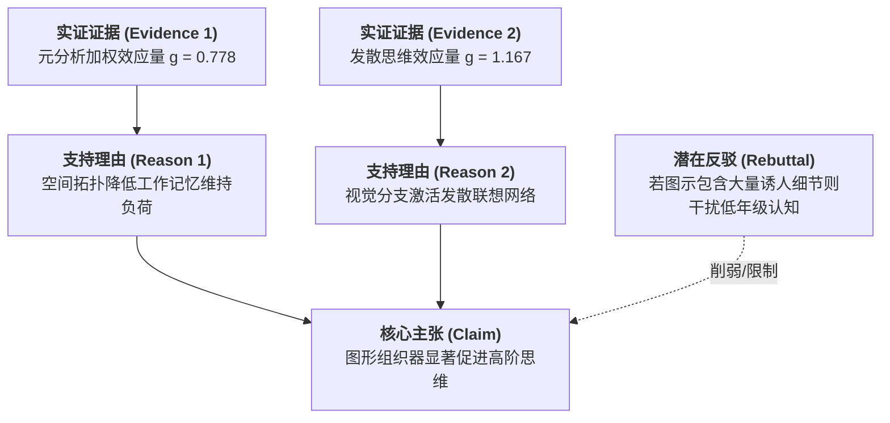

# Argument Mapping

---

## 定义

> [!def] 核心定义
> 论证图（Argument Mapping）是指依据非形式逻辑与论辩推论语法（如 Toulmin 论证模型的六要素：主张 Claim、证据 Data/Evidence、保证 Warrant、支撑 Backing、反驳 Rebuttal 与限定 Qualifier），将复杂文本或思维中的论证结构、前提[[Hypothesis|假设]]与[[Chain of Evidence|证据链]]条进行双向或多层空间树状可视化的认知支架与教学工具。与自由发散的[[Mind Mapping|思维导图]]（Mind Map）和多向语义交叉的[[Concept Mapping|概念图]]（Concept Map）不同，论证图的核心特征在于其严格的逻辑推导约束与说服性论证链条表征。[[Argument_Lei_Ding_Chiu_2026_ERR|(Lei et al., 2026, pp. 4, 9–10)]]

> [!concept-lens] 概念透镜
> - **含义** 将抽象隐蔽的论辩逻辑与反驳结构转化为清晰可见的空间树状拓扑图。
> - **用途** 用于培养学生的[[Critical Thinking|批判性思维]]、议论文写作构思、劣构问题辩论与论据有效性审视。
> - **边界** 论证图强调整体推理的合逻辑性与论据充足性，不负责自由头脑风暴中的无约束发散生成。

> [!citation-card]- 关键表述
> 概念图和思维导图组织观念及其关系以促进理解，而论证图则构建主张、证据、保证和反驳背后的逻辑以说服他人接受特定结论；论证图能够显著促进结构化写作与问题解决中的批判性思维。[[Argument_Lei_Ding_Chiu_2026_ERR|(Lei et al., 2026, pp. 4, 11)]]
>
> *Whereas concept maps and mind maps organize ideas and their relations for greater understanding, argument maps structure the logic behind claims, evidence, warrants and backing to persuade others of a specific conclusion (Davies, 2011)...*

---

## 概念辨析

> [!contrast-table] 论证图 vs [[Mind Mapping|思维导图]] vs [[Concept Mapping|概念图]]
> | 比较维度 | 论证图（Argument Mapping） | 思维导图（Mind Mapping） | 概念图（Concept Mapping） |
> |---|---|---|---|
> | **拓扑结构** | **树状逻辑链**（自顶向下主张—理由—证据） | **放射状多级分支**（单中心核心词） | **复杂多向网络**（多节点双向交叉连接） |
> | **组织规则** | 严格依循 Toulmin 论证语法与反驳规则 | 自由联想、放射性速记、关键词与颜色 | 命题连接词（Linking words）与交叉链接 |
> | **认知加工负荷** | **中等**（规则清晰，但需验证逻辑推理） | **最低**（单中心极简规则，无形式约束） | **较高**（网状交叉连接容易造成视觉拥挤） |
> | **[[Higher-Order Thinking Skills|高阶思维]]促进效应** | **强效促进（$g = 0.798$）** | **最强促进（$g = 1.041$）** | **中等稳健促进（$g = 0.548$）** |

---

## 核心结构与论证要素

> [!feature] 论证图的核心视觉拓扑要素
> - **主张节点（Claim）** 待证明的核心论点或中心争议立场（通常置于顶部或根部）。
> - **支持理由分支（Reasons / Evidence）** 直接支撑主张的事实、经验数据或理论前提。
> - **逻辑保证与支撑（Warrants & Backings）** 解释为什么该理由能够合乎逻辑地推导出主张的内在原则。
> - **反驳与限制（Rebuttals & Counter-arguments）** 明确指出主张不成立的例外条件、对立观点或潜在漏洞。

---

## 围绕概念形成的命题

---

### 命题一　论证图在结构化写作与批判性论辩中效能优异且认知开销适中

> [!concept-lens] 逻辑严密性与认知门槛的权衡
> 论证图通过显式[[Externalization|外化]]论据与反驳链条有效指引推论方向，其促进效能显著优于结构过于冗余的[[Concept Mapping|概念图]]。

> [!claim] Davies; van Gelder; Lei, Ding & Chiu
> **[[Graphic Organizer|图形组织器]]形态级差命题** 在针对[[Higher-Order Thinking Skills|高阶思维]]培养的[[Meta-analysis|元分析]]中，论证图表现出强效的显著促进作用（$g = 0.798$），显著优于概念图（$g = 0.548, W = 13.98, p < .001$），但略低于[[Mind Mapping|思维导图]]（$g = 1.041, W = 11.23, p < .001$）。这一效能级差表明：论证图所提供的逻辑语法既有效避免了概念图多向交叉网状连接所带来的认知超载与视觉拥挤，又提供了比思维导图更严密的推理约束，因而在科学论辩与批判性写作教学中具有独特的育人价值。[[Argument_Lei_Ding_Chiu_2026_ERR|(Lei et al., 2026, pp. 4, 9–11)]]

---

## 实证数据

> [!ma-table]- 一阶[[Meta-analysis|元分析]]总体结果与形态亚组
> 
>
> | 一阶元分析 | 组织器形态亚组 | $k$ | 效应量 $g$ 与 95% CI | [[Pairwise Wald Tests|成对 Wald 检验]]对比 | 教学机制 |
> |---|---|---|---|---|---|
> | [[Argument_Lei_Ding_Chiu_2026_ERR|Lei et al. (2026)]] | **论证图（Argument Mapping）** | 12 | $g = 0.798$, $[0.469, 1.237]$ | 显著高于概念图（$W = 13.98, p < .001$）；低于思维导图（$W = 11.23, p < .001$） | 结构化支撑主张—证据—反驳推导链条 |

---

## 相关研究

> [!evidence-grid-a] 相关研究索引
> - [[Argument_Lei_Ding_Chiu_2026_ERR|Lei et al. (2026)]] 系统对比了论证图（$g = 0.798$）、[[Mind Mapping|思维导图]]（$g = 1.041$）与[[Concept Mapping|概念图]]（$g = 0.548$）对[[Higher-Order Thinking Skills|高阶思维]]的促学效能级差。
