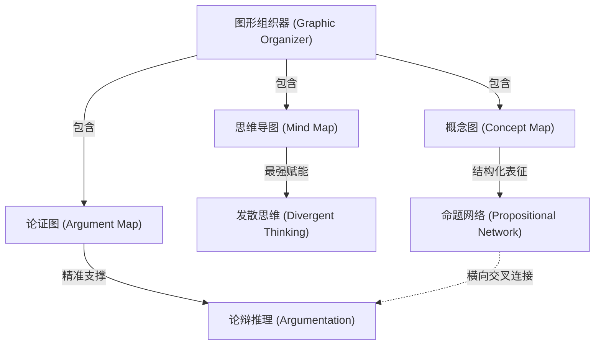

# Concept Mapping

---

## 定义

> [!def] 核心定义
> 概念图（Concept Mapping）是指由 Joseph Novak 基于大卫·奥苏贝尔（David Ausubel）有意义学习理论开发的高结构化空间语义网络表征工具。概念图由置于方框或圆圈中的概念节点（Concept Nodes）、指示方向的连接线（Directed Links）、标明概念间语义关系的命题连接词（Linking Words / Phrases）以及跨越不同知识分支的横向交叉连接（Cross-links）构成；两个概念节点与连接词共同构成一个完整可判断真伪的命题（Proposition），用于外显化表征复杂领域知识的层级结构与网状语义模型。[[Argument_Lei_Ding_Chiu_2026_ERR|(Lei et al., 2026, pp. 4, 9–10)]]

> [!concept-lens] 概念透镜
> - **含义** 基于命题语法与交叉网络建构领域深层知识结构的高阶表征系统。
> - **用途** 用于复杂科学概念建模、概念转变评估、深层有意义学习与课程知识网络整合。
> - **边界** 概念图强调严格的命题语义连接与交叉整合，其内在网状复杂性高于单中心[[Mind Mapping|思维导图]]。

> [!citation-card]- 关键表述
> 概念图包含多节点交叉连接与严格的命题连接词，属于复杂网状语义表征工具；教学中用于复杂领域建模，虽然对概念理解有稳健促进，但较高的结构复杂度容易引发额外的外在认知负荷。[[Argument_Lei_Ding_Chiu_2026_ERR|(Lei et al., 2026, pp. 4, 11–12)]]
>
> *Concept maps organize ideas and their relations for greater understanding using multi-node networks with cross-links and linking phrases. However, their complex network structure can become unwieldy...*

---

## 概念辨析

> [!contrast-table] 概念图 vs [[Mind Mapping|思维导图]] vs [[Argument Mapping|论证图]]
> | 比较维度 | 概念图（Concept Mapping） | 思维导图（[[Mind Mapping]]） | 论证图（[[Argument Mapping]]） |
> |---|---|---|---|
> | **拓扑结构** | **多节点复杂网状**（包含双向交叉连线） | **单中心放射状树形**（放射性多级分支） | **树状/层级推论链**（主张—理由—证据） |
> | **核心组织语法** | 概念节点 + 命题连接词 + 网状交叉链接 | 核心词 + 放射分支 + 色彩/图像 + 自由联想 | Toulmin 论证语法（主张、保证、反驳） |
> | **内在认知开销** | **较高**（网状交叉连接容易带来视觉拥挤） | **最低**（规则极简，无复杂拓扑约束） | **中等**（规则明确，需验证逻辑严密性） |
> | **最适思维维度** | **概念整合** 与领域深层知识建模 | **[[Divergent Thinking\|发散思维]]** 与创意头脑风暴 | **[[Critical Thinking\|批判性思维]]** 与结构化论辩写作 |
> | **[[Higher-Order Thinking Skills\|高阶思维]]促学效应** | **中等稳健促进（$g = 0.548$）** | **最强促进（$g = 1.041$）** | **强效促进（$g = 0.798$）** |

---

## 核心要素

> [!feature] 概念图的四大核心建构构件（Novak & Gowin, 1984）
> 1. **概念节点（Concept Nodes）** 置于方框或圆圈中的核心概念术语（通常为名词或名词短语）。
> 2. **命题连接词（Linking Words）** 写在有向连线上的关系词（如“导致”、“包含”、“转化为”、“作用于”），与相连节点共同构成完整命题。
> 3. **层级结构（Hierarchical Structure）** 最宽泛、最包容的核心概念置于顶部，向下逐层展开更具象、更细分的次级概念。
> 4. **交叉连接（Cross-links）** 连接不同知识分支概念节点的横向连线，表征跨领域的深层语义整合，是衡量深层理解与[[Creativity|创造性]]洞见的关键指标。

---

## 围绕概念形成的命题

---

### 命题一　概念图对高阶思维具有稳健促进作用但受网状结构认知负荷制约

> [!concept-lens] 表征复杂度与视觉负荷的权衡
> 交叉网状拓扑要求学习者在维护全局概念关系的同时标明局部命题语法，容易引发视觉拥挤并降低即时高阶加工的净效能。

> [!claim] Novak; Nesbit & Adesope; Lei, Ding & Chiu
> **概念图效能与认知负荷权衡命题** 在[[Meta-analysis|元分析]]中，概念图对学生[[Higher-Order Thinking Skills|高阶思维]]展现出高度稳健的显著促进作用（$g = 0.548, 95\%\text{ CI} = [0.403, 0.692]$），但显著低于[[Mind Mapping|思维导图]]（$g = 1.041, W = 28.56, p < .001$）与[[Argument Mapping|论证图]]（$g = 0.798, W = 13.98, p < .001$）。这一现象的理论根源在于：概念图的多中心网络拓扑和严格的关系连接词标注大幅增加了外在认知负荷，导致学习者在绘制与阅读过程中需花费大量心智资源维持视觉注意与语法对齐，从而略微削弱了对即时高阶思维生成的净增益。[[Argument_Lei_Ding_Chiu_2026_ERR|(Lei et al., 2026, pp. 4, 9–12)]]

---

## 概念演变

> [!dev-timeline] 概念演变脉络
> - **1970s — Joseph Novak 创立概念图技术** 康奈尔大学研究团队基于 Ausubel 有意义学习理论开发概念图，用于追踪儿童科学概念的发展与转变。
> - **1980s — 确立命题语法与交叉连接评估准则** Novak & Gowin 出版《Learning How to Learn》，确立包含层级、命题、交叉连接与具体实例的标准评分系统。
> - **2000s — CmapTools 数字化建模平台开发** 佛罗里达人机认知研究所（IHMC）开发 CmapTools，推动概念图在全球科学教育与企业知识管理中的应用。
> - **2020s — [[Meta-analysis|元分析]]多维对比与效能定位** [[Argument_Lei_Ding_Chiu_2026_ERR|Lei et al. (2026)]] 与 Barta et al. (2022) 实证确立概念图对[[Critical Thinking|批判性思维]]与高阶认知的定量效能基准（$g = 0.548$）。

---

## 实证数据

> [!ma-table]- 一阶[[Meta-analysis|元分析]]总体结果与形态亚组
> 
>
> | 一阶元分析 | 组织器形态亚组 | $k$ | 效应量 $g$ 与 95% CI | [[Pairwise Wald Tests\|成对 Wald 检验]]对比 | 教学机制 |
> |---|---|---|---|---|---|
> | [[Argument_Lei_Ding_Chiu_2026_ERR\|Lei et al. (2026)]] | **概念图（Concept Mapping）** | 36 | $g = 0.548$, $[0.403, 0.692]$ | 显著低于思维导图（$W = 28.56, p < .001$）与论证图（$W = 13.98, p < .001$） | 多节点交叉网络复杂度高，结构化命题建模稳健但具认知开销 |

---

## 相关研究

> [!evidence-grid-a] 相关研究索引
> - [[Argument_Lei_Ding_Chiu_2026_ERR|Lei et al. (2026)]] 综合 36 项概念图实证研究，量化确立其对[[Higher-Order Thinking Skills|高阶思维]]的促进效应（$g = 0.548$）并与[[Mind Mapping|思维导图]]、[[Argument Mapping|论证图]]展开多水平对比。
