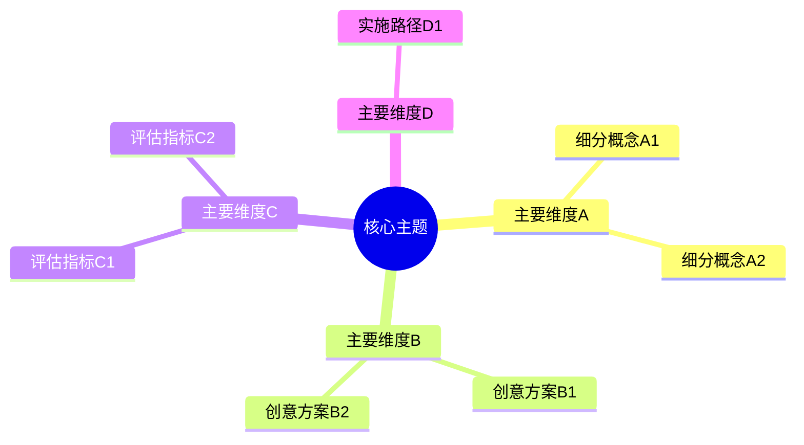

# Mind Mapping

---

## 定义

> [!def] 核心定义
> 思维导图（Mind Mapping）是指以单一核心主题或核心词为中心节点，遵循放射状思维模式向外辐射多级层级分支，结合色彩、图形、关键词和自由联想规则，将非线性心智思考过程与概念联想网络进行空间视觉外显化的低认知开销教学支架与思维工具。由 Tony Buzan 于 20 世纪 70 年代普及推广，思维导图在头脑风暴、发散创意生成、快速速记与结构化复习中被广泛应用。[[Argument_Lei_Ding_Chiu_2026_ERR|(Lei et al., 2026, pp. 4, 9–10)]]

> [!concept-lens] 概念透镜
> - **含义** 模拟人脑神经元突触联想机制的单中心放射状空间视觉表征系统。
> - **用途** 用于激发学习者的[[Divergent Thinking|发散思维]]、头脑风暴观念生成、创意写作构思与跨领域远距离联想。
> - **边界** 思维导图强调联想的自由发散与低结构门槛，通常不要求节点间严格的双向交叉命题连接或严密的逻辑推论反驳语法。

> [!citation-card]- 关键表述
> 思维导图以单一中心概念为核心向外辐射多级分支，结构复杂度低，强调联想发散与速记，能够以最低的认知门槛最大化卸载机械组织负担，让学习者全神贯注于新颖观念的生成与联想拓展。[[Argument_Lei_Ding_Chiu_2026_ERR|(Lei et al., 2026, pp. 4, 11)]]
>
> *Mind maps use a single central topic with radiating branches and keywords. They have low structural complexity and minimal cognitive overhead, maximizing ideational fluency and divergent thinking...*

> [!boundary]- 概念边界
> - 不等于 [[Concept Mapping|概念图]]：概念图采用多中心网络拓扑，要求标明概念间的命题连接词（Linking words）并包含复杂的交叉连接（Cross-links）；思维导图围绕单一中心树状放射，无严格命题语法约束。
> - 不等于 [[Argument Mapping|论证图]]：论证图依循非形式逻辑的论辩语法（主张、理由、证据、反驳），强调线性推导的严密性；思维导图强调自由联想的发散性与多样性。

---

## 概念辨析

> [!contrast-table] 思维导图 vs [[Concept Mapping|概念图]] vs [[Argument Mapping|论证图]]
> | 比较维度 | 思维导图（Mind Mapping） | 概念图（[[Concept Mapping]]） | 论证图（[[Argument Mapping]]） |
> |---|---|---|---|
> | **拓扑结构** | **单中心放射状树形**（放射性多级分支） | **多节点复杂网状**（包含双向交叉连线） | **树状/层级推论链**（主张—理由—证据） |
> | **核心组织语法** | 核心词 + 放射分支 + 色彩/图像 + 自由联想 | 概念节点 + 命题连接词 + 网状交叉链接 | Toulmin 论证语法（主张、保证、反驳） |
> | **内在认知开销** | **最低**（规则极简，无复杂拓扑约束） | **较高**（网状交叉连接容易带来视觉拥挤） | **中等**（规则明确，需验证逻辑严密性） |
> | **最适思维维度** | **[[Divergent Thinking\|发散思维]]** 与创意头脑风暴 | **概念整合** 与领域深层知识建模 | **[[Critical Thinking\|批判性思维]]** 与结构化论辩写作 |
> | **[[Higher-Order Thinking Skills\|高阶思维]]促学效应** | **最强促进（$g = 1.041$）** | **中等稳健促进（$g = 0.548$）** | **强效促进（$g = 0.798$）** |

---

## 核心要素

> [!feature] 思维导图的五大核心视觉要素
> 1. **单一中心主题（Central Theme）** 居于画布中央的核心图像或核心关键词，作为所有思维发散的原点。
> 2. **主干与多级分支（Main & Sub-branches）** 从中心向外辐射的一级主干（主要范畴）与逐级细化的次级分支，表征层级包含关系。
> 3. **节点关键词（Keywords）** 每一分支线上仅保留精炼的单个关键词，避免整句长文本造成的阅读负荷。
> 4. **视觉强化[[Coding in Qualitative Research|编码]]（Color & Visual Coding）** 运用不同颜色区分思维板块，嵌入简笔图标强化视觉注意与记忆检索。
> 5. **放射状联想联结（Radiant Association）** 鼓励自由联想与非线性发散，打破思维定势。

---

## 围绕概念形成的命题

---

### 命题一　低心智操作门槛使思维导图在高阶思维干预中产生最强的促学效能

> [!concept-lens] 认知负荷卸载与结构开销权衡
> 工具本身的组织规则越极简，学习者被外在操作规则侵占的心智资源越少，越能全力投入高阶认知加工。

> [!claim] Buzan; Shi et al.; Lei, Ding & Chiu
> **思维导图形态效能优势命题** 在[[Graphic Organizer|图形组织器]]对[[Higher-Order Thinking Skills|高阶思维]]促学效应的[[Meta-analysis|元分析]]中，思维导图表现出高达 $g = 1.041$ 的强效促进作用，显著优于[[Argument Mapping|论证图]]（$g = 0.798, W = 11.23, p < .001$）与概念图（$g = 0.548, W = 28.56, p < .001$）。这一效能级差的核心机理在于：思维导图采用单一中心发散结构与自由联想规则，不仅外在认知负荷极低，而且完美契合大脑的发散联想机制，从而以最低的认知门槛最大化释放了高阶思维潜能。[[Argument_Lei_Ding_Chiu_2026_ERR|(Lei et al., 2026, pp. 4, 9–11)]]

---

### 命题二　思维导图对发散思维的赋能显著超越聚合逻辑推导

> [!concept-lens] 空间辐射拓扑与发散生成契合
> 放射状空间拓扑通过全景式视觉激活加速远距离语义检索，为发散创新提供了最具生产力的外在支架。

> [!claim] Lei, Ding & Chiu
> **思维导图对[[Divergent Thinking|发散思维]]的优先激活机制** 思维导图的空间分支布局天然鼓励多角度、多维度的观念拓展，因而对流畅性、灵活性与独创性等发散思维指标具有极强的放大效应（$g = 1.167$）；相比之下，受确定性规则与形式逻辑严密约束的[[Convergent Thinking|聚合思维]]从自由导图中获取的增益相对稳健（$g = 0.680, Q_b = 7.07, p < .01$）。[[Argument_Lei_Ding_Chiu_2026_ERR|(Lei et al., 2026, pp. 3–4, 10)]]

---

## 概念演变

> [!dev-timeline] 概念演变脉络
> - **1970s — Tony Buzan 提出放射性思维与思维导图** 确立单中心、多分支、色彩与关键词[[Coding in Qualitative Research|编码]]的经典脑图[[Paradigm|范式]]。
> - **2000s — 数字化导图软件普及** MindManager、XMind 等数字化工具[[Emergence|涌现]]，支持大规模团队协作与动态展开。
> - **2010s — 认知神经科学与多媒体整合** 研究证实视觉导图利用海马体空间记忆通道强化图文双重编码。
> - **2020s — [[Meta-analysis|元分析]]量化确立工具效能级差** [[Argument_Lei_Ding_Chiu_2026_ERR|Lei et al. (2026)]] 实证确立思维导图（$g = 1.041$）对[[Higher-Order Thinking Skills|高阶思维]]的促学效应显著超越[[Argument Mapping|论证图]]与[[Concept Mapping|概念图]]。

---

## 实证数据

> [!ma-table]- 一阶[[Meta-analysis|元分析]]总体结果与形态亚组
> 
>
> | 一阶元分析 | 组织器形态亚组 | $k$ | 效应量 $g$ 与 95% CI | [[Pairwise Wald Tests\|成对 Wald 检验]]对比 | 教学机制 |
> |---|---|---|---|---|---|
> | [[Argument_Lei_Ding_Chiu_2026_ERR\|Lei et al. (2026)]] | **思维导图（Mind Mapping）** | 16 | $g = 1.041$, $[0.704, 1.379]$ | 显著高于概念图（$W = 28.56, p < .001$）与论证图（$W = 11.23, p < .001$） | 单中心极简发散规则，认知开销最低，促学效能最强 |

---

## 相关研究

> [!evidence-grid-a] 相关研究索引
> - [[Argument_Lei_Ding_Chiu_2026_ERR|Lei et al. (2026)]] 综合 16 项思维导图实证[[Effect Size|效应量]]，量化确立其对学生[[Higher-Order Thinking Skills|高阶思维]]的强促进效应（$g = 1.041$）。
