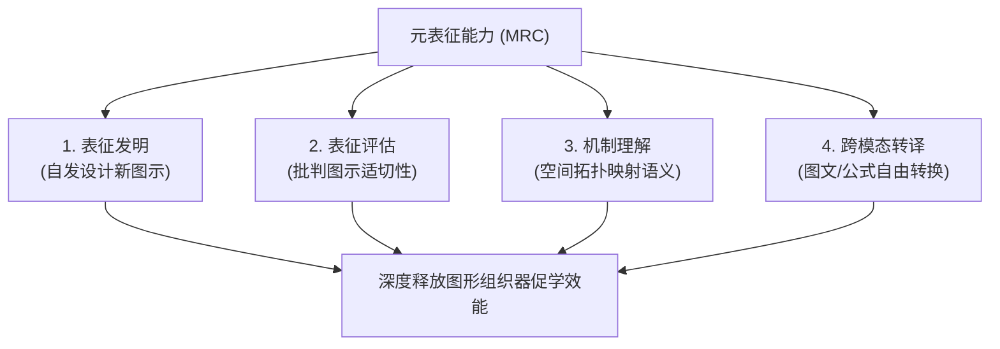

# Meta-Representational Competence

---

## 定义

> [!def] 核心定义
> 元表征能力（Meta-Representational Competence, MRC）是由 diSessa & Sherin (2000) 提出的学习科学高阶认知[[Construct|构念]]，指学习者不仅能够被动阅读和理解现有的外部表征形式（如文本、[[Concept Mapping|概念图]]、数学方程、树状图、统计图表），而且能够深入理解不同表征形式的设计逻辑与表征局限，具备自主发明新表征、批判性评估表征的适切性与完备性、根据任务情境修改优化表征结构以及在多种不同表征模态之间自由转换与映射的高阶[[Metacognition|元认知]]能力。[[Argument_Lei_Ding_Chiu_2026_ERR|(Lei et al., 2026, pp. 4, 12)]]

> [!concept-lens] 概念透镜
> - **含义** 指向“对表征的表征与反思”（Thinking about representations）。
> - **用途** 衡量学生利用、设计与反思科学与数学表征工具的能力，是连接外部教学脚手架与内在认知发展的核心枢纽。
> - **边界** 元表征能力超越了单一图表的绘制技能，重点在于对表征符号系统与认知功能之间的元认知觉察与批判性裁量。

> [!citation-card]- 关键表述
> 相比于低年级学生，中学生通常具备更强的元表征技能，因而能够更高效地利用[[Graphic Organizer|图形组织器]]来组织思维并抑制无关干扰。[[Argument_Lei_Ding_Chiu_2026_ERR|(Lei et al., 2026, pp. 4, 12)]]
>
> *Compared to younger students, secondary school students often have stronger (meta-) representational skills, so they can use graphic organizers more effectively...*

---

## 概念辨析

> [!contrast-table] 元表征能力 vs 表征识读技能 vs 一般[[Metacognition|元认知]]
> | 比较维度 | 元表征能力（MRC） | 表征识读技能（Representational Literacy） | 一般元认知（General [[Metacognition\|Metacognition]]） |
> |---|---|---|---|
> | **认知客体** | 外部表征系统本身（图式、图表、符号网络） | 特定图表或文本的既定内容信息 | 自身的记忆、注意力与思维监控过程 |
> | **核心操作** | 发明新图示、评估表征优劣、跨模态[[Transfer Translation Transformation\|转译]] | 照章读图、提取图表中的具体数值与标签 | 计划任务进度、检查计算错误、调控做题速度 |
> | **发展转折点** | 形式运算期与中等教育阶段迅速成熟 | 具体运算期（小学中高年级）初步掌握 | 贯穿终身，随反思训练持续增强 |

---

## 核心维度

> [!feature] 元表征能力的四大核心支柱（diSessa & Sherin, 2000）
> 1. **表征发明（Invention）** 面对新颖问题情境时，自发构思并绘制全新图示或符号表征形式的能力。
> 2. **表征评估与批判（Critique & Evaluation）** 能够从清晰度、紧凑性、完备性与易读性等维度，判断某种图示是否胜任当前交流或推理任务。
> 3. **表征功能理解（Understanding Function & Form）** 理解空间拓扑、颜色[[Coding in Qualitative Research|编码]]、箭头方向与节点包含关系如何映射抽象语义与因果逻辑。
> 4. **表征修饰与[[Transfer Translation Transformation|转译]]（Modification & Translation）** 能够在文字、[[Concept Mapping|概念图]]、逻辑公式与表格等不同模态之间自如转译信息。

---

## 围绕概念形成的命题

---

### 命题一　元表征能力的成熟是学习者从外在图形组织器中获取最大促学收益的发展前提

> [!concept-lens] 认知发展匹配假说
> 外部认知脚手架的促学效能取决于学习者内在元表征能力与工具结构复杂度之间的动态匹配。

> [!claim] diSessa & Sherin; Lei, Ding & Chiu
> **中学生群体的元表征发展峰值效应** 在大样本[[Meta-analysis|元分析]]中，中学生群体利用[[Graphic Organizer|图形组织器]]发展[[Higher-Order Thinking Skills|高阶思维]]的[[Effect Size|效应量]]最为突出（$g = 1.113$），显著高于小学生（$g = 0.877$）与大学生（$g = 0.659$）。[[Jean Piaget|皮亚杰]]发展理论与元表征理论表明：中学生刚进入形式运算阶段，其元表征能力已足以自如理解和操控多层级[[Mind Mapping|思维导图]]、[[Argument Mapping|论证图]]与[[Concept Mapping|概念图]]，且能有效抵抗诱人细节干扰；同时其内部[[Self-Scaffolding|自我脚手架]]尚未完全固化，外部结构化工具恰好提供了最及时的认知支架，从而产生了最强的发展红利。[[Argument_Lei_Ding_Chiu_2026_ERR|(Lei et al., 2026, pp. 4, 12)]]

---

## 实证数据

> [!ma-table]- 一阶[[Meta-analysis|元分析]]相关结果
> 
>
> | 一阶元分析 | 对应调节[[Variable\|变量]] | 亚组与效应量 $g$ | 组间检验 $Q_b$ / $W$ | 理论机制解释 |
> |---|---|---|---|---|
> | [[Argument_Lei_Ding_Chiu_2026_ERR\|Lei et al. (2026)]] | 学习者学段对[[Higher-Order Thinking Skills\|高阶思维]]的调节 | 中学生（$g = 1.113$） vs 小学（$g = 0.877$） vs 大学（$g = 0.659$） | $Q_b = 6.61, p < .05$；两两成对 Wald 检验均极显著 | 中学生元表征能力成熟且正处于形式运算爆发期，促学效应达到峰值 |

---

## 相关研究

> [!evidence-grid-a] 相关研究索引
> - [[Argument_Lei_Ding_Chiu_2026_ERR|Lei et al. (2026)]] 引入元表征能力[[Construct|构念]]解释中学生在[[Graphic Organizer|图形组织器]]干预下表现出显著高于其他学段的促学收益峰值。
