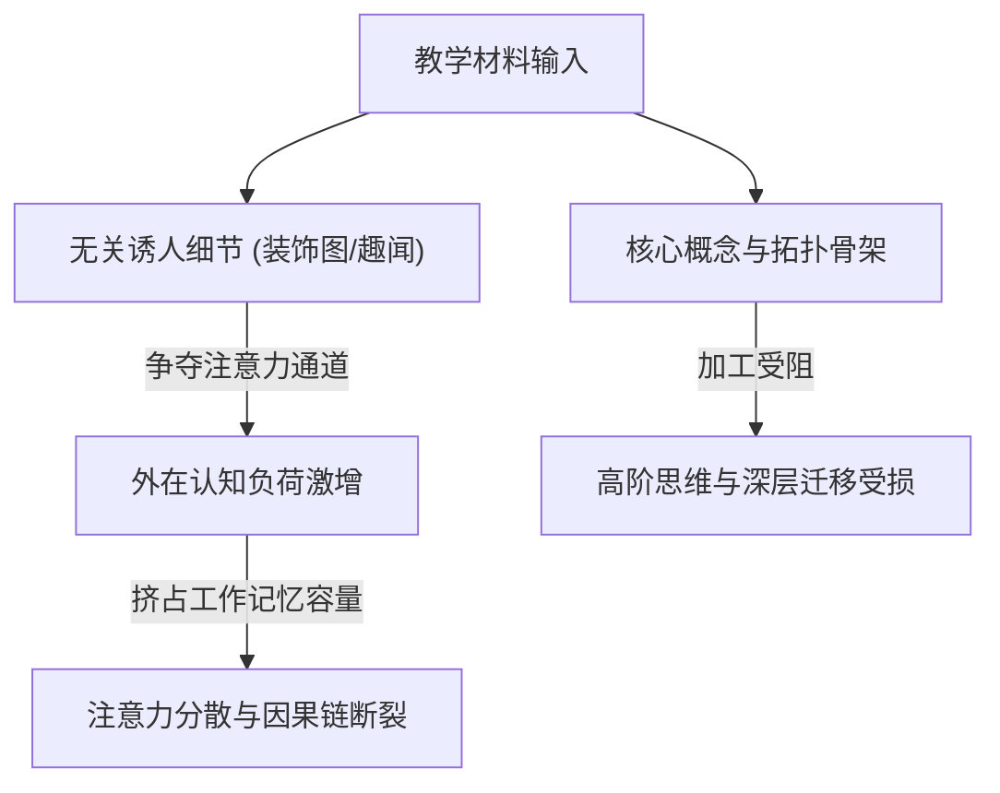

# Seductive Details Effect

---

## 定义

> [!def] 核心定义
> 诱人细节效应（Seductive Details Effect）是指在教学文本、多媒体课件或图示材料中，加入虽然高度有趣、引人入胜但与核心教学目标和本质语义拓扑无关的细节信息（如装饰性插图、背景音效、生动趣闻或无关视觉动画），反而分散学习者的注意力资源、增加外在认知负荷，并最终显著损害对核心知识的深层理解与[[Higher-Order Thinking Skills|高阶思维]]迁移的认知心理学现象。[[Argument_Lei_Ding_Chiu_2026_ERR|(Lei et al., 2026, pp. 4, 12)]]

> [!concept-lens] 概念透镜
> - **含义** 教学设计中“有趣性”与“目标相关性”脱节带来的认知干扰代价。
> - **用途** 解释为什么低年龄学习者在面对富媒体或复杂视觉组织器时容易迷失重点，指导极简高效的可视化脚手架设计。
> - **边界** 诱人细节特指与核心学习目标无关的附加信息；若生动细节本身直接承载核心概念与因果机制，则属于有效表征而非诱人细节。

> [!citation-card]- 关键表述
> 无关的图示细节（如装饰性图像）更容易分散小学生的注意力并阻碍其对[[Graphic Organizer|图形组织器]]的有效利用，产生显著的诱人细节效应；相比之下，高年级学生具备更强的抗干扰与[[Meta-Representational Competence|元表征能力]]。[[Argument_Lei_Ding_Chiu_2026_ERR|(Lei et al., 2026, pp. 4, 12)]]
>
> *Moreover, unimportant graphic organizer details (e.g., images) more readily distract primary school students and hinder their graphic organizer use, compared to older students (seductive-details effect, Rowland-Bryant et al., 2009)...*

> [!boundary]- 概念边界
> - 不等于 趣味化教学原则：适度趣味化能够激发学习者的情境兴趣，但诱人细节效应警示：脱离核心概念逻辑的纯装饰性趣味会侵占有限的[[Working Memory|工作记忆]]容量。
> - 不等于 有效双重[[Coding in Qualitative Research|编码]]：在[[Dual Coding Theory|双重编码理论]]中，图文协同必须围绕同一核心命题展开；诱人细节则属于图文不一致或视觉冗余。

---

## 概念辨析

> [!contrast-table] 诱人细节 vs 核心图示表征 vs 认知脚手架
> | 比较维度 | 诱人细节（Seductive Details） | 核心图示表征（Core Visuals） | 认知脚手架（Cognitive Scaffolding） |
> |---|---|---|---|
> | **信息属性** | 有趣但与核心概念拓扑无关的附加视听信息 | 直接表征核心概念、[[Causality\|因果关系]]与拓扑结构的图示 | 引导学习者进行分析、评价与推理的结构化支撑 |
> | **认知负荷影响** | 显著增加外在认知负荷，争夺[[Working Memory\|工作记忆]] | 卸载言语工作记忆维持负荷，促进图示整合 | 降低检索门槛，释放心智资源投入[[Higher-Order Thinking Skills\|高阶思维]] |
> | **对促学效应的调节** | 负向干扰深层迁移，在小学生中干扰尤甚 | 正向促进深层理解与关系识别 | 显著提升发散与聚合推理表现 |

---

## 核心机制

> [!feature] 诱人细节的三重认知干扰机制
> - **注意力分散机制（Distraction）** 鲜艳的插画、无关动画或趣闻优先抢占有限的感官注意通道，导致学习者忽视核心文本或拓扑连线。
> - **心理模型阻碍机制（Disruption）** 学习者在构建概念心理模型时，试图将无关细节强行整合进因果逻辑链条，导致心理表征支离破碎。
> - **错误图式激活机制（Diversion）** 诱人细节容易激活与学习主题无关的不恰当长时记忆先验图式，误导后续信息加工路径。

---

## 围绕概念形成的命题

---

### 命题一　诱人细节效应的干扰强度受学习者元表征能力与认知成熟度的显著调节

> [!concept-lens] 年龄发展与抗干扰门槛
> 小学生尚未发展出成熟的[[Meta-Representational Competence|元表征能力]]，对视觉装饰信息的过滤与选择性注意调控较弱，因而最易遭受诱人细节的负面干扰。

> [!claim] Rowland-Bryant et al.; Lei, Ding & Chiu
> **学段发展与诱人细节敏感性** 在[[Graphic Organizer|图形组织器]]促学效应的[[Meta-analysis|元分析]]中，小学生[[Higher-Order Thinking Skills|高阶思维]]获益（$g = 0.877$）显著低于中学生（$g = 1.113, W = 6.10, p = .014$）。这一现象的核心解释之一即为小学生在面对带有丰富图像与色彩的视觉图示时，难以抑制诱人细节效应的干扰，无法精准聚焦于节点间的语义逻辑连线；而中学生具备更强的主动过滤与图式抽象能力，能最大化榨取空间表征的认知红利。[[Argument_Lei_Ding_Chiu_2026_ERR|(Lei et al., 2026, pp. 4, 12)]]

---

## 实证数据

> [!ma-table]- 一阶[[Meta-analysis|元分析]]相关结果
> 
>
> | 一阶元分析 | 涉及现象与调节维度 | 亚组与效应量 $g$ | 组间检验 $Q_b$ / $W$ | 理论机制解释 |
> |---|---|---|---|---|
> | [[Argument_Lei_Ding_Chiu_2026_ERR\|Lei et al. (2026)]] | 学习者学段对[[Graphic Organizer\|图形组织器]]促学效应的调节 | 小学生（$g = 0.877$） vs 中学生（$g = 1.113$） | $W = 6.10, p = .014$ | 小学生[[Meta-Representational Competence\|元表征能力]]弱，更易受诱人细节干扰，中学生获益显著更高 |

---

## 相关研究

> [!evidence-grid-a] 相关研究索引
> - [[Argument_Lei_Ding_Chiu_2026_ERR|Lei et al. (2026)]] 在[[Meta-analysis|元分析]]中将诱人细节效应作为解释基础教育不同学段学生利用可视化工具获益差异的核心理论机制。
