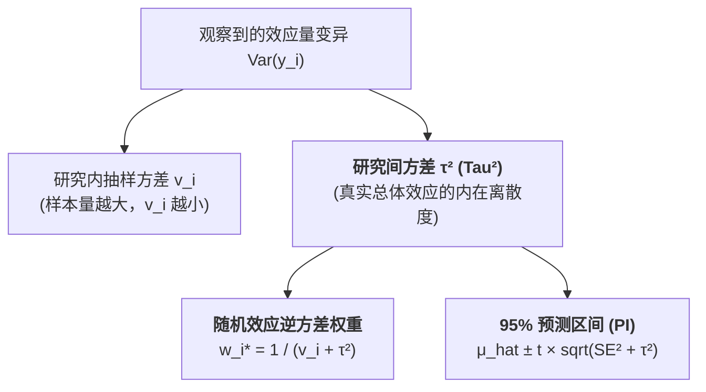

# Between-Study Variance

---

## 定义

> [!def] 核心定义
> 研究间方差（Between-Study Variance，符号记为 $\tau^2$ 或 $\text{Tau}^2$）是随机效应[[Meta-analysis|元分析]]模型中的核心统计参数。它衡量的是各项初级研究背后的“真实[[Effect Size|效应量]]”（True Effect Sizes）分布的方差，代表了[[Sampling Error|抽样误差]]（Sampling Error, $v_i$）之外、由不同研究人群特征、干预实施强度、测量工具与情境条件等实质性差异所引起的跨研究变异总量。[[Argument_Higgins_2016_RE|(Higgins, 2016, pp. 38–39)]]; [[Argument_Cohen_Manion_Morrison_2011_Routledge_Ch17|(Cohen et al., 2011, Ch. 17)]]

> [!concept-lens] 概念透镜
> - **含义** 将观察到的总方差严格分解为“研究内抽样误差”（Within-study variance $v_i$）与“研究间真实方差”（Between-study variance $\tau^2$）。
> - **用途** 用于构建随机效应[[Inverse-Variance Weighting|逆方差加权]]权重 $w_i^* = \frac{1}{v_i + \tau^2}$、计算 [[I-squared Statistic|I² 统计量]] 以及构建 95% [[Prediction Interval|预测区间]]。
> - **边界** $\tau^2$ 衡量的是真实效应的绝对离散尺度（量纲与效应量平方相同），不受[[Sample Size Determination|样本量]]大小影响；而 $I^2$ 衡量的是[[Heterogeneity|异质性]]占总变异的相对比例。

---

## 概念辨析

> [!contrast-table] 研究间方差与相近[[Heterogeneity|异质性]]参数辨析
> | 维度 | 研究间方差（$\tau^2$） | 研究间标准差（$\tau$） | [[I-squared Statistic|I² 统计量]] | [[Cochran's Q Test|Cochran's Q 检验]] |
> |---|---|---|---|---|
> | **数学性质** | 真实效应分布的方差参数 | 真实效应分布的标准差 | 异质性方差占总变异的百分比（$0\%–100\%$） | 加权离差平方和统计量 |
> | **量纲尺度** | 效应量的平方尺度（如 $g^2, d^2$） | 与效应量相同尺度（如 $g, d, r$） | 无量纲（相对比例） | 服从 $\chi^2_{k-1}$ 分布 |
> | **[[Sample Size Determination|样本量]]敏感性** | 不随初级研究样本量 $N$ 系统性变动 | 不随样本量系统性变动 | 随初级[[Study Population and Sample|研究样本]]量增大而趋向升高 | 极度依赖样本量与研究数 $k$ |
> | **主要用途** | 分配随机效应权重、计算[[Prediction Interval|预测区间]] | 直观解读真实效应在总体中的波动幅度 | 向读者报告异质性严重程度等级 | [[Hypothesis|假设]]检验判定异质性是否显著存在 |

---

## 核心数学原理与估计方法

### 1. DerSimonian-Laird (DL) 经典矩估计法

> [!formula-step] DerSimonian-Laird 封闭解公式
> DerSimonian & Laird (1986) 提出了最经典的非迭代矩估计法：
>
> $$\hat{\tau}_{\text{DL}}^2 = \max\left(0, \; \frac{Q - (k - 1)}{\sum w_i - \frac{\sum w_i^2}{\sum w_i}}\right)$$
>
> 其中：
> - $Q = \sum_{i=1}^k w_i (y_i - \hat{\theta}_{\text{FE}})^2$ 为 Cochran's [[Cochran's Q Test|Q 统计量]]；
> - $k$ 为纳入研究数，$k - 1$ 为无[[Heterogeneity|异质性]]假定下 $Q$ 的期望值；
> - $w_i = \frac{1}{v_i}$ 为固定效应权重。
>
> **机制解读** 分子 $Q - (k - 1)$ 代表超出纯[[Random Sampling|随机抽样]]误差的“多余变异总量”；分母是权重系数的修正因子。若 $Q \le k - 1$，表明观察到的差异完全可由抽样随机性解释，截断为 $\hat{\tau}^2 = 0$，[[Fixed-Effect and Random-Effects Models|随机效应模型]]自动退化为固定效应模型。

### 2. 现代迭代估计法（REML 与 Paule-Mandel）

> [!math-principle] 限制性最大似然估计（REML）
> 现代统计学（Viechtbauer, 2005）推荐在连续型数据中使用**限制性最大似然法（REML）**或 **Paule-Mandel (PM) 经验贝叶斯法**。相比 DL 矩估计法，REML 能够有效避免在极小样本或高度偏态分布下低估 $\tau^2$ 的缺陷，是 R · `metafor` 包中的默认标准算法。

---

## 统计功能与影响机制

> [!feature] $\tau^2$ 对[[Meta-analysis|元分析]]推断的核心调节作用
> - **权重再平衡（Weight Leveling）** 当 $\tau^2$ 较大时，各研究的随机权重 $w_i^* = \frac{1}{v_i + \tau^2}$ 趋于相等，有效防止单一大样本研究垄断合并结论，赋予小样本研究适度的话语权。
> - **[[Standard Error|标准误]]扩张与保守推断** 随机效应合并估计量的方差为 $\text{Var}(\hat{\mu}) = \frac{1}{\sum w_i^*}$。$\tau^2$ 的存在使得合并[[Confidence Interval|置信区间]]展宽，反映了外推至更广总体的真实不确定性。
> - **[[Prediction Interval|预测区间]]构建基石** 在估计未来一项同类新研究的潜在效应范围时，$\tau^2$ 提供了个体研究效应离散度的直接测度。

---

## 相关研究

> [!evidence-grid-a] 相关研究索引
> - [[Argument_Higgins_2016_RE|Higgins (2016)]] — 系统阐述[[Meta-analysis|元分析]]中研究间方差 $\tau^2$ 的统计定位与[[Heterogeneity|异质性]]量化演进。
> - [[Argument_Cohen_Manion_Morrison_2011_Routledge_Ch17|Cohen, Manion & Morrison (2011, Ch17)]] — 介绍固定与[[Fixed-Effect and Random-Effects Models|随机效应模型]]中 $\tau^2$ 的计算原理与实践意义。
