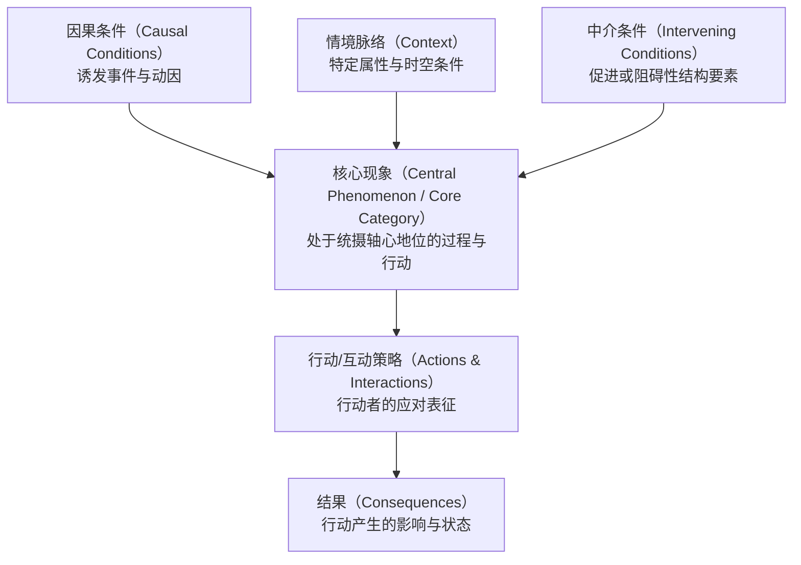
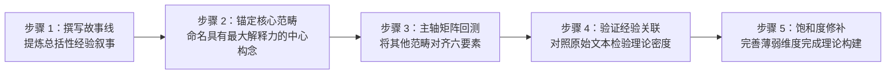

# Central Phenomenon

---

## 定义

> [!def] 核心定义
> **核心现象（Central Phenomenon，在[[Grounded Theory|扎根理论]]分析中深化为核心范畴 Core Category）** 是[[Qualitative Research|质性研究]]与[[Grounded Theory|扎根理论]]中用于探索、理解与理论建构的统摄性轴心概念。在研究设计阶段，它是质性[[Purpose Statement|目的陈述]]与[[Central Question|核心研究问题]]所推进的单一核心观念，有别于[[Quantitative Research|量化研究]]对多[[Variable|变量]]关联或群组比较的先验设定（[[Argument_Creswell_2022_SAGE|Creswell & Creswell, 2022, p. 125]]）；在数据分析与理论生成阶段，核心现象是扎根理论[[Axial Coding|主轴编码]]与[[Selective Coding|选择性编码]]中具有最大解释力（greatest explanatory potential）的中心范畴，所有其他范畴、因果条件、中介机制与行动策略均围绕其展开系统整合、校验并凝聚为连贯的理论[[Story Line|故事线]]（Strauss, 1987, p. 11；Strauss & Corbin, 1990, p. 116；[[Argument_Cohen_Manion_Morrison_2011_Routledge_Ch30|Cohen et al., 2011, p. 561]]）。

> [!concept-lens] 概念透镜
> - **含义** 质性探究的意义引力中心：在微观文本拆解与范畴建构中，作为统摄经验碎片、凝聚理论故事线（Storyline）并达成概念密度（Conceptual density）的轴心支点。
> - **用途** 在研究筹划期充当目的陈述[[Research Writing Script|写作脚本]]与核心提问的聚焦基准；在主轴[[Coding in Qualitative Research|编码]]中充当六要素因果[[Paradigm|范式]]模型的中心锚点；在选择性编码中充当将分散范畴升华为实质理论的整合枢纽。
> - **边界** 核心现象不同于量化[[Variable|变量]]——变量追求[[Operationalization|操作化]]测量与方差解析，核心现象追求情境扎根性、解释张力与概念深度；核心现象亦不同于宽泛的[[Research Topic|研究主题]]（Research Topic）——主题界定探究的宏观领域，核心现象界定具体展开的认知机制与动态行动过程。

> [!citation-card] Strauss 论核心范畴的最大解释潜力
> 核心范畴是在文本数据中具有最大解释潜力的范畴，其他范畴和次级范畴反复且紧密地与之产生实质关联。选择性编码正是识别文本中的这一核心范畴，并将所有已建立的范畴围绕其进行系统整合并验证的过程。[[Argument_Cohen_Manion_Morrison_2011_Routledge_Ch30|(Cohen et al., 2011, p. 561)]]
>
> *A core category is that which has the greatest explanatory potential and to which the other categories and subcategories seem to be repeatedly and closely related... It is the central category or phenomenon around which all the other categories identified and created are integrated. (Strauss, 1987, p. 11; Strauss & Corbin, 1990, p. 116)*

> [!citation-card] Creswell & Creswell 论单一现象聚焦
> 质性目的陈述不传达关联两个或多个变量，亦不比较两个或多个群体，而是推进一个单一现象。研究者围绕核心现象收集来自参与者和研究场所的数据，理解这一概念在特定情境中的深层复杂性。[[Argument_Creswell_2022_SAGE|(Creswell & Creswell, 2022, p. 125)]]
>
> *A qualitative purpose statement does not convey relating two or more variables or comparing two or more groups, as in quantitative research. Instead, it advances a single phenomenon.*

> [!boundary]- 概念边界
> - 不等于 量化研究的[[Dependent Variable|因变量]] — 因变量是预设[[Scale of Measurement|测量尺度]]的反应变量；核心现象是开放探索中动态浮现与澄清的整体性概念空间。
> - 不等于 宽泛研究主题（Research Topic） — 主题是宏观领域（如“教师职业发展”），核心现象是主题之下聚焦探索的具体过程概念（如“教师专业身份的边缘化处境”）。
> - 不等于 孤立的局部编码标签 — 普通代码（Codes）记录文本片断的微观特征，核心现象是统摄全部编码网络的上位核心范畴（Core Category）。

---

## 概念辨析

核心现象在[[Qualitative Research|质性研究]]全流程中承载双重使命（设计端聚集与分析端统摄），与相邻方法学术语具有明确区别：

> [!contrast-table] 核心现象与相关方法学术语对比
> | 维度 | 核心现象（Central Phenomenon / Core Category） | 量化[[Variable\|变量]]（Variable） | [[Research Topic\|研究主题]]（Research Topic） | [[Unit of Analysis\|分析单位]]（Unit of Analysis） | 普通分析范畴（Analytic Category） |
> |---|---|---|---|---|
> | **[[Ontology\|本体论]]定位** | 质性探究的意义整合中心与过程轴心 | 可测量的属性或特征变异体 | 宽泛的学科[[Areas of Knowledge\|知识领域]]或议题范围 | 观察与测量的实体边界或文本载体 | 某一维度属性的分类容器 |
> | **结构构型** | 辐射状网络中心（统摄因果条件与行动结果） | 线性因果链中的节点（[[Independent Variable\|自变量]]/[[Dependent Variable\|因变量]]） | 包含众多子现象的宏观集合 | 物理、语法或语义层级的切片片段 | 局部层级从属节点 |
> | **演化形态** | 尝试性提出，随数据迭代深化为核心范畴 | 在研究设计之初即严格预先界定 | 在研究周期内通常保持相对宽泛稳定 | 在[[Coding in Qualitative Research\|编码]]分析规程中保持相对恒定 | 随编码不断增加、合并或调整 |
> | **[[Epistemology\|认识论]]追求** | 过程理解、情境扎根性与理论概念密度 | 统计相关性、因果推论与[[External Validity\|可推广性]] | 界定探究疆域与[[Document\|文献]][[Dialogue in Education\|对话]]入口 | 确保测量[[Reliability\|信度]]、语义效度与防止去情境化 | 组织具体编码与消除范畴交叉 |
> | **代表学者** | Strauss & Corbin (1990); [[Argument_Creswell_2022_SAGE\|Creswell & Creswell (2022)]] | Kerlinger (1986); [[Argument_Cohen_Manion_Morrison_2011_Routledge\|Cohen et al. (2011)]] | Booth et al. (2008) | Krippendorff (2004); Lincoln & Guba (1985) | Mayring (2004); Spradley (1979) |

---

## 理论机制与双重视角

核心现象在现代[[Qualitative Research|质性研究]]方法论中由两大理论支柱共同支撑：[[Constructivist Paradigm|建构主义]]探究设计的非方向性聚焦机制，以及[[Grounded Theory|扎根理论]]主轴与[[Selective Coding|选择性编码]]的轴心整合机制。

### 机制一　扎根理论主轴与选择性编码的轴心统摄

安塞尔姆·施特劳斯与朱丽叶·科宾（Anselm Strauss & Juliet Corbin, 1990；[[Argument_Cohen_Manion_Morrison_2011_Routledge_Ch30|Cohen et al., 2011, p. 561]]）论证，质性数据分析从离散[[Coding in Qualitative Research|编码]]迈向理论建构的关键飞跃，取决于核心现象的确立：

1. **六要素[[Paradigm|范式]]模型的引力轴心** 在[[Axial Coding|主轴编码]]中，核心现象占据结构拓扑的绝对中心。因果条件解释核心现象何以产生，情境脉络与中介条件划定核心现象展开的约束[[Champ|场域]]，行动与互动策略是当事人针对核心现象作出的动态反应，而结果则是该应对机制的衍生状态。脱离核心现象，六要素模型将坍缩为互不连贯的碎片。
2. **选择性编码的[[Story Line|故事线]]（Story Line）与概念密度** 在选择性编码阶段，研究者必须识别并最终确立那一个具有最大解释潜力的核心范畴（Strauss, 1987, p. 11）。确立核心范畴依赖于：
   - 深入领悟主导故事线（对主要现象及其显著特征的整体性叙事概括）；
   - 确立核心范畴并将其他所有范畴在维度属性层面与之对接；
   - 依据经验证据持续校验这些关联关系；
   - 针对范畴空白进行[[Saturation|理论饱和]]填充，达成理论的高概念密度（Conceptual density）（Strauss & Corbin, 1990, pp. 116–117；[[Argument_Cohen_Manion_Morrison_2011_Routledge_Ch30|Cohen et al., 2011, p. 561]]）。
3. **层级包容系统（Hierarchies of Subsumption）的顶点** 描述性编码归并于分析编码与主轴编码之下，而主轴编码最终在最高层级统摄于选择性编码（核心范畴）之下。核心范畴构成了整套质性编码树的最高统摄节点（Gibbs, 2007；[[Argument_Cohen_Manion_Morrison_2011_Routledge_Ch30|Cohen et al., 2011, p. 561]]）。

---

### 机制二　建构主义探究设计的非方向性聚焦

约翰·克雷斯威尔（John W. Creswell, 2022）从探究设计与学术表述规范出发，确立了核心现象在质性设计前端的四大约束机制：

1. **单一聚焦原则（Single Focus）** 质性探究在起点处必须严格聚焦于一个核心概念或想法，而非预设多个概念的相互关系。尽管随着分析推进可能会浮现多重关联，但研究开端若试图同时追逐多个中心，势必削弱[[Rich and Thick Description|深描]]（Thick Description）的质性解释力。
2. **开放演化特征（Tentative and Evolving）** 核心现象在研究初期的界定是探索性的，随访谈与观察的深化而动态演变，不同于量化[[Operationalization|操作化]]定义的预先封闭。
3. **行动指向动词（Action-oriented Verbs）** 围绕核心现象表述的探究行动必须采用探索性动词（如“理解”、“探索”、“发现”、“生成”、“阐释意义”），严禁使用“检验”、“证明”、“测定”等[[Positivism|实证主义]]验证性词汇。
4. **麦克拉肯[[Nondirectional Language|非方向性法则]]（Law of Nondirection）** 格兰特·麦克拉肯（Grant McCracken, 1988）指出，质性研究必须坚持非方向性语言（Nondirectional language）。在界定核心现象时，使用“有用的”、“成功的”、“消极的”等带有价值预判的修饰语，会在探究之初强行给经验材料注入方向性偏见（[[Argument_Creswell_2022_SAGE|Creswell & Creswell, 2022, p. 126]]）。例如：
   - 违规表述：探索初任教师**成功**应对工作压力的机制（预设了成功方向）；
   - 规范表述：探索初任教师应对工作压力的**经验过程**（保持开放中立）。

---

### 命题总览

> [!contrast-table] 核心现象核心理论命题总览
> | 命题类型 | 核心理论判定 | 方法论机制 | 代表学者与[[Document\|文献]]出处 |
> |---|---|---|---|
> | **最大解释力命题** | 扎根理论的理论整合必须收敛于一个具有最大解释潜力的核心范畴，方能建构高密度实质理论 | 范畴系统整合、故事线聚合、概念饱和度 | Strauss (1987, p. 11); [[Argument_Cohen_Manion_Morrison_2011_Routledge_Ch30\|Cohen et al. (2011, p. 561)]] |
> | **非方向性[[Emergence\|涌现]]命题** | 核心现象的语言表述必须摒弃方向性价值预设，以确保经验材料的开放性生成与真实性呈现 | 非方向性法则、开放性探索动词脚本 | McCracken (1988); [[Argument_Creswell_2022_SAGE\|Creswell & Creswell (2022, p. 126)]] |
> | **轴心拓扑整合命题** | 核心现象在主轴编码中充当引力中心，将条件、脉络、策略与结果结构化为有机因果网络 | 六要素范式模型、因果拓扑映射 | Strauss & Corbin (1990, p. 96); [[Argument_Cohen_Manion_Morrison_2011_Routledge_Ch30\|Cohen et al. (2011, p. 562)]] |

---

## 概念演变

> [!dev-timeline] 概念演变
> - **1967 — [[Grounded Theory|扎根理论]]核心范畴提出** 巴尼·格拉瑟与安塞尔姆·施特劳斯（Glaser & Strauss, 1967）在《扎根理论的发现》中提出“核心范畴（Core Category）”，作为持续比较分析中统摄其他类属的理论基石。
> - **1987–1990 — [[Paradigm|范式]]模型与[[Story Line|故事线]]规范化** 施特劳斯（Strauss, 1987）与施特劳斯与科宾（Strauss & Corbin, 1990）系统确立六要素范式模型，将核心现象正式确立为[[Axial Coding|主轴编码]]的结构枢纽与[[Selective Coding|选择性编码]]中故事线的核心承载者。
> - **1994–2003 — [[Qualitative Research|质性研究]]设计规范化** 约翰·克雷斯威尔（Creswell, 1994, 2003）将“核心现象”引入质性研究设计规范，确立了[[Purpose Statement|目的陈述]]脚本、核心提问公式与[[Nondirectional Language|非方向性语言]]准则。
> - **2011 — [[Coding in Qualitative Research|编码]]阶梯与教材方法论定型** [[Louis Cohen|路易斯·科恩]]等（[[Argument_Cohen_Manion_Morrison_2011_Routledge|Cohen et al., 2011]]）在经典专著第 30 章中，将核心现象打通并嵌入[[Content Analysis|内容分析]]与编码包容层级架构（Ch. 30），阐释其与[[Domain Analysis|领域分析]]及理论生成的衔接规程。
> - **2020s — 计算质性分析与人机协同演进** 在 [[Qualitative Computer Software|CAQDAS]] 语义知识图谱与大语言模型（LLM）时代，文本主题建模（Topic Modeling）与无监督语义聚类能够快速生成候选核心节点，但最终对核心现象的理论命名、主轴关系对齐与[[Epistemology|认识论]]审校，仍依赖人类学者的[[Reflexivity|反身性]]判断。

---

## 争议与批评

> [!debates] 学术争议
>
> > [!axis] 单一核心范畴（Single Core） vs 多元网状范畴（Multiple Centers）
> > 争论理论建构是否必须强行收敛于单一核心范畴，抑或可以容纳多个并列或块茎式（Rhizomatic）的分布式理论中心。
> >
> > - **Strauss & Corbin (1990)** 坚持一元整合原则，认为[[Grounded Theory|扎根理论]]必须具备一个主导性核心范畴，否则理论将失去概念聚集力与清晰的[[Story Line|故事线]]。
> > - **[[Constructivist Paradigm|建构主义]]与后现代学者（Charmaz, 2006; Clarke, 2005）** 批评强求单一核心范畴是结构功能主义的简化残余，主张社会生活充满多重矛盾与去中心化特征，应允许情境分析（Situational Analysis）展现多元弥散的理论构型。
>
> > [!axis] 预先设计锚定（Pre-figured） vs 完全后生[[Emergence|涌现]]（Emergent）
> > 争论研究者在进入田野前是否可以在[[Purpose Statement|目的陈述]]中预设尝试性核心现象。
> >
> > - **[[Argument_Creswell_2022_SAGE|Creswell & Creswell (2022)]]** 主张在研究提议中设定明确的初步核心现象是获得学术论证合法性与对齐[[Research Question|研究问题]]的必要规范，只要保持开放演化即可。
> > - **Glaser (1992)** 强烈反对任何形式的前置预设，坚称真正的核心范畴必须完全在彻底沉浸于数据后自然浮现，任何前置[[Research Writing Script|写作脚本]]都会诱发对经验材料的形式主义强加。

---

## 操作程序

### 规程一　质性目的陈述与核心提问的标准脚本操作

依据约翰·克雷斯威尔（[[Argument_Creswell_2022_SAGE|Creswell & Creswell, 2022, pp. 125–130]]），核心现象在[[Qualitative Research|质性研究]]前端的标准化操作规程如下：

> [!proc] [[Purpose Statement|目的陈述]][[Research Writing Script|写作脚本]]中的核心现象操作
> 1. **选定核心探索动词** 使用“理解”、“探索”、“发现”、“描述”等非方向性动词；
> 2. **嵌入核心现象** 明确填写单一概念，坚决剔除任何暗示积极或消极结果的方向性修饰词；
> 3. **锚定研究参与者与场所** 标明具体情境边界；
> 4. **提供尝试性操作界定** 依据已有[[Document|文献]]或前期观察，给出核心现象在当前研究阶段的暂定工作定义。
>
> 标准化脚本模板格式：
> > 本质性研究的目的是为了**探索/理解**（参与者）在（研究场所）所经历的**【核心现象】**。在研究目前阶段，**【核心现象】**被初步定义为……

> [!proc] [[Central Question|核心研究问题]]转化规程
> 将目的陈述中的核心现象直接转换为质性核心问题（Central Question）：
> - 句型公式：*What is the [核心现象] for [参与者] at [研究场所]?*
> - 追问原则：始终紧扣“一个核心观念”，子问题（Sub-questions）只能作为该核心现象的不同维度细化或时间阶段展开，严禁在子问题中节外生枝引入新的并列现象。

---

### 规程二　扎根理论中核心范畴的提炼与故事线整合

依据安塞尔姆·施特劳斯与朱丽叶·科宾（Strauss & Corbin, 1990；[[Argument_Cohen_Manion_Morrison_2011_Routledge_Ch30|Cohen et al., 2011, p. 561]]），从微观[[Coding in Qualitative Research|编码]]提炼核心现象的标准操作五步法：

> [!proc] 核心范畴提炼五步操作规程
> 1. **撰写描述性[[Story Line|故事线]]（Story Line）** 暂时抽离微观代码，用通俗语言写下一篇 1–2 页的整体叙事概览，描绘核心人物在特定情境中所遭遇的核心困境与主要行动过程。
> 2. **提炼并命名核心范畴（Core Category）** 从故事线中提取出那个统摄全部情节、在数据中反复高频[[Emergence|涌现]]、且对其他所有范畴具备最强解释潜力的上位概念。
> 3. **主轴[[Paradigm|范式]]六要素回测对齐** 检验核心范畴是否能够自洽地作为中心纽带，将因果条件、中介脉络、行动策略与衍生结果严密编织在一起。
> 4. **对照原始经验文本验证关联** 重新调取不同参与者的原始访谈与现场切片，检验各范畴在维度属性上的关联是否契合现实数据，防止产生脱离数据的空洞理论[[Hypothesis|假设]]。
> 5. **修补范畴漏洞并达致[[Saturation|理论饱和]]** 审查核心范畴内部是否存在概念薄弱点或未饱和维度，开展针对性的[[Theoretical Sampling|理论抽样]]与补充编码，直至理论体系达到完全的概念密度与逻辑自洽。

---

### 经典实证案例中的核心现象表述范例

> [!table] 跨质性研究流派经典文献中的核心现象操作范例
> | [[Research Topic\|研究主题]]领域 | 核心现象规范表述（Central Phenomenon） | 质性探究进路 | 实证文献出处 |
> |---|---|---|---|
> | 教师边缘化处境 | 教师专业身份的边缘化历程与学校生存体验 | [[Narrative Research\|叙事研究]]（Narrative） | Huber & Whelan (1999); [[Argument_Creswell_2022_SAGE\|Creswell & Creswell (2022, p. 125)]] |
> | 体育场日常互动 | 职业棒球场基层员工的劳动文化与组织认同实践 | [[Ethnography\|民族志]]（Ethnography） | Trujillo (1992) |
> | 疾病社会心理表征 | 慢性感染者对艾滋病病理与自我的认知表征建构 | 质性描述（Qualitative） | Anderson & Spencer (2002) |
> | 创伤与哀伤经验 | 女性在晚期妊娠失子后的具身生活体验与记忆重建 | [[Phenomenology\|现象学]]（Phenomenology） | Lauterbach (1993) |
> | 弱势学生支持机制 | 教师面向学业受挫学生的关怀关系与专业实践互动 | [[Case Study\|案例研究]]（Case Study） | Frelin (2015) |
> | 移民二代课程认同 | 华裔移民学生在学校主流课程中家庭叙事的交织调和 | 叙事探究（Narrative） | Chan (2010) |
> | 教师工作压力与应对 | 教师工作压力的多维结构、累积性本质与防御性应对机制 | [[Qualitative Content Analysis\|质性内容分析]]与[[Grounded Theory\|扎根理论]] | [[Argument_Cohen_Manion_Morrison_2011_Routledge_Ch30\|Cohen et al. (2011, pp. 568–572)]] |

---

## 相关研究

> [!evidence-grid-a] 相关研究索引
> - [[Argument_Creswell_2022_SAGE|Creswell & Creswell (2022)]] — 系统确立核心现象在[[Qualitative Research|质性研究]][[Purpose Statement|目的陈述]]与核心提问中的单一聚焦规范与[[Nondirectional Language|非方向性语言]]准则（Ch. 6 & 7）。
> - [[Argument_Cohen_Manion_Morrison_2011_Routledge|Cohen et al. (2011)]] — 在[[Grounded Theory|扎根理论]]主轴与[[Selective Coding|选择性编码]]专节中系统阐释核心范畴的最大解释潜力、[[Story Line|故事线]]整合与包容层级统摄机制（Ch. 30）。

---

## 知识网络

> [!rel-table] 关联知识实体
> | 关联实体 | 实体类型 | 关联本质说明 | [[Document\|文献]]出处 |
> |---|---|---|---|
> | [[Axial Coding\|主轴编码]] | 方法 | 核心现象构成了主轴[[Coding in Qualitative Research\|编码]]六要素[[Paradigm\|范式]]模型不可或缺的拓扑引力中心。 | Strauss & Corbin (1990, p. 96) |
> | [[Grounded Theory\|扎根理论]] | 方法 | 核心现象在扎根理论理论建构中最终深化为统领全局的“核心范畴（Core Category）”。 | Glaser & Strauss (1967) |
> | [[Unit of Analysis\|分析单位]] | 概念 | 分析单位为核心现象的经验观察与文本抽取提供了微观操作边界与语境支撑。 | Krippendorff (2004) |
> | [[Domain Analysis\|领域分析]] | 概念 | 领域分析发掘的宏观象征范畴与层级包容结构，为核心范畴的提炼提供了上位分类地基。 | Spradley (1979) |
> | [[Qualitative Codebook\|质性编码本]] | 概念 | 核心现象及其下辖主轴范畴直接决定了质性编码本的核心架构与层级树状展开。 | [[Argument_Cohen_Manion_Morrison_2011_Routledge_Ch30\|Cohen et al. (2011, p. 562)]] |
> | [[Purpose Statement\|目的陈述]] | 概念 | 核心现象是质性目的陈述[[Research Writing Script\|写作脚本]]中最核心的必填[[Construct\|构念]]，界定探究的实质灵魂。 | [[Argument_Creswell_2022_SAGE\|Creswell & Creswell (2022, p. 125)]] |
> | [[Central Question\|核心研究问题]] | 概念 | 核心[[Research Question\|研究问题]]是核心现象在问题层面的直接转化与句法对应。 | Creswell & Creswell (2022, Ch. 7) |
> | [[Nondirectional Language\|非方向性语言]] | 概念 | 非方向性法则是界定核心现象不可逾越的方法论纪律，严防价值预设污染探究。 | McCracken (1988) |
> | [[Story Line\|故事线]] | 概念 | 撰写主导故事线是研究者从复杂数据中锁定并提炼核心现象的关键跳板。 | Strauss & Corbin (1990, p. 117) |
> | [[Saturation\|理论饱和]] | 概念 | 当针对核心现象及其属性的补充抽样不再产生新的理论见解时，探究达到饱和状态。 | Strauss (1987) |
