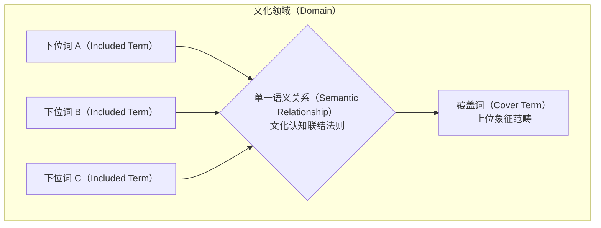

# Domain Analysis

---

## 定义

> [!def] 核心定义
> **领域分析（Domain Analysis，又称象征范畴分析）** 是[[Qualitative Research|质性数据分析]]与[[Content Analysis|内容分析]]中将初级编码与离散文本片段系统归纳为上位象征范畴的结构化分析阶段。在方法论上，一个“领域”（Domain）是指包含若干其他子范畴的象征性上位范畴（Spradley, 1979, p. 100）。领域分析处于建立[[Unit of Analysis|分析单位]]与基础编码之后、建立关系与理论推论之前的核心纽带位置。其核心旨趣在于通过发掘文化符号与经验概念之间的深层语义关系（Semantic Relationships），将高度分散的编码条目聚合成层级化、有条理的意义群组（Clusters）、主题（Themes）与模式（Patterns），从而在精简数据规模的同时，最大程度维护经验材料的情境扎根性（Context-groundedness），筑牢防止文本去情境化的组织屏障（[[Argument_Cohen_Manion_Morrison_2011_Routledge_Ch11|Cohen et al., 2011, p. 440]]；[[Argument_Cohen_Manion_Morrison_2011_Routledge_Ch30|Cohen et al., 2011, pp. 566–567]]）。

> [!concept-lens] 概念透镜
> - **含义** 质性文本分析中的语义拓扑与范畴组织机制：以文化符号的“覆盖词—语义关系—下位词”三元构型为基准，将微观经验切片系统上溯并锚定于具备文化解释力的上位概念空间。
> - **用途** 在质性研究通用分析程序中作为第二步，承接分析单位的离散切分，完成向主题模式的归并提升；在内容分析标准化规程中作为构建分析范畴的核心技术，通过包容层级归并消除范畴重叠，为后续关联检验与理论假设检验奠定结构骨架。
> - **边界** 领域分析不同于初级描述性编码——编码侧重于为具体文本段落贴附微观概念标签，领域分析侧重于建构标签之间的包含关系与逻辑从属层级；领域分析亦不同于主轴编码或因果建模——领域分析本质上是语义层面的分类组织（Categorical organization），旨在澄清“概念是什么以及包含什么”，尚未进入跨领域的命题联结或条件因果推论。

> [!citation-card] Spradley 论象征范畴与符号关系发现
> 领域分析致力于发掘文化符号之间的内在关系。一个领域是包含其他范畴的象征性范畴。民族志探究必须立足参与者的本土语言和分类系统，通过系统搜寻事物名称、界定语义关系并提炼覆盖词，揭示行动者赋予社会世界的认知图式。[[Argument_Cohen_Manion_Morrison_2011_Routledge_Ch30|(Cohen et al., 2011, p. 566)]]
>
> *A domain is any symbolic category that includes other categories... Domain analysis, then, strives to discover relationships between symbols. (Spradley, 1979, pp. 100, 157)*

> [!citation-card] Cohen et al. 论领域分析的防去情境化功能
> 质性分析的核心挑战在于如何在缩减数据规模的同时不抹杀经验情境。构建范畴的阶段即是创建领域分析的过程。将编码单元归入领域、群组、模式和连贯集合，使研究者能够在保持数据丰富性与情境扎根性的同时，将散落的原始文本转化为具备严密分析力度的解释架构。[[Argument_Cohen_Manion_Morrison_2011_Routledge_Ch11|(Cohen et al., 2011, p. 440)]]; [[Argument_Cohen_Manion_Morrison_2011_Routledge_Ch30|(Cohen et al., 2011, p. 566)]]
>
> *This stage of constructing the categories is sometimes termed the creation of a 'domain analysis'. This involves grouping the units into domains, clusters, groups, patterns, themes and coherent sets to form domains... maintaining the richness of the data and context-groundedness. (Cohen et al., 2011, Ch. 11 & Ch. 30)*

> [!boundary]- 概念边界
> - 不等于 [[Coding in Qualitative Research|开放编码（Open Coding）]] — 开放编码关注对离散切片的逐行逐句拆解并赋予微观属性标签；领域分析则是对已有编码的自下而上聚合建构。
> - 不等于 [[Axial Coding|主轴编码（Axial Coding）]] — 主轴编码围绕核心现象构建“因果条件—行动策略—中介条件—结果”的动态因果范式；领域分析主要挖掘静态文化语义关系（如严格包含、空间、功能、理由）。
> - 不等于 简单内容汇总统计 — 领域分析不仅是词频归类，而是重建文化符号背后的本土认知分类法则。

---

## 概念辨析

领域分析在质性数据分析体系中处于承上启下的枢纽层次，与相邻分析进路存在明确的方法论分工：

> [!contrast-table] 领域分析与相邻质性分析进路对比
> | 维度 | 领域分析（Domain Analysis） | 基础/开放编码（Initial Coding） | 扎根理论[[Axial Coding\|主轴编码]]（Axial Coding） | 分类学分析（Taxonomic Analysis） |
> |---|---|---|---|---|
> | **核心分析目标** | 发现符号间语义关系并建构上位象征范畴 | 拆解文本片段并赋予具象概念标签 | 围绕核心现象建立多维度因果模型 | 详尽展示某一单一领域内部的深层下位层级 |
> | **基本组织单元** | 领域（覆盖词与下位词集合） | 初始代码（Codes） | 主轴范畴与因果范式六要素 | 分类阶元（Taxa）与层级子类 |
> | **关系连接机制** | 九类通用语义关系（包含、功能、因果等） | 属性相似性或外显特征贴标 | 范式模型（条件、行动、互动、结果） | 严格的单一垂直从属关系（X 是 Y 的一种） |
> | **认知抽象层次** | 中阶概念聚合（消除范畴交叉） | 低阶经验切片（贴近原始数据） | 高阶动态理论构念关联 | 结构化分类树状体系 |
> | **代表学者出处** | 詹姆斯·斯普拉德利（Spradley, 1979）；[[Argument_Cohen_Manion_Morrison_2011_Routledge_Ch30\|Cohen et al. (2011)]] | 格拉瑟与施特劳斯（Glaser & Strauss, 1967） | 施特劳斯与科宾（Strauss & Corbin, 1990） | 斯普拉德利（Spradley, 1979, 1980） |

### 编码与节点的本体论区隔

克劳斯·克里彭多夫（Klaus Krippendorff, 2004, p. 296）与路易斯·科恩等（[[Argument_Cohen_Manion_Morrison_2011_Routledge_Ch30|Cohen et al., 2011, p. 567]]）深入阐明了编码（Code）与节点/范畴（Node / Category）的本质分野：
- **编码（Code）** 是为特定文本片段所赋予的操作性标签，如同书本中段落旁侧的手批边注，刻画具体文本时刻的微观事实。
- **节点（Node / Domain Category）** 则是不同编码汇聚的归纳性容器，类似于整本书的章节目录或主题框架。节点承载着将散落的编码片段汇聚进概念体系的功能，节点之间可以通过三种方式建立联结：
  1. **定义性联结** 一个概念从内涵上界定另一个概念；
  2. **逻辑性联结** 概念之间存在形式逻辑上的蕴含或排斥；
  3. **经验性联结** 在田野观察或文本中发现二者经常伴随共现。

---

## 理论机制与核心架构

领域分析的运转依托于文化认知图式、通用语义网络以及包容层级归并三重理论机制。

### 机制一　领域的文化三元结构

詹姆斯·斯普拉德利（James Spradley, 1979）论证，人类通过文化符号对世界进行分类与赋予意涵。任何一个完整的文化领域在结构上均由三个不可或缺的要素构成：
1. **覆盖词（Cover Term）** 统摄整个领域的上位文化范畴名称（例如“应对压力的策略”）；
2. **下位词（Included Terms）** 所有从属于该领域的具体概念或经验范畴（例如“跑步锻炼”、“向同行倾诉”、“饮酒借消”）；
3. **语义关系（Semantic Relationship）** 将下位词与覆盖词有机串联成统一知识结构的单一逻辑线索（例如“……是……的一种途径/手段”）。

### 机制二　斯普拉德利九大通用语义关系

在社会生活与语言表达中，人们组织经验知识的深层认知语法可归纳为九种基础语义关系（Spradley, 1979, p. 111；[[Argument_Cohen_Manion_Morrison_2011_Routledge_Ch30|Cohen et al., 2011, p. 566]]）：

> [!table] 斯普拉德利九大通用语义关系矩阵
> | 序号 | 语义关系类型 | 形式化逻辑表达 | 质性经验表述句型 | 教育研究实证应用示例 |
> |---|---|---|---|---|
> | 1 | **严格包含（Strict inclusion）** | $X \text{ is a kind of } Y$ | X 是 Y 的一种 | 巡回讲评是教师课堂观察的一种形式 |
> | 2 | **空间关系（Spatial）** | $X \text{ is a place in / part of } Y$ | X 是 Y 的一个场所 / X 是 Y 的一部分 | 教研室是校园教师非正式互动的一个空间 |
> | 3 | **因果关系（Cause-effect）** | $X \text{ is a result of / cause of } Y$ | X 是 Y 的结果 / 原因 | 领导问责失当是产生职业倦怠的重要原因 |
> | 4 | **理由关系（Rationale）** | $X \text{ is a reason for doing } Y$ | X 是行动者做 Y 的理由 | 维护课堂纪律是实施分组惩戒的解释理由 |
> | 5 | **活动场所（Location for action）**| $X \text{ is a place for doing } Y$ | X 是开展 Y 活动的专门地点 | 教师休息室是教师私下宣泄情绪的场所 |
> | 6 | **功能关系（Function）** | $X \text{ is used for } Y$ | X 用于 Y / X 的功能是 Y | 课堂小测验用于形成性诊断与教学反馈 |
> | 7 | **手段—目的（Means-end）** | $X \text{ is a way to do } Y$ | X 是实现 Y 的一种途径或手段 | 同伴结对帮扶是缓解初任教师焦虑的途径 |
> | 8 | **时序关系（Sequence）** | $X \text{ is a step / stage in } Y$ | X 是开展 Y 的一个步骤或阶段 | 课后集体反思是校本研修流程的关键阶段 |
> | 9 | **属性特征（Attribution）** | $X \text{ is an attribute / characteristic of } Y$ | X 是 Y 的一种内在属性或特征 | 情感消耗是工作压力累积的典型表征 |

### 机制三　包容层级归并与范畴去重机制

在实际文本分析中，初始编码往往存在大量的交叠、歧义与抽象层次差异。若直接对初始编码进行统计或理论推论，会导致模型混乱。路易斯·科恩等（[[Argument_Cohen_Manion_Morrison_2011_Routledge_Ch30|Cohen et al., 2011, pp. 568–572]]）以“教师工作压力（Teacher Stress）”实证案例展示了**包容层级归并（Subsumption）**的标准分析机制：

1. **初始聚合形成宏观领域** 研究者将 33 条描述教师工作压力的语句初步划分为 4 个宏观领域：
   - 压力成因（Causes of stress）
   - 压力本质（Nature of stress）
   - 压力后果（Outcomes of stress）
   - 压力应对（Handling stress）
2. **二级包容归并消除范畴交叉** 针对“压力成因”下过于分散的 23 个具象条目，通过次级覆盖词实施二次归并，建立具有排他性的子领域群组：
   - **个人因素（Personal factors）** 期望受挫、个人时间被侵占、对工作失去热情、缺乏成就感；
   - **环境因素（Environmental factors）** 工作负荷过重、突发变故打乱计划；
   - **管理与领导因素（Management/leadership factors）** 学校管理失效、缺乏减压释放渠道、问题悬而不决；
   - **职业诉求与伦理妥协（Professional matters）** 棘手学生困扰、职业自主权丧失、被迫违背专业良知与道德准则。
3. **主客观双重视角划分** 在“压力本质”领域中，进一步剥离出“客观结构特征”（滚雪球式累积、恶性循环、效应呈指数放大）与“主观感知特征”（压力程度取决于教师赋予事项的重要性评价、与施压者关系越近则压力越大）。

通过多层级的包容归并，零散的语料切片被整合成清晰严密的树状范畴网络，使后续的质性陈述与频率分析得以建立在清晰的概念地基之上。

---

### 命题总览

> [!contrast-table] 领域分析核心理论命题总览
> | 命题类型 | 核心理论判定 | 方法论机制 | 代表学者与文献出处 |
> |---|---|---|---|
> | **认知语法命题** | 文化经验不是离散要素的堆叠，而是由有限的通用语义关系组织而成的结构化知识系统 | 语义关系矩阵、本土象征系统投射 | Spradley (1979); [[Argument_Cohen_Manion_Morrison_2011_Routledge_Ch30\|Cohen et al. (2011)]] |
> | **层级同质命题** | 数据分析与理论推论必须严格保持在同一概念抽象层级上展开，严禁混淆上位领域与下位细目 | 包容层级归并（Subsumption）、节点与编码分离 | Krippendorff (2004); [[Argument_Cohen_Manion_Morrison_2011_Routledge_Ch30\|Cohen et al. (2011, p. 566)]] |
> | **情境防线命题** | 领域分析通过将微观编码单元锚定于连贯的上位语义场，有效阻断文本去情境化与碎片化断裂 | 情境扎根性（Context-groundedness）、连贯意义簇聚合 | Hammersley & Atkinson (1983); [[Argument_Cohen_Manion_Morrison_2011_Routledge_Ch11\|Cohen et al. (2011, p. 440)]] |

---

## 概念演变

> [!dev-timeline] 概念演变
> - **1960s–1970s — 认知人类学与民间分类学萌芽** 哈罗德·康克林（Harold Conklin）与查尔斯·弗拉克（Charles Frake）等发展出成分分析与民间分类法，探明原住民对自然与社会世界的内在概念分类图式。
> - **1979–1980 — 民族志发展序列与九大语义关系确立** 詹姆斯·斯普拉德利（James Spradley）出版《民族志访谈》（1979）与《参与观察》（1980），系统提出发展研究序列（DRS），将领域分析确立为首要分析基石，界定了九类通用语义关系与六步分析法。
> - **1980s–1990s — 融入质性研究与内容分析主流** 马丁·哈默斯利与保罗·阿特金森（Hammersley & Atkinson, 1983）论证了资料归入多重范畴以保留丰富性的合法性；科林·罗布森（Robson, 1993）与迈尔斯和休伯曼（Miles & Huberman, 1994）将领域归并规范引入内容分析与案例研究。
> - **2000s–2010s — 教材方法论规范与操作实务定型** 路易斯·科恩等（[[Argument_Cohen_Manion_Morrison_2011_Routledge|Cohen et al., 2011]]）在经典方法论专著中将领域分析深度嵌入质性分析流程（Ch. 11）与内容分析 11 步规程（Ch. 30），并创立教师工作压力包容归并范例。
> - **2020s — 计算辅助与大模型人在回路演进** 随着 CAQDAS 知识图谱功能与生成式人工智能（LLM）的发展，基于语义向量嵌入（Embeddings）与无监督聚类辅助识别领域雏形成为新前沿；但研究者的反身性核查与文化语境审定仍是防范算法偏差的关键屏障。

---

## 争议与批评

> [!debates] 学术争议
>
> > [!axis] 本土经验概念（Emic） vs 研究者理论先验（Etic）
> > 争论领域范畴的提炼应当完全忠实于受访者的本土语言（In vivo / Folk terms），还是允许研究者以理论前见自上而下施加外来分析范畴。
> >
> > - **Spradley (1979)** 坚守本土立场，主张领域分析的核心使命是揭示行动者自身的文化知识，覆盖词与下位词必须尽量使用当事人的原话与象征符号。
> > - **[[Argument_Cohen_Manion_Morrison_2011_Routledge_Ch30|Cohen et al. (2011, p. 567)]]** 提出严厉警示：研究者在建构编码与范畴时极易将自身偏见与前设强加给数据。例如在分析课外活动收益时，若研究者先验设立“认知”与“非认知”对立范畴，就会人为割裂二者的内在共生关联，使分析沦为研究者自身先验偏好的循环论证。
>
> > [!axis] 范畴绝对互斥（Mutual Exclusivity） vs 质性多义重叠（Polysemic Overlap）
> > 争论领域范畴之间是否应当像量化内容分析那样追求严格的边界排他性。
> >
> > - **Robson (1993) & Weber (1990)** 强调分析范畴必须具备互斥性与穷尽性，以确保不同编码者之间的一致性与测量信度。
> > - **Hammersley & Atkinson (1983)** 与 **[[Argument_Cohen_Manion_Morrison_2011_Routledge_Ch30|Cohen et al. (2011, p. 566)]]** 明确指出，在质性研究中将同一经验条目赋予多个领域范畴不仅完全合理，而且是极为可取的做法，因为人类社会生活的话语具有多维内涵，强制互斥会导致数据丰富性与真实性的大量流失。
>
> > [!axis] 静态拓扑分类 vs 动态叙事流失
> > 争论基于九大语义关系的“下位词—覆盖词”空间拓扑分类，是否会切断经验叙事的时间流变与因果张力。
> >
> > - 批评者认为领域分析倾向于产生静态的分类目录，弱化了事件发生的前后时序与动态交互；因此成熟的质性分析必须将领域分析与主轴编码或叙事分析深度结合，在完成静态范畴聚合后及时重构历时性因果脉络。

---

## 操作程序

### 规程一　斯普拉德利领域分析标准六步法

斯普拉德利（Spradley, 1979, pp. 100–120；[[Argument_Cohen_Manion_Morrison_2011_Routledge_Ch30|Cohen et al., 2011, p. 566]]）确立了建构领域的四项核心分析任务与六个操作步骤：

> [!proc] 斯普拉德利领域分析六步操作规程
> 1. **选定单一语义关系** 从九大通用语义关系（如“严格包含”、“手段—目的”或“因果关系”）中选定一条作为当前扫描的分析轴线。
> 2. **准备领域分析工作表** 设立三栏式工作表，分别对应“下位词”、“语义关系”与“覆盖词”。
> 3. **选取受访者陈述样本** 从转录文本或田野笔记中抽取具有代表性的逐字表达。
> 4. **搜寻拟合语义关系的覆盖词** 反复比对文本中的事物名称与行动陈述，将符合选定语义关系的条目归入同一覆盖词下。
> 5. **为每个领域构思结构性问题** 针对提炼出的领域设计验证性结构问题（如“初任教师缓解课堂压力的途径还有哪些？”），在后续访谈中进一步检验领域的饱和度与边界。
> 6. **编制假设领域总清单** 列出在当前数据集中所有已发掘与假设的领域，作为进一步分类学分析（Taxonomic Analysis）的基准。

> [!table] 领域分析工作表标准范例（Domain Analysis Worksheet）
> | 下位词（Included Terms） | 语义关系（Semantic Relationship） | 覆盖词（Cover Term） | 验证性结构问题（Structural Questions） |
> |---|---|---|---|
> | · 备课组集体研讨 · 课后观摩资深教师示范课 · 寻求心理辅导支持 · 课间同伴倾诉 | 是……的一种途径/手段 *(is a way to)* 【手段—目的关系】 | **初任教师应对工作压力的策略** | 在本校环境中，初任教师应对工作压力的方式还有哪些？ |
> | · 班级偶发纪律冲突 · 个人备课时间被行政杂务侵占 · 教学自主权受到外在干预 · 家长不切实际的过高期望 | 是……的重要原因 *(is a cause of)* 【因果关系】 | **诱发教师职业倦怠的因素** | 除了上述情况，还有哪些事情会导致您感到职业倦怠？ |
> | · 情感衰竭 · 去个性化（冷漠对待学生） · 个人成就感低落 | 是……的一种典型表现/属性 *(is an attribute of)* 【属性特征关系】 | **教师职业耗竭的核心特征** | 教师在陷入耗竭状态时，通常还会表现出哪些行为或心理特征？ |

---

### 规程二　内容分析中的包容层级归并操作

依据路易斯·科恩等（[[Argument_Cohen_Manion_Morrison_2011_Routledge_Ch30|Cohen et al., 2011, pp. 568–572]]）的内容分析工作流，通过包容层级归并消除范畴重叠的标准操作如下：

> [!proc] 包容层级归并的六阶段操作规程
> 1. **提取微观评注并拟定分析编码** 通读全部转录材料，提取核心意涵陈述，并在侧栏赋予初级描述性编码。
> 2. **按核心主题划分初始领域** 将散落的初始编码按照议题性质初步汇聚至宽泛的主题领域（如成因、本质、后果、应对）。
> 3. **编制议题清单并标记出现频次** 在每个初始领域下列出所有出现的细分议题，利用标记符号记录受访者提及的频次，以此评估不同议题的经验饱和度。
> 4. **实施二级包容归并消除范畴交叉** 仔细审视各议题之间的从属与并列关系，设立中间层级的子领域（Sub-domains），将语义相近或处于同一维度属性的议题收纳归并在子领域之下，确保同级范畴之间界限清晰、互不重叠。
> 5. **系统反思领域结构与经验启示** 跨领域对比条目分布与频次特征，发现潜在的经验矛盾与结构性失衡（例如成因众多但应对途径匮乏；后果主要集中于心理生理层面而制度性干预缺位）。
> 6. **走向推论解释与理论命题构建** 依据领域结构图与跨领域关联，提出针对现象本质与因果机制的工作假设（Working Hypotheses）。

---

## 相关研究

> [!evidence-grid-a] 相关研究索引
> - [[Argument_Cohen_Manion_Morrison_2011_Routledge|Cohen et al. (2011)]] — 在质性数据分析七步框架中将领域分析确立为跨越孤立编码与理论推论的组织枢纽（Ch. 11），并在内容分析中系统整合 Spradley 的符号语义关系与多层归并规程（Ch. 30）。

---

## 知识网络

> [!rel-table] 关联知识实体
> | 关联实体 | 实体类型 | 关联本质说明 | 文献出处 |
> |---|---|---|---|
> | [[Unit of Analysis\|分析单位]] | 概念 | 分析单位构成了领域分析的前置基准；领域分析是对已切分分析单位与初级编码的上位语义聚合。 | [[Argument_Cohen_Manion_Morrison_2011_Routledge_Ch11\|Cohen et al. (2011, p. 440)]] |
> | [[Coding in Qualitative Research\|质性研究编码]] | 方法 | 编码赋予具体文本微观概念标签，领域分析提供宏观聚合容器，二者构成质性数据从碎片到结构的进阶链条。 | [[Argument_Cohen_Manion_Morrison_2011_Routledge_Ch30\|Cohen et al. (2011, p. 560)]] |
> | [[Content Analysis\|内容分析]] | 方法 | 领域分析构成内容分析 11 步标准化操作规程的第 7 步（构建分析范畴）的核心方法支撑。 | [[Argument_Cohen_Manion_Morrison_2011_Routledge_Ch30\|Cohen et al. (2011, pp. 566–567)]] |
> | [[Axial Coding\|主轴编码]] | 方法 | 领域分析侧重于发掘静态文化语义包含关系，主轴编码侧重于建构动态因果机制与行动条件，二者在质性分析中互为补充。 | Strauss & Corbin (1990) |
> | [[Central Phenomenon\|核心现象]] | 概念 | 在扎根理论与主题分析中，具有全局统摄力的核心现象往往孕育于主导性核心文化领域之中。 | [[Argument_Cohen_Manion_Morrison_2011_Routledge_Ch30\|Cohen et al. (2011, p. 561)]] |
> | [[Qualitative Codebook\|质性编码本]] | 概念 | 领域分析确立的覆盖词、下位词体系与包容层级架构，直接构成了结构化质性编码本的分类框架指南。 | [[Argument_Cohen_Manion_Morrison_2011_Routledge_Ch30\|Cohen et al. (2011, p. 562)]] |
> | [[Reflexivity\|反身性]] | 概念 | 研究者在划分领域范畴与设计覆盖词时必须反躬自省自身理论前见，严防将个人学术偏好强加于本土语料。 | [[Argument_Cohen_Manion_Morrison_2011_Routledge_Ch30\|Cohen et al. (2011, p. 567)]] |
> | [[Audit Trail\|审计追踪]] | 概念 | 领域分析工作表与层级归并草稿是记录分析者从微观数据迈向宏观范畴演进轨迹的核心审计凭证。 | Lincoln & Guba (1985) |
> | [[Ethnography\|民族志]] | 方法 | 领域分析起源于认知人类学与民族志探究发展序列，是系统破解文化群体共享认知图式的基石工具。 | Spradley (1979, 1980) |
> | [[Ethnomethodology\|俗民方法学]] | 理论 | 领域分析中挖掘的本土常识分类规则与成员解释实践，呼应了俗民方法学对日常生活实践构成的理论关切。 | Garfinkel (1967) |
