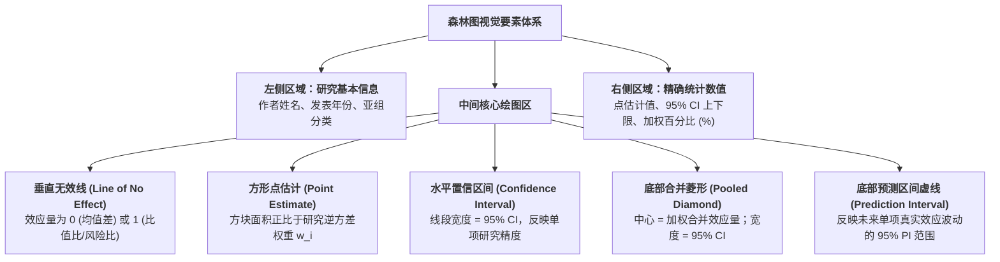

# Forest Plot

---

## 定义

> [!def] 核心定义
> 森林图（Forest Plot）是[[Meta-analysis|元分析]]与[[Systematic Review|系统综述]]中用于全景展示各项初级研究定量结果及总体合成估计的标准可视化图表。图中每一横行代表一项纳入的独立实证研究，以矩形方块（Square）表示[[Effect Size|效应量]]点估计值、以贯穿方块的水平线段表示95% [[Confidence Interval|置信区间]]（CI），图表底部以一个菱形（Diamond）表示加权合并后的总体效应量及其置信区间。[[Argument_Higgins_2016_RE|(Higgins, 2016, p. 33)]]; [[Argument_Cohen_Manion_Morrison_2011_Routledge_Ch17|(Cohen et al., 2011, Ch. 17)]]

> [!concept-lens] 概念透镜
> - **含义** 将复杂的统计矩阵转化为直观的空间几何线段，实现多研究离散度、权重分布与综合效应的一览式呈现。
> - **用途** 用于直观研判干预效应方向、比较单项研究与总体的偏离度、定性评估[[Heterogeneity|异质性]]严重程度（线段重叠度）。
> - **边界** 森林图展示的是已有数据的综合结果与置信范围，不直接展示[[Publication Bias|发表偏倚]]风险（后者主要由 [[Funnel Plot|漏斗图]] 诊断）。

---

## 森林图解剖结构与视觉要素



> [!feature] 核心解剖要素解读
> 1. **垂直无效参考线（Line of No Effect）** 通常位于 $x = 0$（连续型均值差）或 $x = 1$（二分类 RR/OR）。若单项研究的水平置信线段穿过该垂直线，表明该研究结果在 $\alpha = .05$ 下不具备[[Statistical Significance|统计显著性]]。
> 2. **方块大小（Box Size）** 方块面积严格正比于该研究在加权模型中获得的权重 $w_i$。[[Sample Size Determination|样本量]]越大、抽样方差越小的研究，方块越大。
> 3. **合并菱形（Summary Diamond）**
>    - 菱形的**中心垂直顶点**对应总体加权平均[[Effect Size|效应量]] $\hat{\theta}$；
>    - 菱形的**左右水平端点**对应总体效应量的 95% [[Confidence Interval|置信区间]]。若整个菱形完全位于无效参考线的一侧且不接触无效线，表明合并效应具备统计显著性。
> 4. **[[Prediction Interval|预测区间]]横线（Prediction Interval Bar）** 在高级森林图中常绘制于菱形正下方，展示 95% 预测区间，直接呈现[[Heterogeneity|异质性]]在真实情境下的潜在变异范围。

---

## 森林图专业判读三步法

> [!proc] 森林图三步判读规程
> 1. **第一步：看效应方向与显著性** 观察绝大多数研究的方块位于无效线左侧还是右侧；观察底部汇总菱形是否远离无效参考线。
> 2. **第二步：看置信线段重叠度（直观判读[[Heterogeneity|异质性]]）** 
>    - 若各研究的水平线段大部分相互重叠，提示研究间高度同质；
>    - 若大量研究的[[Confidence Interval|置信区间]]完全不重叠、彼此割裂，提示存在高度[[Heterogeneity|异质性]]（需结合 $I^2$ 与 $Q$ 检验开展[[Moderator Analysis|调节变量分析]]）。
> 3. **第三步：看大权重研究的主导性** 检查是否存在单项方块极大、权重占比过高（如 $> 50\%$）的研究；若存在，需警惕总体结论是否被单一研究所绑架，需进行[[Leave-One-Out Sensitivity Analysis|留一法敏感性分析]]（Leave-one-out sensitivity analysis）。

---

## 概念辨析

> [!contrast-table] 森林图与[[Funnel Plot|漏斗图]]对比
> | 维度 | 森林图（Forest Plot） | [[Funnel Plot|漏斗图（Funnel Plot）]] |
> |---|---|---|
> | **图表定位** | **综合结果展示图** | **偏倚与[[Heterogeneity|异质性]]诊断图** |
> | **横坐标** | 效应量尺度（$g, d, r$） | 效应量尺度（$g, d, r$） |
> | **纵坐标** | 纳入研究列表（分类/时间顺序） | 研究精度倒数（标准误 $SE$，倒置刻度） |
> | **核心判读点** | 菱形位置、线段重叠度、大研究主导性 | 散点空间对称性、底部偏倚缺失角 |
> | **出现阶段** | 报告分析结论的标准主图 | 质控与敏感性分析阶段的辅助图 |

---

## 软件绘制示例（R · metafor）

> [!software-impl] 森林图生成脚本
> ```r
> library(metafor)
> 
> # 拟合模型
> res <- rma(yi, vi, data = dat, method = "REML")
> 
> # 绘制标准森林图 (包含作者年份标签、预测区间与统计数据)
> forest(res, 
>        slab = paste(dat$author, dat$year, sep = ", "),
>        xlab = "Standardized Mean Difference (Hedges' g)",
>        addcred = TRUE,   # 添加 95% 预测区间虚线段
>        showweights = TRUE) # 显示各研究权重百分比
> ```

---

## 相关研究

> [!evidence-grid-a] 相关研究索引
> - [[Argument_Higgins_2016_RE|Higgins (2016)]] — 回溯 Karl Pearson (1904) 伤寒疫苗分析对森林图形式的历史先驱贡献，以及森林图在[[Evidence-Based Education|循证教育]]工具中的核心角色。
> - [[Argument_Abrami_2015_RER|Abrami et al. (2015)]] — 呈现通用[[Critical Thinking|批判性思维]]技能[[Effect Size|效应量]]分布图，直观展现教学干预在跨学科领域中的一致收益。
> - [[Argument_Cohen_Manion_Morrison_2011_Routledge_Ch17|Cohen, Manion & Morrison (2011, Ch17)]] — 系统阐述森林图作为[[Meta-analysis|元分析]]研究报告标配的结构要素与判读规范。
