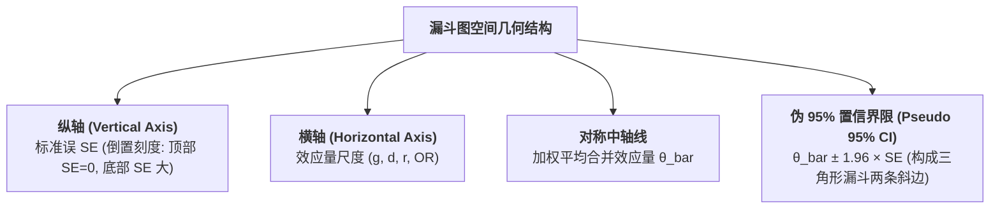

# Funnel Plot

---

## 定义

> [!def] 核心定义
> 漏斗图（Funnel Plot）是由 Light & Pillemer (1984) 提出并在[[Meta-analysis|元分析]]中被广泛采用的标准化可视化诊断工具。它以各项初级研究的[[Effect Size|效应量]]点估计值为横轴，以研究精度的倒数测度（通常为[[Standard Error|标准误]] $SE$，且纵轴采用倒置刻度，即顶部为小标准误/大样本、底部为大标准误/小样本）为纵轴。在无[[Publication Bias|发表偏倚]]且效应同质的理想假定下，大样本研究向真实效应量集中于顶部窄角区，小样本研究受[[Sampling Error|抽样误差]]影响在底部呈宽幅离散，整体散点分布呈现一个对称的“倒置漏斗”形态。[[Argument_Higgins_2016_RE|(Higgins, 2016, pp. 38, 48)]]

> [!concept-lens] 概念透镜
> - **含义** 通过散点空间几何分布对称性，快速研判是否存在由于小样本阴性结果未发表而引起的系统性证据缺失。
> - **用途** 作为元分析[[Document|文献]]筛选与证据稳健性质控的第一道视觉防线，指导后续是否采用参数检验（如 Egger 检验）或校正算法（如[[Trim and Fill Method|剪补法]]）。
> - **边界** 漏斗图不对称性**并不必然等同于发表偏倚**；研究真实[[Heterogeneity|异质性]]、研究方法论质量差异及偶然抽样波动均可导致不对称。

---

## 概念辨析

> [!contrast-table] 漏斗图与[[Forest Plot|森林图]]辨析
> | 维度 | 漏斗图（Funnel Plot） | [[Forest Plot\|森林图（Forest Plot）]] |
> |---|---|---|
> | **图表性质** | 偏倚与[[Heterogeneity\|异质性]]诊断散点图 | 综合结果与[[Effect Size\|效应量]]点估计展示图 |
> | **坐标轴定义** | 横轴为效应量，纵轴为[[Standard Error\|标准误]]（倒置刻度） | 纵轴为独立研究清单，横轴为效应量与[[Confidence Interval\|置信区间]] |
> | **核心判读** | 散点是否呈倒置漏斗对称分布（检查[[Small Study Effects\|小研究效应]]） | 各研究置信区间重叠度与菱形合并效应量显著性 |
> | **使用阶段** | 证据质控与偏倚检验阶段 | 结果汇总与模型报告阶段 |

---

## 数学原理与几何特征

> [!formula-step] 漏斗图参考边界方程
> 漏斗图中的三角警戒边界（斜边）基于以下公式构建：
>
> $$\text{Boundary}(SE) = \bar{\theta} \pm 1.96 \times SE$$
>
> **几何机制**
> 1. **顶部区域（高精度/大样本）** $SE \to 0$，置信带宽收窄，散点紧密聚集于中轴线 $\bar{\theta}$ 附近；
> 2. **底部区域（低精度/小样本）** $SE$ 较大，置信带宽放宽，散点呈宽基底离散；
> 3. **偏倚切除角（Missing Bottom Corner）** 若发生[[Publication Bias|发表偏倚]]，底部通常缺失“小样本 + 负效应/零效应”的一角（通常是右侧偏倚时的左下角），导致漏斗图呈现显著单侧空缺。

---

## 漏斗图不对称性的四大来源

> [!feature] 导致漏斗图不对称的机制诊断
> - **[[Publication Bias|发表偏倚]]与报告偏倚（Publication Bias）** 不显著的小样本研究更难见刊（“抽屉文件”效应），造成统计学意义上的单侧缺失。
> - **真实效应[[Heterogeneity|异质性]]（True Heterogeneity）** 小样本研究通常聚焦于高风险或特殊干预组，其实际效应可能客观上大于大范围普通人群研究。
> - **研究质量与方法学差异（Methodological Quality）** 小样本研究在[[Random Assignment|随机化]]、[[Blinding|盲法]]或控制组设计上可能不够严密，产生方法论缺陷导致的效应夸大。
> - **统计伪影与偶然波动（Chance / [[Artefact|artifacts]]）** 当纳入研究数量较少（如 $k < 10$）时，纯粹的抽样随机性极易被误判为偏倚。

---

## 配合使用的定量诊断与校正方法

> [!ref-table]- 漏斗图辅助检验与校正工具矩阵
> | 工具/方法 | 方法性质 | 检验逻辑与研判标准 | 关联条目 |
> |---|---|---|---|
> | **[[Egger Regression Test\|Egger 回归检验]]** | 参数化线性回归 | 检验标准化效应量对精度的回归截距是否显著偏离 0（$p < .05$ 提示不对称） | [[Egger Regression Test]] |
> | **[[Begg and Mazumdar Rank Correlation\|Begg 秩相关检验]]** | 非参数等级相关 | 检验标准化效应量与方差的 Kendall's $\tau$ 等级相关（$p < .05$ 提示小研究效应） | [[Begg and Mazumdar Rank Correlation]] |
> | **[[Trim and Fill Method\|剪补法（Trim & Fill）]]** | 非参数迭代估计 | 剪除不对称极值研究并镜像填补缺失研究，评估填补前后[[Effect Size\|效应量]]稳健性 | [[Trim and Fill Method]] |
> | **[[Multilevel Egger's Test\|多水平 Egger 检验]]** | 多水平[[Meta-regression\|元回归]] | 针对嵌套数据与集群依赖，提供无偏截距估计与稳健[[Small Study Effects\|小研究效应]]检验 | [[Multilevel Egger's Test]] |

---

## 实证检验案例

> [!case]- 实证检验案例：生成式 AI 赋能高阶思维的漏斗图审计
> - **数据规模与坐标设定** 在一项关于生成式 AI 促进高阶思维的一阶元分析中，纳入 29 项实验与准实验研究共 59 个效应量（Hedges' $g$），以反向排列的标准误 $SE$ 为纵轴、效应量 $g$ 为横轴绘制漏斗图，中心虚线对准合并效应量 $g = 0.609$。
> - **散点空间分布与离群点诊断** 漏斗图显示除 8 个分散离群点落在 95% 伪置信区间斜线外侧外，绝大多数研究紧密且大致对称地分布于均值虚线两侧；漏斗底部并未出现小样本阴性或微弱效应研究系统性缺失的“左下角空洞”，右偏倾向轻微。
> - **结合定量回归确证稳健性** 漏斗图的目视对称性得到了 Egger 线性回归截距检验（$t = 1.871, p = 0.066 > 0.05$）的支持，证实未触发严重发表偏倚警戒，排除了严重抽屉文件效应对总体效应量的系统性扭曲。[[Argument_Zhao_2025_JIntell|(Zhao et al., 2025, pp. 9–10)]]

---

## 相关研究

> [!evidence-grid-a] 相关研究索引
> - [[Argument_Zhao_2025_JIntell|Zhao et al. (2025)]] — 绘制包含 59 个效应量与 8 个离群点的漏斗图，配合 Egger 线性回归检验（$t = 1.871, p = 0.066$）对生成式 AI 促进高阶思维的元分析证据池开展发表偏倚诊断。
> - [[Argument_Higgins_2016_RE|Higgins (2016)]] — 系统阐述[[Meta-analysis|元分析]]中漏斗图的可视化原理、不对称性检验及[[Sample Size Determination|样本量]]与[[Effect Size|效应量]]负相关现象（$r = -0.28$）。
> - [[Argument_Cohen_Manion_Morrison_2011_Routledge_Ch17|Cohen, Manion & Morrison (2011, Ch17)]] — 介绍元分析偏倚控制方法与漏斗图的判读规程。
