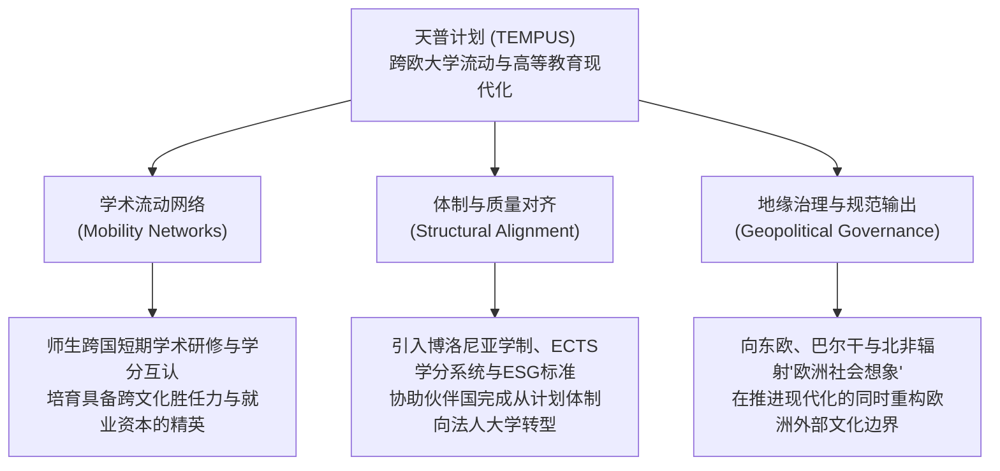

# TEMPUS

---

## 项目背景与立项契机

> [!claim] 项目定位
> **泛欧大学机动性合作计划（Trans-European Mobility Programme for University Studies，TEMPUS / 天普计划）** 是欧洲联盟（European Union，EU）于 1990 年在冷战终结与东欧剧变的历史节点上设立的高等教育跨国合作与学术流动旗舰项目。该计划作为欧盟内部伊拉斯谟计划（ERASMUS）向非成员国外围邻国的制度延伸，专门面向中东欧、西巴尔干、东欧邻国、南高加索、中亚以及南部地中海周边伙伴国，旨在通过大学跨国结对、课程革新与体制对接，推进伙伴国高等教育体制的现代化、民主化与市场经济转型。[[Argument_Sobe_Fischer_2009_MobilityMigration|(Sobe & Fischer, 2009, pp. 362–363)]]

> [!program-context] 项目背景
> - **立项时间 / 周期** 1990 年正式设立，先后历经四期工程（TEMPUS I 至 TEMPUS IV），持续推进至 2013 年底；2014 年整体整合并入新一代欧盟“伊拉斯谟+”（Erasmus+）全球教育、培训与青年行动框架。
> - **发起方与资助机制** 由欧盟委员会（European Commission）主导发起并全额资助，依托欧盟外部援助基金（如 PHARE、TACIS、CARDS 与 MEDA 计划），通过竞争性“联合欧洲项目”（Joint European Projects，JEP）与“结构性措施”（Structural Measures）拨款实施。
> - **覆盖范围与对象** 覆盖欧盟所有成员国高校以及数十个非欧盟伙伴国（涵盖西巴尔干、前苏联加盟共和国及中东、北非地中海沿岸国）；资助数以万计的大学教师、行政主管与研究生开展跨国互访与学术研修。
> - **核心问题导向** 协助前计划经济体制国家消除封闭隔绝的高等教育壁垒，重构严重教条化的专业大纲与院系架构，对齐[[Bologna Process|博洛尼亚进程]]的跨国学位质量标准。

---

## 方案设计与运行机制

> [!claim] 核心干预／机制假说
> 天普计划基于多边伙伴关系与学术流动的制度假说：通过将欧盟成员国高校的“导师型经验”与伙伴国高校结成多边联盟，以跨国学术流动（师生研修）为催化剂，驱动伙伴国高校自下而上重构课程大纲、引入欧洲学分互认与现代治理结构，从而将伙伴国高等教育无缝嵌入欧洲共同知识空间。[[Argument_Sobe_Fischer_2009_MobilityMigration|(Sobe & Fischer, 2009, pp. 362–363)]]

> [!policy-design] 方案设计与核心干预维度
> - **联合欧洲项目（Joint European Projects, JEP）** 核心资助载体，要求至少由两个欧盟成员国高校与至少一个伙伴国高校组成跨国联合体，围绕特定学科开展为期 2–3 年的课程联合更新、教材联合编写与双学位培育。
> - **结构性治理与能力建设（Structural Measures）** 针对伙伴国教育部与高校行政体系，提供大学法人化改革咨询，建立现代欧洲学分转换与累加系统（ECTS）及符合欧洲高等教育质量保障标准（[[European Standards and Guidelines|ESG]]）的内部评估机制。
> - **师生机动性（Academic Mobility）** 资助伙伴国骨干教师赴欧盟高校进修现代教学法，资助学生开展为期 1–2 学期的学术交流，建立跨国学术人际网络。
> - **[[University-Industry Collaboration|产学合作]]与[[Employability|就业能力]]挂钩** 推动伙伴国大学与当地企业、行业协会合作，改革脱离生产实际的传统专业，增强毕业生面对市场经济的就业胜任力。

> [!citation-card]
> **[[Argument_Sobe_Fischer_2009_MobilityMigration|Sobe & Fischer (2009)]] 论 TEMPUS 项目中的空间治理与社会想象**
> 天普计划专门面向欧盟与东欧、西巴尔干、中东及北非伙伴国之间的高等教育机动性，拓展了这种跨国现代化与相互学习工程，有效巩固了将‘流动性’（Mobility）与围绕参与式网络构筑的‘欧洲社会想象’（European Social Imaginary）深度绑定的制度联系。这绝非暗示 TEMPUS 项目不会产生排斥（Lawson et al., 2003; Walsh et al., 2005），而是强调当前在欧洲作为教育政策核心问题的‘[[Student Mobility|学生流动]]’，是如何与身份认同建构紧密缠绕在一起——它将个体的物理位移、灵活性以及多元文化素养，规范化为享有完全权利公民（Enfranchised Citizen）的法定资质。[[Argument_Sobe_Fischer_2009_MobilityMigration|(Sobe & Fischer, 2009, pp. 362–363)]]

---

## 推进历程与阶段演进

> [!dev-timeline] TEMPUS 项目四阶段推进历程
> - **1990–1994 年 — TEMPUS I：中东欧政治转型应激支援期** 聚焦中东欧“中欧四国”（维谢格拉德集团，波兰、匈牙利、捷克、斯洛伐克）及波罗的海三国的高等教育体系重建，重点资助语言教育、经管法政学科现代化与基础设备更新。
> - **1994–2000 年 — TEMPUS II / II bis：向独联体与西巴尔干纵深扩展期** 项目覆盖面扩展至前苏联加盟共和国（TACIS 计划国家）及战后西巴尔干地区，重点转向大学内部管理重组、系所自治与多边伙伴关系深化。
> - **2000–2006 年 — TEMPUS III：[[Bologna Process|博洛尼亚进程]]全面对接期** 正式纳入地中海沿岸伙伴国（MEDA 计划）；核心任务全面转向对接 1999 年《博洛尼亚宣言》目标，推动学士-硕士-博士三级学位架构改革、欧洲学分转换系统（ECTS）落地与学分透明。
> - **2007–2013 年 — TEMPUS IV：区域高教区辐射与[[Lifelong Learning|终身学习]]融合期** 强化高等教育对区域经济转型的适应性，推动大学与企业、公民社会的产学研网络化共建；2014 年正式完成历史使命，整体整合并入“伊拉斯谟+”（Erasmus+）全球旗舰项目。

---

## 比较教育学定性与学术反思

在比较教育学与空间转向（Spatial Turn）理论视域下，天普计划不仅仅是一项技术性的高等教育国际援助工程，更是欧盟在全球展开[[Spatial Governmentality|空间化治理]]与地缘文化塑造的关键制度装置：

> [!claim] 比较教育学核心反思判断
> 天普计划是欧盟通过教育流动向外围空间行使[[Governing at a Distance|远距治理]]（Governing at a Distance）的典型范例：它一方面通过学术资助与机制互认极大地促进了跨国人员交流与[[Knowledge Transfer|知识转移]]，另一方面也确立了西欧大学规范作为“唯一正统现代大学”的中心地位，在输出“欧洲社会想象”的同时，生产出新型的地缘[[Cultural Hierarchy|文化等级]]与外围排斥。[[Argument_Sobe_Fischer_2009_MobilityMigration|(Sobe & Fischer, 2009, pp. 362–363)]]

> [!debates] 围绕天普计划的理论与现实争议
>
> > [!axis] 平等互惠学习 vs 规范单向输出（Asymmetric Norm Transfer）
> > - **官方倡导叙事（European Commission）** 将 TEMPUS 描绘为基于大学平等伙伴关系的“现代化与相互学习”（Mutual Learning）工程，尊重伙伴国的主权独立与文化传统。
> > - **批判比较教育学者（Lawson et al., 2003; Walsh et al., 2005）** 揭示该项目具有强烈的单向“欧洲中心主义”倾向：欧盟高校扮演标准输出者与评估导师，伙伴国高校则处于被动的接受者与整改者地位；借现代化之名输出的西欧课程与治理模板，往往导致伙伴国传统本土学术生态遭受边缘化。[[Argument_Sobe_Fischer_2009_MobilityMigration|(Sobe & Fischer, 2009, p. 363)]]
>
> > [!axis] 精英流动自由 vs 申根边界排斥（Enclave Mobility vs Border Abjection）
> > - **流动性赞赏视角** 欧盟政策[[Discourse|话语]]将 TEMPUS 资助的高等教育师生跨国流动，颂扬为培育开放包容、面向未来的欧洲公民资格典范。
> > - **空间社会学批判（[[Argument_Sobe_Fischer_2009_MobilityMigration|Sobe & Fischer, 2009]]）** 空间[[Governmentality|治理术]]视角揭示出严峻的阶层悖论：TEMPUS 资助的跨国流动仅属于伙伴国内部极少数具备外语资本与社会声望的高校精英阶层；对于伙伴国的绝大多数底层劳工、流动人口与边缘学童而言，欧盟森严的申根签证壁垒与边境管控技术构筑了一堵坚不可摧的“欧洲堡垒”（Fortress Europe）物理围墙，生动折射出全球化下流动性（Mobility）与定居性（[[Sedentarism|Sedentarism]]）被阶层化切分的治理面孔。

---

## 相关条目网络

> [!entry-map] 关联条目网络映射
>
> | 条目 | 类型 | 在网络中的关联与功能 |
> |:-----|:-----|:---------------------|
> | [[European Education Space]] | Concept | **上位治理空间** TEMPUS 是欧盟向非成员国构建欧洲教育空间与社会想象的核心辐射工具。 |
> | [[Student Mobility]] | Concept | **核心治理客体** TEMPUS 将精英大学生的跨国流动道德化为欧洲公民资本与[[Employability\|就业能力]]的范例。 |
> | [[Teacher Mobility]] | Concept | **核心资助机制** 伙伴国高校骨干师资赴西欧大学进修与联合教研的机制载体。 |
> | [[Spatial Governmentality]] | Theory | **解释理论工具** 透视 TEMPUS 如何通过空间划界、流动调控与外围排斥对人口实施[[Governing at a Distance\|远距治理]]。 |
> | [[Two Problematics of Educational Inclusion and Exclusion]] | Theory | **批判反思视角** 揭示 TEMPUS 在推进制度包容与代表性的同时，在知识分类系统层面生产出新型外围排斥。 |
> | [[Bologna Process]] | Fact (Policy) | **体制对齐基准** 项目实施后期全面对齐博洛尼亚进程学制与学分转换标准。 |
> | [[Tuning Project]] | Fact (Program) | **协同支撑项目** 博洛尼亚进程中具体研制各学科核心能力参考框架的欧盟同行协作方案。 |
> | 安东尼奥·诺沃亚（António Nóvoa） | 学者 | **关键理论家** 深入解构欧洲流动性[[Discourse\|话语]]如何生产超国家公民认同与欧洲社会想象。 |

---

