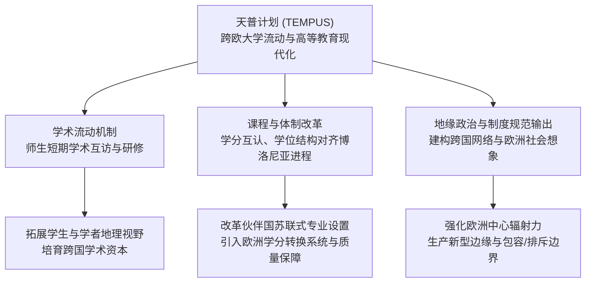

# TEMPUS

---

## 背景

> [!event-context] 事件背景
> - **时间 / 发起主体** 1990 年由欧洲联盟（European Union，EU）在冷战结束与东欧剧变的历史节点上正式设立并实施。
> - **制度背景** [[Isaiah Berlin|柏林]]墙倒塌与中东欧转型后，欧盟亟需建立一套跨国高等教育合作框架，协助原苏东集团国家及周边邻国完成从计划体制向民主治理与市场经济的高等教育转型。
> - **项目定位** 作为欧盟对内学术流动旗舰项目（伊拉斯谟计划，ERASMUS）的对外延伸，天普计划专门面向欧盟非成员国的“周边伙伴国”（Partner Countries），涵盖中东欧、西巴尔干、东欧邻国、南高加索、中亚以及南部地中海沿岸地区。[[Argument_Sobe_Fischer_2009_MobilityMigration|(Sobe & Fischer, 2009, pp. 362–363)]]

---

## 核心机制与实施阶段

天普计划通过结构性多边伙伴关系（Joint European Projects，JEP）与机构能力建设项目，资助欧盟成员国高校与伙伴国高校开展深度合作：

1. **课程更新与教学重构** 引入以学生为中心的现代教学大纲、新型教材与跨国联合学位项目，重构伙伴国传统的高度教条化课程结构。
2. **大学治理与行政能力建设** 协助伙伴国大学引入现代大学法人治理机制、欧洲学分转换系统（European Credit Transfer and Accumulation System，ECTS）以及高校质量保障标准（Standards and Guidelines for Quality Assurance，[[European Standards and Guidelines|ESG]]）。
3. **高等教育与社会协同** 推动大学与企业、公民社会组织的产学研合作，提升毕业生的市场[[Employability|就业能力]]。
4. **实施阶段演进** 该项目先后历经 TEMPUS I（1990–1994）、TEMPUS II（1994–2000）、TEMPUS III（2000–2006）以及 TEMPUS IV（2007–2013），最终于 2014 年整体整合并入新一代欧盟“伊拉斯谟+”（Erasmus+）全球旗舰框架。

---

## 比较教育学定性与批判反思

在比较教育学与高等教育空间化分析中，天普计划不仅仅是一项技术性的高等教育援助方案，更是欧盟展开跨国区域治理与地缘空间建构的关键象征装置：

> [!citation-card]
> **[[Argument_Sobe_Fischer_2009_MobilityMigration|Sobe & Fischer (2009)]] 论欧盟流动项目中的空间治理与社会想象**
> 诺亚·索比与梅丽莎·菲舍尔援引安东尼奥·诺沃亚（António Nóvoa）关于欧洲认同建构的研究指出，包括 ERASMUS 与 TEMPUS 在内的欧盟机动性计划，将“流动性”（Mobility）塑造成欧洲公民资格与现代性价值的黄金试金石。这些项目调动了欧洲历史上古典学者游学与旅行的浪漫意象，承诺赋予个体自由流动与拥抱未来的能力。然而，学者们（Lawson et al., 2003; Walsh et al., 2005）的实证研究表明，通过参与式网络和[[Knowledge Transfer|知识转移]]所扩散的“欧洲社会想象”（European Social Imaginary），一方面推动了东欧与伙伴国的高等教育现代化，另一方面也隐蔽地确立了欧洲知识规范的中心地位，在定义何为“合格的现代大学”过程中，对非西方传统实践施加了新型的象征性排斥。[[Argument_Sobe_Fischer_2009_MobilityMigration|(Sobe & Fischer, 2009, pp. 362–363)]]

> [!warrant] 空间治理与流动性分层的制度反思
> 1. **学术流动性的不对称性** 相较于欧盟内部成员国之间双向对等的学者交流，天普计划在客观上呈现出明显的“规范单向输出”特征，欧盟成员国高校通常扮演制度标准的输出者与导师，伙伴国高校则往往处于接收者与受检视者的不对称地位。
> 2. **精英化流动与边界建构** 虽然天普计划极大地促进了跨国人员流动，但能够获得资助并跨越国界的往往是伙伴国内部具备外语优势与社会资本的精英阶层；同时，欧盟严格的申根签证制度与外围边界管控，又使绝大多数普通学生与民众被严密封锁在欧洲空间围墙之外，生动折射出全球化下流动性与定居性被阶层化切分的治理悖论。

---

