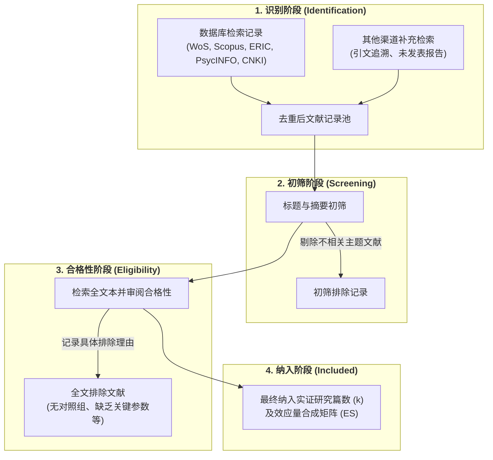

# PRISMA

---

## 工具定位

> [!instrument-profile] PRISMA
> - **工具类型** 方法学报告规范与透明度核查清单（Checklist）。
> - **开发者与年份** Page et al. (2021) / PRISMA 核心工作组（PRISMA 2020 声明）。
> - **测量目的** 规范[[Systematic Review\|系统综述]]与[[Meta-analysis\|元分析]]的检索、筛选、纳入与结果报告，防范选择性报告偏倚与[[Publication Bias\|发表偏倚]]，提升综合研究的透明度、可复现性与证据质量。
> - **实施方式** 自陈核查（Self-Report）或同行评议专家审核，由系统综述作者在撰写报告时自查填报各条目对应页码，期刊编辑与审稿人据此核验合规性。

> [!citation-card] PRISMA 2020 声明与方法学使命
> 系统评价和元分析优先报告条目（Preferred Reporting Items for Systematic Reviews and Meta-Analyses, PRISMA）是一套旨在提升系统综述与元分析研究透明度、规范性与可复现性的国际权威方法学标准与报告指南。PRISMA 体系由核心报告检查清单（涵盖 27 项条目）和四阶段[[Document\|文献]]流转图（PRISMA [[Flow]] Diagram）构成，要求研究者系统记录从文献数据库检索、去重、标题摘要初筛、全文合格性审阅到最终纳入证据合成的完整决策路径与排除缘由。[[Argument_Lei_Ding_Chiu_2026_ERR\|(Lei et al., 2026, pp. 4–5)]]
>
> *"The [[Literature Search]] and screening strictly adhered to the Preferred Reporting Items for Systematic Reviews and Meta-Analyses (PRISMA) statement... through systematic identification, screening, eligibility, and inclusion phases."*

---

## 测量构念与维度

> [!construct-table] [[Systematic Review\|系统综述]]与[[Meta-analysis\|元分析]]报告规范
> 
>
> | 维度 | 题项数 | 测量内容 | 计分方式 |
> |---|---|---|---|
> | **题目（Title）** | 1 | 明确标明本研究为系统综述或元分析 | 报告项二元核查（已报告 / 未报告 / 不适用） |
> | **摘要（[[Abstract]]）** | 1 | 结构化呈现背景、目标、合格标准、数据源、偏倚风险、合成结果与结论 | 报告项二元核查（已报告 / 未报告 / 不适用） |
> | **引言（Introduction）** | 2 | 陈述开展本综述的既有理论背景、现实必要性与明确预设的 PICOS [[Research Question\|研究问题]] | 报告项二元核查（已报告 / 未报告 / 不适用） |
> | **方法（Methods）** | 12 | 详述合格标准、信息源、完整检索式、双盲筛选流程、数据提取手册、偏倚风险评估、[[Effect Size\|效应量]]度量指标、定量合成方法与报告偏倚评估 | 报告项二元核查（已报告 / 未报告 / 不适用） |
> | **结果（Results）** | 7 | 详细报告筛选流程图、初级研究特征、单项研究偏倚风险、分项结果、综合统计效应量、[[Heterogeneity\|异质性]]亚组分析与证据确定性评级 | 报告项二元核查（已报告 / 未报告 / 不适用） |
> | **讨论（Discussion）** | 1 | 结合全证据体探讨发现的实践启示、局限性（偏倚风险、报告缺失）与证据外推边界 | 报告项二元核查（已报告 / 未报告 / 不适用） |
> | **其他信息（Other Information）** | 3 | 报告[[Preregistration\|预注册]]平台编号、获取协议途径、资金资助角色、利益冲突声明及数据代码共享链接 | 报告项二元核查（已报告 / 未报告 / 不适用） |

---

## 题项与作答方式

> [!instrument-items] 核查与报告规则
> - **题项形式** 标准化方法学陈述核查条目（Checklist Items）。
> - **作答格式** 二元合规核查（已报告并注明论文对应页码 / 未报告 / 不适用说明）。
> - **流转图规程** 严格按识别（Identification）、初筛（Screening）、合格性审阅（Eligibility）与最终纳入（Included）四阶段绘制流程图，透明记录各阶段排除的具体理由与篇数。

### PRISMA 2020 核心核查清单

> [!ref-table]- PRISMA 2020 核心报告条目清单
> 
> 评定依据：Page et al. (2021, pp. 3–5)
>
> | 编号 | 章节与主题 | 原文核查重点 | 方法学功能与偏倚防范 |
> |---|---|---|---|
> | **Item 1** | 题目（Title） | 题名中明确标明研究设计类型为[[Systematic Review\|系统综述]]或[[Meta-analysis\|元分析]] | 确保[[Document\|文献]]在数据库中被精准检索与归类识别 |
> | **Item 2** | 结构化摘要（Structured [[Abstract]]） | 依照 PRISMA 摘要扩展标准，结构化报告背景、目标、标准、合成结果与局限 | 杜绝摘要与正文脱节的宣传性夸大 |
> | **Item 3** | 综述背景与理由（Rationale） | 基于既有理论争议或实践空白说明开展本综述的必要性 | 阐明知识创新的理论张力与实证价值 |
> | **Item 4** | 明确研究目标（Objectives） | 基于 PICOS 框架（对象、干预、对照、结局、设计）陈述明确[[Research Question\|研究问题]] | 确定综述的范围边界与[[Operationalization\|操作化]]口径 |
> | **Item 5** | 合格性标准（Eligibility Criteria） | 明确说明纳入和排除初级研究的纳入标准及设定依据 | 防范事后随意挑选文献导致的纳入偏倚 |
> | **Item 6** | 信息来源（Information Sources） | 列出检索的全部学术数据库、寄存库、网站以及检索的起始与截止日期 | 确保检索范围的完整度与时间溯源性 |
> | **Item 7** | 完整检索策略（Search Strategy） | 提供至少一个主流数据库可全盘复现的完整布尔检索式与过滤参数 | 保证[[Literature Search\|文献检索]]策略的完全透明与可复现性 |
> | **Item 8** | 筛选流程（Selection Process） | 说明文献去重、双盲独立筛选、分歧裁决机制以及所使用的辅助软件 | 降低人工筛查疲劳导致的疏漏与主观偏向 |
> | **Item 9** | 数据收集过程（Data Collection） | 阐明提取数据项的操作规程、[[Qualitative Codebook\|编码手册]]及提取一致性校验机制 | 保证文献[[Coding in Qualitative Research\|编码]]提取的数据保真度与[[Reliability\|信度]] |
> | **Item 10** | 数据项定义（Data Items） | 列出提取的所有[[Independent Variable\|自变量]]、[[Dependent Variable\|因变量]]、[[Effect Size\|效应量]]度量指标及协[[Variable\|变量]]的明确定义 | 杜绝由于定义模糊导致的混淆变量混入 |
> | **Item 11** | 单项研究偏倚风险（Study Risk of Bias） | 明确所使用的偏倚风险评估工具（如 RoB 2、ROBINS-I）及评级规程 | 识别初级研究的方法学漏洞与低质量风险 |
> | **Item 12** | 效应量测度（Effect Measures） | 说明每个结局指标所采用的效应量统计量（如 SMD、Hedges' $g$、RR、OR） | 统一各研究统计口径的可比性基础 |
> | **Item 13** | 综合方法（Synthesis Methods） | 详述数据清洗标准、合并模型（固定/随机效应）、异质性检验（$I^2$）及敏感性分析 | 规避不合理统计模型导致的人为假阳性 |
> | **Item 14** | 报告偏倚评估（Reporting Bias） | 说明用于评估由于缺失结果所致报告偏倚的具体方法（如[[Funnel Plot\|漏斗图]]、Egger 检验） | 系统诊断潜在[[Publication Bias\|发表偏倚]]与文件抽屉问题 |
> | **Item 15** | 证据确定性评估（Certainty Assessment） | 说明用于评估整个证据体确定性水平的评估体系（如 GRADE） | 衡量证据合成结果的实践确定性与稳健度 |
> | **Item 16** | 文献筛选结果（Study Selection） | 详细报告各阶段文献筛选篇数，并以标准流转图呈现全文排除具体理由 | 彻底打开文献筛选与淘汰全流程黑箱 |
> | **Item 17** | 纳入研究特征（Study Characteristics） | 列表呈现每项纳入研究的[[Sample Size Determination\|样本量]]、干预时长、研究情境与关键指标 | 提供初级研究全景概览供读者核验 |
> | **Item 18** | 单项研究偏倚风险结果（Risk of Bias） | 呈现所有纳入研究的方法学质量评级图表与偏倚风险汇总图 | 揭示纳入研究整体的方法学弱点与稳健度 |
> | **Item 19** | 个别研究结果（Individual Studies） | 呈现每项研究在各结局指标上的汇总数据、点估计值与[[Confidence Interval\|置信区间]] | 保障元分析基础数据的完全透明性 |
> | **Item 20** | 合成结果与[[Forest Plot\|森林图]]（Syntheses Results） | 报告统计合并的平均效应量、置信区间、[[Heterogeneity\|异质性]]指标及亚组分析结果 | 呈现循证综合的核心定量结论与离散特征 |
> | **Item 21** | 报告偏倚检验结果（Reporting Biases） | 报告发表偏倚检验图表（如[[Trim and Fill Method\|剪补法]]、漏斗图不对称检验统计量） | 评估未发表文献对合并效应量的稀释风险 |
> | **Item 22** | 证据确定性评级结果（Certainty of Evidence） | 呈现 GRADE 等级评估结果，阐明是否降级（偏倚风险、不一致性、间接性） | 为临床、教育或政策转化提供信心层级 |
> | **Item 23** | 讨论与实践启示（Discussion） | 综合全证据体讨论结论、指出研究局限并审慎推导政策与实践启示 | 避免脱离证据质量盲目做出激进推广建议 |
> | **Item 24** | [[Preregistration\|预注册]]与方案获取（Registration & Protocol） | 报告综述在 PROSPERO 等平台的预注册编号与公开协议网址 | 防范研究者在看到数据后随意篡改分析计划 |
> | **Item 25** | 资助与支持（Support） | 明确披露研究资助方及其在综述构思、执行与撰写过程中的角色 | 防范资助方学术干预与商业利益冲突 |
> | **Item 26** | 利益冲突声明（Competing Interests） | 明确声明全体作者是否存在与本综述主题相关的财务或非财务利益冲突 | 切断利益绑定导致的学术倾向性偏倚 |
> | **Item 27** | 数据与代码共享（Availability of Materials） | 说明原始提取数据矩阵、分析脚本代码及辅助材料的公开获取途径 | 落实完全开放科学与证据可计算复现 |

### 四阶段文献流转程序

> [!proc] PRISMA 四阶段标准流转程序
> 1. **识别阶段（Identification）** 确定检索关键词布尔组合，跨中英文核心数据库检索并记录各库命中篇数，汇入文献管理软件完成自动与人工去重。
> 2. **初筛阶段（Screening）** 由两位研究者独立阅读文献标题与摘要，根据预设标准剔除明显不相关的研究，记录剔除数量。
> 3. **合格性审阅（Eligibility）** 下载并深入通读剩余文献的完整全文，对照严格的实证设计、样本量、干预时长及统计参数完整性标准进行逐一审阅，详细记录不合格文献的具体排除缘由。
> 4. **纳入阶段（Included）** 汇总最终符合标准的独立研究篇数与独立效应量个数，构建元分析数据矩阵并绘制标准 PRISMA 流程图。

---

## 使用该工具的研究

> [!ref-table]- 研究索引
> 
>
> | 研究 | 工具版本 | 样本与用途 | 测量属性 | 关键结果 |
> |---|---|---|---|---|
> | [[Argument_Lei_Ding_Chiu_2026_ERR\|Lei et al. (2026)]] | PRISMA 2020 | 跨 Web of Science、Scopus、[[Education Resources Information Center\|ERIC]]、PsycINFO 与 CNKI 检索的 66 篇实证研究（72 个[[Effect Size\|效应量]]） | [[Systematic Review\|系统综述]]与[[Meta-analysis\|元分析]]报告规范性 | 严格依循 PRISMA 2020 标准开展双语跨库检索，双人独立背对背完成初筛与全文本审阅，并以规范流转图详尽报告排除理由。 |
> | [[Argument_Li_2026_CEAI\|Li et al. (2026)]] | PRISMA 2020 | Web of Science、Scopus 与 ERIC 检索的 409 篇初始记录至 67 篇最终纳入实证研究 | 高等教育生成式 AI 实证综述规范性 | 严格落实四阶段流转程序，经标题摘要初筛与全文审阅，最终纳入 67 篇研究进行[[Higher-Order Thinking Skills\|高阶思维]]认知模式主题综合。 |
> | [[Argument_Runco_2026_CRJ\|Runco et al. (2026)]] | PRISMA 声明 | 52 项[[Creativity\|创造力]]一阶元分析数据库 | [[Meta-meta-analysis\|二阶元分析]]系统检索与纳入控制 | 依据 PRISMA 规范对初级元分析进行分层提取，严格剔除缺乏定量合并统计量的质性综述。 |
> | [[Argument_Park_2026_TSC\|Park et al. (2026)]] | PRISMA 声明 | 创造力与[[Critical Thinking\|批判性思维]]相关性实证[[Document\|文献]]集 | 相关性元分析检索与合规筛选 | 运用 PRISMA 规范流程图完整呈现从初始检索至最终合格研究的收敛漏斗。 |
> | [[Argument_Song_Choi_2026_FPSYG\|Song & Choi (2026)]] | PRISMA 声明 | [[Epistemic Cognition\|认识论认知]]实证研究文献集 | 多水平元分析文献筛选路径 | 以标准 PRISMA 流程图呈现多数据库检索记录、去重与全文本审阅决策流。 |
> | [[Argument_Abrami_2015_RER\|Abrami et al. (2015)]] | PRISMA 规范原型 | 341 项批判性思维教学[[Intervention Research\|干预研究]] | 教学干预大规模元分析筛选 | 采用规范的系统检索与流转筛选流程，对批判性思维干预研究进行分层质量准入。 |
> | [[Argument_Mausethagen_2025_ERR\|Mausethagen et al. (2025)]] | PRISMA 声明 | ERIC、Scopus 等数据库 1,617 篇初始记录至 34 篇纳入文献 | 教育[[Research Utilization\|研究使用]][[Critical Review\|批判性综述]]质控 | 结合 PRISMA 检索规范与多维概念分析，对教育研究使用实证文献进行全文本解构。 |

---

## 版本与适配

> [!ref-table]- 版本索引
> 
>
> | 版本 | 语言与地区 | 目标人群 | 题项数 | 主要变化 | 来源 |
> |---|---|---|---|---|---|
> | QUOROM 声明（初版） | 英语（全球） | 医学[[Randomised Controlled Trials\|随机对照试验]][[Meta-analysis\|元分析]] | 18 项 | 首次确立元分析报告核心核查清单与流程图标准 | Moher et al. (1999) |
> | PRISMA 2009 声明 | 英语（全球） | 医学与社会科学[[Systematic Review\|系统综述]]与元分析 | 27 项 | 将标准由元分析扩展至所有系统评价，更名为 PRISMA 并确立四阶段流程图 | Moher et al. (2009) |
> | PRISMA 2020 现行版 | 英语（全球） | 全学科系统综述、元分析与证据综合 | 27 项 | 全面反映检索技术进步、[[Preregistration\|预注册]]规范、偏倚风险评估演进及数据代码完全共享要求 | Page et al. (2021) |
> | PRISMA-S 检索扩展版 | 英语（全球） | 循证医学与社科[[Literature Search\|文献检索]]人员与信息学家 | 16 项 | 专门针对文献检索策略、多源数据库与未发表灰色文献检索透明度的深度扩展 | Rethlefsen et al. (2021) |
> | PRISMA-ScR 范围综述版 | 英语（全球） | 开展范围综述（Scoping Reviews）的研究团队 | 22 项 | 针对无定量合并与偏倚风险评估的范围综述量身定制的报告规范 | Tricco et al. (2018) |
