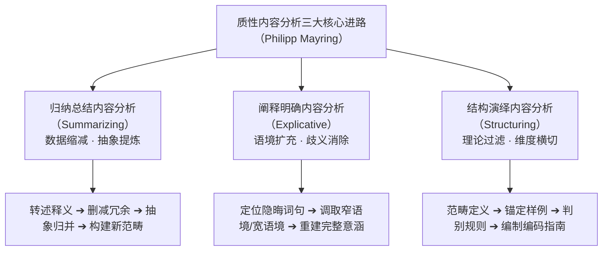
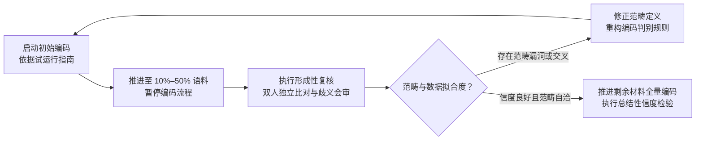

# Qualitative Content Analysis

---

## 定义

> [!def] 核心定义
> **质性[[Content Analysis|内容分析]]（Qualitative Content Analysis，简称 QCA，又称质性文本分析）** 是一种将定性诠释学的深度语境理解与经典内容分析的严密规则性相融合的实证文本分析方法。由德国心理学与教育学方法学家菲利普·迈林（Philipp Mayring, 2000, 2004, 2014）系统奠基。QCA 既反对传统量化内容分析将文本机械还原为脱离语境的孤立词频计数，亦摒弃无结构自由诠释缺乏程序透明度与[[Reliability|信度]]校验的随意性；它将分析置于传播生成情境中，依托逐级抽象释义、[[Coding in Qualitative Research|编码]]指南（Coding agenda）与形成性复核（Formative reliability check），从经验材料中系统提炼出兼具理论严谨性与情境扎根性的范畴体系（Mayring, 2004, pp. 266–269；[[Argument_Cohen_Manion_Morrison_2011_Routledge_Ch30|Cohen et al., 2011, pp. 563, 567]]）。

> [!concept-lens] 概念透镜
> - **含义** 嵌入传播情境的规则主导型质性解释[[Paradigm|范式]]：以显性定义的编码规则、锚定样例文本与分步缩减规程为基准，在不割裂文本语义场的前提下完成系统化推论。
> - **用途** 适用于大样本至中等规模质性文本（访谈[[Transcription in Qualitative Research|转录]]、开放[[Questionnaire|问卷]]作答、政策文件、历史档案、教学日志等）的主题聚类、维度过滤与跨案例横断面比较。
> - **边界** 质性内容分析不同于经典量化内容分析（Quantitative Content Analysis）——量化分析预设互斥分类并以[[Hypothesis|假设]]检验与推断统计为中心，QCA 聚焦于潜在语义（Latent content）与语境层级释义；QCA 亦不同于经典[[Grounded Theory|扎根理论]]（Grounded Theory）——扎根理论追求纯粹从数据中自下而上[[Emergence|涌现]]理论，QCA 则高度强调研究设问导向、允许理论驱动的演绎范畴框架，并通过形成性复核在编码中途有节制地调整范畴。

> [!citation-card] Mayring 论质性内容分析的规则性与情境性
> 质性内容分析将自身定义为对传播脉络中的书面材料进行方法学控制的经验分析方法。它保留了内容分析中由规则主导的逐步分析程序，使分析过程具备高度透明度与互为主体复验性，同时坚决避免草率的数字化量化，始终将文本锚定于社会生成情境之中。[[Argument_Cohen_Manion_Morrison_2011_Routledge_Ch30|(Cohen et al., 2011, p. 563)]]
>
> *Qualitative content analysis defines itself as an approach of empirical, methodological controlled analysis of texts within their context of communication, following content analytical rules and step by step models, without rash quantification. (Mayring, 2000, 2004)*

> [!boundary]- 概念边界
> - 不等于 经典量化内容分析（Berelson, 1952） — 量化分析严格聚焦显性内容（Manifest content）与统计频次；QCA 兼顾隐性意涵[[Rich and Thick Description|深描]]与解释性语境扩充。
> - 不等于 自由诠释学解读（Hermeneutics） — 传统诠释学缺乏显性[[Externalization|外化]]的规则手册；QCA 强制编制包含范畴定义、锚定样例与判定规则的编码指南。
> - 不等于 主题分析（Thematic Analysis） — 主题分析更具灵活性且通常不要求计算[[Intercoder Agreement|编码者间信度]]；QCA 严格嵌入传播模型并要求执行形成性与总结性信度检验。

---

## 方法定位

> [!method-position] [[Epistemology|认识论]]与方法定位
> - **知识观** 语言符号既承载显性字面信息，亦深植于说话者的心理诉求、权力关系与社会文化情境；文本的意义不是静态预存的物理实体，而是研究者在规则控制下与传播情境互动建构的解释性[[Construct|构念]]。
> - **研究者角色** 研究者既是严守分析规则的技术执行者，又是洞悉文化语境的诠释主体；通过公开[[Coding in Qualitative Research|编码]]指南与留存修改轨迹，确保解释过程的互为主体性（Intersubjectivity）与可审计性。
> - **有效性标准** 范畴体系对文本材料的充分拟合度（[[Content Validity]]）、分析规程的透明可复现性（Replicability）、[[Intercoder Agreement|编码者间一致性]]（Inter-coder [[Reliability]]），以及对反常案例的形成性容纳能力。
> - **不声称回答的问题** QCA 不仅凭词频分布推断[[Determinism|因果决定论]]，亦不脱离文本生产脉络进行抽象玄思。

> [!method-stack] 方法层级
> - **研究设计** 质性文本研究、探索性[[Mixed Methods Research|混合方法]]设计、[[Document|文献]]考据与政策话语评估。
> - **数据收集** [[Semi-structured Interview|半结构化访谈]][[Transcription in Qualitative Research|转录]]、开放[[Questionnaire|问卷]]文本、课堂互动录像文字稿、组织制度文本。
> - **分析方法** 归纳总结性[[Content Analysis|内容分析]]、阐释明确性内容分析、结构演绎性内容分析、形成性复核、领域归并。
> - **辅助技术** [[Qualitative Computer Software|CAQDAS]] 软件的编码树与交叉表功能、人在回路的文本分块与规则匹配。

---

## 概念辨析

质性[[Content Analysis|内容分析]]在经验文本研究中处于量化分析与纯质性探索之间的交叉高地：

> [!contrast-table] 质性内容分析与相邻文本分析方法辨析
> | 维度 | 质性内容分析（Mayring QCA） | 经典量化内容分析（Berelson / Weber） | [[Grounded Theory\|扎根理论]]（Glaser & Strauss） | 主题分析（Braun & Clarke） |
> |---|---|---|---|---|
> | **[[Epistemology\|认识论]]基础** | 规则主导的质性诠释主义 | [[Positivism\|实证主义]]与逻辑实证主义 | [[Symbolic Interactionism\|符号互动论]]与[[Constructivist Paradigm\|建构主义]] | 灵活的质性范式（[[Reflexivity\|反思性]]） |
> | **范畴生成进路** | 归纳总结与结构演绎并存，重在规则化 | 严格先验演绎预设，保持[[Operationalization\|操作化]]封闭 | 纯粹自下而上归纳，坚拒先验理论强加 | 归纳或演绎均可，重在主题网络编织 |
> | **[[Reliability\|信度]]控制机制** | 10%–50% 节点上的**形成性复核**与规则修正 | [[Coding in Qualitative Research\|编码]]完成后计算总结性 Kappa / Alpha 指标 | [[Constant Comparison\|持续比较法]]与负面案例审视直至[[Saturation\|理论饱和]] | 强调反身性日志与研究者主观透镜审视 |
> | **语境处理方式** | 区分窄语境与宽语境，主动引入背景阐释 | 剥离语境，将文本切分为孤立测量单元 | [[Rich and Thick Description\|深描]]情境脉络，作为主轴范畴中介条件 | 保持叙事完整性，围绕主题展开说明 |
> | **代表学者出处** | 菲利普·迈林（Mayring, 2000, 2004）；[[Argument_Cohen_Manion_Morrison_2011_Routledge_Ch30\|Cohen et al. (2011)]] | 贝雷尔森（Berelson, 1952）；韦伯（Weber, 1990） | 格拉瑟与施特劳斯（Glaser & Strauss, 1967） | 布劳恩与克拉克（Braun & Clarke, 2006） |

---

## 理论机制与三大进路

菲利普·迈林（Mayring, 2004, pp. 268–269；[[Argument_Cohen_Manion_Morrison_2011_Routledge_Ch30|Cohen et al., 2011, p. 567]]）构建了质性[[Content Analysis|内容分析]]的三大核心技术进路，三者在分析方向与操作策略上形成精密互补：

### 进路一　归纳总结内容分析（Summarizing Content Analysis）

当研究处于探索阶段或旨在从原始经验文本中提炼新的理论范畴时，采用总结性内容分析。其核心在于**[[Data Reduction|数据缩减]]（Data reduction）**——在维护实质内涵完整性的前提下，将庞杂材料压缩为高度条理化的范畴大纲（Mayring, 2004, p. 268）：
1. **确定抽象基准层级（Level of Abstraction）** 明确界定待提炼范畴的概括水准，防止出现层级混乱；
2. **逐段客观转述释义（Paraphrasing）** 剔除修辞性修饰词与冗赘语言，将包含有效信息的语句转换为简短明确的陈述句；
3. **删减冗余重复** 审查转述文本，剔除在同一案例或不同案例中完全同义的重复表述；
4. **向上归并相近意涵** 将语义重叠或共享同一属性的陈述收纳合并，提炼为更具概括力的上位范畴（Subsumption）；
5. **构建归纳范畴体系并回测** 构建最终的范畴网络，重新投射回原始文本检验其代表性与解释覆盖度。

---

### 进路二　阐释明确内容分析（Explicative / Explicit Content Analysis）

当文本中出现歧义语句、隐喻修辞、地方俚语或内涵高度隐晦的关键片段时，总结性缩减会导致严重的信息扭曲。阐释性进路致力于**语境扩充（Context expansion）**，通过系统调取外部材料照亮模糊文本（Mayring, 2004, p. 268）：
1. **划定待解构的模糊段落** 精确圈定存在语义障碍或矛盾陈述的文本切片；
2. **窄语境检验（Narrow Context）** 仔细审视该语句前后紧邻的段落、[[Dialogue in Education|对话]]上下文与副语言线索（如停顿、叹息、语气转变）；
3. **宽语境发掘（Broad Context）** 调取文本之外的社会历史背景、作者生平传记、机构规章制度以及[[Qualitative Observation|田野观察]]备忘录；
4. **拟定阐释释义陈述** 结合双重语境重构该片段的真实意涵，消除歧义性；
5. **形成解释性备忘条目** 将澄清后的意涵纳为正式的分析证据。

---

### 进路三　结构演绎内容分析（Structuring Content Analysis）

当研究旨在检验既有理论框架、评估政策维度或实施跨群组横断面比对时，采用结构化内容分析。其核心在于**理论驱动的范畴过滤（Theory-driven category application）**，要求分析前编制高度完备的**[[Coding in Qualitative Research|编码]]指南（Coding Agenda）**（Mayring, 2004, p. 269）：
1. **明确界定分析范畴（Category Definitions）** 依据预设理论对每个范畴的内涵、外延与理论命题给出清晰定义；
2. **提供典型锚定样例（Anchor Examples / Ankerbeispiele）** 从前期样本文本中提取最具代表性、毫无歧义的典型引语，作为该范畴的原型参照；
3. **制定精确编码判别规则（Coding Rules / Entscheidungsregeln）** 针对容易混淆的相近范畴，制定具有排他性的边界判决准则（如当文本同时包含 A 与 B 特征时应归入哪一范畴）；
4. **通读过滤并执行横切赋码** 依据编码指南扫描全部材料，抽取各范畴对应的证据片段。

---

### 机制四　形成性复核与范畴修正回路

菲利普·迈林对[[Qualitative Research|质性研究]]方法论的标志性贡献在于提出了**形成性复核（Formative [[Reliability]] Check）**机制：

传统量化内容分析仅在全量编码完成后计算一次性的事后信度（总结性复核），若发现问题已覆水难收；纯质性研究又往往忽视信度监控。QCA 强制规定：在编码推进到总样本的 **10% 至 50%** 之间时，必须**暂停编码**，组织编码者开展形成性复核：
- 评估归纳范畴的层级抽象水准是否一致；
- 检验演绎范畴是否有效覆盖了经验数据的重要维度；
- 针对出现歧义赋码的案例现场会商，修改范畴定义或追加编码判别规则；
- 修正完毕后，已完成编码的部分必须依据新规则重新过梳，确保整套编码体系高度贴合经验事实。

---

### 命题总览

> [!contrast-table] 质性内容分析核心理论命题总览
> | 命题类型 | 核心理论判定 | 方法论机制 | 代表学者与[[Document\|文献]]出处 |
> |---|---|---|---|
> | **传播情境命题** | 文本意涵不能脱离其传播生成情境孤立判定，必须依据窄语境与宽语境实施控制性推论 | 阐释明确分析、传播模型映射 | Mayring (2000, 2004); [[Argument_Cohen_Manion_Morrison_2011_Routledge_Ch30\|Cohen et al. (2011, p. 563)]] |
> | **形成性修正命题** | 编码范畴体系必须在分析中期经受经验数据的反向冲击与形成性修正，方能兼顾理论导向与经验敏感 | 10%–50% 暂停复核机制、编码指南迭代 | Mayring (2004); Schreier (2012) |
> | **规则透明命题** | 质性解释的科学性与公信力不依赖研究者的不可言说直觉，而取决于编码规则与判别边界的完全公开 | 锚定样例（Ankerbeispiele）、显性编码判别准则 | Mayring (2000, 2014); [[Argument_Cohen_Manion_Morrison_2011_Routledge_Ch30\|Cohen et al. (2011, p. 567)]] |

---

## 概念演变

> [!dev-timeline] 概念演变
> - **1950s–1970s — 经典[[Content Analysis|内容分析]]的量化霸权** 伯纳德·贝雷尔森（Bernard Berelson, 1952）确立内容分析的[[Positivism|实证主义]]基调（“客观、系统和定量描述传播的显性内容”），质性诠释被长期边缘化。
> - **1980s — 德国方法论突破与 QCA 创立** 菲利普·迈林（Philipp Mayring）在失业社会心理影响与教师生涯研究中正式创立质性内容分析（QCA），提出总结、阐释、结构三大分析模型与逐步检验规程。
> - **2000s — 走向国际主流与 [[Qualitative Computer Software|CAQDAS]] 结合** 迈林于 2000 年发表经典英文导论《Qualitative Content Analysis》，随后玛格丽特·施赖尔（Margrit Schreier, 2012）出版专著，QCA 与质性分析软件全面深度融合。
> - **2011 — 教育研究综合方法论确立** [[Louis Cohen|路易斯·科恩]]等（[[Argument_Cohen_Manion_Morrison_2011_Routledge|Cohen et al., 2011]]）在经典专著第 30 章中将迈林 QCA 进路与克里彭多夫体系深度整合，确立为现代教育[[Coding in Qualitative Research|质性编码]]与文本分析的核心支柱。
> - **2020s — 大模型时代的智能结构化 QCA 演进** 随着生成式大语言模型（LLM）的兴起，基于 Prompt 的初级释义转述与结构化横切成为可能；但形成性复核中的边界歧义判决、锚定样例裁定与理论反思，进一步强化了研究者人在回路（HITL）的主体把关责任。

---

## 争议与批评

> [!debates] 学术争议
>
> > [!axis] 预设理论束缚（Pre-ordained Framework） vs 动态归纳响应（Inductive Responsiveness）
> > 争论质性[[Content Analysis|内容分析]]是否因依赖预设[[Coding in Qualitative Research|编码]]系统而丧失了对全新事实的发现能力。
> >
> > - **Ezzy (2002, pp. 84–85)** 提出严厉批评，认为内容分析本质上是将经验数据强行削足适履塞进既有范畴，只能用于检验或证实已有理论，极大地压制了研究对异质事实与受访者真实主体性的响应能力。
> > - **Mayring (2004) 与 [[Argument_Cohen_Manion_Morrison_2011_Routledge_Ch30|Cohen et al. (2011, p. 574)]]** 坚决反驳，指出 QCA 拥有完整的归纳总结进路，且即使在演绎结构化进路中，10%–50% 节点的形成性复核正是为了让数据反向修正既有理论范畴，断言 QCA 拒绝归纳纯属方法论偏见。
>
> > [!axis] 编码者[[Reliability|信度]]指标（Inter-coder Reliability）在质性探究中的合法性
> > 争论计算百分比一致率或 Cohen's Kappa / Krippendorff's Alpha 是否背离了[[Qualitative Research|质性研究]]的[[Constructivist Paradigm|建构主义]][[Epistemology|认识论]]。
> >
> > - **量化融合派（Mayring, 2004; Schreier, 2012）** 坚持信度度量是保证范畴清晰度与抑制主观随意性的必要审计手段，主张在形成性与总结性阶段均应实施双人独立盲编复核。
> > - **纯粹建构主义学者** 认为社会现实具有多义性，不同编码者的差异恰恰体现了主体视角的丰富性，机械追求统计一致性指标会扼杀富有洞见的质性洞察。

---

## 操作程序

### 规程一　质性内容分析标准化八步操作流程

依据菲利普·迈林（Mayring, 2000, 2004；[[Argument_Cohen_Manion_Morrison_2011_Routledge_Ch30|Cohen et al., 2011, pp. 564–567]]），质性[[Content Analysis|内容分析]]的标准操作流程如下：

> [!proc] 质性内容分析八步操作规程
> 1. **界定[[Research Question|研究问题]]与材料范围** 明确研究设问，界定待分析文本材料的来源与总体边界。
> 2. **分析文本生成情境与传播背景** 考证作者身份、受众特征、机构权力结构与文本生产的历史社会情境。
> 3. **确立[[Unit of Analysis|分析单位]]与分析进路** 严格划定抽样单位、记录单位与语境单位，依据研究目标选取归纳总结、阐释明确或结构演绎进路。
> 4. **编制[[Open Coding|初始编码]]指南或确立抽象层级** 若走演绎进路，编制包含范畴定义、锚定样例与判别规则的[[Coding in Qualitative Research|编码]]指南；若走归纳进路，确立初始抽象基准层级。
> 5. **样本试运行与推进至 10%–50% 编码** 在部分代表性文本中开展初始编码，记录遇到的模糊地带与未覆盖维度。
> 6. **实施形成性复核与范畴修正** 暂停编码流程，会审[[Reliability|信度]]问题与范畴交叉，动态修订范畴系统与判别规则，重新过梳已编材料。
> 7. **全量语料推进编码与数据聚合** 依据定型后的编码指南完成全部文本编码，通过包容层级归并消除冗余，制作矩阵与频次报表。
> 8. **深度质性解释与理论命题生成** 超越描述性汇总，结合传播情境挖掘深层机制，回答研究问题并建构实质理论。

---

### 规程二　结构化 QCA 编码指南标准编制范式

> [!table] 结构化质性内容分析编码指南范例（Coding Agenda）
> | 范畴名称（Category） | 理论[[Operationalization\|操作化]]界定（Definition） | 典型锚定样例（Anchor Examples） | 编码判决规则（Decision Rules） |
> |---|---|---|---|
> | **主动型专业反思** *(Active Professional Reflection)* | 教师针对自身课堂教学决策与突发事件展开的主动问题排查、成因剖析与改进行动规划。 | “下课后我意识到提问过于仓促，学生没有消化时间，明天我必须调整节奏并引入小组互评。” | 只有当教师同时指出问题且提出具体调整行动时方可归入此项；若仅表达消极沮丧情绪，归入“情绪宣泄”范畴。 |
> | **外在归因型防御** *(External Defensive Attribution)* | 教师将教学挫折或[[Classroom Management\|课堂管理]]失控完全归咎于学生素质、家长不配合或学校行政干预等外部因素。 | “现在的学生完全没有学习动力，家长也根本不管，任凭老师怎么努力都无济于事。” | 无论教师用词是否温和，只要其因果论述排除了自身行动改进空间且全由外力负责，一律归入此项。 |
> | **制度性倦怠表征** *(Institutional Burnout)* | 教师因长期面对繁琐行政非教学杂务或问责压力而产生的身心衰竭、自主权丧失与疏离感。 | “填不完的表格和无休止的迎检让我精疲力竭，我觉得自己只是一个机械执行考核指标的工具。” | 须体现对学校行政科层体系的系统性异化感；若单纯因睡眠不足引起的生理疲劳，归入“生理疲劳”次级范畴。 |

---

## 相关研究

> [!evidence-grid-a] 相关研究索引
> - [[Argument_Cohen_Manion_Morrison_2011_Routledge|Cohen et al. (2011)]] — 在专章中系统整合 Mayring 质性[[Content Analysis|内容分析]]的三大核心进路与形成性复核规程，确立其在教育研究[[Coding in Qualitative Research|编码]]与范畴构建中的基石地位（Ch. 30）。

---

## 知识网络

> [!rel-table] 关联知识实体
> | 关联实体 | 实体类型 | 关联本质说明 | [[Document\|文献]]出处 |
> |---|---|---|---|
> | [[Content Analysis\|内容分析]] | 方法 | 质性内容分析脱胎于内容分析母体，是其向质性诠释与传播情境深度拓展的现代方法学分支。 | [[Argument_Cohen_Manion_Morrison_2011_Routledge_Ch30\|Cohen et al. (2011, p. 563)]] |
> | [[Coding in Qualitative Research\|质性研究编码]] | 方法 | 编码指南中的范畴界定与锚定样例为质性编码提供了规则化、可复验的操作标准。 | Mayring (2000, 2004) |
> | [[Unit of Analysis\|分析单位]] | 概念 | 分析单位（抽样、记录与语境单位）的科学划定是质性内容分析防范去情境化的首要技术前提。 | Krippendorff (2004) |
> | [[Domain Analysis\|领域分析]] | 概念 | 归纳总结进路中的包容层级归并与覆盖词提炼，与领域分析发掘符号语义关系的旨趣高度交织。 | Spradley (1979) |
> | [[Central Phenomenon\|核心现象]] | 概念 | 在质性内容分析的理论生成阶段，高阶抽象归并最终收敛于解释力最强的核心现象或主题范畴。 | Strauss (1987) |
> | [[Qualitative Codebook\|质性编码本]] | 概念 | 结构化 QCA 编制的包含定义、锚定样例与判别规则的编码指南，是结构化质性编码本的原型典范。 | Schreier (2012) |
> | [[Grounded Theory\|扎根理论]] | 方法 | 扎根理论代表纯粹归纳[[Emergence\|涌现]]路径，与 QCA 形成互补；当研究设问高度开放时常作为 QCA 的上位替代。 | Glaser & Strauss (1967) |
> | [[Typological Analysis\|类型学分析]] | 方法 | 结构演绎进路通过预设维度横切文本，直接服务于质性经验材料的分类与多维类型建构。 | LeCompte & Preissle (1993) |
> | [[Audit Trail\|审计追踪]] | 概念 | 编码指南的演变版本、形成性复核的修改会审记录，构成了 QCA 严密的过程审计链条。 | Lincoln & Guba (1985) |
> | [[Reflexivity\|反身性]] | 概念 | 研究者在制定判别规则与形成性复核时必须保持高度反躬自省，严防理论预设演化为主观偏见。 | Flick (1998) |
