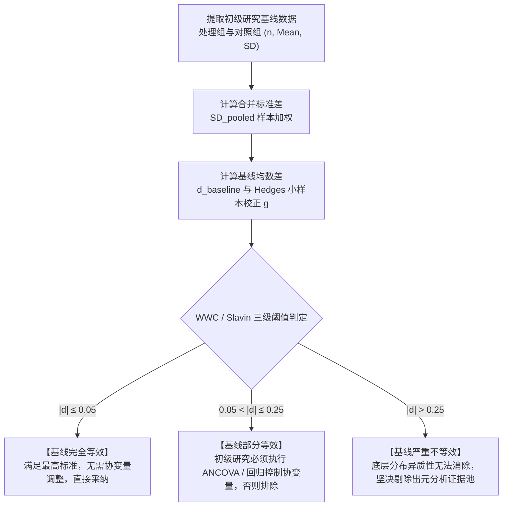

# Baseline Standardized Mean Difference

---

## 定义

> [!def] 方法定义
> 基线等效性标准化均数差（Baseline Standardized Mean Difference, Baseline SMD / $d_{\text{baseline}}$）是在实验与准实验设计以及循证[[Meta-analysis|元分析]]中，用于定量度量干预前（[[Pre-test and Post-test|前测]]）处理组与对照组在目标变量或关键协变量上初始能力等价程度的标准化统计量。
>
> 该指标源于因果推断（Causal Inference）反事实等价性理论，由美国教育部教育科学研究院有效教学策略网（[[What Works Clearinghouse|What Works Clearinghouse, WWC]]）与 Robert Slavin 的最佳证据百科（Best Evidence Encyclopedia）系统规范化，确立了以 $0.05$ 与 $0.25$ 标准差（SD）为断点的三级证据准入与模型调整判准。[[Argument_Chen_Cheung_2025_ERR|(Chen & Cheung, 2025, p. 8)]]

> [!method-scope] 方法范围
> - **研究对象** 实验与准实验初级研究中基线期（干预前）的客观学科测试成绩、标准化量表得分或关键人口学协变量。
> - **问题类型** 因果识别前置假定检验、非随机分配选择偏倚诊断与元分析初级证据筛选。
> - **分析单位** 初级研究中处理组与对照组的前测样本量（$n_T, n_C$）、前测均值（$\bar{X}_T, \bar{X}_C$）与前测标准差（$SD_T, SD_C$）。
> - **输出形式** 标准化均数差点估计值 $d_{\text{baseline}}$（或小样本校正值 $g_{\text{baseline}}$）及对应的三级等效性评定结论（完全等效、需调整后采纳、不达标剔除）。

> [!citation-card]- 关键定义与排除规程
> 报告前测数据并确立初始组间等效性且基线差异小于 0.25 SD 是元分析的重要准入标准；若无前测则必须为严格随机试验。前测差异超过 0.25 SD 的研究必须予以排除，因为即便使用协方差分析，由于底层分数分布存在实质性异质性，过大的前测差异也无法得到充分控制。[[Argument_Chen_Cheung_2025_ERR|(Chen & Cheung, 2025, p. 8)]]
>
> *Studies with pretest differences of more than 25% of a standard deviation were excluded because, even with analyses of covariance, large pretest differences cannot be adequately controlled for as underlying distributions may be fundamentally different.*

---

## 方法定位

> [!method-position] 认识论与方法定位
> - **知识观** 循证评价坚持“因果推断的可比性依赖于反事实构造的无偏性”。在非随机分配的准实验情境下，若未严格证明组间起点等价，后测观察到的组间差异必然混杂了不可观测的初始能力和环境禀赋差异。
> - **研究者角色** 研究者必须执行标准化的前端硬性门槛筛选，避免将研究者对初级研究的个人偏好引入文献池。
> - **有效性标准** 核心保障研究的[[Internal Validity|内部效度]]（Internal Validity）与统计结论效度，为[[Campbellian Validity Framework|坎贝尔效度体系]]中抵御“选择-成熟交互作用”（Selection-Maturation Interaction）提供量化屏障。
> - **不声称回答的问题** 基线等效仅证明两组在所测量的观测变量上起点相当，不能完全排除未测量的深层心理特质差异，亦不能替代对实验实施保真度（Implementation Fidelity）与磨蚀偏倚（Attrition Bias）的审查。

> [!method-stack] 方法层级与技术定位
> - **研究设计层级** 准实验设计（[[Quasi-Experimental Designs|QED]]）必须执行；高流失随机对照试验（[[Randomised Controlled Trials|RCT]]）因样本选择性损耗破坏随机性后亦必须执行。
> - **前置分析技术** 样本量加权合并方差计算、小样本无偏校正。
> - **后续补偿技术** 当 $0.05 < |d| \le 0.25$ 时，触发初级研究层级的[[Analysis of Covariance|协方差分析]]（ANCOVA）、倾向得分匹配（PSM）或双重差分（DID）统计校正。
> - **上位元分析功能** 充当元分析文献检索与筛选流程中的核心方法学“防火墙”，抵御“垃圾进，垃圾出”效应。

---

## 研究程序与核心公式

> [!formula-step] 公式步骤 1　两组前测合并标准差计算
> $$SD_{\text{pooled}} = \sqrt{\frac{(n_T - 1)SD^2_{T, \text{pre}} + (n_C - 1)SD^2_{C, \text{pre}}}{n_T + n_C - 2}}$$
>
> **这个公式在做什么** 计算两组前测分数的加权方差平均值的平方根，用于消除两组样本量不平衡对基准方差造成的偏差。
>
> **符号说明**
> - $n_T, n_C$：处理组与对照组的前测有效样本量；
> - $SD_{T, \text{pre}}, SD_{C, \text{pre}}$：处理组与对照组在前测测量上的样本标准差；
> - 分母 $n_T + n_C - 2$：两组加权样本方差的自由度。
>
> **数学直觉** 依据自由度对两组方差进行样本量逆方差加权，使大样本组在合并离散度中拥有更高权重。

> [!formula-step] 公式步骤 2　基线标准化均数差计算（Cohen's d）
> $$d_{\text{baseline}} = \frac{\bar{X}_{T, \text{pre}} - \bar{X}_{C, \text{pre}}}{SD_{\text{pooled}}}$$
>
> **这个公式在做什么** 将前测组间均值原始差异除以合并标准差，消除测量量表原始量纲的影响，得到无量纲的标准差单位差值。
>
> **符号说明**
> - $\bar{X}_{T, \text{pre}}, \bar{X}_{C, \text{pre}}$：处理组与对照组在前测上的样本算术均值；
> - $d_{\text{baseline}}$：基线标准化均值差。
>
> **结果怎么读**
> - $d_{\text{baseline}} > 0$ 表示处理组在干预前基础更优；
> - $d_{\text{baseline}} < 0$ 表示对照组在干预前基础更优；
> - 核心判定取绝对值 $|d_{\text{baseline}}|$ 进行阈值对照。

> [!formula-step] 公式步骤 3　小样本无偏校正因子（Hedges' g）
> $$J \approx 1 - \frac{3}{4(n_T + n_C) - 9}$$
> $$g_{\text{baseline}} = J \times d_{\text{baseline}}$$
>
> **这个公式在做什么** 当总样本量较小（如每组 $n < 20$）时，标准差估计容易系统性低估总体方差，从而轻微高估标准化均数差；乘上校正因子 $J$ 可消除这一正向偏倚。

---

## 判定准则与统计学机理

> [!contrast-table] WWC 5.0 与 Slavin (2009) 循证三级决策矩阵
> | 基线差值绝对值区间 | 等效性裁定等级 | 初级研究要求与处理方式 | 元分析采纳决策 | 方法学原理与偏倚机制 |
> |---|---|---|---|---|
> | **$|d| \le 0.05$** | **基线高度等价** （High Equivalence） | 组间差异微弱，属于完全随机抽样误差范围；后测分析无需加入协变量。 | **无条件采纳** | 组间无系统性选择偏倚，内部效度达到准随机对照水平。 |
> | **$0.05 < |d| \le 0.25$** | **基线有条件等价** （Conditional Equivalence） | 初级研究必须在统计分析中将前测成绩作为协变量控制（如 ANCOVA 或回归）。 | **有条件采纳**（报告校正结果者纳入，未校正则排除） | 组间存在轻中度初始偏差，但在线性假定范围内可通过协方差统计模型消除混杂。 |
> | **$|d| > 0.25$** | **基线严重不等价** （Baseline Non-equivalent） | 统计模型无法纠偏；WWC 判定为“未达标（Does Not Meet Standards）”。 | **坚决予以剔除** | **ANCOVA 纠偏失效** 两组潜在能力分布存在质性异质性、天花板/地板效应，违背平行回归假设。 |

> [!warning] 为什么 $|d_{\text{baseline}}| > 0.25$ 时 ANCOVA 统计校正会失效？
> 1. **潜在分布质性异质性** 当组间基线差异超过 $0.25$ 个标准差时，两组学生通常来自质性不同的群体（如重点班 vs 普通班）。此时测验工具可能在高端出现“天花板效应”或在低端出现“地板效应”，严重扭曲分数的等距性。
> 2. **违背回归斜率齐性假定（Homogeneity of Regression Slopes）** 协方差分析的核心假定是两组的前测-后测回归斜率完全平行。当初始能力差距过大时，能力强组的认知增速往往远高于薄弱组（马太效应），导致斜率异质，强行线性调整会产生严重的人为估计偏差。
> 3. **高维未测混杂的投射** $0.25$ SD 的巨大落差往往是家庭社会经济地位、前期累积学业资本与学习动机的综合外显，单凭单一前测分数的线性扣除绝不可能彻底剔除这些高维多重共线性变量的影响。

---

## 适用场景

> [!method-fit] 适用判断
> - **适合使用**
>   - 系统综述与元分析的文献筛选阶段，对实验与准实验初级研究实施前端质量准入审查。[[Argument_Chen_Cheung_2025_ERR|(Chen & Cheung, 2025, p. 8)]]
>   - 准实验教育干预研究在数据收集后的内部效度诊断，决定后续统计分析是否需要引入协变量控制。
>   - 随机对照试验中发生严重样本流失（Differential Attrition）后的补救性等价检验。
> - **谨慎使用**
>   - 样本量极小（每组 $< 15$ 人）的情境：此时由于样本方差波动剧烈，$SD_{\text{pooled}}$ 估计极不稳定，可能误判等效性。
> - **不适合使用**
>   - 单组前后测设计（Pre-experimental One-group Pretest-Posttest Design）：因缺乏对照组，无法计算组间基线均数差。
>   - 分类结局变量（如升学率、及格率）：应采用几率比（Odds Ratio）或风险比（Risk Ratio）评估基线等效。

---

## 局限性

> [!method-limits] 方法局限
> - **无法侦测未测量的潜在混杂** $d_{\text{baseline}}$ 只能衡量已纳入前测测验的变量；两组如果在未测量的性格特质、家庭期望或教师教学风格上存在偏差，该指标无法识别。
> - **高度依赖前测工具的心理测量学质量** 若前测测验信度较低（如 $\alpha < 0.70$）或存在严重的题目难度偏向，计算出的 $d_{\text{baseline}}$ 将受测量误差严重衰减。
> - **实践中的“报告缺失”门槛** 基础教育初级研究中大量文献未能规范报告前测标准差或两组独立均值，严格执行该门槛可能导致大量研究被排除，面临合成样本量缩减的张力。

---

## 相关理论与方法

> [!entry-map]
>
> | 条目 | 类型 | 关系 |
> |:-----|:-----|:-----|
> | [[Campbellian Validity Framework]] | 理论 | 为基线等效性提供因果推断内部效度（抵御选择-成熟交互偏差）的认识论依据。 |
> | [[What Works Clearinghouse]] | 评价标准 | 制定并将 0.05/0.25 SD 门槛制度化为国家级循证证据评级标准的权威机构。 |
> | [[Meta-analysis]] | 上位方法 | 将基线等效性作为前置质控筛选工具，解决“垃圾进，垃圾出”问题。 |
> | [[Analysis of Covariance]] | 补偿方法 | 当基线差异处于 $0.05 < |d| \le 0.25$ 时用于统计纠偏的核心线性模型。 |
> | [[Quasi-Experimental Designs]] | 适用对象 | 因缺乏随机分配而最依赖基线等效性检验的研究设计门类。 |
> | [[Pre-test and Post-test]] | 数据基础 | 提供计算两组合并方差与初始能力差距的前测实证测量基础。 |
> | [[Effect Size]] | 统计基础 | 为基线差异提供无量纲标准差度量尺度的统计方法家族。 |

---

## 使用此方法的研究

> [!evidence-grid-a] 相关研究索引
> - [[Argument_Chen_Cheung_2025_ERR|Chen & Cheung (2025)]] — 首次在高等教育生成式 AI 元分析中严格引入 $d < 0.25$ 基线等效门槛，实证证实该标准成功消除了准实验与随机对照试验之间的系统性效应差异（$Q_B = 0.407, p = 0.523$），消解了过度乐观的效应膨胀。
