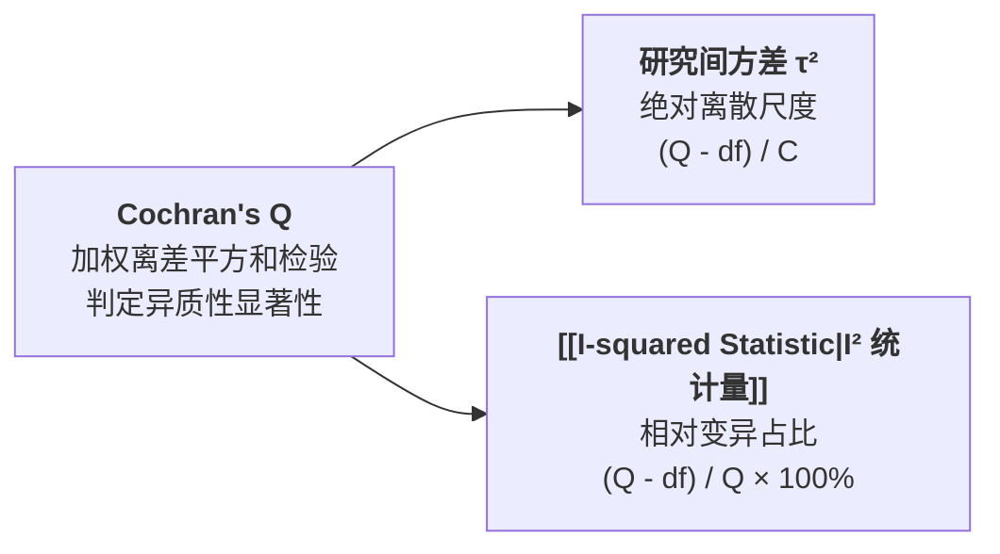

# Cochran's Q Test

---

## 定义

> [!def] 方法定义
> Cochran's Q 检验（Cochran's Q Test，亦称 Q 统计量检验）是由 William G. Cochran (1954) 提出并在[[Meta-analysis|元分析]]中被作为标准检验手段的经典统计[[Hypothesis|假设]]检验方法。它通过计算各项初级研究[[Effect Size|效应量]]与其固定效应加权均值之间的**加权离差平方和**，检验“所有研究估计同一真实效应量”（原假设 $H_0: \theta_1 = \dots = \theta_k = \theta$，即 $\tau^2 = 0$）的同质性假设，判定观察到的研究间差异是纯属[[Sampling Error|抽样误差]]随机波动，还是存在实质性[[Heterogeneity|异质性]]。[[Argument_Higgins_2016_RE|(Higgins, 2016, pp. 38–39)]]; [[Argument_Cohen_Manion_Morrison_2011_Routledge_Ch17|(Cohen et al., 2011, Ch. 17)]]

> [!method-scope] 方法范围
> - **检验对象** 纳入元分析的 $k$ 项独立实证研究的效应量向量与抽样方差矩阵。
> - **原假设与[[Alternative Hypothesis|备择假设]]** 
>   - 原假设 $H_0$：$\tau^2 = 0$（同质性，无真实变异）；
>   - 备择假设 $H_1$：$\tau^2 > 0$（存在跨研究真实效应异质性）。
> - **输出指标** $Q$ 统计量观测值、自由度 $df = k - 1$ 及渐近 $p$ 值。

---

## 数学原理与公式推导

> [!formula-step] Q 统计量计算公式
> $$Q = \sum_{i=1}^k w_i (y_i - \hat{\theta}_{\text{FE}})^2 = \sum_{i=1}^k \frac{(y_i - \hat{\theta}_{\text{FE}})^2}{v_i}$$
>
> 其中：
> - $y_i$ 为第 $i$ 项研究的[[Effect Size|效应量]]估计值；
> - $v_i$ 为该效应量的抽样方差；
> - $w_i = \frac{1}{v_i}$ 为固定效应逆方差权重；
> - $\hat{\theta}_{\text{FE}} = \frac{\sum w_i y_i}{\sum w_i}$ 为固定效应加权合并平均值。
>
> **简化计算方程**
> $$Q = \sum_{i=1}^k w_i y_i^2 - \frac{(\sum_{i=1}^k w_i y_i)^2}{\sum_{i=1}^k w_i}$$

> [!math-principle] [[Sampling Error|抽样分布]]与统计推断
> 在原[[Hypothesis|假设]] $H_0$ 成立的前提下，$Q$ 统计量渐近服从自由度为 $df = k - 1$ 的**卡方分布（$\chi^2_{k-1}$）**。
> - $Q$ 的理论期望值为 $E(Q) = k - 1$；
> - 若计算得到的 $Q > \chi^2_{1-\alpha, \, k-1}$（或对应 $p < \alpha$），则在 $\alpha$ 显著性水平下拒绝原假设，认定存在跨研究异质性。
> - 在[[Meta-analysis|元分析]]实践中，由于纳入研究数 $k$ 通常较小导致检验功效不足，常规惯例常采用更宽松的 **$\alpha = 0.10$** 作为显著性判定阈值。

---

## 局限性与方法学困境

> [!method-limits] Cochran's Q 检验的双重功效困境
> - **小样本检验功效不足（Low Statistical Power when $k$ is small）** 当纳入研究数量较少（如 $k < 15$）或初级研究样本量较小时，即使客观存在实质性异质性，Q 检验也极易得出 $p > .05$ 的不显著结论，造成高假阴性率（Type II 错误）。
> - **大样本假阳性过度敏感（Excessive Sensitivity when $k$ or $N$ is large）** 当纳入研究数量极多或[[Sample Size Determination|样本量]]极庞大时，极其微小的临床/教育无关轻微波动也会触发 $p < .001$ 极度显著，无法反映异质性的实际严重程度。
> - **无法度量[[Heterogeneity|异质性]]幅度** Q 检验仅能给出“异质性是否存在”（Yes/No）的二[[Metainferences|元推断]]，无法回答“异质性有多大”这一核心量化问题。

---

## 进阶承接：$\tau^2$ 与 $I^2$ 的衍生基石

Q 统计量构成了现代[[Meta-analysis|元分析]][[Heterogeneity|异质性]]量化体系的基础骨架：
1. 从 $Q$ 减去其期望值 $k - 1$，提取出超出随机误差的真实变异，除以权重系数得到 **[[Between-Study Variance|研究间方差]] $\tau^2$**；
2. 将超出部分除以 $Q$ 总量，得到相对异质性比例 **[[I-squared Statistic|I² 统计量]]**。

---

## 相关研究

> [!evidence-grid-a] 相关研究索引
> - [[Argument_Higgins_2016_RE|Higgins (2016)]] — 系统评述 Cochran's Q 检验在证据综合中的统计原理及其向 $I^2$ 指标演进的历史背景。
> - [[Argument_Cohen_Manion_Morrison_2011_Routledge_Ch17|Cohen, Manion & Morrison (2011, Ch17)]] — 介绍[[Meta-analysis|元分析]]中同质性检验的操作程序与判定准则。
