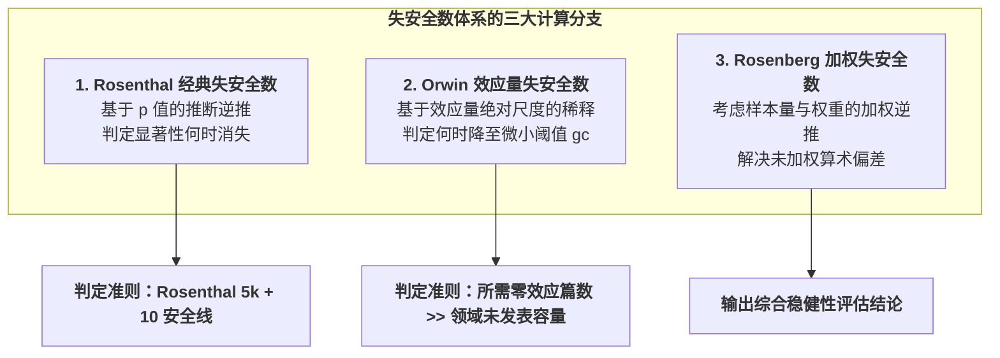

# Fail-Safe N

---

## 定义

> [!def] 方法定义
> 失安全系数（Fail-Safe N, 简写为 $N_{\text{fs}}$），又称失安全数（Fail-Safe Number），是由心理统计学家 Robert Rosenthal 于 1979 年提出并在后续由 Orwin（1983）和 Rosenberg（2005）扩展的[[Meta-analysis|元分析]]敏感性分析方法体系。该方法通过构建极端[[Counterfactual|反事实]][[Hypothesis|假设]]，计算在现有纳入研究的基础上，还需要多少篇无效应（[[Effect Size|效应量]]为零）的未发表研究才能将当前统计显著的汇总结果拉低至不显著水平（经典法），或将合并效应量稀释至微小无意义阈值（Orwin 法），从而定量测度元分析结论抵抗[[Publication Bias|发表偏倚]]（抽屉文件效应，File Drawer Effect）的稳健性边界。[[Argument_Gungor_2026_CP|(Güngör et al., 2026, pp. 6–8)]]; [[Argument_Liu_2026_CHBR|(Liu et al., 2026, pp. 8, 12)]]

> [!method-scope] 方法范围
> - **研究对象** 元分析中纳入的 $k$ 项独立初级实证研究的标准正态统计量（$Z$ 值）、加权合并效应量（如 Hedges' $g$、Cohen's $d$）及其抽样方差。
> - **问题类型** 评估元分析汇总发现对未发表阴性[[Document|文献]]潜在威胁的容忍限度与统计稳健性。
> - **分析单位** 元分析数据集（一阶元分析效应量集合或[[Meta-meta-analysis|二阶元分析]]汇总集）。
> - **输出形式** 理论所需的临界文献数量 $N_{\text{fs}}$（整数值）及经验安全门槛（如 Rosenthal $5k + 10$ 准则）。

> [!citation-card]- 关键定义
> 经典失安全数代表将总体效应降至不显著水平所必须添加到元分析中的非显著（零效应）研究数量；当失安全数远大于经验安全门槛（$N_{\text{fs}} \gg 5k + 10$）时，表明该元分析结论受发表偏倚逆转的概率极低（Rosenthal, 1979; Borenstein et al., 2021）。[[Argument_Gungor_2026_CP|(Güngör et al., 2026, p. 8)]]
>
> *The classic fail-safe N represents the number of non-significant (null) studies that would have to be added to the meta-analysis to reduce the overall effect to a non-significant level... while Orwin's fail-safe N calculates the number of missing studies needed to reduce the overall effect size to a specified trivial criterion (Rosenthal, 1979; Orwin, 1983).*

---

## 方法定位

> [!method-position] [[Epistemology|认识论]]与方法定位
> - **知识观** 基于[[Counterfactual|反事实推理]]与极端情境压力测试，将[[Publication Bias|发表偏倚]]形式化为未发表阴性研究在抽屉中的隐藏堆积。
> - **研究者角色** 设定临界显著性水平（如 $\alpha = .05$）或微小[[Effect Size|效应量]]实践阈值（如 $g_c = 0.01$ 或 $0.10$），对潜在缺失[[Document|文献]]的理论规模进行逆向推导。
> - **有效性标准** 若计算得出的 $N_{\text{fs}} > 5k + 10$（Rosenthal 准则），且 Orwin 失安全数远超该领域合理的未发表文献容量，判定结论具备高度抗偏倚稳健度。
> - **不声称回答的问题** 不能检验[[Funnel Plot|漏斗图]]不对称的具体机制，不能识别小研究偏倚的来源，亦不能直接修正有偏的效应量点估计值。

> [!method-stack] 方法层级
> - **研究设计** [[Meta-analysis|元分析]]（Meta-analysis）偏倚压力测试与敏感性分析
> - **数据输入** 初级研究的 $Z$ 统计量、单项效应量及其逆方差权重
> - **分析方法** Rosenthal 经典法（基于 $p$ 值）、Orwin 稀释法（基于效应量阈值）、Rosenberg 加权法
> - **协同工具** 与漏斗图（Funnel Plot）、[[Trim and Fill Method|剪补法]]（Trim and Fill Method）、Egger 线性回归及[[Leave-One-Out Sensitivity Analysis|留一法敏感性分析]]（Leave-One-Out）协同构成偏倚诊断闭环

---

## 核心计算原理与数学公式



> [!formula-step] 公式步骤一　Rosenthal（1979）经典失安全数
> $$N_{\text{fs}} = \frac{\left(\sum_{i=1}^k Z_i\right)^2}{Z_\alpha^2} - k = \frac{\left(\sum_{i=1}^k Z_i\right)^2}{2.706} - k$$
>
> **这个公式在做什么** 接收纳入的 $k$ 项研究的标准正态统计量 $Z_i$，输出将综合 $p$ 值拉升至不显著水平（$\alpha = .05$, 单尾临界值 $Z_\alpha = 1.645$, $1.645^2 \approx 2.706$）所必需的零效应（$Z = 0$）隐藏研究篇数。
>
> **符号说明**
> - $k$：[[Meta-analysis|元分析]]纳入的初级研究（或[[Effect Size|效应量]]）总数；
> - $Z_i$：第 $i$ 项初级研究单尾显著性对应的标准正态分位数；
> - $Z_\alpha$：显著性检验临界值（单尾 $\alpha = .05$ 时为 1.645；双尾 $\alpha = .05$ 时为 1.96，分母对应 $1.96^2 = 3.841$）。
>
> **数学直觉** [[Hypothesis|假设]]所有未发表的抽屉研究其平均 $Z$ 值为 0；当加入 $N_{\text{fs}}$ 篇零效应研究后，新的合并统计量 $\bar{Z}_{\text{new}} = \frac{\sum Z_i}{\sqrt{k + N_{\text{fs}}}}$ 恰好等于显著性临界值 $Z_\alpha$，解此方程即可得出 $N_{\text{fs}}$。
>
> **结果怎么读** $N_{\text{fs}}$ 数值越大，表明推翻当前显著性所需的隐藏[[Document|文献]]越多；若 $N_{\text{fs}} > 5k + 10$（Rosenthal 经验准则），确认[[Publication Bias|发表偏倚]]极难颠覆结论。

> [!formula-step] 公式步骤二　Orwin（1983）效应量稀释失安全数
> $$N_{\text{fs}} = \frac{k(\bar{g} - g_c)}{g_c - g_{\text{fs}}}$$
>
> **这个公式在做什么** 克服了经典法仅关注 $p$ 值显著性的缺陷，直接计算将加权平均效应量 $\bar{g}$ 稀释至人为设定的微小无意义阈值 $g_c$ 所需的潜在未发表研究数。
>
> **符号说明**
> - $\bar{g}$：当前元分析中观察到的加权平均效应量（如 $g = 0.404$）；
> - $g_c$：评判效应量微小或琐碎的目标阈值（Criterion for trivial effect，如 $g_c = 0.01$ 或 $0.10$）；
> - $g_{\text{fs}}$：假设缺失研究的平均效应量（通常保守假定为完全零效应，即 $g_{\text{fs}} = 0.00$）。
>
> **数学直觉** 当假定缺失研究效应量为 0（$g_{\text{fs}} = 0$）时，公式简化为 $N_{\text{fs}} = k \left(\frac{\bar{g}}{g_c} - 1\right)$。它直观度量了当前合并效应量相对于微小阈值的倍数关系。
>
> **结果怎么读** 输出所需的研究篇数；若需数千篇零效应研究才能将效应量拉低至 $0.01$，表明该研究结论在效应量尺度上具有极高抗稀释韧性。[[Argument_Liu_2026_CHBR|(Liu et al., 2026, pp. 8, 12)]]

> [!formula-step] 公式步骤三　Rosenberg（2005）加权失安全数
> $$N_{\text{fs(w)}} = \frac{\sum_{i=1}^k w_i y_i - g_c \sum_{i=1}^k w_i}{g_c \bar{w}_{\text{fs}} - \bar{w}_{\text{fs}} g_{\text{fs}}}$$
>
> **这个公式在做什么** 修正了 Rosenthal 和 Orwin 公式假定所有研究具有同等权重的缺陷，将逆方差权重纳入失安全数求解过程。
>
> **符号说明**
> - $w_i$：第 $i$ 项已发表研究的逆方差权重；
> - $\bar{w}_{\text{fs}}$：假定缺失研究所赋予的平均权重（通常取已纳入研究权重的均值或中位数）。
>
> **数学直觉** 赋予大样本研究更高权重，避免小样本研究对失安全数产生过度放大或扭曲。

---

## 软件实现工作流

> [!software-impl] R（metafor）与 STATA 18 分析脚本
> 
> ```r
> # ==================== R (metafor) 计算脚本 ====================
> library(metafor)
> 
> # 1. 经典 Rosenthal 失安全数
> fsn(yi, vi, data = dat, type = "Rosenthal", alpha = 0.05)
> 
> # 2. Orwin 效应量失安全数 (设定微小阈值 target = 0.01, 假设缺失效应 = 0)
> fsn(yi, vi, data = dat, type = "Orwin", target = 0.01)
> 
> # 3. Rosenberg 加权失安全数
> fsn(yi, vi, data = dat, type = "Rosenberg")
> ```
> 
> ```stata
> * ==================== STATA 18 计算脚本 ====================
> * 1. 声明元分析数据
> meta set es se_es
> 
> * 2. 计算 Orwin 与经典失安全数
> meta fsn, target(0.01)
> ```

---

## 方法学批判与适用边界

> [!contrast-table] 失安全数与现代偏倚检验方法对比
> | 维度 | Rosenthal 经典失安全数 | Orwin [[Effect Size\|效应量]]失安全数 | 现代偏倚校正法（[[Trim and Fill Method\|剪补法]] / Egger 检验 / [[Leave-One-Out Sensitivity Analysis\|留一法]]） |
> |---|---|---|---|
> | **关注核心** | 统计显著性（$p$ 值） | 效应量绝对大小（Effect Size） | [[Funnel Plot\|漏斗图]]不对称几何形态与分布[[Heterogeneity\|异质性]] |
> | **[[Hypothesis\|假设]]前提** | 假设未发表[[Document\|文献]]效应严格为 0 | 假设未发表文献效应为 0 或指定常数 | 基于已有研究分布迭代剪除与镜像填补 |
> | **效应量校正** | **无法修正点估计** | **无法修正点估计** | **可输出校正后的真实效应量与[[Confidence Interval\|置信区间]]** |
> | **敏感性识别** | 无法检测单个异常值主导效应 | 无法检测单个异常值主导效应 | **留一法可直接识别极端异常值干扰** |
> | **现代定位** | 辅助性压力测试工具 | 辅助性效应量稀释指标 | Cochrane 与 [[PRISMA]] 推荐的标准报告工具 |

> [!warning] 方法局限与使用警示
> 1. **忽视真实[[Publication Bias|发表偏倚]]机制** 现实中被隐藏在抽屉里的研究往往具有微弱正效应、零效应甚至负效应，而非整齐划一的绝对零效应（$ES = 0$）。
> 2. **[[Sample Size Determination|样本量]]与 $p$ 值的虚假安全** 初级研究数量 $k$ 极大时，即使每个研究效应微弱，累积的失安全数也会异常膨胀，容易造成虚假的安全感。
> 3. **不能替代偏倚校正与质评** 失安全数仅能作为极端情境压力测试，绝不能替代基于 Cochrane RoB 2 的初级研究方法学质量评估，亦不能替代剪补法和留一法对效应量真实性的校正与扰动检验。

---

## 典型案例研究

> [!case] 实证案例一　[[Argument_Liu_2026_CHBR|Liu et al. (2026)]] · AI [[AI Agent in Education|智能体]]促学[[Meta-analysis|元分析]]双重失安全数检验
> 在关于 AI 智能体促进 K-12 认知表现的元分析中（34 项研究，73 个[[Effect Size|效应量]]），研究者同时执行了经典与 Orwin 失安全数压力测试：
> - **经典失安全数** 观测研究合并 $Z = 4.870 (p < .001)$，计算得到 $N_{\text{fs}} = 378.00$，远超 Rosenthal 经验安全门槛（$5k + 10 = 5 \times 34 + 10 = 180$）；
> - **Orwin 失安全数** 在随机效应合并效应量 $g = 0.404$ 基础上，设定微小琐碎阈值 $g_c = 0.01$ 且[[Hypothesis|假设]]缺失研究平均效应 $g_{\text{fs}} = 0.00$，计算得出需要 **$2{,}876.00$ 篇**未发表的零效应研究才能将结果稀释至无意义水平；
> - **结论** 双重失安全数确凿证实该元分析证据体系受[[Publication Bias|发表偏倚]]逆转的概率极低。[[Argument_Liu_2026_CHBR|(Liu et al., 2026, pp. 8, 12)]]

> [!case] 实证案例二　[[Argument_Gungor_2026_CP|Güngör et al. (2026)]] · [[Cooperative Learning|合作学习]][[Meta-meta-analysis|二阶元分析]]极端稳健性检验
> 在合作学习二阶元分析中（$k = 23$ 个效应量），计算所得经典失安全系数高达 **$N_{\text{fs}} = 4954$**，远超安全门槛（$5 \times 23 + 10 = 125$），排除了发表偏倚对二阶中等促进效应（$ES = 0.71$）的潜在干扰。[[Argument_Gungor_2026_CP|(Güngör et al., 2026, p. 8)]]

---

## 相关理论与方法

> [!entry-map]
> | 条目 | 类型 | 关系 |
> |:-----|:-----|:-----|
> | [[Meta-analysis]] | 上位方法 | 提供失安全数运行的总体[[Effect Size\|效应量]]与方差统计环境。 |
> | [[Trim and Fill Method]] | 补充方法 | 相比失安全数，剪补法能通过镜像填补给出校正后的效应量点估计。 |
> | [[Leave-One-Out Sensitivity Analysis]] | 互补方法 | 逐一排除单项研究以检验异常值扰动，弥补失安全数无法识别单项极端样本的缺陷。 |
> | [[Multilevel Egger's Test]] | 协同方法 | 通过回归截距检验[[Funnel Plot\|漏斗图]]不对称性，提供连续型偏倚检验统计量。 |
> | [[Publication Bias]] | 目标[[Construct\|构念]] | 失安全数所致力于诊断与抵抗的理论偏误来源。 |

---

## 使用此方法的研究

> [!evidence-grid-a] 相关研究索引
> - [[Argument_Liu_2026_CHBR|Liu et al. (2026)]] 在 AI [[AI Agent in Education|智能体]]促进 K-12 认知表现的[[Meta-analysis|元分析]]中，综合运用经典失安全数（$N_{\text{fs}} = 378$，大于 180 门槛）与 Orwin 失安全数（需 $2{,}876$ 篇未发表零效应研究稀释至 $0.01$），系统确立了证据体系的抗偏倚稳健度。
> - [[Argument_Gungor_2026_CP|Güngör et al. (2026)]] 在[[Meta-meta-analysis|二阶元分析]]中综合运用经典失安全系数（$N_{\text{fs}} = 4954$）、Egger 回归截距检验与[[Trim and Fill Method|剪补法]]，全面证实[[Cooperative Learning|合作学习]]宏观干预效应的稳健性。
