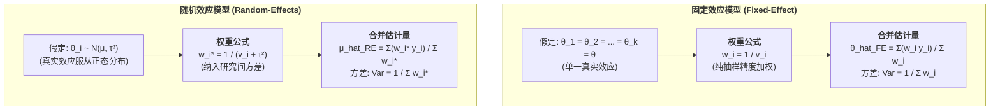

# Fixed-Effect and Random-Effects Models

---

## 定义

> [!def] 方法定义
> 固定效应模型（Fixed-Effect Model）与随机效应模型（Random-Effects Model）是[[Meta-analysis|元分析]]中用于加权合成初级研究[[Effect Size|效应量]]的两种根本性统计建模[[Paradigm|范式]]。它们的核心分歧在于**对跨研究效应量变异来源的方法论[[Hypothesis|假设]]**
> - **固定效应模型** 假定所有纳入研究共享同一个恒定不变的真实效应量 $\theta$，观察到的研究间差异纯粹源于初级研究内部的随机[[Sampling Error|抽样误差]]（Sampling Error）；
> - **随机效应模型** 假定各初级研究的真实效应量本身存在实质性[[Heterogeneity|异质性]]，属于广义总体效应分布的一个[[Random Sampling|随机抽样]]样本，因而模型同时分解“研究内抽样方差”（Within-study variance）与“[[Between-Study Variance|研究间真实方差]]”（Between-study variance, $\tau^2$）。[[Argument_Higgins_2016_RE|(Higgins, 2016, p. 39)]]; [[Argument_Cohen_Manion_Morrison_2011_Routledge_Ch17|(Cohen et al., 2011, Ch. 17)]]

> [!method-scope] 方法范围
> - **研究对象** 纳入元分析的 $k$ 项独立初级研究的效应量点估计值及其抽样方差。
> - **核心决策** 根据研究设计异质性、[[Construct|理论构念]]一致性及统计检验（$Q$ 检验与 $I^2$ 指标）决定采用何种模型加权合成。
> - **输出指标** 合并加权平均效应量点估计值、95% [[Confidence Interval|置信区间]]（CI）及在随机效应模型下的 95% [[Prediction Interval|预测区间]]（PI）。

---

## 核心模型结构与数学公式



### 1. 固定效应模型（Fixed-Effect Model）

> [!formula-step] 固定效应统计模型
> $$y_i = \theta + \epsilon_i, \quad \epsilon_i \sim N(0, v_i)$$
>
> **最优逆方差权重**
> $$w_i = \frac{1}{v_i}$$
>
> **加权合并[[Effect Size|效应量]]与方差**
> $$\hat{\theta}_{\text{FE}} = \frac{\sum_{i=1}^k w_i y_i}{\sum_{i=1}^k w_i}, \quad \text{Var}(\hat{\theta}_{\text{FE}}) = \frac{1}{\sum_{i=1}^k w_i}$$
>
> **推断范围** 推论严格局限于所纳入的这 $k$ 项特定研究集合，不可外推至更广泛的未知总体。

### 2. 随机效应模型（Random-Effects Model）

> [!formula-step] 随机效应统计模型
> $$y_i = \theta_i + \epsilon_i = \mu + u_i + \epsilon_i, \quad u_i \sim N(0, \tau^2), \quad \epsilon_i \sim N(0, v_i)$$
>
> 其中 $\mu$ 为总体真实效应均值，$u_i$ 为第 $i$ 项研究偏离总均值的真实离差，$\epsilon_i$ 为测量[[Sampling Error|抽样误差]]。
>
> **随机效应调整权重**
> $$w_i^* = \frac{1}{v_i + \tau^2}$$
>
> **加权合并效应量与方差**
> $$\hat{\mu}_{\text{RE}} = \frac{\sum_{i=1}^k w_i^* y_i}{\sum_{i=1}^k w_i^*}, \quad \text{Var}(\hat{\mu}_{\text{RE}}) = \frac{1}{\sum_{i=1}^k w_i^*}$$
>
> **推断范围** 推论面向同类研究的潜在“超总体”（Super-population）。

---

## 核心机制辨析与权重再平衡

> [!contrast-table] 固定效应与随机效应模型全方位对比
> | 比较维度 | 固定效应模型（Fixed-Effect） | 随机效应模型（Random-Effects） |
> |---|---|---|
> | **核心哲学[[Hypothesis\|假设]]** | 存在唯一的“真实[[Effect Size\|效应量]]”（One True Effect） | 存在一个“真实效应量分布”（Distribution of True Effects） |
> | **方差来源分解** | 仅抽样方差（Within-study variance $v_i$） | 抽样方差 $v_i$ + [[Between-Study Variance\|研究间方差]] $\tau^2$ |
> | **权重分配特征** | 极度偏向大样本研究（$w_i \propto N_i$） | 权重趋于平均化（大样本优势被 $\tau^2$ 稀释） |
> | **[[Confidence Interval\|置信区间]]宽度** | 通常较窄（[[Standard Error\|标准误]]较小，推断激进） | 较宽（[[Standard Error\|标准误]]较大，充分反映[[Heterogeneity\|异质性]]不确定性） |
> | **[[Prediction Interval\|预测区间]]（PI）** | 无法构建预测区间（假定方差为 0） | 可计算 [[Prediction Interval\|95% 预测区间]] 评估单项新研究风险 |
> | **小研究偏倚风险** | 对小样本[[Publication Bias\|发表偏倚]]相对不敏感 | 更易受[[Small Study Effects\|小研究效应]]扭曲（小样本权重被相对抬高） |
> | **适用情境** | 实验室严格复现、高度同质[[Clinical Trial\|临床试验]] | 真实课堂干预、教育政策、社会科学与多中心研究 |

> [!math-principle] 权重再平衡（Weight Leveling Effect）与小研究效应敏感性
> 当真实异质性极大（$\tau^2 \gg v_i$）时，随机效应权重 $w_i^* = \frac{1}{v_i + \tau^2} \to \frac{1}{\tau^2}$，这意味着所有研究的权重几乎变得完全相同。
>
> **方法学警示** 如果[[Document|文献]]库中存在严重的[[Publication Bias|发表偏倚]]（即存在若干具有夸大效应的小样本劣质研究），随机效应模型因相对提升了小研究的权重，其合并均值 $\hat{\mu}_{\text{RE}}$ 反而可能比固定效应估计值 $\hat{\theta}_{\text{FE}}$ 更容易被高估。因此，在报告随机效应模型时，必须严格配合[[Funnel Plot|漏斗图]]、Egger 检验与[[Trim and Fill Method|剪补法]]进行发表偏倚诊断。

---

## 软件实现示例（R · metafor）

> [!software-impl] 固定与随机效应模型拟合对比
> ```r
> library(metafor)
> 
> # 1. 拟合固定效应模型 (method = "FE")
> fit_fe <- rma(yi, vi, data = dat, method = "FE")
> summary(fit_fe)
> 
> # 2. 拟合随机效应模型 (默认 REML 限制性最大似然估计 tau^2)
> fit_re <- rma(yi, vi, data = dat, method = "REML")
> summary(fit_re)
> 
> # 3. 计算随机效应 95% 预测区间 (Prediction Interval)
> predict(fit_re)
> ```

---

## 相关研究

> [!evidence-grid-a] 相关研究索引
> - [[Argument_Higgins_2016_RE|Higgins (2016)]] — 系统阐述固定与随机效应模型在教育与医学证据综合中的方法论差异与演进历史。
> - [[Argument_Wecker_2016_ZfE|Wecker et al. (2016)]] — 从固定效应数学等价性推导[[Meta-meta-analysis|二阶元分析]]六项方法论前提，批判 Hattie 违背独立性假定。
> - [[Argument_Abrami_2015_RER|Abrami et al. (2015)]] — 在 341 项[[Critical Thinking|批判性思维]][[Intervention Research|干预研究]]中全面采用随机效应模型与混合效应[[Meta-regression|元回归]]。
> - [[Argument_Cohen_Manion_Morrison_2011_Routledge_Ch17|Cohen, Manion & Morrison (2011, Ch17)]] — 介绍[[Meta-analysis|元分析]]加权模型与[[Heterogeneity|异质性]]控制准则。
