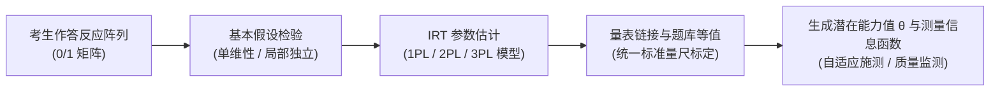

# Item Response Theory

---

## 定义

> [!def] 方法定义
> 项目反应理论（Item Response Theory, IRT；又称潜在特质理论 Latent Trait Theory）是现代心理与教育测量学的核心量化建模方法体系。该方法[[Hypothesis|假设]]个体的可观测测验反应由不可直接观测的潜在特质（Latent Traits, $\theta$）与测验题目的内在计量属性（难度、区分度、伪猜测率）共同决定的非线性数学概率函数所支配；其核心计量突破在于实现了**题目参数估计的样本无关性（Sample Invariance）**与**受试者能力估计的测验题目无关性（Item Invariance）**，为跨时空测验等值、[[Computerized Adaptive Testing|计算机自适应测验]]（Computerized Adaptive Testing, [[Consensual Assessment Technique|CAT]]）与大规模国家教育监测题库标定提供了根本方法学支撑。[[Argument_Cohen_Manion_Morrison_2011_Routledge_Ch24|(Ch24, 24.5 节)]]; [[Argument_Hartong_2018_GSE|(Hartong, 2018, pp. 140–141)]]

> [!method-scope] 方法范围
> - **研究对象** 个体在标准化测验、量表[[Questionnaire|问卷]]或认知任务中的离散反应数据（二分作答如对/错，或多分类等级作答如[[Likert Scale|李克特量表]]评分）。
> - **问题类型** 潜在特质测度、题目质量诊断、跨群体与历时测验等值、题目偏差检验（Differential Item Functioning, DIF）、自适应个性化测评算法构建。
> - **[[Unit of Analysis|分析单位]]** 被试个体、题目项（Item）、测验分量表以及群体水平的能力分布。
> - **输出形式** 被试潜在特质得分（$\theta$）及其个性化测量[[Standard Error|标准误]]、题目特征曲线（Item Characteristic Curve, [[Intraclass Correlation Coefficient|ICC]]）、测验信息函数（Test Information Function, TIF）与等值能力量规。

> [!citation-card] 项目反应理论的核心突破与样本独立性
> 柯恩等人在教育研究方法学中系统阐明了 IRT 对[[Classical Test Theory|经典测验理论]]的根本超越：
> 
> 可以测量单一、特定的潜在特质——这些特质本身不可观测，但可以通过个体对测验题目的反应模式被量化估计。IRT 的核心突破在于：[[Item Analysis|题目难度]]和区分度可以独立于任何特定的受试者样本被描述（样本无关性），同时受试者的能力也可以独立于任何特定的题目样本被估计（题目无关性）。（[[Argument_Cohen_Manion_Morrison_2011_Routledge_Ch24|Cohen et al., 2011, Ch24.5]]）
> 
> *A unidimensional, latent trait can be measured... The breakthrough of IRT is that item difficulty and discriminability can be described independently of any particular sample of examinees, and examinee ability can be estimated independently of any particular sample of items.*

---

## 方法定位

> [!method-position] [[Epistemology|认识论]]与方法定位
> - **知识观** 秉持潜在特质实在论与概率测量观，主张人类复杂的心理认知属性是连续的隐[[Variable|变量]]，虽然不可直接肉眼观测，但能够通过概率数学模型从外显行为反应模式中精确反推。
> - **研究者角色** 研究者需在测验编制前严格界定[[Construct|构念]]维度，并在建模过程中对单维性、局部独立性与模型拟合度做出严谨的形式化检验与参数约束。
> - **有效性标准** 单维性检验（解释方差比）、局部独立性检验（残差相关系数）、项目拟合度（Infit / Outfit 等统计量）、[[Measurement Invariance|跨组测量不变性]]（Measurement Invariance）。
> - **不声称回答的问题** IRT 是纯粹的测量与心理计量学参数标定方法，不负责因果机制识别；估算出的潜在特质 $\theta$ 不能直接等同于学生的综合育人素养或道德发展。

> [!method-stack] 方法层级
> - **研究设计** 大规模标准化教育测评、心理学量表研发、跨区域教学质量监测、计算机自适应测评系统。
> - **数据收集** 纸笔测试卷、上机计算机化自适应考试、结构化认知调查[[Questionnaire|问卷]]。
> - **分析方法** 边际极大似然估计（Marginal Maximum Likelihood Estimation, MMLE）、马尔可夫链蒙特卡罗算法（MCMC）、联合极大似然估计（JMLE）。
> - **辅助技术** 锚题等值（Anchor-Item Equating）、多群组并发标定（Concurrent Calibration）、差异项目功能分析（DIF）。

---

## 研究程序与模型算法

> [!proc] IRT 标准实施程序
> 1. **[[Construct|构念]]界定与题库编制** 明确界定潜在特质内涵，编写覆盖不同认知层级的大规模候选试题池。
> 2. **预试与基本[[Hypothesis|假设]]检验** 施测大样本预试数据，运用探索性/[[Confirmatory Factor Analysis|验证性因子分析]]检验**单维性假设（Unidimensionality）**与**局部独立性假设（Local Independence）**。
> 3. **模型选型与参数标定** 根据题目类型与[[Sample Size Determination|样本量]]选择 1PL（Rasch）、2PL、3PL 或多分式等级反应模型（GRM），估计[[Item Analysis|题目难度]]（$b_i$）、区分度（$a_i$）与猜测参数（$c_i$）。
> 4. **项目拟合诊断与题库清洗** 剔除严重偏离特征曲线、存在作弊猜测干扰或具有群体偏倚（DIF）的不良题目，建立高质量标定题库。
> 5. **量表链接与等值转换** 运用共同题或共同被试设计，将不同试卷或不同施测年份的参数统一转换到国家标准基准量尺上（如将均值标定为 500，标准差标定为 100）。
> 6. **个体能力估计与信息函数输出** 基于最终题本计算被试能力值 $\theta$ 及对应能力点上的测验信息量，生成分级报告与自适应施测路径。

### 量化模型与公式步骤



> [!formula-step] 公式步骤一　一参数逻辑斯蒂模型（1PL / Rasch 模型）
> $$P(X_{ij} = 1 \mid \theta_j, b_i) = \frac{e^{(\theta_j - b_i)}}{1 + e^{(\theta_j - b_i)}} = \frac{1}{1 + e^{-(\theta_j - b_i)}}$$
>
> **这个公式在做什么** 计算能力水平为 $\theta_j$ 的受试者 $j$ 在难度为 $b_i$ 的题目 $i$ 上答对的理论概率。
>
> **符号说明**
> - $\theta_j$：受试者 $j$ 的潜在特质水平（能力值），通常取值在 $[-3, +3]$ 区间。
> - $b_i$：题目 $i$ 的难度参数（与能力值处于同一数学量尺上）。
>
> **数学直觉** 答对概率完全由能力与难度的代数差 $(\theta_j - b_i)$ 决定。当 $\theta_j = b_i$ 时，答对概率恰好为 0.50；当能力高于难度时概率趋近于 1，低于难度时趋近于 0。
>
> **结果怎么读** $b_i$ 越大代表题目越难，需要更高能力的被试才能达到 50% 答对概率。

> [!formula-step] 公式步骤二　两参数逻辑斯蒂模型（2PL 模型）
> $$P(X_{ij} = 1 \mid \theta_j, a_i, b_i) = \frac{1}{1 + e^{-D a_i (\theta_j - b_i)}}$$
>
> **这个公式在做什么** 在难度参数之外引入题目区分度参数 $a_i$，刻画题目对不同能力水平受试者的鉴别敏感度。
>
> **符号说明**
> - $a_i$：题目 $i$ 的区分度参数（斜率）。
> - $D$：缩放常数（通常设为 1.702，使逻辑斯蒂曲线与正态平方法曲线高度拟合）。
>
> **数学直觉** $a_i$ 控制题目特征曲线（[[Intraclass Correlation Coefficient|ICC]]）拐点处的斜率。$a_i$ 越大，曲线在难度 $b_i$ 附近越陡峭，意味着该题目在难度阈值附近区分能力差异的能力极强。

> [!formula-step] 公式步骤三　三参数逻辑斯蒂模型（3PL 模型）
> $$P(X_{ij} = 1 \mid \theta_j, a_i, b_i, c_i) = c_i + (1 - c_i) \frac{1}{1 + e^{-D a_i (\theta_j - b_i)}}$$
>
> **这个公式在做什么** 在二参数基础上增加伪猜测参数 $c_i$，专门校正[[Multiple-Choice Questions|多项选择题]]中低能力被试随机盲猜答对的下限概率。
>
> **符号说明**
> - $c_i$：题目 $i$ 的伪猜测参数（ICC 曲线的下渐近线，如四选一单选题理论猜测率为 0.25）。
>
> **数学直觉** 即使被试能力极低（$\theta_j \to -\infty$），其答对概率也不会降至 0，而是收敛至 $c_i$。

> [!software-impl] 软件实现与计算包
> - **推荐工具** R 环境、Python 或专用心理测量软件（BILOG-MG, MULTILOG, ConQuest）。
> - **R 核心包**
>   - `mirt`：支持多维与单维 IRT、多分类反应模型（GRM/PCM）及极大似然与贝叶斯估计；
>   - `eRm`：专注于 Rasch 家族模型扩展与条件极大似然估计（CML）；
>   - `ltm`：适合基础 1PL、2PL、3PL 建模与特征曲线绘制；
>   - `difR`：用于多组差异题目功能（DIF）检验。
> - **Python 核心包** `py-irt`、`scikit-learn`（结合定制逻辑斯蒂优化算法）。
> - **标准代码流程（R 示例）**
>   ```r
>   library(mirt)
>   # 估计 2PL 模型
>   fit_2pl <- mirt(data_matrix, 1, itemtype = '2PL')
>   # 提取题目参数 (a, b)
>   coef(fit_2pl, IRTpars = TRUE, simplify = TRUE)
>   # 估计被试能力得分及标准误
>   theta_scores <- fscores(fit_2pl, full.scores.SE = TRUE)
>   # 绘制测验信息函数
>   plot(fit_2pl, type = 'info')
>   ```

---

## 适用场景与实证应用

> [!method-fit] 适用判断
> - **适合使用**
>   1. **国家与跨国大型教育监测（[[PISA]]、[[TIMSS]]、[[Vergleichsarbeiten|VERA]]）** 不同国家或学生作答不同试卷模块（Matrix Sampling），依靠 IRT 共同题实现跨国横向与历时纵向绝对可[[Commensuration|通约]]等值。[[Argument_Hartong_2018_GSE|(Hartong, 2018, pp. 140–141)]]
>   2. **国家标准能力量表研制** 如[[Institute for Educational Quality Improvement|德国教育质量发展研究所]]（[[Institute for Educational Quality Improvement|IQB]]）利用 IRT 将试题参数划分为 5 级能力水平模型（Kompetenzstufenmodelle），标定全国最低与卓越标准。[[Argument_Hartong_2018_GSE|(Hartong, 2018, p. 141)]]
>   3. **[[Computerized Adaptive Testing|计算机自适应测验]]（[[Consensual Assessment Technique|CAT]]）** 系统根据被试前一道题的作答情况，实时在标定题库中提取信息量最大（难度最接近被试即时 $\theta$）的题目，以极少题量达到极高测量精度。
> - **谨慎使用**
>   - [[Sample Size Determination|样本量]]小于 300 人的小规模测验（参数估计极不稳定，优先使用 Rasch 模型或[[Classical Test Theory|经典测验理论]] CTT）；
>   - 题目包含复杂多维交互且难以分离的综合主观项目。
> - **不适合使用**
>   - 日常几十名学生的班级期中随堂测验（CTT 百分制足以满足[[Feedback|教学反馈]]需求）。

---

## 局限性与批评

> [!method-limits] 方法局限与风险
> - **严苛的模型数学[[Hypothesis|假设]]依赖** 单维性与局部独立性假设在真实复杂教学情境中常难以绝对满足；若题目间存在上下文阅读材料依赖或题组效应（Testlet Effects），会导致[[Standard Error|标准误]]被严重低估。
> - **大样本门槛与计算复杂度** 2PL 与 3PL 模型通常要求 500 至 1000 人以上的有效样本方能稳定收敛，研发与维护标定题库的财务与技术成本高昂。
> - **认知过程的黑箱化简化** IRT 聚焦于终局性的作答对错概率，无法直接捕捉学生解题过程中的即时思维停顿、直觉顿悟或概念误区，需结合认知诊断模型（CDM）或眼动追踪等微观方法加以补充。

---

## 相关理论与方法

> [!entry-map]
>
> | 条目 | 类型 | 关系 |
> |:-----|:-----|:-----|
> | [[Classical Test Theory]] | 理论 | IRT 的前身与参照系，两者形成现代心理测量学的两大[[Paradigm\|范式]]对照。 |
> | [[Rasch Measurement]] | 方法 | IRT 中最经典的一参数客观测验模型，强调模型支配数据的测量哲学。 |
> | [[Computerized Adaptive Testing]] | 概念 | IRT 为自适应测评提供了[[Item Analysis\|题目难度]]与能力即时匹配的核心算法底座。 |
> | [[Item Analysis]] | 方法 | IRT 参数标定是高级题目分析的核心方法。 |
> | [[Confirmatory Factor Analysis]] | 方法 | 用于检验 IRT 建模前置条件中的单维性[[Hypothesis\|假设]]。 |
> | [[Commensuration]] | 概念 | IRT 是教育治理中将异质学生表现通约为一维连续量尺的技术机器。 |
> | [[Center of Calculation]] | 概念 | 计算中心（如 [[Institute for Educational Quality Improvement\|IQB]]）依托 IRT 参数标定掌控国家教育质量的认知定义权。 |
> | [[Institute for Educational Quality Improvement]] | Fact (Organization) | 德国 IQB 运用 IRT 研发国家题库并标定 5 级能力模型。 |
> | [[Argument_Cohen_Manion_Morrison_2011_Routledge_Ch24\|Cohen et al., 2011]] | Argument | 教材第 24 章系统阐述 IRT 基础原理、样本无关性与 Rasch 模型的[[Document\|文献]]。 |
> | [[Argument_Hartong_2018_GSE\|Hartong, 2018]] | Argument | 剖析 IRT 在德国教育标准跨尺度[[Data Infrastructure\|数据基础设施]]中实现[[Governing at a Distance\|远处治理]]的文献。 |

---

## 使用此方法的研究

> [!evidence-grid-a] [[Correlational Research|相关研究]]索引
> - [[Argument_Cohen_Manion_Morrison_2011_Routledge_Ch24|Cohen et al. (2011)]] — 系统阐释 IRT 基本原理、潜在特质[[Hypothesis|假设]]、题目属性与样本独立性、Rasch 模型及 [[Consensual Assessment Technique|CAT]] 算法。
> - [[Argument_Hartong_2018_GSE|Hartong (2018)]] — 追踪德国 [[Institute for Educational Quality Improvement|IQB]] 如何运用 IRT 算法将 16 州异质考试转化为统一 5 级能力模型，并运营全国 [[Vergleichsarbeiten|VERA]] 题库平台实现政策[[Topological Spatialisation|拓扑重组]]。
