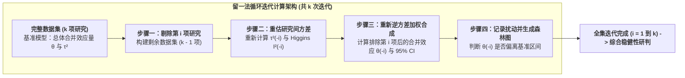

# Leave-One-Out Sensitivity Analysis

---

## 定义

> [!def] 方法定义
> 留一法敏感性分析（Leave-One-Out Sensitivity Analysis），又称逐一剔除敏感性检验或基于刀切法（Jackknife）的敏感性分析，是[[Meta-analysis|元分析]]与统计建模中用于评估证据体系稳健性与识别极端异常值的核心诊断方法。该方法通过从包含 $k$ 项初级研究的数据集中每次依次剔除一项研究，利用剩余的 $k-1$ 项研究重新拟合加权模型并重新估计合并[[Effect Size|效应量]]、95% [[Confidence Interval|置信区间]]（95% Confidence Interval, 95% CI）与[[Heterogeneity|异质性]]统计量（如 $\tau^2, I^2$），从而定量检验元分析的核心发现是否过度依赖于某单项大权重研究或极端异常样本。[[Argument_Liu_2026_CHBR|(Liu et al., 2026, pp. 7–9)]]

> [!method-scope] 方法范围
> - **研究对象** 元分析数据集中的 $k$ 项独立初级研究或效应量及其方差矩阵。
> - **问题类型** 检验汇总统计推断的稳定性，诊断潜在的极端离群值（Outliers）与高影响力研究（Influential Studies）。
> - **分析单位** 包含 $k$ 个效应量的初级研究集合。
> - **输出形式** $k$ 次循环迭代的加权合并效应量序列、重估 95% 置信区间、重估异质性参数（$\tau_{(-i)}^2, I_{(-i)}^2$）及留一法[[Forest Plot|森林图]]。

> [!citation-card]- 关键定义
> 留一法敏感性分析通过系统性地逐项排除初级研究，检验每一次排除后合并效应量是否仍落在基准置信区间内；若排除任何单一研究均未改变总体效应的方向与显著性，则确立元分析证据体系的高度统计稳健性。[[Argument_Liu_2026_CHBR|(Liu et al., 2026, pp. 7–9)]]
>
> *A leave-one-out sensitivity analysis was conducted to evaluate the robustness of the pooled effect size. By iteratively removing one primary study at a time and recalculating the summary effect under the [[Fixed-Effect and Random-Effects Models|Random-Effects Model]], this method ensures that the overarching conclusions are not driven by any single outlier or disproportionately weighted study.*

---

## 方法定位

> [!method-position] [[Epistemology|认识论]]与方法定位
> - **知识观** 秉持经验证据的审慎怀疑主义与压力测试原则，认为可信的科学综合结论不应被个别孤立研究的极端数据所绑架。
> - **研究者角色** 通过系统性算法重抽样，对数据池施加单点扰动，客观记录[[Effect Size|效应量]]的波动轨迹。
> - **有效性标准** 若在全部 $k$ 次剔除重估中，加权合并效应量点估计波动平缓且所有 95% [[Confidence Interval|置信区间]]均不跨越 0（维持原有[[Statistical Significance|统计显著性]]），则判定证据具备极高的抗扰动性。
> - **不声称回答的问题** 不能自动识别由系统性系统误差、共同测量偏误或研究间高度同质共犯导致的偏倚，亦不能代替对[[Primary and Secondary Documents|初级文献]]方法学质量的个别质评。

> [!method-stack] 方法层级
> - **研究设计** [[Meta-analysis|元分析]]偏倚诊断与敏感性压力测试
> - **算法核心** 刀切法（Jackknife）单样本置换与逆方差重加权
> - **分析输出** 逐项排除[[Forest Plot|森林图]]、Baujat 诊断图、Cook's 距离与学生化删除残差
> - **协同工具** 与[[Funnel Plot|漏斗图]]（Funnel Plot）、Egger 回归、[[Trim and Fill Method|剪补法]]（Trim and Fill Method）及[[Fail-Safe N|失安全数]]（Fail-Safe N）协同构成偏倚与稳健性质控闭环

---

## 核心统计原理与分析流程



> [!formula-step] 公式步骤　留一法加权合并[[Effect Size|效应量]]重估公式
> $$\hat{\theta}_{(-i)} = \frac{\sum_{j \ne i} w_j^* y_j}{\sum_{j \ne i} w_j^*}, \quad \text{Var}\left(\hat{\theta}_{(-i)}\right) = \frac{1}{\sum_{j \ne i} w_j^*}$$
>
> **这个公式在做什么** 接收剔除第 $i$ 项研究后的 $k-1$ 项研究效应量 $y_j$ 及其重新计算的随机效应权重 $w_j^*$，输出排除第 $i$ 项研究后的加权平均效应量 $\hat{\theta}_{(-i)}$ 及其抽样方差。
>
> **符号说明**
> - $\hat{\theta}_{(-i)}$：排除第 $i$ 项初级研究后的合并效应量点估计值；
> - $w_j^*$：第 $j$ 项研究的随机效应逆方差权重，计算公式为 $w_j^* = \frac{1}{v_j + \hat{\tau}_{(-i)}^2}$；
> - $\hat{\tau}_{(-i)}^2$：仅基于剩余 $k-1$ 项研究重新估计的[[Between-Study Variance|研究间方差]]（Between-Study Variance）。
>
> **数学直觉** 若某项研究 $i$ 具有极端的效应量或异常巨大的[[Sample Size Determination|样本量]]（极小方差 $v_i$），其在基准模型中会占据过高权重或大幅拉升[[Heterogeneity|异质性]] $\tau^2$；将其剔除后，$\hat{\theta}_{(-i)}$ 会发生剧烈跳跃或导致 $\hat{\tau}_{(-i)}^2$ 锐减。
>
> **结果怎么读** 
> 1. 若所有 $\hat{\theta}_{(-i)}$ 的 95% CI 均紧密包络在基准模型的[[Confidence Interval|置信区间]]内且方向一致，表明结论稳健；
> 2. 若剔除某研究后 $\hat{\theta}_{(-i)}$ 显著下降且 $p$ 值由显著变为不显著，该研究即为支撑原结论的关键杠杆点（Influential Case）；
> 3. 若剔除某研究后异质性 $I_{(-i)}^2$ 出现断崖式下跌，该研究即为造成整体异质性的主要异源（Outlier）。

---

## 软件实现工作流

> [!software-impl] R（metafor）与 STATA 18 分析脚本对照
> 
> ```r
> # ==================== R (metafor) 留一法工作流 ====================
> library(metafor)
> 
> # 1. 拟合基准随机效应模型 (REML 法)
> res <- rma(yi, vi, data = dat, method = "REML")
> 
> # 2. 执行留一法敏感性分析 (输出每次排除后的估计值、SE、Z、p、tau^2 与 I^2)
> l1o <- leave1out(res)
> print(l1o)
> 
> # 3. 绘制留一法森林图 (可视化观察效应量波动)
> forest(l1o$estimate, sei = l1o$se, slab = paste("Excl.", dat$study_id),
>        refline = res$beta, xlab = "Leave-One-Out Pooled Effect Size (95% CI)")
> 
> # 4. 影响力与离群诊断图 (Baujat Plot 与 Cook's Distance)
> inf <- influence(res)
> plot(inf)
> baujat(res)
> ```
> 
> ```stata
> * ==================== STATA 18 留一法工作流 ====================
> * 1. 声明元分析数据
> meta set es se_es, studylabel(study_id)
> 
> * 2. 执行留一法敏感性分析与森林图绘制
> meta summarize, random(reml) leaveoneout
> meta forestplot, leaveoneout nullrefline
> ```

---

## 方法学优势与局限性

> [!contrast-table] 留一法与传统敏感性分析方法对比
> | 维度 | 留一法敏感性分析（Leave-One-Out） | 亚组敏感性分析（Subgroup Sensitivity） | [[Trim and Fill Method|剪补法]]（Trim-and-Fill） |
> |---|---|---|---|
> | **分析颗粒度** | 单项初级研究（微观逐个扫描） | 研究特征类别（宏观学段/学科/设计） | [[Funnel Plot|漏斗图]]对称性（总体虚拟填补） |
> | **核心诊断目标** | 识别单一极端异常值与过度影响力样本 | 检验特定调节[[Variable|变量]]情境下的效应稳健性 | 评估未发表[[Document|文献]]造成的[[Publication Bias|发表偏倚]]程度 |
> | **[[Heterogeneity|异质性]]敏感度** | 能精确定位引起 $\tau^2$ 剧增的单项异源文献 | 仅能按类别对比组间异质性 $Q_B$ | 不以降低真实异质性为主要目标 |
> | **自动化程度** | 完全自动化迭代，无需人工预设分组 | 依赖研究者预先设定的分组标签 | 依赖非参数迭代算法 |

> [!warning] 适用边界与警示
> 1. **无法识别多研究集群偏倚** 若数据集中存在来自同一实验团队或同一地区的 3 至 5 篇相似高偏倚文献，逐一剔除单篇文献无法打破集群效应，需配合留多法（Leave-Group-Out）或三水平多层建模。
> 2. **不可作为随意剔除文献的借口** 留一法用于稳健性压力测试与异质性归因，不能据此直接将拉低[[Effect Size|效应量]]的正常研究随意从[[Meta-analysis|元分析]]全集中永久删除，除非经核查该研究确存在严重录入错误或方案违背。
> 3. **不能替代方法学质评** 留一法检验的是统计数值的抗扰动性，无法直接替代基于 Cochrane RoB 2 或 ROBINS-I 工具对[[Primary and Secondary Documents|初级文献]][[Internal Validity|内部效度]]与偏倚风险的实质审查。

---

## 典型案例研究

> [!case] 实证案例　[[Argument_Liu_2026_CHBR|Liu et al. (2026)]] · AI [[AI Agent in Education|智能体]][[Meta-analysis|元分析]]留一法全集压力测试
> 在关于 AI 智能体对 K-12 学生认知表现影响的元分析中（包含 34 项研究、73 个[[Effect Size|效应量]]与 3,042 名学生），研究者为排除极端效应量主导结论的风险，在 DerSimonian-Laird [[Fixed-Effect and Random-Effects Models|随机效应模型]]下执行了完整的留一法敏感性分析：
> - **基准模型参数** 全集加权合并效应量为 $g = 0.404, 95\%\text{ CI } [0.242, 0.567], p < .001$；
> - **迭代剔除表现** 依次排除 73 个独立效应量中的任一单项研究后，重新计算的加权汇总 $g$ 均严格稳定在 **$[0.242, 0.567]$** 的 95% [[Confidence Interval|置信区间]]内；
> - **极端研究扰动测试** 即使剔除效应量高达 $g = 2.12$ 的极端正向研究（Elmaadaway et al., 2025）或效应量为负向的受挫案例（Tong et al., 2025, $g = -0.73$），总体效应量仍保持中等程度的正向显著促进水平；
> - **方法学推论** 留一法测试确凿排除了由单一离群样本或异常大样本扭曲总体元分析结论的可能性，确立了 AI 智能体促学效应的内在真实性与统计结论效度。[[Argument_Liu_2026_CHBR|(Liu et al., 2026, pp. 7–9)]]

---

## 相关理论与方法

> [!entry-map]
> | 条目 | 类型 | 关系 |
> |:-----|:-----|:-----|
> | [[Meta-analysis]] | 上位方法 | 留一法作为元分析全流程质控中的关键敏感性压力测试技术。 |
> | [[Fixed-Effect and Random-Effects Models]] | 基础模型 | 留一法在每次迭代中调用的核心加权拟合算法。 |
> | [[Fail-Safe N]] | 互补方法 | 失安全数评估抵御抽屉未发表[[Document|文献]]的极限容量，留一法检验已纳入文献内部的单点扰动。 |
> | [[Trim and Fill Method]] | 互补方法 | 剪补法针对宏观[[Funnel Plot|漏斗图]]不对称进行镜像修剪填补，留一法针对微观异常值进行逐项诊断。 |
> | [[Between-Study Variance]] | 核心统计量 | 留一法每次迭代均重新解构研究间方差 $\tau_{(-i)}^2$，用于识别异质性异源。 |
> | [[Forest Plot]] | 可视化工具 | 留一法分析结果的标准展示形式（逐项排除森林图）。 |

---

## 使用此方法的研究

> [!evidence-grid-a] 相关研究索引
> - [[Argument_Liu_2026_CHBR|Liu et al. (2026)]] 在关于 AI [[AI Agent in Education|智能体]]促进 K-12 认知表现的[[Meta-analysis|元分析]]中，对 73 个[[Effect Size|效应量]]执行随机效应留一法敏感性分析，证实汇总效应量严格稳定在 [0.242, 0.567] [[Confidence Interval|置信区间]]内，确立了证据体系的高度抗扰动稳健性。
