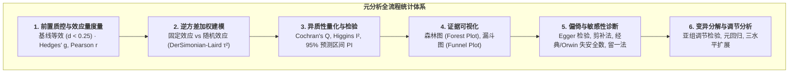
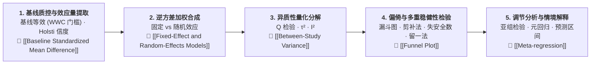

# Meta-analysis

---

## 定义

> [!def] 核心定义
> 元分析（Meta-analysis）是对分析的分析（the analysis of analyses），即对多项针对同一[[Research Question|研究问题]]的独立实证研究进行系统检索、方法学[[Coding in Qualitative Research|编码]]、[[Effect Size|效应量]]提取与加权统计合并的研究方法体系。该术语由 [[Gene Glass]] 于 1976 年在美国教育研究协会主席演说中首次提出（Glass, 1976），后由 Glass, McGaw, & Smith (1981) 系统奠定统计规范。
>
> 定量元分析的核心操作是：将不同[[Scale of Measurement|测量尺度]]的初级研究结果转换为标准化的效应量（如 $g, d, r$），利用[[Inverse-Variance Weighting|逆方差加权法]]最小化抽样方差，估计总体加权平均效应量，并通过[[Heterogeneity|异质性]]检验与[[Meta-regression|元回归]]解释跨研究效应变异的实质来源。[[Argument_Higgins_2016_RE|(Higgins, 2016, pp. 32–37)]]; [[Argument_Cohen_Manion_Morrison_2011_Routledge_Ch17|(Cohen et al., 2011, Ch. 17)]]

> [!method-scope] 方法范围
> - **研究对象** 针对特定主题的定量实证研究（尤其是[[Randomised Controlled Trials|随机对照试验]]与高质准实验）的效应量矩阵与研究特征编码。
> - **核心目标** ① 估计干预措施或相关关系的总体平均效应量；② [[Evaluation Research|评估研究]]间效果的一致性（异质性）；③ 检验[[Construct|理论构念]]、样本特征与实施情境的[[Interaction Effect|调节效应]]。
> - **分析单位** 纳入研究报告的独立效应量或多水平效应量集群。
> - **输出形式** 加权合并效应量点估计值、95% [[Confidence Interval|置信区间]]（95% Confidence Interval, 95% CI）、95% [[Prediction Interval|预测区间]]（95% Prediction Interval, 95% PI）、[[Forest Plot|森林图]]、[[Funnel Plot|漏斗图]]及元回归调节系数。

> [!citation-card]- 关键定位与层级区分
> 元分析综合原始研究的效应量；而[[Meta-meta-analysis|元-元分析]]则是通过加权合并综合多个元分析的结果，二者属于不同统计层级。[[Argument_Wiliam_2019_ERE|(Wiliam, 2019, p. 11)]]
>
> 元分析的结果永远不应该仅仅是一个平均值；它应该是一幅展示变异分布的证据地图。 （Gene Glass; 引自 [[Argument_Wrigley_2019_ERE|Wrigley & McCusker, 2019, p. 119]]）

---

## 历史发展

> [!dev-timeline] 元分析的历史演进脉络
> - **1904 年 Pearson 的思想先驱** [[Karl Pearson|Karl Pearson]] 在《BMJ》发表伤寒疫苗数据的跨研究合并，首次采用按精度整合多项小研究的思路，其表格形式预示了后来的[[Forest Plot|森林图]]（[[Argument_Higgins_2016_RE|Higgins, 2016]]）。
> - **1930年代至1950年代 Fisher 的方差统计基础** Ronald Fisher 提出合并独立 $p$ 值的方法，为跨研究比较奠定了推断统计基石。
> - **1976 年 Glass 的命名与[[Paradigm|范式]]确立** [[Gene Glass|Gene Glass]] 提出元分析概念，并与 Mary Lee Smith 发表心理治疗效果元分析（Smith & Glass, 1977, 平均 $d = 0.60$），确立了以[[Effect Size|效应量]]为通用尺度的实证综合范式。
> - **1980年代 [[Fixed-Effect and Random-Effects Models|随机效应模型]]与[[Heterogeneity|异质性]]检验** Larry Hedges (1981, 1983) 提出小样本校正 $g$ 与随机效应模型；DerSimonian & Laird (1986) 提出经典的 $\tau^2$ 矩估计封闭解法；Rosenthal (1979) 与 Orwin (1983) 分别提出经典与效应量稀释[[Fail-Safe N|失安全数]]。
> - **1990年代至2000年代 Cochrane 协作网与 [[PRISMA]] 规范化** 证据本位医学推动了[[Systematic Review|系统综述]]（Systematic Review）与元分析的全球制度化，PRISMA 声明与 Cochrane Handbook 成为规范报告标准。
> - **2010年代至今 多水平元分析、[[Robust Variance Estimation|稳健方差估计]]与多软件协同** 针对多效应量相关依赖与复杂嵌套数据，[[Three-Level Meta-Analysis|三水平元分析]]（Cheung, 2014）与稳健方差估计（Robust Variance Estimation, RVE, Hedges et al., 2010）成为现代元分析前沿；STATA 与 R 形成完备的元分析计算生态。

---

## 元分析核心统计参数与方法索引矩阵



> [!contrast-table] 元分析核心统计方法与参数索引矩阵
> | 统计方法 / 核心参数 | 核心数学符号与公式 | 统计学功能与解决的痛点 | 决策阈值与研判准则 | 深度条目与实证索引 |
> |---|---|---|---|---|
> | **[[Baseline Standardized Mean Difference\|基线等效性标准化均数差（Baseline SMD / d_baseline）]]** | $d_{\text{baseline}} = \frac{\bar{X}_{T, \text{pre}} - \bar{X}_{C, \text{pre}}}{SD_{\text{pooled}}}$<br>$SD_{\text{pooled}} = \sqrt{\frac{(n_T-1)S_T^2 + (n_C-1)S_C^2}{n_T+n_C-2}}$ | 实验与准实验初级研究的前端准入门槛，杜绝初始能力异质性与选择偏倚污染合并效应量。 | $|d| \le 0.05$ 免调；$0.05 < |d| \le 0.25$ 必须经协变量（ANCOVA）校正；$|d| > 0.25$ 坚决剔除（WWC 2022 / Slavin 2009 准则）。 | 🔗 [[Baseline Standardized Mean Difference]]<br>📚 [[Argument_Chen_Cheung_2025_ERR\|Chen & Cheung (2025)]] |
> | **[[Effect Size\|标准化均数差效应量（Hedges' g / Cohen's d）]]** | $d = \frac{\bar{X}_T - \bar{X}_C}{SD_{\text{pooled}}},\quad g = J \times d$<br>$J \approx 1 - \frac{3}{4(n_T + n_C) - 9}$ | 统一不同量表测验的连续型干预结果，消除量纲差异，乘上 Hedges 小样本校正因子 $J$ 剔除正向估计偏倚。 | 传统 Cohen 经验基准：$0.2$（小）、$0.5$（中）、$0.8$（大）；教育领域参考 Hattie 铰链点 $d = 0.40$（年度期望进步标准）。 | 🔗 [[Effect Size]]<br>📚 [[Argument_Lei_Ding_Chiu_2026_ERR\|Lei et al. (2026)]] |
> | **[[Inverse-Variance Weighting\|逆方差加权（IVW）]]** | $w_i = \frac{1}{v_i} \text{ 或 } w_i^* = \frac{1}{v_i + \tau^2}$<br>$\bar{\theta} = \frac{\sum w_i y_i}{\sum w_i},\quad SE(\bar{\theta}) = \sqrt{\frac{1}{\sum w_i}}$ | 依据研究精度的倒数分配权重，方差越小（精度越高）赋予更大权重，实现合成估计量方差最小化（BLUE 最佳线性无偏估计）。 | 95% CI 不跨 0 判定效应显著；检验超大样本单项研究权重集中度，防范单一研究绑架合并估计；对比固定与随机权重差异评估小研究膨胀。 | 🔗 [[Inverse-Variance Weighting]]<br>📚 [[Argument_Cohen_Manion_Morrison_2011_Routledge_Ch17\|Cohen et al. (2011, Ch. 17)]] |
> | **[[Fixed-Effect and Random-Effects Models\|固定与随机效应模型]]** | 固定：$\theta_i = \theta + \epsilon_i,\ \epsilon_i \sim N(0, v_i)$<br>随机：$\theta_i = \mu + u_i + \epsilon_i,\ u_i \sim N(0, \tau^2)$ | 固定模型假定所有研究共享单一恒定真实效应；随机模型纳入跨人群与情境的研究间异质性方差 $\tau^2$，外推至广义总体。 | $Q$ 检验显著（$p < .10$）或 $I^2 > 25\%$ 时必须优先采用随机效应模型；教育干预生态多样化时随机效应为通用默认模型。 | 🔗 [[Fixed-Effect and Random-Effects Models]]<br>📚 [[Argument_Abrami_2015_RER\|Abrami et al. (2015)]] |
> | **[[Between-Study Variance\|研究间方差（Tau² / τ²）]]** | $\hat{\tau}^2 = \max\left(0, \frac{Q - (k-1)}{\sum w_i - \frac{\sum w_i^2}{\sum w_i}}\right)$<br>（DerSimonian-Laird 矩估计或 REML 估计） | 绝对尺度衡量超出[[Sampling Error\|抽样误差]]之外的跨研究真实效应离散度，为随机效应逆方差加权提供加项。 | $\tau^2 = 0$ 退化为固定效应；$\tau = \sqrt{\tau^2}$ 反映真实效应量在广义情境总体中的标准差离散尺度。 | 🔗 [[Between-Study Variance]]<br>📚 [[Argument_Greene_2018_JEP\|Greene et al. (2018)]] |
> | **[[Cochran's Q Test\|Cochran's Q 检验]]** | $Q = \sum_{i=1}^k w_i (y_i - \bar{y})^2 \sim \chi^2(k-1)$ | 推断统计检验各初级研究真实效应量是否完全同质（$H_0: \tau^2 = 0$），判别效应量离散是否超出抽样随机误差。 | 因纳入研究数量较少时检验效力不足，常规设定 $\alpha = .10$；若 $p < .10$（或 $p < .05$），拒绝同质性假设，确证存在实质性异质性。 | 🔗 [[Cochran's Q Test]]<br>📚 [[Argument_Wiliam_2019_ERE\|Wiliam (2019)]] |
> | **[[I-squared Statistic\|I² 统计量（异质性比率）]]** | $I^2 = \max\left(0, \frac{Q - (k-1)}{Q}\right) \times 100\%$ | 相对尺度量化跨研究总变异中由真实[[Heterogeneity\|异质性]]而非抽样误差所解释的百分比，克服 $Q$ 统计量受样本量膨胀的缺陷。 | Higgins 经验门槛：$25\%$（低）、$50\%$（中）、$75\%$（高异质性）；$I^2 > 50\%$ 强烈提示必须启动亚组调节分析与元回归以解释变异。 | 🔗 [[I-squared Statistic]]<br>📚 [[Argument_Simpson_2017_JEP\|Simpson (2017)]] |
> | **[[Prediction Interval\|95% 预测区间（PI）]]** | $\bar{\mu} \pm t_{k-2, 0.975} \sqrt{SE(\bar{\mu})^2 + \hat{\tau}^2}$ | 估计在未来单项同类新情境研究中观察到的真实效应可能范围，揭示平均效应掩盖下的极端负效应或干预损害风险。 | 即使合并效应量 95% CI 全部落在正向显著区间，若 95% PI 跨越 0，表明干预在部分特定真实情境中可能无效甚至有害。 | 🔗 [[Prediction Interval]]<br>📚 [[Argument_Higgins_2016_RE\|Higgins (2016)]] |
> | **[[Forest Plot\|森林图（Forest Plot）]]** | 初级研究：$y_i \pm 1.96\sqrt{v_i}$，方块面积 $\propto w_i^*$<br>合并效应菱形：$\bar{\mu} \pm 1.96 \times SE(\bar{\mu})$ | 全景几何集成与直观展示各项纳入研究的[[Effect Size\|效应量]]点估计、[[Confidence Interval\|置信区间]]线段、权重占比及总体汇总菱形。 | 观察线段重叠度（直观判读异质性离散度）、菱形中心顶点（总体效应方向与大小）与水平跨度（估计精度）。 | 🔗 [[Forest Plot]]<br>📚 [[Argument_Hattie_2015_Paideia\|Hattie (2015a)]] |
> | **[[Funnel Plot\|漏斗图（Funnel Plot）]]** | 横轴效应量 $y_i$，纵轴标准误 $SE_i$（倒置）<br>伪 95% 置信边界：$\bar{\theta} \pm 1.96 \times SE_i$ | 几何图形化诊断[[Publication Bias\|发表偏倚]]、[[Small Study Effects\|小研究效应]]与系统误差；高精度大样本聚集顶部，小样本对称分散于底部。 | 对称倒置漏斗提示无显著偏倚；底部小样本一角缺失（不对称偏斜，如缺乏负效应小研究）强烈提示潜在发表偏倚。 | 🔗 [[Funnel Plot]]<br>📚 [[Argument_Berk_2011_ER\|Berk (2011)]] |
> | **[[Egger Regression Test\|Egger 线性回归检验]]** | $\frac{y_i}{SE_i} = \beta_0 + \beta_1 \left(\frac{1}{SE_i}\right) + \epsilon_i$<br>（$SND_i = \beta_0 + \beta_1 \text{Prec}_i$） | 定量参数化检验漏斗图不对称性；截距项 $\beta_0$ 度量漏斗图不对称度，斜率项 $\beta_1$ 代表规模加权无偏效应量。 | 对截距 $\beta_0$ 进行 $t$ 检验：若 $p < .05$ 且截距显著偏离 0，确认存在显著发表偏倚与小研究效应；反之未检出偏倚。 | 🔗 [[Egger Regression Test]]<br>📚 [[Argument_Wrigley_2019_ERE\|Wrigley & McCusker (2019)]] |
> | **[[Begg and Mazumdar Rank Correlation\|Begg 秩相关检验]]** | $z_i^* = \frac{y_i - \bar{y}^*}{\sqrt{v_i - \tilde{v}}},\quad \tau = \frac{P - Q}{\frac{1}{2} k (k-1)}$ | 基于 Kendall's $\tau$ 检验标准化效应量与方差的等级相关，提供不受正态性假设限制的非参数小研究偏倚诊断。 | 若等级相关检验 $p < .05$ 且 $\tau > 0$，表明效应量大小与抽样方差存在单调依赖，印证发表偏倚存在。 | 🔗 [[Begg and Mazumdar Rank Correlation]] |
> | **[[Trim and Fill Method\|剪补法（Trim & Fill）]]** | $L_0 = \frac{4S - k(k+1)}{2k - 1},\quad R_0 = k - r_*$<br>（对侧镜像虚拟填补并重拟合模型） | 估算漏斗图不对称导致的缺失研究篇数，在对侧虚拟填补缺失点，重新计算校正后的真实效应量与置信区间。 | 比较填补后效应量点估计降幅与 95% CI：若填补后效应量大幅稀释或不再显著，表明原始研究结论高度依赖发表偏倚。 | 🔗 [[Trim and Fill Method]] |
> | **[[Fail-Safe N\|失安全系数（Fail-Safe N）]]** | 经典：$N_{\text{fs}} = \frac{(\sum Z_i)^2}{2.706} - k$<br>Orwin：$N_{\text{fs}} = \frac{k(\bar{g} - g_c)}{g_c - g_{\text{fs}}}$ | 极端抽屉文件敏感性压力测试：经典法计算推翻显著性所需零效应研究数；Orwin 法计算稀释至微小平凡阈值（如 $g_c = 0.01$）所需篇数。 | **Rosenthal 准则** $N_{\text{fs}} > 5k + 10$；**Orwin 准则** 稀释所需未发表研究量远超该学科领域现实发表与未发表总量即判定高度稳健。 | 🔗 [[Fail-Safe N]] |
> | **[[Leave-One-Out Sensitivity Analysis\|留一法敏感性分析]]** | $\hat{\theta}_{(-i)} = \frac{\sum_{j \ne i} w_j^* y_j}{\sum_{j \ne i} w_j^*},\quad SE(\hat{\theta}_{(-i)}) = \sqrt{\frac{1}{\sum_{j \ne i} w_j^*}}$ | 依次逐一剔除单项初级研究后重新拟合模型，检验是否存在主导结论方向、极度拉大效应量或扭曲异质性的极端异常值。 | 观察逐项剔除后效应量波动区间是否始终涵盖在总体估计边界内；若剔除某项研究后效应剧变，该研究为强杠杆偏倚源。 | 🔗 [[Leave-One-Out Sensitivity Analysis]]<br>📚 [[Argument_Liu_2026_CHBR\|Liu et al. (2026)]] |
> | **[[Pairwise Wald Tests\|成对 Wald 检验]]** | $W_{jk} = \frac{(\hat{\theta}_j - \hat{\theta}_k)^2}{v_j + v_k} \sim \chi^2(1)$ | 在分类亚组调节分析后，检验三个或更多分类亚组之间两两成对效应量差异的统计显著性与级差排序。 | $W > 3.84$ 判定两亚组间差异显著（$p < .05$）；配合事后多重检验（如 Bonferroni / Holm）校正假阳性膨胀。 | 🔗 [[Pairwise Wald Tests]] |
> | **[[Meta-regression\|元回归（Meta-regression）]]** | $\theta_i = \beta_0 + \sum_{p=1}^P \beta_p X_{pi} + u_i + \epsilon_i$<br>$u_i \sim N(0, \tau^2_{\text{res}})$ | 将效应量作为[[Dependent Variable\|因变量]]，研究特征作为[[Independent Variable\|自变量]]，检验连续与多元协[[Variable\|变量]]对异质性的联合解释力。 | $F$ 或 $Q_M$ 检验评价模型联合显著性；伪 $R^2 = \frac{\tau^2 - \tau^2_{\text{res}}}{\tau^2}$ 评估协变量对真实异质性方差的解释比例。 | 🔗 [[Meta-regression]]<br>📚 [[Argument_Cohen_Manion_Morrison_2011_Routledge\|Cohen et al. (2011)]] |
> | **[[Three-Level Meta-Analysis\|三水平多层元分析]]** | $y_{ij} = \beta_0 + \zeta_{(2)ij} + \zeta_{(3)j} + \epsilon_{ij}$<br>$\operatorname{Var}(y_{ij}) = v_{ij} + \sigma_{(2)}^2 + \sigma_{(3)}^2$ | 处理单项研究报告多个相关效应量（多重测量或多结局）时的统计非独立性依赖，分解抽样误差、研究内变异与研究间异质性。 | 似然比检验（LRT）比较二水平与三水平模型拟合优度；计算研究内变异占比 $\frac{\sigma_{(2)}^2}{\sigma_{(2)}^2 + \sigma_{(3)}^2}$ 评估多重测量依赖严重度。 | 🔗 [[Three-Level Meta-Analysis]]<br>📚 [[Argument_Park_2026_TSC\|Park et al. (2026)]] |
> | **[[Robust Variance Estimation\|稳健方差估计（RVE / 三明治估计量）]]** | $\mathbf{V}_{\text{RVE}} = \left(\mathbf{X}^T \mathbf{W} \mathbf{X}\right)^{-1} \left(\sum_j \mathbf{X}_j^T \mathbf{W}_j \mathbf{e}_j \mathbf{e}_j^T \mathbf{W}_j \mathbf{X}_j\right) \left(\mathbf{X}^T \mathbf{W} \mathbf{X}\right)^{-1}$ | 解决效应量多重嵌套与依赖结构未知的问题，在无需知晓研究内各效应量真实协方差下提供渐近无偏的稳健标准误。 | 检查有效自由度安全门槛 $\text{df} \ge 4$（Pustejovsky & Tipton 准则）；小样本情境下以霍特林 $T^2$ 与 $F$ 检验替代标准正态 $Z$ 检验。 | 🔗 [[Robust Variance Estimation]]<br>📚 [[Argument_Song_Choi_2026_FPSYG\|Song & Choi (2026)]] |

---

## 核心统计原理与分析流程



> [!proc] 统计建模五步闭环
> 1. **初级研究准入门槛、基线等效性审查与效应量标准化**
>    - **基线等效性前置筛查** 对纳入的准实验（QED）与高流失随机对照试验，必须提取前测数据并计算[[Baseline Standardized Mean Difference|基线等效性标准化均数差]] $d_{\text{baseline}}$。严格执行 [[What Works Clearinghouse|WWC 2022]] 与 Slavin & Smith (2009) 门槛：$|d| > 0.25$ 者即刻剔除（两组潜在能力分布质性相异，ANCOVA 统计校正失效），介于 $0.05$ 至 $0.25$ 之间者必须在模型中控制前测协变量；无前测研究必须证明实施了严格的随机分配；
>    - **测量工具信效度审查** 排除测量工具与实验干预过度重叠的自利性自编测验，防范虚假效应量膨胀；
>    - **编码质控与量纲统一** 多名研究者独立进行特征与效应量编码，采用 Holsti（1969）[[Reliability|信度]]公式（$R = \frac{nM}{\sum N_i}$）检验[[Intercoder Agreement|编码者间一致性]]信度（通常要求 $R > 0.90$）；将不同[[Scale of Measurement|测量尺度]]的初级研究结果转换为标准化的效应量（如 Hedges' $g$、Pearson $r$）并计算对应的抽样方差 $v_i$；小样本时采用 Hedges 校正因子消除正向偏倚。
> 2. **加权合成与模型抉择** 依据精度倒数进行[[Inverse-Variance Weighting|逆方差加权]]。若假定存在单一恒定真实效应，采用固定效应模型（$w_i = 1/v_i$）；若假定真实效应随人群和情境变化，采用随机效应模型（$w_i^* = 1/(v_i + \tau^2)$）以实现权重再平衡。详见 [[Fixed-Effect and Random-Effects Models]]。
> 3. **[[Heterogeneity|异质性]]检验与三联量化** 
>    - **[[Hypothesis|假设]]检验** 通过 Cochran's [[Cochran's Q Test|Q 检验]]（$Q \sim \chi^2_{k-1}$）判定效应量离散是否显著超出抽样随机误差；
>    - **绝对尺度** 通过研究间方差（$\tau^2$）度量跨研究真实效应的绝对方差；
>    - **相对占比** 通过 [[I-squared Statistic|I² 统计量]]（$I^2 = \frac{Q - (k-1)}{Q} \times 100\%$）评估真实异质性占总方差的比例。
> 4. **多重偏倚诊断与敏感性压力测试**
>    - 绘制漏斗图观察几何对称性，配合 Egger 线性回归与 Begg 秩相关定量检验[[Small Study Effects|小研究效应]]；
>    - 运用 Duval & Tweedie [[Trim and Fill Method|剪补法]]估计潜在缺失研究并校正合并值；
>    - 计算[[Fail-Safe N|经典失安全数]]（门槛 $5k + 10$）与 Orwin 效应量稀释失安全数，评估结论抵抗抽屉文件效应的能力；
>    - 执行[[Leave-One-Out Sensitivity Analysis|留一法]]（Leave-One-Out）敏感性分析，逐一排除单项初级研究检验合并效应量与[[Confidence Interval|置信区间]]的扰动边界。
> 5. **变异分解、调节检验与预测外推** 开展分类亚组分析（$Q_B$ 组间异质性检验）与连续[[Variable|变量]]元回归（Meta-regression），结合 95% [[Prediction Interval|预测区间]]（PI）评估干预在未来单项真实情境下的潜在外推风险。

---

## 软件实现工作流

> [!software-impl] R（metafor）与 STATA 18 规范分析脚本对照
> 
> ```r
> # ==================== R (metafor) 工作流 ====================
> library(metafor)
> 
> # 1. 效应量与方差计算 (标准化均值差 Hedges' g)
> dat <- escalc(measure = "SMD",
>               m1i = exp_mean, sd1i = exp_sd, n1i = exp_n,
>               m2i = ctl_mean, sd2i = ctl_sd, n2i = ctl_n,
>               data = raw_data)
> 
> # 2. 拟合随机效应模型 (REML 限制性最大似然法)
> res <- rma(yi, vi, data = dat, method = "REML")
> summary(res)  # 输出合并效应量、95% CI、tau^2、I^2 与 Q 检验
> 
> # 3. 计算 95% 预测区间
> predict(res)
> 
> # 4. 森林图与漏斗图绘制
> forest(res, slab = paste(author, year), xlab = "Hedges' g")
> funnel(res, xlab = "Hedges' g")
> 
> # 5. 偏倚与敏感性检验
> regtest(res, model = "rma")  # Egger 线性回归检验
> trimfill(res)                # 剪补法偏倚调整
> fsn(yi, vi, data = dat, type = "Rosenthal")  # 经典失安全数
> fsn(yi, vi, data = dat, type = "Orwin", target = 0.01)  # Orwin 失安全数
> leave1out(res)               # 留一法敏感性分析
> 
> # 6. 调节变量元回归分析
> res_mod <- rma(yi, vi, mods = ~ grade_level + duration, data = dat, method = "REML")
> summary(res_mod)
> ```
> 
> ```stata
> * ==================== STATA 18 工作流 ====================
> * 1. 声明元分析数据 (设置效应量与标准误或两组均值样本)
> meta set es se_es, studylabel(author_year)
> 
> * 2. 随机效应模型合成 (DerSimonian-Laird 或 REML)
> meta summarize, random(reml)
> 
> * 3. 绘制森林图与漏斗图
> meta forestplot, crop(0 2) nullrefline
> meta funnelplot
> 
> * 4. 偏倚诊断与敏感性分析
> meta bias, egger
> meta trimfill
> meta fsn, target(0.01)
> 
> * 5. 亚组调节分析与元回归
> meta summarize, subgroup(grade_level)
> meta regress i.grade_level duration
> ```

---

## 方法学批判与局限性

元分析在教育研究与循证实践中面临系统的学术批判。批判者从方法论前提、操作程序、统计推断与政策滥用等多个维度指出了潜在风险：

> [!warning] 核心批判维度导览
> 1. **研究可比性危机（“苹果与橙子”问题）** 将不同干预定义、测量工具与实施情境的研究强行平均，产生无意义的统计噪音（Eysenck, 1978; [[Argument_Higgins_2016_RE|Higgins, 2016]]）。
> 2. **输入质量决定论（“垃圾进，垃圾出”）** 低质量、高偏倚的初级研究合并后不仅不能相互抵消，反而会产生虚假的“高精度错误估计”（Slavin, 1984; [[Argument_Berk_2011_ER|Berk, 2011]]）。
>    - *现代破局防线* 当代循证元分析（如 [[Argument_Chen_Cheung_2025_ERR|Chen & Cheung, 2025]]）通过确立严格的前端实验设计准入门槛（样本量每组 $\ge 15$、设立对照组、基线等效性 $d_{\text{baseline}} < 0.25$），构建了抵御低质偏倚的方法学防火墙；实证研究证实该门槛能有效消除准实验与 RCT 之间的系统性效应差异（$Q_B$ 组间异质性检验不显著），实现证据池的源头净化。
> 3. **统计独立性[[Hypothesis|假设]]违背** 同一研究提供多重结局测量造成数据嵌套依赖，人为虚窄[[Standard Error|标准误]]（Wolf, 1986; Cheung, 2014）。
> 4. **平均效应掩盖[[Heterogeneity|异质性]]与因果机制** 平均[[Effect Size|效应量]]无法回答“干预对谁有效、在何种情境下有效”，可能掩盖高达 38% 的负向效应子群（Kluger & DeNisi, 1996; [[Argument_Wrigley_2019_ERE|Wrigley & McCusker, 2019]]）。
> 5. **政策工具排名的伪精确性** 将效应量简化为《[[Visible Learning|可见的学习]]》气压计或排行榜，误导教育资源配置（[[Argument_Wiliam_2019_ERE|Wiliam, 2019]]; [[Argument_Simpson_2017_JEP|Simpson, 2017]]）。
>
> 🔗 **完整命题论证、学者辩论与 11 项质量审查清单参见独立深度条目：[[Critique of Meta-analysis]]**。

---

## 典型案例研究

> [!case] Glass & Smith (1978) · [[Class Size|班级规模]]与[[Academic Achievement|学业成就]]元分析
> 该研究收集了 77 项关于班级规模与学生学习的实证研究（涵盖 725 项[[Effect Size|效应量]]比较与近 900,000 名学生）。[[Meta-regression|元回归分析]]清晰揭示了班级规模与学业成就之间的非线性负相关曲线。
>
> 关键方法学发现：实验控制质量是调节曲线斜率的唯一关键因素。良好控制的研究显示出更陡峭的收益曲线，而不充分控制的研究曲线较为平缓。Glass et al. 据此按研究质量分层报告效应量，奠定了按方法学质量开展亚组分析的规范。（[[Argument_Cohen_Manion_Morrison_2011_Routledge|Cohen et al., 2011]], Ch. 17, pp. 357–360）

---

## 相关理论与方法

> [!entry-map]
> | 条目 | 类型 | 关系说明 |
> |---|---|---|
> | [[Baseline Standardized Mean Difference]] | 前置质控方法 | 检验初级研究处理组与对照组前测可比性、确立 0.25 SD 准入门槛的核心指标 |
> | [[What Works Clearinghouse]] | 证据评价标准 | 确立教育因果推断、实验等效性（0.25 SD 门槛）与证据评级基准的旗舰清算中心 |
> | [[Inverse-Variance Weighting]] | 核心算法 | 元分析中最基础的最优精度加权方法 |
> | [[Fixed-Effect and Random-Effects Models]] | 统计模型 | 固定与随机效应两类基础建模[[Paradigm\|范式]] |
> | [[Three-Level Meta-Analysis]] | 高阶扩展 | 处理研究内多重[[Effect Size\|效应量]]嵌套依赖的多层模型 |
> | [[Meta-regression]] | 分析方法 | 检验连续型与类别型协[[Variable\|变量]][[Interaction Effect\|调节效应]]的技术 |
> | [[Critique of Meta-analysis]] | 批判体系 | 系统解构元分析方法论前提与统计推断[[Hypothesis\|假设]]的专有概念条目 |
> | [[Meta-meta-analysis]] | 上位方法 | 汇总多个一阶元分析的二阶统计综合方法 |
> | [[Forest Plot]] | 可视化工具 | 展示研究效应量点估计与[[Confidence Interval\|置信区间]]的标准图表 |
> | [[Funnel Plot]] | 可视化工具 | 诊断[[Publication Bias\|发表偏倚]]与[[Small Study Effects\|小研究效应]]的散点图 |
> | [[Critical Realism]] | [[Epistemology\|认识论]]基础 | 批判实在论对元分析经验主义平均值假设的哲学批判 |

---

## 使用此方法的研究

> [!evidence-grid-a] 研究案例索引
> - [[Argument_Chen_Cheung_2025_ERR|Chen & Cheung (2025)]] 依据[[Third Generation Activity Theory|活动理论]]移动计算机支持协作学习（AT-MCSCL）框架对 57 项实验与准[[Experimental Research|实验研究]]（97 个[[Effect Size|效应量]]，$N = 5{,}389$）实施随机效应元分析，严格控制[[Pre-test and Post-test|前测]]基线等效性（$d < 0.25$），评估生成式人工智能对大学生成果的综合效应（$g^+ = 0.804$），并系统检验 17 个调节变量及剪补法发表偏倚校正（校正后 $g^+ = 0.321$）。
> - [[Argument_Lei_Ding_Chiu_2026_ERR|Lei et al. (2026)]] 运用[[Fixed-Effect and Random-Effects Models|随机效应模型]]综合 66 项实验与准[[Experimental Research|实验研究]]（72 个[[Effect Size|效应量]]，$N = 4{,}824$），评估[[Graphic Organizer|图形组织器]]对学生[[Higher-Order Thinking Skills|高阶思维]]的促进效应（$g = 0.778$），并结合 Wald 检验与[[Meta-regression|元回归]]系统考察导图类型、思维层级及学段等调节[[Variable|变量]]。
> - [[Argument_Liu_2026_CHBR|Liu et al. (2026)]] 采用随机效应模型综合 34 项实验与准实验研究（73 个效应量，$N = 3{,}042$），评估 AI [[AI Agent in Education|智能体]]对 K-12 学生认知学习成果的总体效应（$g = 0.404$），并系统检验技能类结果、知识类结果、高阶思维以及智能体形态、学段、学科和干预时长的[[Interaction Effect|调节效应]]。
> - [[Argument_Abrami_2015_RER|Abrami et al. (2015)]] 综合 341 项实验与准实验研究，运用随机效应模型与混合效应亚组调节检验，确立[[Dialogue in Education|对话]]、[[Authentic Instruction|真实性教学]]与[[Mentorship|导师制]]对[[Critical Thinking|批判性思维]]的三维复合干预效应（$g+ = 0.57$）。
> - [[Argument_Park_2026_TSC|Park et al. (2026)]] 采用三水平随机效应元分析模型综合 51 个样本（$N = 12{,}548$），估计[[Creativity|创造力]]与批判性思维的整体相关（$r = 0.386$），并配合元回归检验测量类型等调节变量。
> - [[Argument_Greene_2018_JEP|Greene et al. (2018)]] 对 132 项非实验研究中的 752 个效应量执行随机效应元分析，系统考察[[Epistemic Cognition|认识论认知]]与[[Academic Achievement|学业成就]]的关联及调节变量。
> - [[Argument_Song_Choi_2026_FPSYG|Song & Choi (2026)]] 采用三水平多层随机效应模型综合 512 个效应量，探讨中小学生认识论认知发展。
> - [[Argument_Cohen_Manion_Morrison_2011_Routledge_Ch17|Cohen, Manion & Morrison (2011, Ch. 17)]] 系统介绍元分析四套操作流程、效应量计算方法与方法论局限。
> - [[Argument_Hattie_2015_Paideia|Hattie (2015a)]] 探讨元分析作为探索[[Heterogeneity|异质性]]与调节变量的证据地图定位。
> - [[Argument_Wrigley_2019_ERE|Wrigley & McCusker (2019)]] 运用实在论综合与[[Critical Realism|批判实在论]]反思元分析的局限性。
