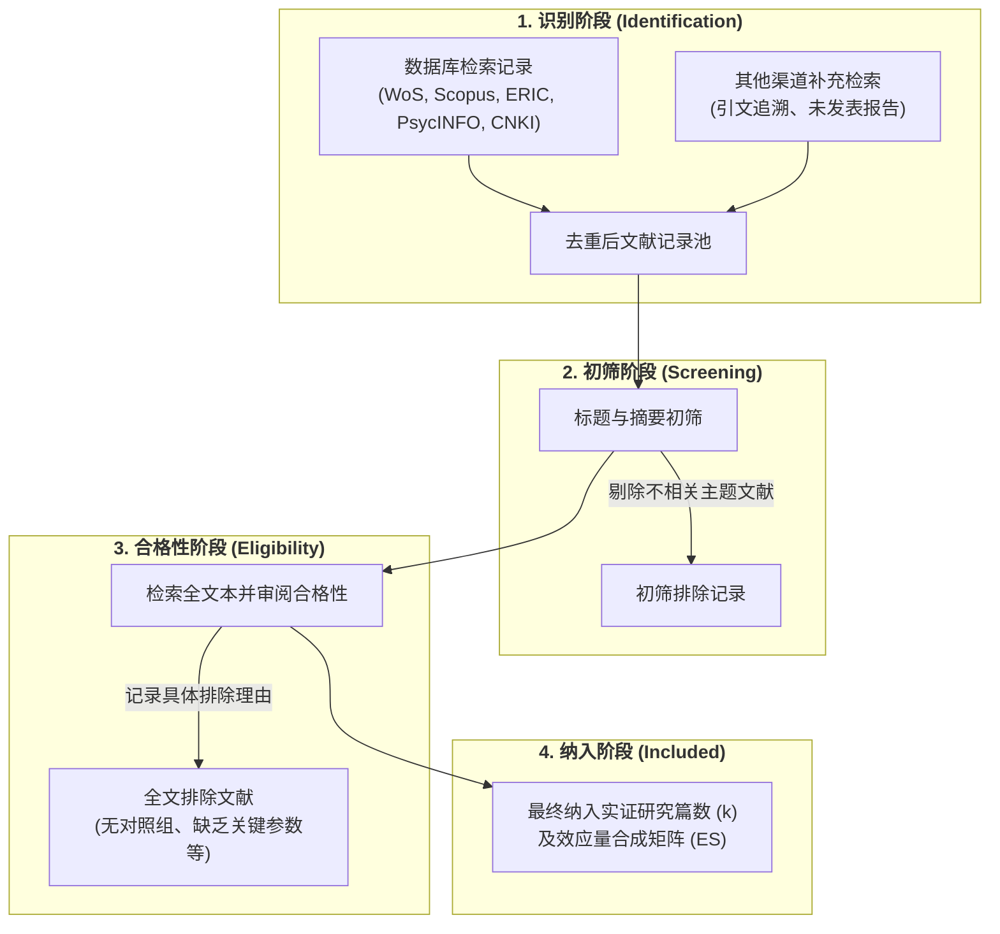

# PRISMA

---

## 定义

> [!def] 方法定义
> 系统评价和[[Meta-analysis|元分析]]优先报告条目（Preferred Reporting Items for Systematic Reviews and Meta-Analyses, PRISMA）是一套旨在提升[[Systematic Review|系统综述]]与[[Meta-analysis|元分析]]研究透明度、规范性与可复现性的国际权威方法学标准与报告指南。PRISMA 体系由核心报告检查清单（涵盖 27 项条目）和四阶段[[Document|文献]]流转图（PRISMA [[Flow]] Diagram）构成，要求研究者系统记录从文献数据库检索、去重、标题摘要初筛、全文合格性审阅到最终纳入证据合成的完整决策路径与排除缘由。[[Argument_Lei_Ding_Chiu_2026_ERR|(Lei et al., 2026, pp. 4–5)]]

> [!method-scope] 方法范围
> - **研究对象** 定量元分析、定性系统综述与混合证据综合的[[Literature Search|文献检索]]流、筛选漏斗与方法学质量报告。
> - **问题类型** 透明度规范、筛选可重复性、偏倚控制与[[Chain of Evidence|证据链]]追踪。
> - **分析单位** 检索到的候选文献记录、全文本报告及最终纳入的初级研究集群。
> - **输出形式** 27 项自查清单（PRISMA Checklist）、四阶段文献流转图（PRISMA Flow Diagram）及透明的排除标准明细。

> [!citation-card]- 关键定义
> 文献检索与筛选严格依循系统评价和元分析优先报告条目（PRISMA）标准，通过明确的纳入与排除准则在五大数据库中定位合格文献，并以流转图呈现各阶段文献数量与剔除原因。[[Argument_Lei_Ding_Chiu_2026_ERR|(Lei et al., 2026, pp. 4–5)]]
>
> *The literature search and screening strictly adhered to the Preferred Reporting Items for Systematic Reviews and Meta-Analyses (PRISMA) statement...*

---

## 方法定位

> [!method-position] [[Epistemology|认识论]]与方法定位
> - **知识观** 循证综合的程序透明性与[[Falsification|可证伪性]]：认为证据合成的效度取决于[[Literature Search|文献检索]]与筛选全流程的无偏性与透明度，杜绝主观选择性报告。
> - **研究者角色** 制定[[Preregistration|预注册]]检索协议（如 PROSPERO），实施独立双盲背对背初筛与全文本审阅，记录并报告[[Intercoder Agreement|编码者间一致性]][[Reliability|信度]]（如 Krippendorff's $\alpha$ 或 Cohen's $\kappa$）。
> - **有效性标准** 检索全面性（多数据库、灰色[[Document|文献]]与反向追溯）、筛选透明度（明确记录排除理由）与流程可复现性。
> - **不声称回答的问题** PRISMA 本身是报告规范而非统计合成算法，不能替代具体的[[Effect Size|效应量]]计算或[[Heterogeneity|异质性]]模型估计。

> [!contrast-table] PRISMA 规范指南 vs 传统叙述性[[Literature Review|文献综述]]
> | 比较维度 | PRISMA 规范体系 | 传统叙述性综述（Narrative Review） |
> |---|---|---|
> | **检索策略** | 预设布尔逻辑检索式，跨多个权威数据库穷尽检索 | 随机检索或基于研究者既有知识积累选择性阅读 |
> | **筛选规程** | 依据明确的纳入/排除准则执行双盲背对背独立筛选 | 单人主观判断，无明确可复现的筛选门槛 |
> | **流程记录** | 绘制标准四阶段流转图，透明报告各环节淘汰篇数与原因 | 仅报告最终引用的文献，中间筛选过程为黑箱 |
> | **偏倚控制** | 全程评估文献质量、选择偏倚与[[Publication Bias|发表偏倚]] | 容易陷入确认偏误（Confirmation Bias）与引用选择偏倚 |

---

## 研究程序

> [!proc] PRISMA 四阶段标准流转程序
> 1. **识别阶段（Identification）** 确定检索关键词布尔组合，跨中英文核心数据库检索并记录各库命中篇数，汇入[[Document|文献]]管理软件完成自动与人工去重。
> 2. **初筛阶段（Screening）** 由两位研究者独立阅读文献标题与摘要，根据预设标准剔除明显不相关的研究，记录剔除数量。
> 3. **合格性审阅（Eligibility）** 下载并深入通读剩余文献的完整全文，对照严格的实证设计、[[Sample Size Determination|样本量]]、干预时长及统计参数完整性标准进行逐一审阅，详细记录不合格文献的具体排除缘由。
> 4. **纳入阶段（Included）** 汇总最终符合标准的独立研究篇数与独立[[Effect Size|效应量]]个数，构建[[Meta-analysis|元分析]]数据矩阵并绘制标准 PRISMA 流程图。



---

## 检查清单与核心维度

> [!checklist] PRISMA 2020 检查清单核心板块
> - **标题与摘要（Title & [[Abstract]]）** 明确声明本研究为[[Systematic Review|系统综述]]或[[Meta-analysis|元分析]]，结构化报告背景、方法、主要[[Effect Size|效应量]]与结论。
> - **引言与目标（Introduction）** 基于既有理论张力陈述开展综述的必要性，并以 PICOS（对象、干预、对照、结局、研究设计）框架明确[[Research Question|研究问题]]。
> - **检索与信息源（Search & Information Sources）** 提供至少一个数据库的完整可复现检索式，说明所有检索源与检索截止日期。
> - **筛选与数据提取（Selection & Data Collection）** 报告独立双盲筛选机制、[[Qualitative Codebook|编码手册]]及[[Coding in Qualitative Research|编码]]者一致性[[Reliability|信度]]（如 Krippendorff's $\alpha$）。
> - **偏倚风险评估（Risk of Bias Assessment）** 运用标准化量表（如 Cochrane 偏倚风险工具、28 分制质量量表）评估初级研究方法学质量。
> - **统计综合与敏感性（Synthesis & Sensitivity）** 报告效应量度量指标（如 Hedges' $g$）、[[Heterogeneity|异质性]]检验、亚组分析、[[Meta-regression|元回归]]及[[Publication Bias|发表偏倚]]诊断。

> [!software-impl] 软件与工具实现
> - **[[Document|文献]]管理与筛选** Covidence、Rayyan、EndNote、Zotero
> - **流程图绘制** R 语言 `PRISMA2020` 程序包、PRISMA 官方网页流转图生成器
>   ```r
>   library(PRISMA2020)
>   # 生成符合 PRISMA 2020 规范的可视化流转图
>   data <- read.csv("prisma_flow_data.csv")
>   PRISMA_flowdiagram(data, interactive = FALSE, previous = FALSE, other = TRUE)
>   ```
> - **质量评价辅助** [[AMSTAR|AMSTAR 2]] 量表、RevMan 软件

---

## 适用场景

> [!method-fit] 适用判断
> - **适合使用** 定量[[Meta-analysis|元分析]]、质性元整合、范围综述（Scoping Review）以及[[Evidence-Based Education|循证教育]]政策系统评价的检索与报告设计。[[Argument_Lei_Ding_Chiu_2026_ERR|(Lei et al., 2026)]]; [[Argument_Runco_2026_CRJ|(Runco et al., 2026)]]
> - **谨慎使用** [[Document|文献]]量极少（如新兴探索性前沿仅有个位数个案）时的流程简化报告。
> - **不适合使用** 个人学术随笔、纯理论思辨述评或教材导论性章节综述。

---

## 局限性

> [!method-limits] 方法局限
> - **偏误来源** 数据库选择偏倚（未检索特定非英语数据库）、关键词截断与布尔逻辑遗漏、人工全文本筛查疲劳导致误剔。
> - **适用边界** PRISMA 规范报告流程的严谨性，但无法直接弥补初级研究本身的低质量（Garbage in, garbage out）。
> - **误用风险** 将 PRISMA 流程图流于形式化勾选，而未在正文中真实披露详细的全文排除理由清单。
> - **补救方式** 结合[[Preregistration|预注册]]（PROSPERO / OSF）、双人独立背对背筛选、公开完整排除[[Document|文献]]清单与补充灰色[[Literature Search|文献检索]]。

---

## 相关理论与方法

> [!entry-map]
>
> | 条目 | 类型 | 关系 |
> |:-----|:-----|:-----|
> | [[Meta-analysis]] | 应用场景 | PRISMA 为定量元分析提供标准化的[[Literature Search|文献检索]]、筛选与质量报告框架。 |
> | [[Systematic Review]] | 上位方法 | PRISMA 是系统综述方法学操作与论文报告的国际金标准。 |
> | [[Literature Search]] | 组成步骤 | [[Document|文献]]检索是 PRISMA 识别阶段的核心操作引擎。 |
> | [[Inter-Rater Reliability]] | 质控指标 | 编码者间一致性信度（如 Krippendorff's $\alpha$）用于衡量 PRISMA 筛选与提取阶段的可靠性。 |
> | [[AMSTAR]] | 评价工具 | AMSTAR 是外部评估系统综述是否严格遵循 PRISMA 等规范的方法学质量量表。 |

---

## 使用此方法的研究

> [!evidence-grid-a] 相关研究索引
> - [[Argument_Lei_Ding_Chiu_2026_ERR|Lei et al. (2026)]] 严格依循 PRISMA 规范对 Web of Science、Scopus、ERIC、PsycINFO 与 CNKI 进行双语跨库检索，通过四阶段流转最终纳入 66 篇实证[[Document|文献]]（72 个[[Effect Size|效应量]]），并以流转图详细报告各阶段筛选数据。
> - [[Argument_Runco_2026_CRJ|Runco et al. (2026)]] 在[[Creativity|创造力]][[Meta-meta-analysis|二阶元分析]]中依照 PRISMA 指南对 52 项一阶[[Meta-analysis|元分析]]进行系统检索与分层提取。
> - [[Argument_Park_2026_TSC|Park et al. (2026)]] 依循 PRISMA 规范开展创造力与[[Critical Thinking|批判性思维]]相关性元分析[[Literature Search|文献检索]]与合格性筛查。
> - [[Argument_Song_Choi_2026_FPSYG|Song & Choi (2026)]] 运用 PRISMA 流程图展示[[Epistemic Cognition|认识论认知]]多水平元分析的文献筛选路径。
> - [[Argument_Abrami_2015_RER|Abrami et al. (2015)]] 采用规范的系统检索与流转筛选流程综合 341 项批判性思维教学[[Intervention Research|干预研究]]。
> - [[Argument_Mausethagen_2025_ERR|Mausethagen et al. (2025)]] 在教育[[Research Utilization|研究使用]][[Critical Review|批判性综述]]中依据 PRISMA 规范对 ERIC、Scopus、Teacher Reference Center 等数据库进行结构化检索，以流程图报告 1,617 篇初始记录至 34 篇最终纳入文献的筛选全过程。
