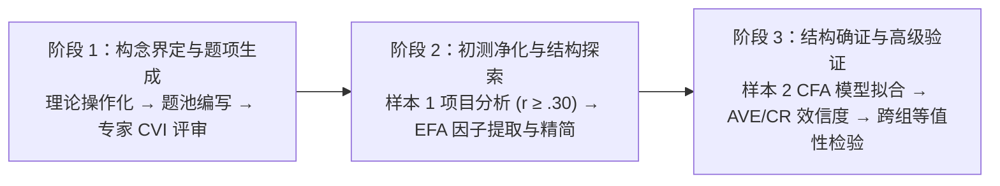

# Scale Development

---

## 定义

> [!def] 方法定义
> **量表编制与心理计量验证（Scale Development & Psychometric Validation）** 是心理学、教育学及社会科学中，依据[[Classical Test Theory|经典测量理论]]（Classical Test Theory, CTT）或[[Item Response Theory|项目反应理论]]（Item Response Theory, IRT），将抽象、复杂且不可直接观测的[[Construct|理论构念]]（如态度、信念、素养、动机、效能感等潜[[Variable|变量]]）[[Operationalization|操作化]]为一组标准化、可量化测度的指标题项，并通过多阶段独立样本实证检验确立其构念维度、[[Content Validity|内容效度]]、[[Construct Validity|结构效度]]、[[Reliability|信度]]体系及跨群体[[Measurement Invariance|测量等值性]]的系统方法论体系。[[Argument_Kazanci_Tinmaz_Sezgin_2023_SO|(Kazancı Tınmaz & Sezgin, 2023, pp. 4–6)]]

> [!method-scope] 方法范围
> - **研究对象** 无法直接物理测量的个体心理特质、专业素养、认知图式、情感态度、行为意向或组织环境感知。
> - **问题类型** 理论构念的操作化测量、潜在因子维度结构探索与确证、跨群体测量不变性识别、心理测量学属性综合评定。
> - **分析单位** 目标群体个体的逐题标准化作答数据。
> - **输出形式** 标准化量表手册（包含题项清单、作答等级与计分指南）、探索性因子载荷矩阵、验证性结构方程模型拟合参数、[[Average Variance Extracted|平均方差抽取量]]（AVE）与[[Composite Reliability|组合信度]]（CR）效度矩阵、跨组测量等值性阶梯报告及常模参照基准。

> [!citation-card]- 关键定义
> 现代量表编制是一个多阶段、迭代演进的严格科学流程：研究者首先从理论[[Document|文献]]中界定构念边界并生成初始题池，通过专家[[Content Validity Index|内容效度指数]]（CVI）评审与目标群体认知访谈进行初筛；随后在样本 1 中执行[[Item Analysis|项目分析]]与[[Exploratory Factor Analysis|探索性因子分析]]（EFA）精简题项并探索潜在维度；最后在独立样本 2 中运用[[Confirmatory Factor Analysis|验证性因子分析]]（CFA）确证一阶与高阶因子结构，检验[[Convergent and Discriminant Validity|收敛效度]]（AVE ≥ .50）与区分效度（Fornell-Larcker 准则），并确立跨群体的严格测量等值性。[[Argument_Kazanci_Tinmaz_Sezgin_2023_SO|(Kazancı Tınmaz & Sezgin, 2023, pp. 4–5)]]
>
> *Scale development is an iterative, multi-phase methodology in which researchers define construct boundaries, generate item pools, evaluate content validity via expert panels, and administer the instrument across independent samples to conduct EFA for dimension discovery and CFA for structural verification, convergent/discriminant validity, and measurement invariance.*

---

## 方法定位

> [!method-position] [[Epistemology|认识论]]与方法定位
> - **知识观** 潜在特质（Latent Trait）虽不可直接观测，但可以通过一组具有[[Reflexivity|反思性]]（Reflective）或形成性（Formative）的外显行为指标进行概率性、线性加权推断。
> - **研究者角色** 研究者必须在[[Construct|构念]]界定、题项编制、因子截断标准选择及模型误差协方差修正中保持高度的理论自觉与方法学反思，严禁陷入纯粹数据驱动的机械拟合。
> - **有效性标准** 遵循严密的测量学阶梯：[[Face Validity|表面效度]] $\rightarrow$ [[Content Validity|内容效度]]（[[Content Validity Index|CVI]] / CVR） $\rightarrow$ 探索性[[Construct Validity|结构效度]]（[[Exploratory Factor Analysis|EFA]]） $\rightarrow$ 验证性结构效度（[[Confirmatory Factor Analysis|CFA]]） $\rightarrow$ 收敛与[[Convergent and Discriminant Validity|区分效度]]（[[Average Variance Extracted|AVE]] / CR / Fornell-Larcker 准则） $\rightarrow$ 跨群体[[Measurement Invariance|测量等值性]]。
> - **不声称回答的问题** 量表本身仅提供测量构念的有效工具，量表得分之间的相关或群体差异无法直接推断[[Causality|因果关系]]，需进一步结合实验设计或纵向追踪模型。

> [!method-stack] 方法层级
> - **研究设计** 心理测量工具开发设计、两阶段双独立样本横断面调查设计。
> - **数据收集** 专家[[Delphi Technique|德尔菲法]]、认知访谈预试、大规模纸笔或在线[[Questionnaire|问卷调查]]。
> - **分析方法** [[Item Analysis|项目分析]]（Item Analysis）、探索性因子分析（EFA）、验证性因子分析（CFA）、多组验证性因子分析（MG-CFA）、多[[Variable|变量]][[Analysis of Variance|方差分析]]（MANOVA）。
> - **辅助技术** 期望极大化（EM）算法[[Imputation Methods|缺失值插补]]、马氏距离多变量离群值筛查、Bootstrap 稳健[[Standard Error|标准误]]估计、方差最大正交旋转（Varimax）与斜交旋转（Promax）。

---

## 量表编制八步标准操作规程

> [!proc] 量表编制与验证的标准全流程（DeVellis & Boateng 现代[[Paradigm|范式]]）
> 1. **[[Construct|理论构念]]界定与维度划分** 深入检索[[Document|文献]]，明确构念的理论内涵、子维度结构与适用边界条件。
> 2. **初始题池编写与作答格式设计** 编写 3–4 倍于目标题数的陈述句题池（通常 40–80 题），设定平衡的李克特计分点（如 5 级或 7 级）。
> 3. **专家[[Content Validity|内容效度]]评审与认知访谈** 邀请 5–10 位专家计算 [[Content Validity Index|内容效度指数]]（CVI） 与 CVR，结合 10–20 位目标被试的[[Pilot Testing|预测试]]完成题池初审。
> 4. **样本 1 施测与[[Item Analysis|项目分析]]初筛** 在样本 1（$N \ge 300$）中施测，计算矫正题总相关（剔除 $r < .30$），执行极端分组 $t$ 检验。
> 5. **[[Exploratory Factor Analysis|探索性因子分析]]（EFA）与维度提炼** 检验 KMO 与 Bartlett 球形检验，采用主轴因子提取法（PAF）与方差最大正交旋转，依据载荷 $> .32$ 且跨载荷差 $> .10$ 精简题项。
> 6. **独立样本 2 施测与[[Confirmatory Factor Analysis|验证性因子分析]]（CFA）** 收集独立样本 2（$N \ge 200\sim300$），拟合并对比单因子、一阶多因子与二阶因子模型，评估拟合指数（$\chi^2/df, \text{RMSEA}, \text{CFI}$）。
> 7. **[[Construct Validity|构念效度]]与[[Composite Reliability|复合信度]]电池检验** 计算各因子的[[Average Variance Extracted|平均方差抽取量]]（AVE $\ge .50$）与组合[[Reliability|信度]]（CR $\ge .70$），验证 Fornell-Larcker [[Convergent and Discriminant Validity|区分效度]]准则，报告 Cronbach's $\alpha$ 与 McDonald's $\omega$。
> 8. **跨群体[[Measurement Invariance|多组测量等值性]]检验与实证应用** 阶梯检验形态、弱、强与严格等值性（$|\Delta\text{CFI}| \le .010$），结合[[Analysis of Variance|方差分析]]（MANOVA）探索背景[[Variable|变量]]的赋能效应。



---

## 量表编制三阶段核心步骤与方法学原理

### 阶段一：构念界定与内容效度（Item Generation & Content Validity）

> [!concept-lens] 阶段一适用情境
> 适用于[[Literature Review|文献综述]]完成后，将理论概念[[Operationalization|操作化]]为初始题池，并通过学科专家评审与小样本预试剔除不切题或歧义题项的初始阶段。

> [!contrast-table] 阶段一核心方法与工具矩阵
> | 统计方法/工具条目 | 方法定位与角色 | 解决的核心问题与痛点 | 判断标准与决策阈值 | 深度条目索引 |
> |:---|:---|:---|:---|:---|
> | **[[Content Validity Index|内容效度指数（CVI / CVR）]]** | **专家[[Content Validity|内容效度]]量化工具** | 将同行专家对题项适切性的定性判断转化为定量指标，解决初始题池主观随意性问题。 | Lynn 判定标准：6–10 位专家时，题项级 **$\text{I-CVI} \ge .78$**，量表级 **$\text{S-CVI/Ave} \ge .90$**；Lawshe CVR 达显著水平。 | 🔗 [[Content Validity Index]] |
> | **[[Delphi Technique|德尔菲法（Delphi Technique）]]** | **专家共识汇聚方法** | 解决不同专家对[[Construct|构念]]维度与题项表述意见分歧的问题，通过多轮匿名函询形成稳定共识。 | 专家积极系数 $> 80\%$，专家权威系数 $Cr \ge 0.70$，肯德尔和谐系数（Kendall's $W$）检验显著（$p < .05$）。 | 🔗 [[Delphi Technique]] |
> | **[[Pilot Testing|预测试与认知访谈（Pilot Testing）]]** | **目标群体试读与质控** | 解决题项语言对一线被试晦涩难懂、存在双重否定或理解偏差的痛点。 | 收集 10–20 位目标被试的逐题出声思考（Think-aloud）反馈，消除所有歧义题项。 | 🔗 [[Pilot Testing]] |

> [!proc] 阶段一核心操作规程与题池开发步骤
> 1. **理论构念操作化与题池编制** 基于系统文献综述明确构念外延与内涵，编写 3–4 倍于目标题数的题项池（40–80 题），避免双重陈述与复杂双重否定，设定平衡的李克特计分点。
> 2. **专家内容效度量化评定与筛选** 组织 5–10 位同行专家以 4 级相关性量表独立打分，计算题项级指数（$\text{I-CVI}$）与量表级指数（$\text{S-CVI/Ave}$），结合 Lawshe CVR 剔除效度偏低题项。

> [!feature] 阶段一核心量化指标与判定准则
> - **题项级内容效度指数** $\text{I-CVI} \ge .78$（Lynn 1986 准则），6–10 位专家时需至少 8 位评为高度相关。
> - **量表级平均内容效度指数** $\text{S-CVI/Ave} \ge .90$，表明量表整体内容代表性与覆盖度卓越。
> - **Lawshe 内容效度比率** $\text{CVR} > 0$，显著超越 $50\%$ 的随机猜测赞同基线。

🔗 完整数学公式、判定临界表与评定规程参见：[[Content Validity Index]]。

---

### 阶段二：量表初测与结构探索（Scale Purification & EFA）

> [!concept-lens] 阶段二适用情境
> 适用于样本 1（$N \ge 300$ 或被试与题项比 $\ge 5:1$）完成施测后，对初始数据进行项目筛选、剔除低区分度题项并探索潜在因子结构的阶段。

> [!contrast-table] 阶段二核心方法与工具矩阵
> | 统计方法/工具条目 | 方法定位与角色 | 解决的核心问题与痛点 | 判断标准与决策阈值 | 深度条目索引 |
> |:---|:---|:---|:---|:---|
> | **[[Item Analysis|项目分析（Item Analysis）]]** | **题项质量统计初筛** | 解决题项区分度低下、与总分脱节或分布极度偏态的问题，在因子分析前净化题池。 | 筛选红线：矫正题总相关 **$r_{\text{it}} \ge .30$**；高低 27% 极端分组决断值 $t$ 检验达极显著水平（$p < .001$）。 | 🔗 [[Item Analysis]] |
> | **[[Exploratory Factor Analysis|探索性因子分析（EFA）]]** | **潜在维度结构探索与精简** | 解决观测[[Variable|变量]]高维冗余问题，通过方差分解提炼出最具解释力的潜变量结构。 | 判定准则：KMO $> .80$，Bartlett 球形检验 $p < .001$；依据特征值 $> 1$、碎石图与平行分析确定因子；载荷 **$> .32$** 且跨载荷差值 **$> .10$**。 | 🔗 [[Exploratory Factor Analysis]] |

> [!proc] 阶段二核心操作规程与因子提炼步骤
> 1. **样本 1 施测与项目分析初筛** 在样本 1（$N \ge 300$）中施测，计算矫正题总相关（剔除 $r_{\text{it}} < .30$），执行前 27% 与后 27% 极端分组决断值独立样本 $t$ 检验（淘汰 $p \ge .05$ 题项）。
> 2. **探索性因子分析与维度精简** 检验 KMO 与 Bartlett 检验，采用主轴因子提取法（PAF）与方差最大正交旋转（Varimax），依据载荷 $> .32$ 且跨载荷差值 $> .10$ 逐题筛选，提炼出清晰的公共因子。

> [!feature] 阶段二核心指标与筛选门槛
> - **矫正题总相关** $r_{\text{it}} \ge .30$，确保题项与构念整体方向高度一致。
> - **极端分组决断值** 高低 27% 组间差异达到极显著水平（$p < .001$），确立题项敏感区分度。
> - **抽样适宜性系数** $\text{KMO} > .80$ 且 Bartlett 球形检验 $p < .001$，证实因子分解合法性。
> - **因子截断与载荷准则** 特征值大于 1，结合平行分析拐点；主载荷 $> .32$ 且跨载荷差值 $> .10$。

🔗 完整区分度公式参见：[[Item Analysis]]；因子提取与旋转算法参见：[[Exploratory Factor Analysis]]。

---

### 阶段三：结构确证与高级心理测量（CFA, Validity & Measurement Invariance）

> [!concept-lens] 阶段三适用情境
> 适用于在全新独立样本 2（$N \ge 200\sim300$）中确证一阶与高阶因子模型、检验潜变量效[[Reliability|信度]]体系并评估跨群体[[External Validity|可推广性]]的高级验证阶段。

> [!contrast-table] 阶段三核心方法与工具矩阵
> | 统计方法/工具条目 | 方法定位与角色 | 解决的核心问题与痛点 | 判断标准与决策阈值 | 深度条目索引 |
> |:---|:---|:---|:---|:---|
> | **[[Confirmatory Factor Analysis|验证性因子分析（CFA）]]** | **理论模型拟合确证** | 检验 EFA 探索出的因子结构是否能在独立新样本中稳定复现，对比竞争模型并检验高阶二阶构念。 | 拟合优良标准：$\chi^2/df < 3.0$，**$\text{RMSEA} < 0.08$**（优选 $< 0.06$），**$\text{SRMR} < 0.08$**，**$\text{CFI} \ge 0.90$**，**$\text{TLI/NNFI} \ge 0.90$**。 | 🔗 [[Confirmatory Factor Analysis]] |
> | **[[Average Variance Extracted|平均方差抽取量（AVE）]]** | **收敛与[[Convergent and Discriminant Validity|区分效度]]判定标准** | 解决传统方法无法量化潜变量真实解释变异比例的痛点，提供 Fornell-Larcker 区分效度基准。 | 收敛标准：**$\text{AVE} \ge .50$**；区分标准：各因子 $\text{AVE}_j > r_{jk}^2$（或 $\sqrt{\text{AVE}_j} > |r_{jk}|$）。 | 🔗 [[Average Variance Extracted]] |
> | **[[Composite Reliability|组合信度（CR）]]** | **现代潜变量[[Internal Consistency|内部一致性]]指标** | 解决 Cronbach's $\alpha$ 强求等载荷假设导致信度系统性低估的缺陷，提供无偏合成信度估计。 | 决策阈值：**$\text{CR} \ge .70$**（探索性研究 $\ge .60$，高精度要求 $\ge .80$）。 | 🔗 [[Composite Reliability]] |
> | **[[Measurement Invariance|多组测量等值性（MI / MG-CFA）]]** | **跨组可比性与测量偏倚检验** | 解决量表在不同子群体（如性别、文化、年龄）中是否存在测量偏差、是否允许直接跨组比较均值的合法性问题。 | Cheung & Rensvold / Chen 准则：形态 $\to$ 弱 $\to$ 强 $\to$ 严格四阶递进，满足 **$|\Delta\text{CFI}| \le .010$** 且 **$\Delta\text{RMSEA} \le .015$**。 | 🔗 [[Measurement Invariance]] |

> [!proc] 阶段三核心操作规程与高级验证步骤
> 1. **独立样本 2 施测与 CFA 拟合确证** 采集全新独立样本 2（$N \ge 250$）拟合竞争模型（单因子 vs 一阶多因子 vs 二阶高阶模型），评估 $\chi^2/df < 3$、$\text{RMSEA} < 0.08$、$\text{CFI} \ge 0.90$。
> 2. **构念收敛效度与区分效度检验** 计算各潜变量的平均方差抽取量（$\text{AVE} \ge .50$），并验证 Fornell-Larcker 准则（$\text{AVE}_j > r_{jk}^2$）。
> 3. **现代构念组合信度检验** 基于完全标准化解计算组合信度（$\text{CR} \ge .70$），同步报告 McDonald's $\omega$ 与[[Split-Half Reliability|折半信度]]。
> 4. **跨群体多组测量等值性阶梯检验** 依次检验形态等值 $\to$ 弱等值 $\to$ 强等值 $\to$ 严格等值（$|\Delta\text{CFI}| \le .010, \Delta\text{RMSEA} \le .015$）。

> [!formula-step] 公式步骤　验证性因子分析基本测量方程与二阶高阶方程
> $$\boldsymbol{X} = \boldsymbol{\Lambda}_x \boldsymbol{\xi} + \boldsymbol{\delta}, \quad \boldsymbol{\xi} = \boldsymbol{\Gamma} \boldsymbol{\Xi} + \boldsymbol{\zeta}$$
>
> **这个公式在做什么** 
> - **一阶方程** 将观测题项向量 $\boldsymbol{X}$ 分解为由一阶潜变量 $\boldsymbol{\xi}$ 乘以因子载荷矩阵 $\boldsymbol{\Lambda}_x$ 加上测量残差 $\boldsymbol{\delta}$；
> - **二阶方程** 将一阶因子向量 $\boldsymbol{\xi}$ 进一步回归到更高阶的统整潜变量 $\boldsymbol{\Xi}$ 上，由二阶载荷矩阵 $\boldsymbol{\Gamma}$ 统摄，残余变异为 $\boldsymbol{\zeta}$。
>
> **数学直觉** 二阶高阶模型检验各个一阶维度（如研究意识、态度、技能、使用）是否均隶属于一个统摄性的全局构念（如总体“[[Research Literacy|研究素养]]”）。二阶拟合良好为研究者在实践中直接计算量表总分提供了坚实的心理测量学合法性。

> [!feature] 阶段三核心指标与判定门槛
> - **模型拟合优良标准** $\chi^2/df < 3.0$、$\text{RMSEA} < 0.08$、$\text{SRMR} < 0.08$、$\text{CFI} \ge 0.90$、$\text{TLI} \ge 0.90$。
> - **平均方差抽取量** $\text{AVE} \ge .50$，确证潜变量解释的指标方差大于测量误差。
> - **Fornell-Larcker 区分准则** 各因子的 $\text{AVE}_j$ 严格大于它与其他因子间的共享方差（$r_{jk}^2$）。
> - **现代组合信度** $\text{CR} \ge .70$，准确估计异质载荷下潜变量合成信度。
> - **测量等值性判据** $|\Delta\text{CFI}| \le .010$ 且 $\Delta\text{RMSEA} \le .015$，确立跨组无测量偏倚。

🔗 完整推导参见：[[Confirmatory Factor Analysis]]、[[Average Variance Extracted]]、[[Composite Reliability]] 与 [[Measurement Invariance]]。

---

## 软件实现与端到端代码规程

> [!software-impl] R 语言端到端量表编制与心理计量分析全流程脚本
> ```R
> # 加载核心心理测量学与结构方程模型包
> library(psych)
> library(lavaan)
> library(semTools)
> 
> # ==============================================================================
> # 阶段一：样本 1 项目分析与探索性因子分析 (EFA)
> # ==============================================================================
> # 1. 题总相关与区分度初筛
> item_stats <- alpha(sample1_data)
> print(item_stats$item.stats) # 检查 r.drop 是否 >= 0.30
> 
> # 2. KMO 与 Bartlett 检验
> print(KMO(sample1_data))
> print(cortest.bartlett(cor(sample1_data), n = nrow(sample1_data)))
> 
> # 3. 主轴因子提取与方差最大旋转
> efa_fit <- fa(sample1_data, nfactors = 4, rotate = "varimax", fm = "pa")
> print(efa_fit$loadings, cutoff = 0.32)
> 
> # ==============================================================================
> # 阶段二：独立样本 2 验证性因子分析 (CFA) 与二阶模型
> # ==============================================================================
> # 4. 定义一阶四因子与二阶结构方程模型
> cfa_syntax <- '
>   # 一阶因子定义
>   Awareness =~ R1 + R2 + R3 + R4
>   Attitude  =~ R5 + R6 + R7
>   Skills    =~ R8 + R9 + R10 + R11 + R12 + R13
>   Usage     =~ R14 + R15 + R16 + R17 + R18 + R19 + R20
>   
>   # 二阶全局因子定义
>   Research_Literacy =~ Awareness + Attitude + Skills + Usage
> '
> 
> # 5. 拟合 CFA 模型并输出拟合指数
> cfa_fit <- cfa(cfa_syntax, data = sample2_data, estimator = "MLR")
> summary(cfa_fit, fit.measures = TRUE, standardized = TRUE)
> 
> # ==============================================================================
> # 阶段三：AVE、CR、Fornell 区分效度与跨组测量等值性
> # ==============================================================================
> # 6. 提取 AVE、CR 与 Omega
> print(reliability(cfa_fit))
> 
> # 7. 跨性别多组测量等值性阶梯检验
> inv_results <- measurementInvariance(
>   model = cfa_syntax, 
>   data = sample2_data, 
>   group = "gender", 
>   estimator = "MLR"
> )
> print(inv_results)
> ```

---

## 使用此方法的经典代表研究

> [!evidence-grid] 使用量表编制方法论的经典实证代表作
> - **《[[Research Literacy Scale for Teachers|教师研究素养量表]]》（RLS）** [[Argument_Kazanci_Tinmaz_Sezgin_2023_SO|Kazancı Tınmaz & Sezgin (2023)]] 严格遵循 DeVellis 现代[[Paradigm|范式]]开发 20 题四维度量表，在样本 1（$N=310$）中通过 [[Exploratory Factor Analysis|EFA]] 提取 4 因子（解释 $62.60\%$ 方差），在独立样本 2（$N=258$）中通过 [[Confirmatory Factor Analysis|CFA]] 确立二阶因子结构，验证了各维度优良的 [[Average Variance Extracted|AVE]]（$.50\sim.56$）、CR（$.75\sim.90$）及跨性别严格[[Measurement Invariance|测量等值性]]，并运用 MANOVA 证实了做研究与读期刊的双轨独立赋能机制。
> - **《[[Confidence Teaching TOK Scale|知识论教学信心量表]]》** [[Argument_Bergeron_2015_TeachingTOK|Bergeron & Rogers (2015)]] 编制并验证包含 11 道题的教学信心量表，通过 EFA 确立单因子结构并解释 35.03% 方差，为评估跨学科[[Epistemology|认识论]]教学效能感提供标准化工具。
> - **《[[Epistemic and Ontological Cognition Questionnaire|认识论与本体论认知问卷]]》（EOCQ）** [[Argument_Greene_2010_JEP|Greene et al. (2010)]] 编制并检验 13 题[[Questionnaire|问卷]]，通过 CFA 在数学和历史领域检验[[Epistemological Beliefs|认识论信念]]与[[Ontology|本体论认知]]的维度结构及[[Domain Specificity|领域特异性]]拟合度。

---

## 方法学局限与学术争议

> [!warning] 方法学局限与操作风险
> 1. **样本割裂与过拟合风险** 严禁在同一数据集上既跑 [[Exploratory Factor Analysis|EFA]] 又跑 [[Confirmatory Factor Analysis|CFA]]；若未采集独立新样本进行跨样本确证，提炼出的因子结构极易受到特定样本随机噪声的污染（Sample Overfitting）。
> 2. **修正指数（MI）滥用风险** 严禁盲目依据修正指数释放无关题项的残差协方差（Error Covariance）以机械凑出优良拟合，任何协方差释放必须具有充分的理论依据或语义重叠支持。
> 3. **同源方法变异（[[Common Method Variance|CMV]]）** 自陈量表容易受社会赞许性、中心化趋势与共同方法偏差影响，建议在设计阶段采用匿名施测、反向题混排或多来源数据互证。
> 4. **等值性检验过度拒绝** 在大样本下避免仅依赖 $\Delta\chi^2$ 差异检验，应全面依据 $|\Delta\text{CFI}| \le .010$ 与 $\Delta\text{RMSEA} \le .015$ 进行稳健判据。

---

## 条目关联

> [!entry-map]
>
> | 条目 | 类型 | 关系 |
> |:-----|:-----|:-----|
> | [[Classical Test Theory]] | 理论 | 为量表编制的真分数模型、方差分解与误差理论提供底层奠基。 |
> | [[Construct Validity]] | 理论概念 | 量表编制追求的核心效度目标，统摄内容、结构、收敛与[[Convergent and Discriminant Validity|区分效度]]。 |
> | [[Content Validity Index]] | 工具/方法 | 阶段一用于量化同行专家对初始题池[[Content Validity|内容效度]]评定的核心工具。 |
> | [[Item Analysis]] | 前置方法 | 阶段二用于检验题项区分度与题总相关以净化题池的初筛方法。 |
> | [[Exploratory Factor Analysis]] | 核心方法 | 阶段二用于精简题项、发现并提炼潜在因子维度的核心统计技术。 |
> | [[Confirmatory Factor Analysis]] | 核心方法 | 阶段三用于在新独立样本中确证因子模型与高阶结构的验证性工具。 |
> | [[Average Variance Extracted]] | 评估指标 | 阶段三用于量化潜[[Variable|变量]]收敛效度与 Fornell-Larcker 区分效度的指标。 |
> | [[Composite Reliability]] | 评估指标 | 阶段三用于克服 Alpha 缺陷、精确估计潜变量[[Internal Consistency|内部一致性]]的现代信度指标。 |
> | [[Measurement Invariance]] | 高级方法 | 阶段三用于确立测量工具跨群体（如性别、文化）[[External Validity|可推广性]]的等值性检验方法。 |
> | [[Research Literacy Scale for Teachers]] | 测量工具 | 严格践行量表编制八步规范与心理测量学验证的典范测量工具。 |
> | [[Argument_Kazanci_Tinmaz_Sezgin_2023_SO|Kazancı Tınmaz & Sezgin (2023)]] | 论证[[Document|文献]] | 提供量表编制全流程实证数据与心理测量指标报告的代表论文。 |
