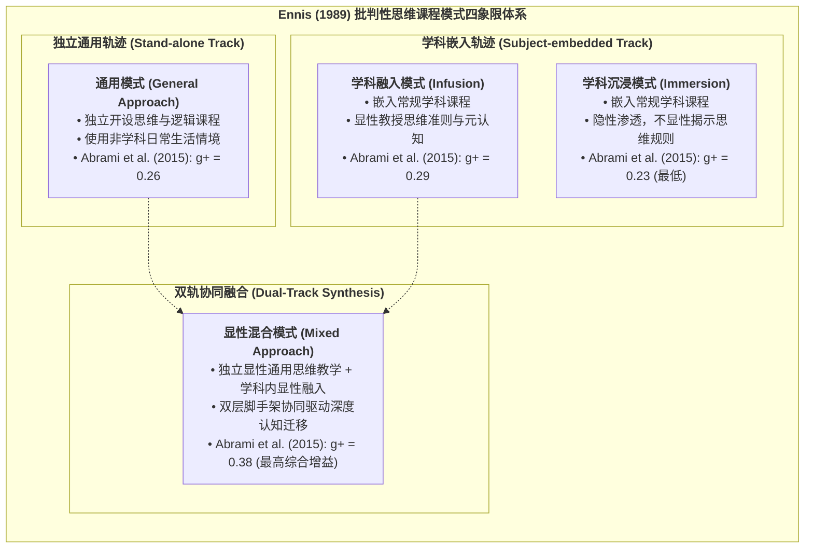

# Ennis's Curricular Typology

---

## 理论定位

> [!theory-position] 理论定位
> - **解释对象** [[Critical Thinking|批判性思维]]教学在学校课程中的不同组织架构与实施路径。
> - **理论问题** 批判性思维应如何与具体学科内容相结合？显性思维规则教学与学科情境浸入如何协同以实现最佳学习迁移？
> - **理论类型** 中层课程分类与教学设计理论（Curricular Typology & Instructional Design Model）。
> - **知识位置** 批判性思维运动与课程论前沿。源于 Robert H. Ennis (1989) 的经典奠基论文，并经 [[Argument_Abrami_2015_RER|Abrami et al. (2008, 2015)]] 大型[[Meta-analysis|元分析]]在实证层面上全面验证。

> [!claim] 核心主张
> 批判性思维教学的成效由“思维原则的显性程度”与“学科知识的结合深度”共同决定。将通用的论证与[[Metacognition|元认知]]原则显性化教授，并与具体学科知识深度融合的**显性混合模式（Mixed Approach）**能够获得最高的综合思维收益与跨情境迁移效能。[[Argument_Abrami_2015_RER|(Abrami et al., 2015, pp. 280–281, 293–294)]]

> [!citation-card]- 经典理论定义
> 在探讨批判性思维与[[Domain Specificity|学科特异性]]关系时，课程可区分为四类模式：通用模式（非学科独立设课）、融入模式（学科内显性教原则）、沉浸模式（学科内隐性渗透）与混合模式（独立显性教学与学科结合）。[[Argument_Abrami_2015_RER|(Abrami et al., 2015, pp. 280–281)]]
>
> *Ennis (1989) proposed a typology of four approaches to teaching critical thinking: the general approach, the [[Infusion Approach]], the [[Immersion Approach]], and the mixed approach... distinguished by the explicitness of CT instruction and its relationship to subject-matter content.*

---

## 关键概念与理论构件

> [!entry-map]
> | 理论构件 | 构件类型 | 在理论体系中的功能与角色 |
> |---|---|---|
> | **通用模式（General Approach）** | 课程模式 | 独立开设[[Critical Thinking\|批判性思维]]专门课程，脱离具体学科内容，使用日常议题与形式逻辑练习显性讲授通用思维原则。 |
> | **[[Infusion Approach\|学科融入模式（Infusion Approach）]]** | 课程模式 | 紧密结合具体学科知识（如历史、生物），引导学生开展学科探究，**同时将通用的批判性思维原则与评价标准显性示范给学生**。 |
> | **[[Immersion Approach\|学科沉浸模式（Immersion Approach）]]** | 课程模式 | 引导学生深入学科问题开展高强度思维活动，**但不显性阐释通用的批判性思维原则**，假定思维能力会作为学科掌握的副产品自发产生。 |
> | **显性混合模式（Mixed Approach）** | 课程模式 | 综合通用模式与融入模式的双轨设计：既保留独立的显性思维与[[Metacognition\|元认知]]技能训练模块，又在常规学科教学中持续强化与应用这些原则。 |
> | **[[Domain Specificity\|学科特异性]]** | 基础[[Construct\|构念]] | 解释思维技能与具体学科知识结构的内嵌关系，为四类模式的划分提供认知心理学依据。 |
> | **[[Explicit Critical Thinking Instruction\|显性教学原则]]** | 核心机制 | 决定思维规则是否作为明晰教学目标被直接示范、练习与评价的关键分水岭。 |

---

## 核心命题与机制推导

---

### 命题一　显性原则示范是决定批判性思维教学成效的根本分水岭

> [!proposition-chain] 命题推导
> - **前提一** 沉浸模式与融入模式均在常规学科内部展开高强度的思维探究，两者的唯一[[Variable|变量]]差异在于**是否向学生显性揭示[[Critical Thinking|批判性思维]]原则与反思[[Metacognition|元认知]]**（Ennis, 1989）。
> - **前提二** 大规模[[Meta-analysis|元分析]]实证显示，显性的[[Infusion Approach|学科融入模式]]干预效果达 $g+ = 0.29$（$k = 152$），而隐性的[[Immersion Approach|学科沉浸模式]]效果仅为 $g+ = 0.23$（$k = 61$），在所有四类模式中表现最弱（Abrami et al., 2015）。
> - **推导结论** 单纯增加学科内容的探究难度（沉浸）并不能自动转化为学生的批判性思维能力；只有当教师把“如何识别[[Hypothesis|假设]]、如何评估证据可[[Reliability|信度]]、如何避免逻辑谬误”等思维准则作为显性知识进行示范与脚手架搭建时，才能有效促进思维技能的发展。

---

### 命题二　显性混合模式通过双层认知脚手架实现最高综合增益与深层迁移

> [!proposition-chain] 命题推导
> - **前提一** 单纯的独立通用模式（$g+ = 0.26$）缺乏丰富情境锚点，易陷入抽象形式主义；单纯的学科融入模式（$g+ = 0.29$）受制于学科课时与特定情境，跨领域迁移可能受阻。
> - **前提二** 混合模式（Mixed approach）构建了“通用元认知规则（上层）+ 学科特异探究实践（下层）”的双层协同机制，在 341 项实证研究中获得了最高的通用思维干预[[Effect Size|效应量]]（**$g+ = 0.38$**，显著高于沉浸模式 $g+ = 0.23$ 与通用模式 $g+ = 0.26$）（Abrami et al., 2015）。
> - **推导结论** 显性混合模式是化解“通用主义”与“学科特异主义”对立的最优课程解决方案。独立思维模块赋予学生通用的分析工具箱，而学科融入则为工具箱提供了真实复杂的演练道场，二者结合最大化了学习迁移。

---

### 命题三　四类课程模式对学科特异思维与常规学业成绩产生差异化溢出

> [!proposition-chain] 命题推导
> - **前提一** 当测量工具切换为“[[Domain Specificity|学科特异性]]批判性思维测验”（$k = 97$）时，直接通用模式与混合模式分别产生了 $g+ = 0.74$ 与 $g+ = 0.67$ 的高增益，融入模式达 $g+ = 0.56$，沉浸模式仍居末位（$g+ = 0.45$）。
> - **前提二** 批判性思维教学对常规[[Academic Achievement|学业成就]]（期末考试与知识掌握）产生显著正向提升（总体 $g+ = 0.33$，期末考 $g+ = 0.37$），并未对学科知识学习产生挤压效应。
> - **推导结论** 显性思维教学不仅不会削弱学科内容的掌握，反而通过深化深层理解机制，对学科特异思维能力与常规学术成绩产生强力的正向反哺。

---

## 实证数据汇总

> [!ma-table]- Abrami et al. (2015) Ennis 课程模式[[Meta-analysis|元分析]]检验矩阵
> | 课程模式 | 核心设计特征 | 纳入效应量 $k$ | 加权效应 $g+$ | 95% CI 下限 | 95% CI 上限 | 组间检验 $Q_b$ (df, $p$) | 理论解释与教学启示 |
> |---|---|---|---|---|---|---|---|
> | **显性混合模式（Mixed）** | 独立显性教学 + 学科内深度融入 | 84 | **0.38** | 0.26 | 0.51 | $Q_b(3) = 4.10, p = .25$ | **综合效果最佳**；通用[[Metacognition\|元认知]]脚手架与学科情境演练产生协同放大效应。 |
> | **[[Infusion Approach\|学科融入模式]]（Infusion）** | 学科教学中显性讲授思维原则 | 152 | **0.29** | 0.23 | 0.36 | | 兼顾学科知识学习与思维训练，成效稳健且易于在常规课堂落地。 |
> | **直接通用模式（General）** | 独立开设思维与逻辑专门课程 | 44 | **0.26** | 0.14 | 0.37 | | 能够有效传授通用论证规则，但若缺乏学科应用则迁移幅度有限。 |
> | **[[Immersion Approach\|学科沉浸模式]]（[[Presence\|immersion]]）** | 隐性渗透，不讲授通用思维规则 | 61 | **0.23** | 0.12 | 0.34 | | **效果最弱**；证明缺乏显性引导的“自发领悟”[[Hypothesis\|假设]]在统计上不成立。 |

---

## 理论争议与边界反思

> [!debates] 课程落地争议
> - **课时挤压与师资负担之争** 混合模式虽然实证效果最佳，但对学校课时调配（需要单独设立思维课）与跨学科教师协同（学科教师必须掌握统一的思维术语）提出了极高要求。在基础教育实践中，[[Infusion Approach|学科融入模式]]（Infusion）因其对课时体系改动最小、落地成本最低，常被作为大规模教学改革的首选折中方案。
> - **沉浸模式的误区** 很多传统学科教师误以为只要给学生布置具有挑战性的复杂问题（如开放式实验、长篇论文），[[Critical Thinking|批判性思维]]就会自然发生。Ennis 分类理论与 Abrami [[Meta-analysis|元分析]]实证彻底打破了这一“沉浸迷思”，确立了显性教学的必要性。

---

## 相关研究

> [!evidence-grid-a] 相关研究索引
> - [[Argument_Abrami_2015_RER|Abrami et al. (2015)]] — 综合 341 项实验实证，对 Ennis 提出的四类课程模式进行系统[[Meta-analysis|元分析]]组间检验，确立混合模式（$g+ = 0.38$）与融入模式（$g+ = 0.29$）的实证有效性。
> - [[Explicit Critical Thinking Instruction]] — 阐述显性[[Critical Thinking|批判性思维]]教学的核心理论命题、教师培训[[Interaction Effect|调节效应]]与实践案例。
> - [[Domain Specificity]] — 阐明学科特异性与通用性的[[Epistemology|认识论]]辩论及双层整合机制。
