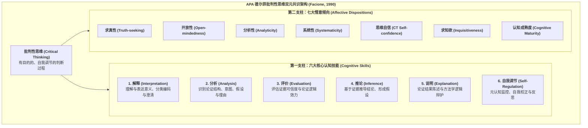

# APA Delphi Consensus on Critical Thinking

---

## 理论定位

> [!theory-position] 理论定位
> - **解释对象** [[Critical Thinking|批判性思维]]（Critical Thinking）的本质内涵、核心构成要素、[[Operationalization|操作化]]定义及其在教育评估中的通用标准。
> - **理论问题** 回应 20 世纪 80 年代批判性思维领域派系林立、定义模糊、测量工具缺乏统一[[Construct Validity|构念效度]]基准的学界困境。
> - **理论类型** 规范性与操作化共识理论框架（Normative & Operational Consensus Framework）。
> - **知识位置** 当代教育哲学、认知心理学与[[Higher-Order Thinking Skills|高阶思维]]教学的奠基石。由美国哲学学会（APA）于 1988–1989 年发起，Peter A. Facione (1990) 担任首席研究员，联合 46 位国际顶尖学者（涵盖哲学、教育学、心理学与物理学领域的代表人物，如 [[Robert Ennis]]、Matthew Lipman、Richard Paul、Harvey Siegel、John McPeck 等）通过多轮[[Delphi Technique|德尔菲法]]历时两年完成，成为后续所有重大实证综述（如 [[Argument_Abrami_2015_RER|Abrami et al., 2008, 2015]]）的金标准。

> [!claim] 核心主张
> 批判性思维是一种有目的的、自我调节的判断过程；它展现为**解释、分析、评价、推论、说明和自我调节**六大核心认知技能，并由**追求真理、思想开放、审慎分析、系统条理、思维自信、探究好奇与认知成熟**七大情意倾向所驱动；认知技能与情意倾向共同构成了理性公民与[[Lifelong Learning|终身学习]]者的双元支柱。[[Argument_Abrami_2015_RER|(Abrami et al., 2015, pp. 277–278)]]

> [!citation-card]- “理想批判性思考者”共识画像
> 理想的批判性思考者习惯性地具备好奇心、见多识广、信任理性、心智开放、灵活通达、公正评价、诚实面对个人偏见、审慎做出判断、乐于重新考虑、对问题表述清晰、在复杂事物中有序推进、勤于检索相关信息、合理选择标准、专注于探究并在情境许可的限度内坚持追求精确的结果。[[Argument_Abrami_2015_RER|(Abrami et al., 2015, p. 278)]]
>
> *The ideal critical thinker is habitually inquisitive, well-informed, trustful of reason, open-minded, flexible, fair-minded in evaluation, honest in facing personal biases, prudent in making judgments, willing to reconsider, clear about issues, orderly in complex matters, diligent in seeking relevant information, reasonable in the selection of criteria, focused in inquiry, and persistent in seeking results which are as precise as the subject and the circumstances of inquiry permit.* (Facione, 1990, p. 2)

---

## 关键构件与双元架构

> [!entry-map]
> | 构件名称 | 构件类型 | 在德尔菲共识框架中的功能 |
> |---|---|---|
> | **六大认知技能（Cognitive Skills）** | 技能维度 | 提供了[[Critical Thinking|批判性思维]]的严密[[Operationalization|操作化]]定义与测量判据，成为 CCTST、WGCTA 等标准化量表编制的理论母体。 |
> | **[[Critical Thinking Disposition|七大情意倾向（Affective Dispositions）]]** | 倾向维度 | 界定了批判精神的内在情意动力学，指导了 [[California Critical Thinking Disposition Inventory|CCTDI]] 的量表研发。 |
> | **自我调节（Self-Regulation / [[Metacognition|元认知]]）** | 枢纽机制 | 认知技能中的最高阶环节，连接了认知操作与自我校准反思。 |
> | **[[Phronesis|实践智慧]]与情境审慎** | 哲学规范 | 确立批判性思维不仅是工具性逻辑技巧，更是指向明智决策与道德生活的反思能力。 |

---

## 核心理论命题与实证检验

---

### 命题一　德尔菲技能构念为实证教学干预的有效性评估提供了严密操作化基准

> [!proposition-chain] 命题推导
> - **前提一** 早期[[Critical Thinking|批判性思维]]研究由于缺乏权威共识，导致测验工具与教学干预内容严重脱节，无法进行跨研究定量综合。
> - **前提二** 德尔菲报告明确将批判性思维界定为六大核心技能，使得研究者能够以此为标准筛选出真正测量批判性思维的标准化测试工具（如 [[California Critical Thinking Skills Test|CCTST]]、[[Ennis-Weir Critical Thinking Essay Test|Ennis-Weir]] 等）。
> - **实证支持** [[Argument_Abrami_2015_RER|Abrami et al. (2015)]] 严格以德尔菲技能框架为纳入标准，在 341 项标准化实验与准[[Experimental Research|实验研究]]中测得总体干预效应为 $g+ = 0.30$（$95\%\text{ CI } [0.25, 0.34]$），证明了基于德尔菲[[Construct|构念]]的[[Operationalization|操作化]]测量具有极高的稳健性与跨情境一致性。

---

### 命题二　认知技能与情意倾向的协同互动是高阶思维迁移的必要条件

> [!proposition-chain] 命题推导
> - **前提一** 德尔菲专家达成压倒性共识（95% 赞成率）：脱离情意倾向的认知技能容易退化为巧言令色的诡辩术（Sophistry），而缺乏认知技能的情意倾向则沦为盲目的热情。
> - **前提二** 实证干预显示，教学干预能够同时显著促进技能（$g+ = 0.30$）与倾向（$g+ = 0.23$），且当融入[[Mentorship|导师制]]时，倾向的获得达到最高峰值（$g+ = 0.38$）（[[Argument_Abrami_2015_RER|Abrami et al., 2015]]）。
> - **推导结论** 理想的批判性思维教学必须坚持“技能训练 + [[Habitus|习性]]浸润”双轨并进，唯有将认知脚手架与导师榜样示范结合，才能实现德尔菲框架所倡导的理性全人发展。

---

## 实证表现与历史影响

> [!ma-table]- [[Argument_Abrami_2015_RER|Abrami et al. (2015)]] 基于德尔菲双元框架的[[Meta-analysis|元分析]]实证成果
> | 德尔菲[[Construct|理论构念]]维度 | 对应测量工具与样本规模 | 汇总效应量 $g+$ | 95% CI | 核心实证结论 |
> |---|---|---|---|---|
> | **通用认知技能维度** | 标准化测试（$k = 341$） | **$g+ = 0.30$** | [0.25, 0.34] | 证实德尔菲六大技能可通过教学干预实现普遍提升。 |
> | **学科特异技能维度** | 学科自编与标准测验（$k = 97$） | **$g+ = 0.57$** | [0.47, 0.68] | 技能在具体学科情境中呈现更强的近迁移增益。 |
> | **情意倾向维度** | CCTDI 等自陈量表（$k = 25$） | **$g+ = 0.23$** | [0.06, 0.40] | 证实七大情意倾向具有后天可塑性（导师制下达 $g+ = 0.38$）。 |

---

## 相关研究

> [!evidence-grid-a] 相关研究索引
> - [[Argument_Abrami_2015_RER|Abrami et al. (2015)]] — 全文以 APA 德尔菲专家共识为理论基底与[[Variable|变量]][[Coding in Qualitative Research|编码]]标准，量化检验了德尔菲技能与倾向的教学成效。
> - [[Critical Thinking Disposition]] — 深入阐述德尔菲情意倾向维度的理论机制与[[Meta-analysis|元分析]]数据。
> - [[California Critical Thinking Disposition Inventory]] — 基于德尔菲七维度开发的经典测量工具。
> - [[Peter Facione]] — 德尔菲报告首席专家的人物档案。
> - [[Ennis's Curricular Typology]] — 德尔菲委员会核心专家 [[Robert Ennis]] 的课程模式理论。
