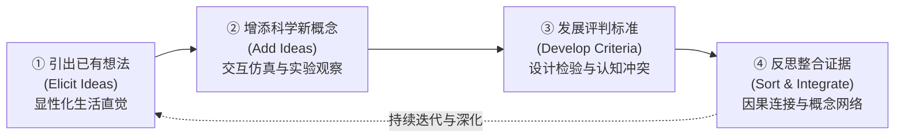

# Knowledge Integration

## 理论概述

> [!def] 核心定义
> 知识整合（Knowledge Integration, KI）是由学习科学学者玛西娅·琳（[[Marcia C. Linn]]）及其团队在加州大学伯克利分校历经三十年实证研究确立的科学教育[[Constructivist Paradigm\|建构主义]][[Didaktik\|教学理论]]与认知评价框架。该理论主张，学习者的初始认知并非缺乏知识的“白纸”，也不是充满必须被彻底连根拔除的孤立“迷思概念”（Misconceptions），而是由源于日常生活经验的多元、直觉性且往往相互冲突的想法片段构成的复合集合。科学学习的核心机制在于借助结构化情境与[[Scaffolding\|认知支架]]，引导学生经历**引出已有想法、增添规范新概念、发展证据评判标准、反思修正并整合认知网络**的动态重构过程，最终发展出连贯协调的科学因果理解（Linn, 2006; [[Argument_DeJong_2023_ERR\|De Jong et al., 2023, pp. 6, 9]]）。

知识整合框架构成了全球著名开源科学探究平台——基于网络的探究科学环境（[[Web-based Inquiry Science Environment]], WISE）的底层教学设计规范与[[Learning Analytics|学习分析学]]引擎。

> [!concept-lens] 知识整合的[[Epistemology\|认识论]]定位
> - **含义** 将学习界定为观点网络的[[Topological Spatialisation\|拓扑重组]]与证据连接，而非真理对谬误的机械置换。
> - **用途** 指导数字化探究课程单元开发、自适应反馈提示设计与科学论证作答的质性分级评测。
> - **边界** 聚焦于复杂因果机制与质性科学概念的深层建构，区别于单纯追求运算熟练度的事实识记教学；区别于放任自流的[[Discovery Learning\|纯发现学习]]，强调外源[[Epistemic Scaffolding\|认识论支架]]的介入。

---

## 核心理论命题与四大过程机制

知识整合教学模式将科学探究过程解析为四个循环迭代的认知支持支架（KI Pattern）：

> [!pattern] 知识整合的四大支架机制
> 1. **引出想法（Eliciting Ideas）**
>    - *机制* 在单元开端激活学习者关于自然现象（如热传导、温室效应、重力加速度）的已有生活直觉与前概念模型。
>    - *[[Epistemic Stances\|认识论立场]]* 赋予学生初始直觉以合法性，避免直接宣判其为“错误”，鼓励学生显性化表达多样化的直觉观点。
> 2. **增添新概念（Adding Ideas）**
>    - *机制* 通过高交互性[[Computer Simulation\|计算机模拟]]、对比实验观察或微世界参数操纵，引入符合科学规范的新因果[[Variable\|变量]]。
>    - *支架设计* 运用直观可视化手段（如热分子碰撞、电荷流动微观模型）弥合不可见物理机制与宏观现象间的表征鸿沟。
> 3. **发展判别标准（Developing Criteria）**
>    - *机制* 引导学习者基于对比实验生成的证据，制定评判“哪些解释更有效、更具普适性”的[[Epistemic Ideals\|认识论标准]]。
>    - *深层认知* 迫使学生直面新旧观点之间的预测矛盾与认知冲突，辨析“为什么铁汤匙比木汤匙摸起来更冷并不意味着铁的温度更低”。
> 4. **反思整合证据（Sorting and Integrating Ideas / Reflecting）**
>    - *机制* 指导学生调和相互竞争的想法，借助反思提示、结构化论证模板或[[Concept Mapping\|概念图]]，将经受检验的有效概念编织入稳定的因果网络。
>    - *产出* 摒弃非科学的孤立猜测，形成兼具解释力与情境迁移能力的整合性认知图式。

---

## 认知评价：知识整合评分量规（KI Rubric）

为精细刻画学生[[Scientific Explanation|科学解释]]从碎片化走向整体融通的发展轨迹，Linn 团队建立了标准化的 5 级知识整合量规，该量规在学习科学界被广泛采纳并与自然语言处理（NLP）自动评分技术紧密整合：

> [!scale] 知识整合 5 级评分梯度
> | 等级 | 认知水平定位 | 结构特征描述 | 典型科学作答样例（以热绝缘为例） |
> |---|---|---|---|
> | **Level 1** | **无关或无效想法** | 完全偏离主题、答非所问或仅重复题干词汇 | “因为铁是金属，我很喜欢用铁锅。” |
> | **Level 2** | **孤立/非科学想法** | 包含直觉生活经验，但未建立任何科学因果机制，或包含事实性迷思 | “铁自身会散发冷气，木头会自己发热。” |
> | **Level 3** | **单一孤立科学概念** | 仅提出一个科学规范术语或事实，缺乏与情境的因果连接 | “因为铁的导热系数和木头不同。”（未解释导热与触觉的关系） |
> | **Level 4** | **基本因果连接（部分整合）** | 成功建立单条科学因果链路，将外部属性与内部机制连接 | “铁是热的良导体，能快速把手指上的热量导走，所以摸起来感觉冷。” |
> | **Level 5** | **多重完备整合（系统网络）** | 协调整合多重科学概念，能基于严密证据清晰权衡不同解释并灵活迁移 | “金属导热速度显著快于木材；当手指触碰物体时热量由体温向外界扩散，手部神经感知的是热[[Attrition\|流失]]速率而非温度绝对值；在室温下两物体温度相同，但金属引起更剧烈的降温感。” |

---

## 实证证据与规模化效应

知识整合教学框架在过去二十余年中开展了跨越数十所学区的大样本受控实验与[[Cohort Study|追踪研究]]，证实其在打破刻板事实灌输、促进概念深层迁移上的稳健实效：

> [!effect-table] 知识整合框架实证数据表
> | 研究[[Document\|文献]] | 比较条件或干预设计 | 样本规模 | 关键因果发现 | [[Effect Size\|效应量]]与统计学表现 | 理论与政策意义 |
> |---|---|---|---|---|---|
> | Linn et al. (2006) | 基于 [[Web-based Inquiry Science Environment\|WISE]] 平台的知识整合课程单元 vs 传统教材讲授对照组 | 跨学区 8,000 余名初中科学学生（涵盖多样化族裔） | KI 探究组在概念理解、因果论证与[[Problem Solving\|复杂问题解决]]上全面显著优于传统对照组；对初始学业处于弱势的学生具有显著补偿促进作用 | 显著跨年级学习增益（$p < .001$） | 证实宏观课程级项目式探究完全能兼顾知识广度与概念深度（引自 [[Argument_DeJong_2023_ERR\|De Jong et al., 2023, p. 6]]） |
> | Gerard et al. (2016) | 结合自动 NLP 评分引擎的自适应即时引导 vs 静态文本反馈 | 大规模初高中探究课堂准实验 | 嵌入 KI 理念的自动化动态诊断使教师能即时识别全班概念盲区，学生修改解释后的整合得分显著提升 | 效应量达中到高水平（$d = 0.45 \sim 0.65$） | 确立人工智能与[[Learning Analytics\|学习分析]]在赋能规模化知识整合教学中的核心可行性 |
> | Vitale et al. (2016) | 直接显性规则讲授 vs 引导式探究与知识整合练习 | 初中物理概念实验 | [[Direct Instruction\|直接讲授]]在即时测验中错误较少，但在数周后的延迟测验中出现显著遗忘；经历知识整合深层探索的学生在长效保持上表现显著占优 | 延迟测验[[Interaction Effect\|交互效应]]显著 | 实证验证了必要难度（Desirable Difficulties）效应与时序整合规律（引自 [[Argument_DeJong_2023_ERR\|De Jong et al., 2023, p. 9]]） |

---

## 理论比较与演变

> [!contrast-table] 知识整合 vs 经典概念转变理论
> | 维度 | 经典概念转变理论（Posner et al., 1982） | 知识整合理论（Linn et al., 2006） |
> |---|---|---|
> | **对前概念的态度** | 视为认知障碍（Misconceptions），必须被全盘推翻或替换 | 视为宝贵认知资源（Intuitive Ideas），应在此基础上增添与重构 |
> | **学习机制** | 认知失衡 ➔ 概念冲突 ➔ 旧图式瓦解 ➔ 采纳新理论 | 引出 ➔ 增添 ➔ 判别 ➔ 整合的多维网络协同演进 |
> | **教学策略** | 制造极端反例，证明学生初始观点是荒谬的 | 搭建证据检验支架，鼓励学生自主识别不同情境下的观点有效性 |
> | **认知终局** | 新概念彻底驱逐旧直觉 | 建立有边界、协调连贯的知识网络结构 |

---

## 相关条目网络

> [!entry-map]
> 
> | 条目 | 类型 | 关系 |
> |:-----|:-----|:-----|
> | [[Marcia C. Linn]] | 人物 | 知识整合理论的奠基人，主持伯克利学习科学与科学教育长期实验。 |
> | [[Web-based Inquiry Science Environment]] | 事实 | 知识整合理论的实体化平台载体，以此架构开发了数百个开源探究单元。 |
> | [[Inquiry Cycle]] | 理论 | 知识整合与探究循环相互支撑，为各探究阶段提供了微观[[Epistemology\|认识论]]重构机制。 |
> | [[Scaffolding]] | 概念 | 知识整合四步法为数字化支架与教师现场指导的精准投放提供了操作蓝图。 |
> | [[Scientific Literacy]] | 概念 | 知识整合能力是现代[[Citizen Science\|公民科学]]素养与抵御伪科学的关键认知基石。 |
> | [[Nature of Science]] | 概念 | 通过基于证据判别观点，学生在知识整合实践中直观领会科学知识的实证性与暂时性。 |
> | [[Interaction Effect]] | 概念 | 知识整合研究系统揭示了教学时序、即时反馈与学习者认知水平的交互效应。 |
> | [[Argument_DeJong_2023_ERR\|De Jong et al. (2023)]] | 论证 | 里程碑综述引述知识整合大规模实证数据，有力驳斥[[Inquiry-Based Learning\|探究式教学]]缺乏实证支撑的观点。 |
