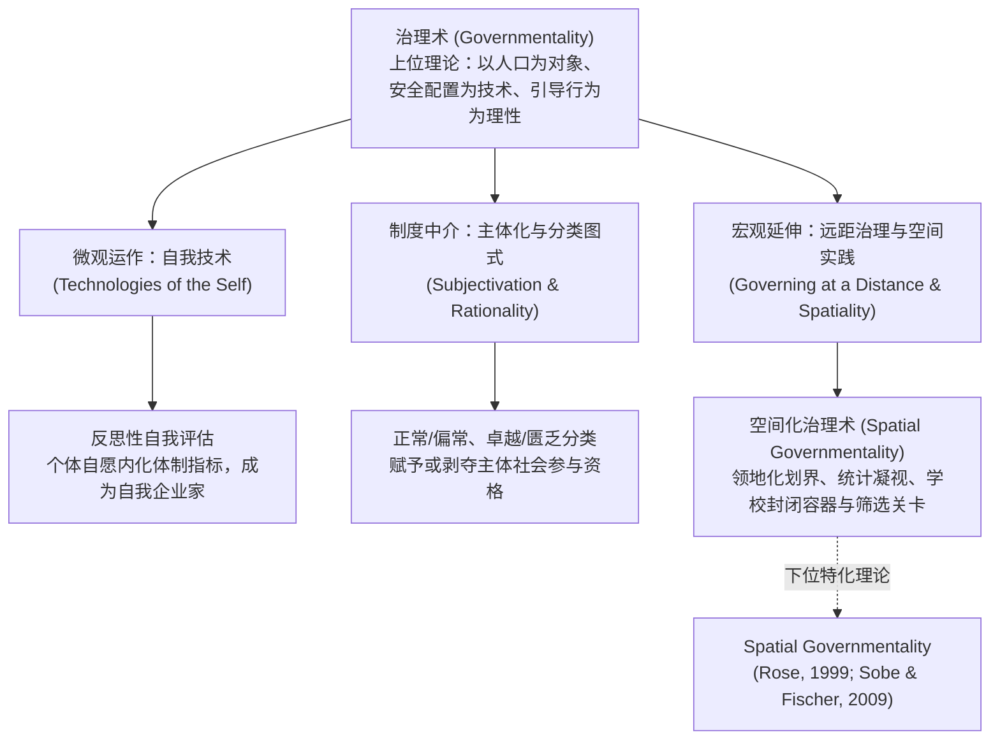

# Governmentality

---

## 理论定位

> [!theory-position] 理论定位
> - **解释对象** 现代国家与非国家机制如何超越单纯的法律禁止与肉体强制，通过制度理性、专家知识与分类标准，将“人口”（Population）组织为可计算、可干预的对象，并引导个体实现自愿的“自我调节”（[[Self-control|self-regulation]]）。
> - **理论问题** 传统法学与政治哲学将权力狭隘地等同于主权者的专制压迫或国家机器的垄断暴力，将自由视为治理的对立面；该理论旨在破解现代自由主义与新自由主义体制如何在“保障自由、尊重选择”的表象下，实现更为严密、深层的全景式社会控制。
> - **理论类型** 元理论（Meta-theory）、权力分析学批判视角、[[Post-structuralism|后结构主义]]政治社会学[[Paradigm|范式]]。
> - **知识位置** 由米歇尔·福柯（Michel Foucault）在法兰西学院后期讲座中正式确立，构成了现代权力分析谱系中统摄[[Disciplina and Doctrina|规训]]权力（Discipline）与生命政治（Biopolitics）的**上位理论框架**；后经尼古拉斯·罗斯（Nikolas Rose）等学者拓展至[[Spatial Governmentality|空间化治理]]与[[Governing at a Distance|远距治理]]，并广泛辐射至教育社会学、高等教育与比较教育学研究。

> [!claim] 核心判断
> 治理术的核心本质是“行为的引导”（Conduct of Conduct）。现代权力的运作并非致力于粗暴压制主体的意志，而是通过提供分类框架、竞争准则、评价标准与理想人格，塑造主体的自我理解与欲望结构；治理不以抹杀自由为代价，反而将个体的“自由选择”与“自我管理”作为权力高效运转的前提机制。[[Argument_Thompson_2022_Promising_Student|(Thompson et al., 2022, p. 226)]]; [[Argument_Sobe_Fischer_2009_MobilityMigration|(Sobe & Fischer, 2009, p. 360)]]

> [!citation-card]
> **[[Argument_Thompson_2022_Promising_Student|Thompson et al. (2022)]] 论治理术作为行为引导的本质**
> 治理术关涉的是“行为的引导”（Conduct of conduct）——不是通过强制命令，而是通过塑造主体的自我理解来引导行为。权力不再以否定性的禁止为主要形态，而是积极建构主体的反思能力，使其在自我审视中主动对齐体制的期许。[[Argument_Thompson_2022_Promising_Student|(Thompson et al., 2022, p. 226)]]

> [!citation-card]
> **[[Argument_Sobe_Fischer_2009_MobilityMigration|Sobe & Fischer (2009)]] 论古典政治理论视野下的广义治理**
> 在政治社会学与比较教育学中，“治理”（Government）绝不能窄化为国家机构（State）的同义词；它必须在更宽广的古典政治理论维度被理解为一个统摄性范畴，涵盖了人类个体受到外部制度规制以及进行自我调节（Regulated and Self-regulate）的极其微观且多元的全部方式。正是在这一基座上，学校演变为现代治理将个体与人口转化为可计算、可行政管理对象的中枢节点。[[Argument_Sobe_Fischer_2009_MobilityMigration|(Sobe & Fischer, 2009, pp. 360, 367)]]

---

## 理论来源与形成

> [!theory-origin] 福柯对现代治理理性的谱系学考察
> - **提出者与原始文本** 米歇尔·福柯（Michel Foucault）于 1978–1979 年在法兰西学院的两次关键课程《安全、领土与人口》（*Security, Territory, Population*）与《生命政治的诞生》（*The Birth of Biopolitics*）中系统提出。
> - **原初问题** 18 世纪以来，现代欧洲国家的统治重心如何从“保卫君主领土”向“优化人口生命质量、繁荣国民财富”转变；自由主义政治经济学如何将自身确立为限制国家直接干预但同时最大化治理效能的统治艺术。
> - **理论资源与材料** 基督教牧领权力（Pastoral Power）的照料与引导传统、重农学派政治经济学理论、德意志国家警政学（Polizeiwissenschaft）历史[[Document|文献]]，以及现代人口统计学与公共卫生制度的形成史。
> - **形成路径** 福柯通过解构主权、[[Disciplina and Doctrina|规训]]与安全配置的历史演进，创造出“治理术”（Gouvernementalité = Gouverner + Mentalité，即“治理之心理/理性”）一词，指出现代国家的力量并非源于统治机构的膨胀，而在于社会整体被“治理化”（Governmentalized）的深度。

### 后续修订与扩展

> [!dev-timeline] 治理术理论的拓展与分支演变
> - **1978–1979 年 — 经典政治谱系学确立** 福柯系统阐明了规训身体、调节人口与自由主义治理理性的三重维度。
> - **1990 年代 — 政治社会学与自由的力量** 尼古拉斯·罗斯（Nikolas Rose, 1999）与科林·戈登（Colin Gordon）等推进英美治理术研究，提出“通过社区治理”与[[Spatial Governmentality|空间化治理]]（领地化、空间凝视、空间质地建模），指出治理依赖[[Lefebvre's Spatial Triad|空间的生产]]与划分。[[Argument_Sobe_Fischer_2009_MobilityMigration|(Sobe & Fischer, 2009, p. 360)]]
> - **2008 年 — 教育社会学史的治理化重读** [[Stephen Ball|斯蒂芬·鲍尔]]（Stephen J. Ball, 2008）论证教育社会学三大传统（[[Political Arithmetic|政治算术]]、[[New Sociology of Education|新教育社会学]]、[[School Effectiveness|学校效能]]）本身即是把家庭、知识与学校转化为可干预治理对象的权力技术。[[Argument_Ball_2008_SR|(Ball, 2008, pp. 651, 654–665)]]
> - **2009 年 — 比较教育学空间转向与[[Two Problematics of Educational Inclusion and Exclusion|双重问题式]]** 诺亚·索比与梅丽莎·菲舍尔（[[Argument_Sobe_Fischer_2009_MobilityMigration|Sobe & Fischer, 2009]]）将治理术深化为“空间实践”与双重问题式的统合框架，揭示学校作为封闭容器与流动资格筛选关卡的职能。[[Argument_Sobe_Fischer_2009_MobilityMigration|(Sobe & Fischer, 2009, pp. 360–361, 367–368)]]
> - **2022 年 — 算法时代与全球知识地缘治理** 汤普森等（[[Argument_Thompson_2022_Promising_Student|Thompson et al., 2022]]）将治理术延伸至大学在线自测系统（[[Online Self-Assessment|OSA]]）与[[Digital Self|数字自我]]塑造；泽林卡（[[Argument_Zelinka_2022_SCD_subjectivity|Zelinka, 2022]]）将其扩展为全球尺度的“[[21st Century Skills and Competencies Discourse|21世纪技能]]”[[Governing at a Distance|远距治理]]。[[Argument_Thompson_2022_Promising_Student|(Thompson et al., 2022, pp. 220–226)]]; [[Argument_Zelinka_2022_SCD_subjectivity|(Zelinka, 2022, pp. 251–265)]]

---

## 理论架构与核心构件

> [!entry-map] 关键构件与理论功能映射
>
> | 构件 | 类型 | 在理论中的功能 |
> |:-----|:-----|:--------------|
> | 行为的引导（Conduct of Conduct） | 核心定义 | 权力的核心机制：非强制性干预，通过塑造主体的理解与期望，促使其“自由”做出符合政策目标的选择。 |
> | 自由作为治理机制（Freedom as Technique） | 运作条件 | 颠覆自由与支配的对立：自由不是权力的豁免区，而是治理理性得以贯彻和转嫁风险的最廉价工具。 |
> | 自我技术（Technologies of the Self） | 行动载体 | 个体对自己施加的操作（如日记、自评、生涯规划），主动将自身改造为符合特定德性与效能标准的主体。 |
> | 主体化（Subjectivation） | 治理效果 | 权力通过制度分类（如“[[Promising Student\|有前景的学生]]”、“后进生”、“流动漂泊者”），呼唤并定型个体的身份认同。 |
> | [[Governing at a Distance\|远距治理]]（Governing at a Distance） | 空间技术 | 权力无需亲临现场，通过标准化指标、绩效排行、资金杠杆与网络规范，跨越地理界限协调分散行动。 |
> | 空间化治理术（[[Spatial Governmentality]]） | 下位分支 | **空间治理术**是治理术理论在空间维度上的专属特化：聚焦领地化划界、空间凝视、平滑/纵深质地与学校容器职能。 |

---

## 核心命题

> [!theory-proposition] 命题一｜权力通过“行为的引导”实现无暴力的深度秩序
> **解释** 治理术的核心运作机制是将治理目标转化为个体的内在动机。权力系统放弃代价高昂的肉体强迫，转而通过知识[[Discourse|话语]]、专家建议与考核量表，建构出何为“理性”、“自主”与“负责任”的规范定义。个体在追求个人卓越与福祉的过程中，不自觉地履行了体制的期望。[[Argument_Thompson_2022_Promising_Student|(Thompson et al., 2022, pp. 220–221)]]
>
> **应用实例** 在高等教育中，大学并不强迫学生选择特定专业，但通过引入在线自测系统（[[Online Self-Assessment|OSA]]），让申请者自行评估胜任力；测试反馈诱导学生主动将自身理解为“自负盈亏的学术企业家”，若遭遇失败则归咎于自身储备不足，从而使大学零阻力地完成了生源筛选。

> [!theory-proposition] 命题二｜自由是现代治理的必要技术条件而非对立面
> **解释** 新自由主义治理理性最深沉的悖论在于：越是鼓吹“自由选择”与“去中心化”，治理权力的毛细血管渗透就越彻底。当政府赋予学校[[School Choice|择校]]权或赋予学生[[Learner Autonomy|自主学习]]权时，实际上是将宏观的结构性风险（失业、贫困、教育不公）个体化、道德化为个人选择的后果，从而免除了国家作为最终责任人的负担。[[Argument_Thompson_2022_Promising_Student|(Thompson et al., 2022, pp. 222–223)]]
>
> **应用实例** 欧洲联盟通过伊拉斯谟计划（ERASMUS）赋予大学生跨国求学的充分自由，并将其赞美为自由探索未来的美德；然而学者指出，这实质上是要求青年个体自发承担打造跨文化“就业[[Competitiveness|竞争力]]”的责任，把应对全球劳动力市场波动的压力内化为个人的道德修行。[[Argument_Sobe_Fischer_2009_MobilityMigration|(Sobe & Fischer, 2009, p. 363)]]

> [!theory-proposition] 命题三｜现代治理本质上依赖对空间的建构、计算与封闭
> **解释** 治理决不仅是时间上的历史演进或身体上的行为操练，而是在根本上依赖于空间的构想、划界与操控。如 Rose（1999）与 Sobe & Fischer（2009）所示，现代权力通过人为制造“学区”、“教室”、“家庭”等离散单元（领地化），并通过统计图表将分散人群变为可见对象（空间凝视），从而使学校成为把人口圈禁在固定网格中的“封闭容器”（Enclosure），以及根据文化标准决定谁有资格跨入更广阔社会空间的“筛选关卡”（Qualification）。[[Argument_Sobe_Fischer_2009_MobilityMigration|(Sobe & Fischer, 2009, pp. 360–361)]]
>
> **应用实例** 在流动儿童管理中，中国通过城乡二元[[Hukou System|户籍制度]]在空间上设立公办学校准入门槛，而美国基础教育则在《[[No Child Left Behind Act 2001|不让一个孩子掉队法案]]》下将中途频繁转校的学生定性为拖累达标率的“流动漂泊者”；两者均利用空间技术划定主体合法性。

> [!theory-proposition] 命题四｜治理术通过远距机制在超国家尺度编织话语网络
> **解释** 权力的有效运行并不依赖集中单一的主权中枢，而是依托跨国组织、智库与标准化指标体系所构筑的松散网络，在空间“远处”协调各方行为。全球[[Geopolitics of Knowledge|知识地缘政治]]通过界定“[[21st Century Skills and Competencies Discourse|21世纪技能]]”或“未来教育愿景”，远距离重塑各主权国家的课程大纲与公民自我期待。[[Argument_Zelinka_2022_SCD_subjectivity|(Zelinka, 2022, pp. 251–260)]]
>
> **应用实例** 欧盟通过[[TEMPUS|天普计划]]面向东欧与周边邻国输出[[Bologna Process|博洛尼亚进程]]标准；虽无主权行政强制力，却通过学术流动基金与学位对齐机制，引导伙伴国高校自愿重构内部专业与评估机制，实现了地缘空间上的远距规范治理。

---

## 转化为分析框架

> [!theory-use] 框架入口
> - **[[Research Question|研究问题]]** 某项教育政策、评估系统或教学改革是如何通过“非强制性”的形式引导实践者的？它如何生产出特定的理想主体形态（如“创新型人才”、“[[Learner Autonomy|自主学习]]者”），又在隐蔽中排斥了哪些人群？
> - **分析对象与单位** 政策文本、评价量规、自测系统、质量保证手册、学校建筑与空间规章、跨国比较政策倡议。
> - **需要的材料** 法律文本、问责指标清单、宣传[[Discourse|话语]]、学生自评档案、教师反思记录、空间流动统计报表。
> - **解释目标** 揭示权力如何隐蔽在“专业常识”、“科学标准”与“赋权自由”的掩护之下，重塑行动者的主体性并维系既定治理秩序。

> [!theory-framework] 治理术批判分析维度
>
> | 理论依据 | 分析维度与提问 | 可观察线索与材料 | 判读规则与边界 |
> |:---------|:---------------|:-----------------|:-----------------|
> | 命题一（Foucault, 1978; [[Argument_Thompson_2022_Promising_Student\|Thompson et al., 2022]]） | **理性与行为引导（Governmental Rationality）** 政策依据何种“常识性”道理来论证自身改革的正当性？ | 政策前言、改革白皮书、专家咨询报告中的正当性修辞。 | 检查政策是否将结构性社会矛盾表述为亟待技术解决的管理或心理议题。 |
> | 命题二（Foucault, 1988） | **自我技术与反思机制（Technologies of the Self）** 系统提供了何种工具促使受教育者进行自我监督与修正？ | 自评量表、个人发展计划（PDP）、反思日志、学业档案。 | 若系统强调“自主反思”并引导个体把失败归因于自身努力或策略不当，支持自我技术假说。 |
> | 命题三（Rose, 1999; [[Argument_Sobe_Fischer_2009_MobilityMigration\|Sobe & Fischer, 2009]]） | **空间治理与容器筛选（[[Spatial Governmentality\|空间实践]]）** 治理如何通过地理划界与学校容器规制人口流动？ | 学区边界、户籍门槛、校园考勤门禁、对中途转学的考核定性。 | 若体制将流动人群区隔在边缘物理空间或施加惩戒性分类，支持空间治理术假说（转入专项分析）。 |
> | 命题四（[[Argument_Zelinka_2022_SCD_subjectivity\|Zelinka, 2022]]） | **[[Governing at a Distance\|远距治理]]与指标杠杆（Governing at a Distance）** 外部权力如何通过软性标准跨距离引导机构与个人？ | 国际排名、关键[[Performance Indicators\|绩效指标]]（KPI）、能力框架、资助竞争方案。 | 检查地方机构是否在无行政硬命令的情况下，为追求排名或资助自发重构教学与科研方向。 |

---

## 局限性与适用边界

> [!theory-boundary] 局限性与适用边界
> - **适合分析** 自由主义与新自由主义民主体制下的教育改革、高等教育绩效主义问责、[[Lifelong Learning|终身学习]][[Discourse|话语]]、数字教育自评机制以及以柔性指标为导向的全球教育治理。
> - **成立条件** 治理对象须享有一定名义上的行动自由与选择空间；被治理者具备[[Reflexivity|反思性]]主体意识，且制度环境依赖专家话语系统。
> - **解释不足** 过度偏重“合意型统治”与微观心理内化，容易淡化或忽视国家机器的硬性暴力、专制法律制裁以及赤裸裸的阶级与经济物质剥削；在分析威权国家纯粹依靠暴力压制的统治形态时解释力相对有限。
> - **不能直接推出** 不能将一切自我反思与能力提升计划均贬斥为虚伪的权力阴谋；自我技术的运用同样包含着行动者赋权与自我发现的潜能。

---

## 争议与批评

> [!debates] 理论争议
>
> > [!axis] 自我技术 vs 物质不平等的结构[[Determinism|决定论]]争
> > 学界激烈争论治理术是否过度沉溺于语言[[Discourse|话语]]与主观技术，从而掩盖了客观阶级结构的决定性作用。
> >
> > - **[[Argument_Thompson_2022_Promising_Student|Thompson et al. (2022)]]** 警示治理术分析容易陷入将一切教育不平等还原为“主体化话语偏见”的唯心陷阱，忽视了资本、家庭财富与种族隔离等物质现实对学生处境的刚性制约。[[Argument_Thompson_2022_Promising_Student|(Thompson et al., 2022, p. 227)]]
> > - **[[Argument_Ball_2008_SR|Ball (2008)]]** 强调知识政治与物质利益不可分割，政策话语既是治理理性的体现，也是阶级利益集团争夺国家资源的载体。[[Argument_Ball_2008_SR|(Ball, 2008, pp. 651–655)]]

> [!critique]- 批评索引
> - [[Argument_Thompson_2022_Promising_Student|Thompson et al. (2022)]] — 批判过度聚焦微观自我技术可能导致忽视宏观社会阶层对教育结果的决定性压迫。
> - [[Argument_Sobe_Fischer_2009_MobilityMigration|Sobe & Fischer (2009)]] — 强调治理术分析必须与空间实践结合，走出传统仅关注身体与意识、忽视物理地理维度的狭隘视野。

---

## 相关研究

> [!evidence-grid-a] [[Correlational Research|相关研究]]索引
> - [[Argument_Thompson_2022_Promising_Student]] — 结合治理术与[[Societies of Control|控制社会]]理论，剖析德国高校在线自测系统如何呼唤出“[[Promising Student|有前景的学生]]”。
> - [[Argument_Ball_2008_SR]] — 运用治理术视角重访英国教育社会学史，揭示[[Political Arithmetic|政治算术]]与[[School Effectiveness|学校效能]]研究如何成为现代国家治理的认知工具。
> - [[Argument_Zelinka_2022_SCD_subjectivity]] — 揭示 21 世纪技能[[Discourse|话语]]如何作为全球治理技术，通过远距机制重塑各国[[Pedagogical Subject|教育主体]]。
> - [[Argument_Sobe_Fischer_2009_MobilityMigration]] — 运用[[Spatial Governmentality|空间治理术]]考察[[Student Mobility|学生流动]]政策中的两极道德话语及全球[[Migrant Education|流动儿童教育]]的空间排斥机制。

---

