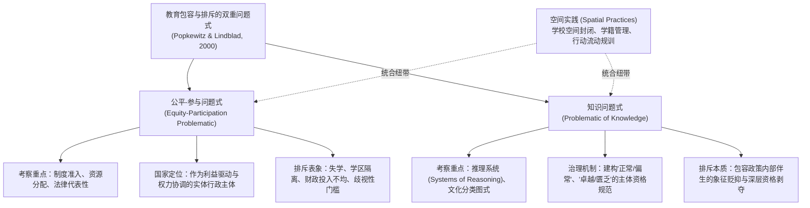

# Two Problematics of Educational Inclusion and Exclusion

---

## 理论定位

> [!theory-position] 理论定位
> - **解释对象** 现代教育改革与政策治理中，“包容”（Inclusion）与“排斥”（Exclusion）如何在宏观制度结构与微观知识[[Discourse|话语]]双重层面上交织生成。
> - **理论问题** 传统自由主义与[[Positivism|实证主义]]政策研究长期将“教育排斥”窄化为入学机会不足、资源短缺或社会代表性失衡，忽视了看似崇高和普惠的包容性改革政策，往往在其内部推理系统与分类规则中内生性地生产出对边缘人群的深层否定与文化排斥。
> - **理论类型** 教育社会学[[Critical Theory|批判理论]]、社会[[Epistemology|认识论]]（Social Epistemology）[[Analytic Framework|分析框架]]。
> - **知识位置** 由[[Thomas S. Popkewitz|托马斯·S·波普科维茨]]（Thomas S. Popkewitz）与斯韦克·林德布拉德（Sverker Lindblad）于 2000 年在《教育研究评论》（*Review of Educational Research*）中提出，由诺亚·索比（Noah W. Sobe）与梅丽莎·菲舍尔（Melissa G. Fischer）等学者引入空间治理与跨国比较教育学研究中。

> [!claim] 核心判断
> 分析教育中的包容与排斥必须双轨并进：仅从“公平-参与问题式”出发，只能看到国家作为利益协调者在物质和机会层面的再分配，容易陷入制度[[Educational Meliorism|改良主义]]的盲区；而必须结合“[[Knowledge Questions|知识问题]]式”，解剖教育理性体系如何以“常态/异常”、“卓越/匮乏”的文化图式对学生进行无形归类与资格剥夺。现代学校的“空间实践”（Spatial Practices）正是连接宏观国家行政再分配与微观知识分类[[Disciplina and Doctrina|规训]]的关键物理与象征[[Champ|场域]]。[[Argument_Sobe_Fischer_2009_MobilityMigration|(Sobe & Fischer, 2009, pp. 367–368)]]

---

## 理论架构与核心问题式区隔

[[Thomas S. Popkewitz|波普科维茨]]与林德布拉德（Popkewitz & Lindblad, 2000）将教育治理中的问题化机制划分为两个既独立又纠缠的分析维度：

### 1. 公平-参与问题式（Equity-Participation Problematic）
- **核心关切** 个体的教育可及性（Access）、制度代表性（Representation）与资源配置平等性。
- **分析逻辑** 将国家视为由不同阶级、族群与政治利益驱动的行动实体。该问题式追问：哪些群体被排斥在正规学校之外？国家通过何种财政转移支付、民权法律或扶持项目促进了边缘人口的入学率？
- **经验案例** 美国《[[Plyler v. Doe 1982|普莱勒诉多伊案]]》赋予无证儿童公立学校受教育权、中国针对随迁子女设立城市入学指标、印度政府在游牧区建立定居公立小学等。
- **局限性** 若仅停留在此层面，研究者会误以为只要消除法律壁垒、增加经费投入，就能实现彻底的“教育平等”。

### 2. 知识问题式（Problematic of Knowledge）
- **核心关切** 主导教育决策与日常教学的“推理系统”（Systems of Reasoning）、认知分类图式与文化实践。
- **分析逻辑** 源于福柯的知识-权力学说。该问题式关注：教育系统通过何种语言、[[Scale of Measurement|测量尺度]]与专业概念来界定“合规与不合规”（Proper and Improper）、“德性与匮乏”（Virtuous and Deficient）？
- **制度反讽** 许多旨在实现“包容”的改革方案（如多元文化教育、特殊教育支持、弱势群体补偿项目），在其[[Discourse|话语]]体系内部已预设了该群体属于“落后”、“病态”或“缺乏[[Cultural Capital|文化资本]]”的存在。这种[[Epistemology|认识论]]层面的分类机制，实际上在把弱势儿童引入学校物理空间的同时，在象征空间内完成了对他们主体身份的再排斥（Abjection）。

---

## 理论拓展：空间实践作为统合纽带

将这两大问题式有机统合起来，长期是教育社会学与比较教育研究中的重大分析难题。诺亚·索比与梅丽莎·菲舍尔（[[Argument_Sobe_Fischer_2009_MobilityMigration|Sobe & Fischer, 2009]]）提出，**空间实践（Spatial Practices）** 是弥合二者鸿沟的核心钥匙：

> [!citation-card]
> **[[Argument_Sobe_Fischer_2009_MobilityMigration|Sobe & Fischer (2009)]] 论空间实践对双重问题式的统合**
> 现代学校不仅坐落在特定的地理坐标上，学校本身就是一种生产治理空间的权力装置。从公平-参与维度看，学校是通过校舍建筑、学区围墙与行政编制将特定人群圈禁（Enclosure）并分配资源的物理场所；从[[Knowledge Questions|知识问题]]式维度看，学校通过课桌排列、时间节律、学籍档案分类以及对学生身体流动的合规性界定，将抽象的文化价值具象化为空间纪律。因此，考察空间实践（包括边界设立、地理流动与停留阻断）能够完整呈现国家行政力量与微观知识[[Discourse|话语]]如何协同运作，既制造出物理准入的限制，又塑造出谁具备进入主流社会空间资格的判定标准。[[Argument_Sobe_Fischer_2009_MobilityMigration|(Sobe & Fischer, 2009, pp. 367–368)]]

### 在流动儿童教育中的实证阐释
以流动与少数群体教育为例：
1. **公平-参与层面** [[Hukou System|户籍制度]]直接在物理空间上把农民工子女阻隔在城市公立校舍之外；2001 年美国《[[No Child Left Behind Act 2001|不让一个孩子掉队法案]]》（NCLB）在统计上追踪流动学童对学校综合达标率的冲击。
2. **知识问题式层面** 无论在中国还是欧美，国家话语系统普遍浸透着[[Sedentarism|定居主义]]偏见——将空间定居视为文明、可预测与心理健康的规范标志，而将流动性（Mobility）[[Coding in Qualitative Research|编码]]为不稳定、家庭失范或学习落后的表征。
3. **空间结合点** 即使公立学校在政策上向流动儿童开放（满足了公平参与的准入要求），由于校园内部高度结构化的空间作息（如英国大篷车儿童面对的固定课桌[[Disciplina and Doctrina|规训]]），以及根据标准化测试设立的分流体系，流动儿童仍旧在日常空间互动中被判定为“不合格”的主体。

---

## 方法论与学术价值

> [!warrant] 对比较教育学[[Paradigm|研究范式]]的批判性推动
> 1. **超越“黑箱”式的政策评估** 警惕仅凭宏观统计报表（入学率、师生比）来宣告教育平等实现的浅层分析，敦促研究者深入课程知识、评价体系与师生互动的隐性分类图式；
> 2. **建立宏观政治与微观[[Epistemology|认识论]]的对话通道** 将宏观的国家政权再分配研究与微观的后现代文化批评融为一体，为教育社会学提供了具有极高解释力度的立体分析工具箱。

---

